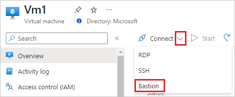

# Quickstart: Create a virtual network using the Azure portal

In this quickstart, you learn how to create a virtual network using the Azure portal. You deploy two virtual machines (VMs). Next, you securely communicate between VMs and connect to VMs from the internet. A virtual network is the fundamental building block for your private network in Azure. It enables Azure resources, like VMs, to securely communicate with each other and with the internet.

## Prerequisites

* An Azure account with an active subscription. [Create one for free](https://azure.microsoft.com/free/?ref=microsoft.com&utm_source=microsoft.com&utm_medium=docs&utm_campaign=visualstudio).

## Sign in to Azure

Sign in to the [Azure portal](https://portal.azure.com).

## Create a virtual network

1. From the Azure portal menu, select **Create a resource**. From the Azure Marketplace, select **Networking** > **Virtual network**.

1. In **Create virtual network**, enter or select this information:

    | Setting | Value |
    | ------- | ----- |
    | Subscription | Select your subscription.|
    | Resource group | Select **Create new**, enter *myResourceGroup*, then select **OK**. |
    | Name | Enter *myVirtualNetwork*. |
    | Location | Select **East US**.|

1. Select **Next: IP Addresses**, and for **IPv4 address space**, enter *10.1.0.0/16*.

1. Select **Add subnet**, then enter *myVirtualSubnet* for **Subnet name** and *10.1.0.0/24* for **Subnet address range**.

1. Select **Add**, then select **Review + create**. Leave the rest as default and select **Create**.

1. In **Create virtual network**, select **Create**.

## Create virtual machines

Create two VMs in the virtual network:

### Create the first VM

1. From the Azure portal menu, select **Create a resource**.

1. From the Azure Marketplace, select **Compute** > **Windows Server 2019 Datacenter**. Select **Create**.

1. In **Create a virtual machine - Basics**, enter or select this information:

    | Setting | Value |
    | ------- | ----- |
    | **Project details** | |
    | Subscription | Select your subscription. |
    | Resource group | Select **myResourceGroup**. You created this resource group in the previous section. |
    | **Instance details** |  |
    | Virtual machine name | Enter *myVm1*. |
    | Region | Select **East US**. |
    | Availability options | Default to **No infrastructure redundancy required**. |
    | Image | Default to **Windows Server 2019 Datacenter**. |
    | Size | Default to **Standard DS1 v2**. |
    | **Administrator account** |  |
    | Username | Enter a username of your choosing. |
    | Password | Enter a password of your choosing. The password must be at least 12 characters long and meet the [defined complexity requirements](../virtual-machines/windows/faq.md?toc=%2fazure%2fvirtual-network%2ftoc.json#what-are-the-password-requirements-when-creating-a-vm).|
    | Confirm Password | Re-enter password. |
    | **Inbound port rules** |  |
    | Public inbound ports | Select **Allow selected ports**. |
    | Select inbound ports | Enter *HTTP (80)* and *RDP (3389)*. |
    | **Save money** |  |
    | Already have a Windows license? | Default to **No**. |

1. Select **Next: Disks**.

1. In **Create a virtual machine - Disks**, keep the defaults and select **Next: Networking**.

1. In **Create a virtual machine - Networking**, select this information:

    | Setting | Value |
    | ------- | ----- |
    | Virtual network | Default to **myVirtualNetwork**. |
    | Subnet | Default to **myVirtualSubnet (10.1.0.0/24)**. |
    | Public IP | Default to **(new) myVm-ip**. |
    | NIC network security group | Default to **Basic**. |
    | Public inbound ports | Default to **Allow selected ports**. |
    | Select inbound ports | Default to **HTTP** and **RDP**.

1. Select **Next: Management**.

1. In **Create a virtual machine - Management**, for **Diagnostics storage account**, select **Create New**.

1. In **Create storage account**, enter or select this information:

    | Setting | Value |
    | ------- | ----- |
    | Name | Enter *myvmstorageaccount*. If this name is taken, create a unique name.|
    | Account kind | Default to **Storage (general purpose v1)**. |
    | Performance | Default to **Standard**. |
    | Replication | Default to **Locally-redundant storage (LRS)**. |

1. Select **OK**, then select **Review + create**. You're taken to the **Review + create** page where Azure validates your configuration.

1. When you see the **Validation passed** message, select **Create**.

### Create the second VM

Repeat the procedure in the previous section to create another virtual machine.

> [!IMPORTANT]
> For the **Virtual machine name**, enter *myVm2*.
>
> For **Diagnosis storage account**, make sure you select **myvmstorageaccount**, instead of creating one.

## Connect to a VM from the internet

After you've created *myVm1*, connect to the internet.

1. In the Azure portal, search for and select *myVm1*.

1. Select **Connect**, then **RDP**.

    

    The **Connect** page opens.

1. Select **Download RDP File**. Azure creates a Remote Desktop Protocol (*.rdp*) file and downloads it to your computer.

1. Open the RDP file. If prompted, select **Connect**.

1. Enter the username and password you specified when creating the VM.

    > [!NOTE]
    > You may need to select **More choices** > **Use a different account**, to specify the credentials you entered when you created the VM.

1. Select **OK**.

1. You may receive a certificate warning when you sign in. If you receive a certificate warning, select **Yes** or **Continue**.

1. Once the VM desktop appears, minimize it to go back to your local desktop.

## Communicate between VMs

1. In the Remote Desktop of *myVm1*, open PowerShell.

1. Enter `ping myVm2`.

    You'll receive a message similar to this output:

    ```output
    Pinging myVm2.0v0zze1s0uiedpvtxz5z0r0cxg.bx.internal.clouda
    Request timed out.
    Request timed out.
    Request timed out.
    Request timed out.

    Ping statistics for 10.1.0.5:
    Packets: Sent = 4, Received = 0, Lost = 4 (100% loss),
    ```

    The `ping` fails, because `ping` uses the Internet Control Message Protocol (ICMP). By default, ICMP isn't allowed through the Windows firewall.

1. To allow *myVm2* to ping *myVm1* in a later step, enter this command:

    ```powershell
    New-NetFirewallRule –DisplayName "Allow ICMPv4-In" –Protocol ICMPv4
    ```

    This command allows ICMP inbound through the Windows firewall:

1. Close the remote desktop connection to *myVm1*.

1. Complete the steps in [Connect to a VM from the internet](#connect-to-a-vm-from-the-internet) again, but connect to *myVm2*.

1. From a command prompt, enter `ping myvm1`.

    You'll get back something like this message:

    ```output
    Pinging myVm1.0v0zze1s0uiedpvtxz5z0r0cxg.bx.internal.cloudapp.net [10.1.0.4] with 32 bytes of data:
    Reply from 10.1.0.4: bytes=32 time=1ms TTL=128
    Reply from 10.1.0.4: bytes=32 time<1ms TTL=128
    Reply from 10.1.0.4: bytes=32 time<1ms TTL=128
    Reply from 10.1.0.4: bytes=32 time<1ms TTL=128

    Ping statistics for 10.1.0.4:
        Packets: Sent = 4, Received = 4, Lost = 0 (0% loss),
    Approximate round trip times in milli-seconds:
        Minimum = 0ms, Maximum = 1ms, Average = 0ms
    ```

    You receive replies from *myVm1*, because you allowed ICMP through the Windows firewall on the *myVm1* VM in step 3.

1. Close the remote desktop connection to *myVm2*.

## Clean up resources

In this quickstart, you created a default virtual network and two VMs. You connected to one VM from the internet and securely communicated between the two VMs.

When you're done using the virtual network and the VMs, delete the resource group and all of the resources it contains:

1. Search for and select *myResourceGroup*.

1. Select **Delete resource group**.

1. Enter *myResourceGroup* for **TYPE THE RESOURCE GROUP NAME** and select **Delete**.

## Next steps

To learn more about virtual network settings, see [Create, change, or delete a virtual network](manage-virtual-network.md).

By default, Azure allows secure communication between VMs. Azure only allows inbound remote desktop connections to Windows VMs from the internet. To learn more about types of VM network communications, see [Filter network traffic](tutorial-filter-network-traffic.md).
