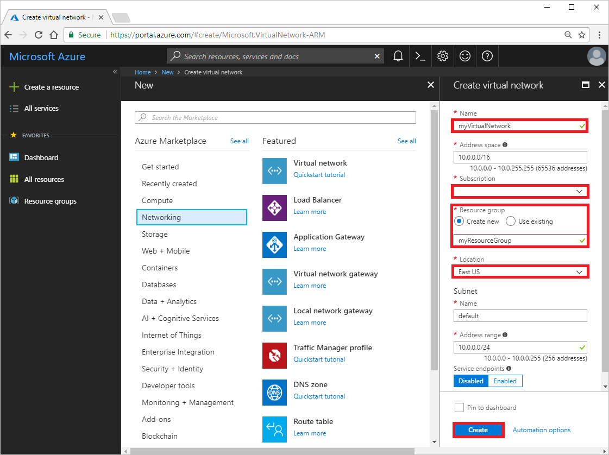
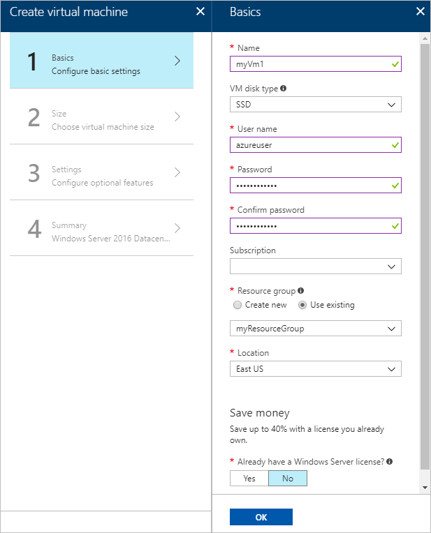
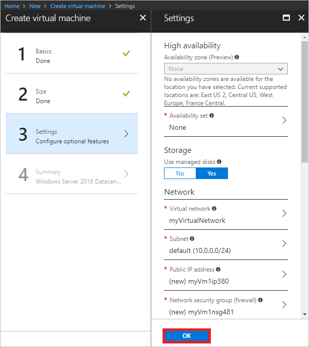

# Quickstart: Create a virtual network using the Azure portal

A virtual network enables Azure resources, such as virtual machines (VM), to communicate privately with each other, and with the internet. In this quickstart, you learn how to create a virtual network. After creating a virtual network, you deploy two VMs into the virtual network. You then connect to one VM from the internet, and communicate privately between the two VMs.

If you don't have an Azure subscription, create a [free account](https://azure.microsoft.com/free/?WT.mc_id=A261C142F) before you begin.

## Log in to Azure 

Log in to the Azure portal at https://portal.azure.com.

## Create a virtual network

1. Select **+ Create a resource** on the upper, left corner of the Azure portal.
2. Select **Networking**, and then select **Virtual network**.
3. Enter, or select, the following information, accept the defaults for the remaining settings, and then select **Create**:

    |Setting|Value|
    |---|---|
    |Name|myVirtualNetwork|
    |Subscription| Select your subscription.|
    |Resource group| Select **Create new** and enter *myResourceGroup*.|
    |Location| Select **East US**.|

    

## Create virtual machines

Create two VMs in the virtual network:

### Create the first VM

1. Select **+ Create a resource** found on the upper, left corner of the Azure portal.
2. Select **Compute**, and then select **Windows Server 2016 Datacenter**.
3. Enter, or select, the following information, accept the defaults for the remaining settings, and then select **OK**:

    |Setting|Value|
    |---|---|
    |Name|myVm1|
    |User name| Enter a user name of your choosing.|
    |Password| Enter a password of your choosing. The password must be at least 12 characters long and meet the [defined complexity requirements](../virtual-machines/windows/faq.md?toc=%2fazure%2fvirtual-network%2ftoc.json#what-are-the-password-requirements-when-creating-a-vm).|
    |Subscription| Select your subscription.|
    |Resource group| Select **Use existing** and select **myResourceGroup**.|
    |Location| Select **East US**|

    

4. Select a size for the VM and then select **Select**.
5. Under **Settings**, accept all the defaults and then select **OK**.

    

6. Under **Create** of the **Summary**, select **Create** to start VM deployment. The VM takes a few minutes to deploy. 

### Create the second VM

Complete steps 1-6 again, but in step 3, name the VM *myVm2*.

## Connect to a VM from the internet

1. After *myVm1* is created, connect to it. At the top of the Azure portal, enter *myVm1*. When **myVm1** appears in the search results, select it. Select the **Connect** button.

    

2. After selecting the **Connect** button, a Remote Desktop Protocol (.rdp) file is created and downloaded to your computer.  
3. Open the downloaded rdp file. If prompted, select **Connect**. Enter the user name and password you specified when creating the VM. You may need to select **More choices**, then **Use a different account**, to specify the credentials you entered when you created the VM. 
4. Select **OK**.
5. You may receive a certificate warning during the sign-in process. If you receive the warning, select **Yes** or **Continue**, to proceed with the connection.

## Communicate between VMs

1. From PowerShell, enter `ping myvm2`. Ping fails, because ping uses the Internet Control Message Protocol (ICMP), and ICMP is not allowed through the Windows firewall, by default.
2. To allow *myVm2* to ping *myVm1* in a later step, enter the following command from PowerShell, which allows ICMP inbound through the Windows firewall:

    ```powershell
    New-NetFirewallRule –DisplayName “Allow ICMPv4-In” –Protocol ICMPv4
    ```

3. Close the remote desktop connection to *myVm1*. 

4. Complete the steps in [Connect to a VM from the internet](#connect-to-a-vm-from-the-internet) again, but connect to *myVm2*. From a command prompt, enter `ping myvm1`.

    You receive replies from *myVm1*, because you allowed ICMP through the Windows firewall on the *myVm1* VM in a previous step.

5. Close the remote desktop connection to *myVm2*.

## Clean up resources

When no longer needed, delete the resource group and all of the resources it contains:

1. Enter *myResourceGroup* in the **Search** box at the top of the portal. When you see **myResourceGroup** in the search results, select it.
2. Select **Delete resource group**.
3. Enter *myResourceGroup* for **TYPE THE RESOURCE GROUP NAME:** and select **Delete**.

## Next steps

In this quickstart, you created a default virtual network and two VMs. You connected to one VM from the internet and communicated privately between the VM and another VM. To learn more about virtual network settings, see [Manage a virtual network](manage-virtual-network.md).

By default, Azure allows unrestricted private communication between virtual machines, but only allows inbound remote desktop connections to Windows VMs from the internet. To learn how to allow or restrict different types of network communication to and from VMs, advance to the [Filter network traffic](tutorial-filter-network-traffic.md) tutorial.