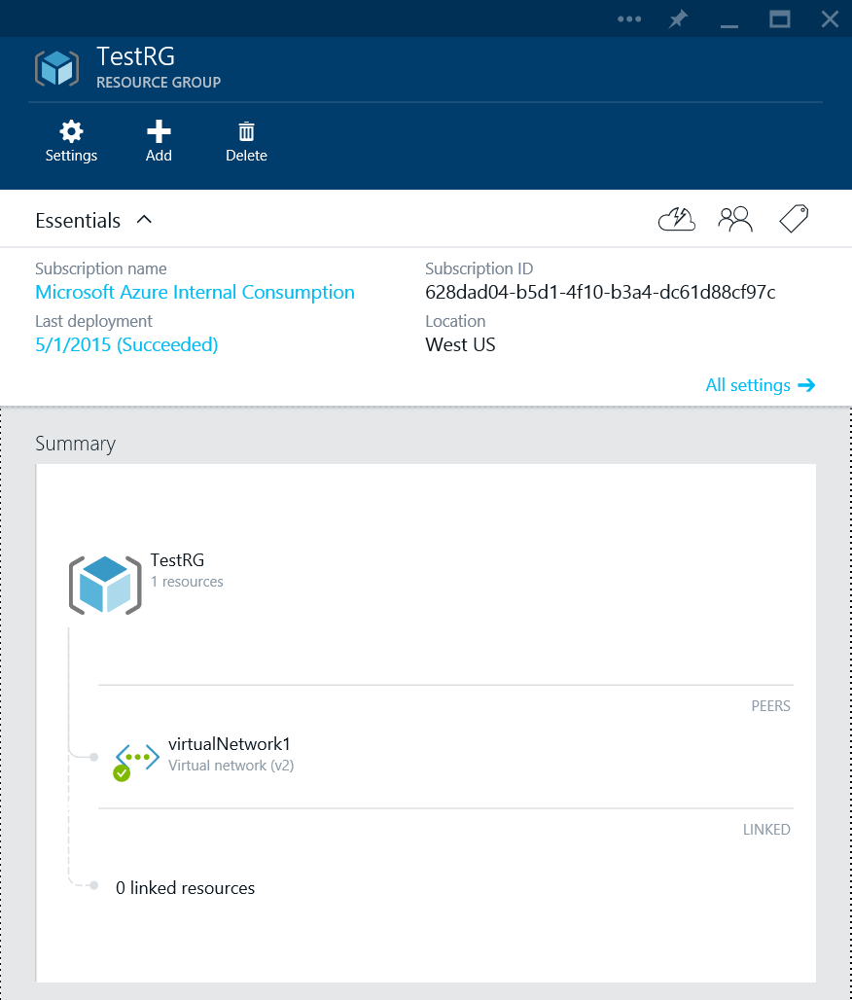

<properties
   pageTitle="Network Resource Provider Overview | Microsoft Azure"
   description="Learn about the new Network Resource Provider in Azure Resource Manager"
   services="virtual-network"
   documentationCenter="na"
   authors="jimdial"
   manager="carmonm"
   editor="tysonn" />
<tags
   ms.service="virtual-network"
   ms.devlang="na"
   ms.topic="article"
   ms.tgt_pltfrm="na"
   ms.workload="infrastructure-services"
   ms.date="03/15/2016"
   ms.author="jdial" />

# Network Resource Provider
An underpinning need in today’s business success, is the ability to build and manage large scale network aware applications in an agile, flexible, secure and repeatable way. Azure Resource Manager (ARM) enables you to create such applications, as a single collection of resources in resource groups. Such resources are managed through various resource providers under ARM.

Azure Resource Manager relies on different resource providers to provide access to your resources. There are three main resource providers: Network, Storage and Compute. This document discusses the characteristics and benefits of the Network Resource Provider, including:

- **Metadata** – you can add information to resources using tags. These tags can be used to track resource utilization across resource groups and subscriptions.
- **Greater control of your network** - network resources are loosely coupled and you can control them in a more granular fashion. This means you have more flexibility in managing the networking resources.
- **Faster configuration** - because network resources are loosely coupled, you can create and orchestrate network resources in parallel. This has drastically reduced configuration time.
- **Role Based Access Control** - RBAC provides default roles, with specific security scope, in addition to allowing the creation of custom roles for secure management.
- **Easier management and deployment** - it’s easier to deploy and manage applications since you can can create an entire application stack as a single collection of resources in a resource group. And faster to deploy, since you can deploy by simply providing a template JSON payload.
- **Rapid customization** - you can use declarative-style templates to enable repeatable and rapid customization of deployments.
- **Repeatable customization** - you can use declarative-style templates to enable repeatable and rapid customization of deployments.
- **Management interfaces** - you can use any of the following interfaces to manage your resources:
	- REST based API
	- PowerShell
	- .NET SDK
	- Node.JS SDK
	- Java SDK
	- Azure CLI
	- Preview Portal
	- ARM template language

## Network resources
You can now manage network resources independently, instead of having them all managed through a single compute resource (a virtual machine). This ensures a higher degree of flexibility and agility in composing a complex and large scale infrastructure in a resource group.

A conceptual view of a sample deployment involving a multi-tiered application is presented below. Each resource you see, such as NICs, public IP addresses, and VMs, can be managed independently.

Every resource contains a common set of properties, and their individual property set. The common properties are:

|Property|Description|Sample values|
|---|---|---|
|**name**|Unique resource name. Each resource type has its own naming restrictions.|PIP01, VM01, NIC01|
|**location**|Azure region in which the resource resides|westus, eastus|
|**id**|Unique URI based identification|/subscriptions/<subGUID>/resourceGroups/TestRG/providers/Microsoft.Network/publicIPAddresses/TestPIP|

You can check the individual properties of resources in the sections below.

[AZURE.INCLUDE [virtual-networks-nrp-pip-include](../../includes/virtual-networks-nrp-pip-include.md)]

[AZURE.INCLUDE [virtual-networks-nrp-nic-include](../../includes/virtual-networks-nrp-nic-include.md)]

[AZURE.INCLUDE [virtual-networks-nrp-nsg-include](../../includes/virtual-networks-nrp-nsg-include.md)]

[AZURE.INCLUDE [virtual-networks-nrp-udr-include](../../includes/virtual-networks-nrp-udr-include.md)]

[AZURE.INCLUDE [virtual-networks-nrp-vnet-include](../../includes/virtual-networks-nrp-vnet-include.md)]

[AZURE.INCLUDE [virtual-networks-nrp-dns-include](../../includes/virtual-networks-nrp-dns-include.md)]

[AZURE.INCLUDE [virtual-networks-nrp-lb-include](../../includes/virtual-networks-nrp-lb-include.md)]

[AZURE.INCLUDE [virtual-networks-nrp-appgw-include](../../includes/virtual-networks-nrp-appgw-include.md)]

[AZURE.INCLUDE [virtual-networks-nrp-vpn-include](../../includes/virtual-networks-nrp-vpn-include.md)]

[AZURE.INCLUDE [virtual-networks-nrp-tm-include](../../includes/virtual-networks-nrp-tm-include.md)]

## Management interfaces
You can manage your Azure networking resources using different interfaces. In this document we will focus on tow of those interfaces: REST API, and templates.

### REST API
As mentioned earlier, network resources can be managed via a variety of interfaces, including REST API,.NET SDK, Node.JS SDK, Java SDK, PowerShell, CLI, Azure Portal and templates.

The Rest API’s conform to the HTTP 1.1 protocol specification. The general URI structure of the API is presented below:

	https://management.azure.com/subscriptions/{subscription-id}/providers/{resource-provider-namespace}/locations/{region-location}/register?api-version={api-version}

And the parameters in braces represent the following elements:

- **subscription-id** - your Azure subscription id.
- **resource-provider-namespace** - namespace for the provider being used. THe value for the network resource provider is *Microsoft.Network*.
- **region-name** - the Azure region name

The following HTTP methods are supported when making calls to the REST API:

- **PUT** - used to create a resource of a given type, modify a resource property or change an association between resources.
- **GET** - used to retrieve information for a provisioned resource.
- **DELETE** - used to delete an existing resource.

Both the request and response conform to a JSON payload format. For more details, see [Azure Resource Management APIs](https://msdn.microsoft.com/library/azure/dn948464.aspx).

### ARM template language
In addition to managing resources imperatively (via APIs or SDK), you can also use a declarative programming style to build and manage network resources by using the ARM Template Language.

A sample representation of a template is provided below –

	{
	  "$schema": "http://schema.management.azure.com/schemas/2014-04-01-preview/deploymentTemplate.json",
	  "contentVersion": "<version-number-of-template>",
	  "parameters": { <parameter-definitions-of-template> },
	  "variables": { <variable-definitions-of-template> },
	  "resources": [ { <definition-of-resource-to-deploy> } ],
	  "outputs": { <output-of-template> }    
	}

The template is primarily a JSON description of the resources and the instance values injected via parameters. The example below can be used to create a virtual network with 2 subnets.

	{
	    "$schema": "http://schema.management.azure.com/schemas/2014-04-01-preview/VNET.json",
	    "contentVersion": "1.0.0.0",
	    "parameters" : {
	      "location": {
	        "type": "String",
	        "allowedValues": ["East US", "West US", "West Europe", "East Asia", "South East Asia"],
	        "metadata" : {
	          "Description" : "Deployment location"
	        }
	      },
	      "virtualNetworkName":{
	        "type" : "string",
	        "defaultValue":"myVNET",
	        "metadata" : {
	          "Description" : "VNET name"
	        }
	      },
	      "addressPrefix":{
	        "type" : "string",
	        "defaultValue" : "10.0.0.0/16",
	        "metadata" : {
	          "Description" : "Address prefix"
	        }

	      },
	      "subnet1Name": {
	        "type" : "string",
	        "defaultValue" : "Subnet-1",
	        "metadata" : {
	          "Description" : "Subnet 1 Name"
	        }
	      },
	      "subnet2Name": {
	        "type" : "string",
	        "defaultValue" : "Subnet-2",
	        "metadata" : {
	          "Description" : "Subnet 2 name"
	        }
	      },
	      "subnet1Prefix" : {
	        "type" : "string",
	        "defaultValue" : "10.0.0.0/24",
	        "metadata" : {
	          "Description" : "Subnet 1 Prefix"
	        }
	      },
	      "subnet2Prefix" : {
	        "type" : "string",
	        "defaultValue" : "10.0.1.0/24",
	        "metadata" : {
	          "Description" : "Subnet 2 Prefix"
	        }
	      }
	    },
	    "resources": [
	    {
	      "apiVersion": "2015-05-01-preview",
	      "type": "Microsoft.Network/virtualNetworks",
	      "name": "[parameters('virtualNetworkName')]",
	      "location": "[parameters('location')]",
	      "properties": {
	        "addressSpace": {
	          "addressPrefixes": [
	            "[parameters('addressPrefix')]"
	          ]
	        },
	        "subnets": [
	          {
	            "name": "[parameters('subnet1Name')]",
	            "properties" : {
	              "addressPrefix": "[parameters('subnet1Prefix')]"
	            }
	          },
	          {
	            "name": "[parameters('subnet2Name')]",
	            "properties" : {
	              "addressPrefix": "[parameters('subnet2Prefix')]"
	            }
	          }
	        ]
	      }
	    }
	    ]
	}

You have the option of providing the parameter values manually when using a template, or you can use a parameter file. The example below shows a possible set of parameter values to be used with the template above:

	{
	  "location": {
	      "value": "East US"
	  },
	  "virtualNetworkName": {
	      "value": "VNET1"
	  },
	  "subnet1Name": {
	      "value": "Subnet1"
	  },
	  "subnet2Name": {
	      "value": "Subnet2"
	  },
	  "addressPrefix": {
	      "value": "192.168.0.0/16"
	  },
	  "subnet1Prefix": {
	      "value": "192.168.1.0/24"
	  },
	  "subnet2Prefix": {
	      "value": "192.168.2.0/24"
	  }
	}

The main advantages of using templates are:

- You can build a complex infrastructure in a resource group in a declarative style. The orchestration of creating the resources, including dependency management, is handled by ARM.
- The infrastructure can be created in a repeatable way across various regions and within a region by simply changing parameters.
- The declarative style leads to shorter lead time in building the templates and rolling out the infrastructure.

For sample templates, see [Azure quickstart templates](https://github.com/Azure/azure-quickstart-templates).

For more information on the ARM Template Language, see [Azure Resource Manager Template Language](../resource-group-authoring-templates.md).

The sample template above uses the virtual network and subnet resources. There are other network resources you can use as listed below:

### Using a template

You can deploy services to Azure from a template by using PowerShell, AzureCLI, or by performing a click to deploy from GitHub. To deploy services from a template in GitHub, execute the following steps:

1. Open the template3 file from GitHub. As an example, open [Virtual network with two subnets](https://github.com/Azure/azure-quickstart-templates/tree/master/101-virtual-network).
2. Click on **Deploy to Azure**, and then sign in on to the Azure portal with your credentials.
3. Verify the template, and then click **Save**.
4. Click **Edit parameters** and select a location, such as *West US*, for the vnet and subnets.
5. If necessary, change the **ADDRESSPREFIX** and **SUBNETPREFIX** parameters, and then click **OK**.
6. Click **Select a resource group** and then click on the resource group you want to add the vnet and subnets to. Alternatively, you can create a new resource group by clicking **Or create new**.
3. Click **Create**. Notice the tile displaying **Provisioning Template deployment**. Once the deployment is done, you will see a screen similar to one below.

## Next steps

[Azure Resource Manager Template Language](../resource-group-authoring-templates.md)

[Azure Networking – commonly used templates](https://github.com/Azure/azure-quickstart-templates)

[Compute Resource Provider](../virtual-machines/virtual-machines-windows-compare-deployment-models.md)

[Azure Resource Manager Overview](../resource-group-overview.md)
