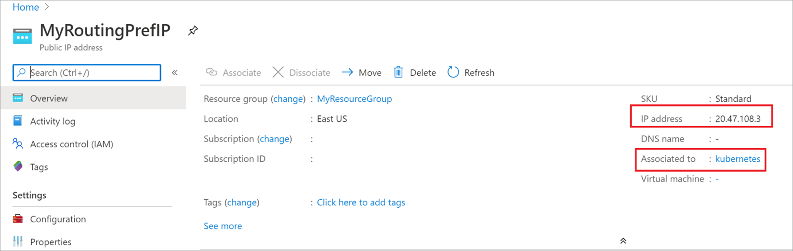

# Configure routing preference for a Kubernetes cluster using Azure CLI

This article shows you how to configure routing preference via ISP network (**Internet** option) for a Kubernetes cluster using Azure CLI. Routing preference is set by creating a public IP address of routing preference type **Internet**** and then using it while creating the AKS cluster.

[!INCLUDE [quickstarts-free-trial-note](../../includes/quickstarts-free-trial-note.md)]

[!INCLUDE [azure-cli-prepare-your-environment.md](../../includes/azure-cli-prepare-your-environment.md)]

- This article requires version 2.0.49 or later of the Azure CLI. If using Azure Cloud Shell, the latest version is already installed.

## Create a resource group
Create a resource group with the [az group create](/cli/azure/group#az_group_create) command. The following example creates a resource group in the **East US** Azure region:

```azurecli
  az group create --name myResourceGroup --location eastus
```
## Create a public IP address

Create a Public IP Address with routing preference of **Internet** type using command [az network public-ip create](/cli/azure/network/public-ip#az_network_public_ip_create).

The following command creates a new public IP with **Internet** routing preference in the **East US** Azure region.

```azurecli
az network public-ip create \
--name MyRoutingPrefIP \
--resource-group MyResourceGroup \
--location eastus \
--ip-tags 'RoutingPreference=Internet' \
--sku STANDARD \
--allocation-method static \
--version IPv4
```
> [!NOTE]
>  Currently, routing preference only supports IPV4 public IP addresses.

## Get the ID of public IP address

The following command returns the public IP address ID created in the previous section:
```azurecli
az network public-ip show \
--resource-group myResourceGroup \
--name myRoutingPrefIP \
--query id
```
## Create Kubernetes cluster with the public ip

The following command creates the AKS cluster with the public IP created in the previous section:

```azurecli
az aks create \
--resource-group MyResourceGroup \
--name MyAKSCluster \
--load-balancer-outbound-ips "Enter the public IP ID from previous step" --generate-ssh-key
```

>[!NOTE]
>It takes a few minutes to deploy the AKS cluster.

To validate, search for the public IP created in the earlier step in Azure portal, you will see the IP is associated with the load balancer that is associated with the Kubernetes cluster as shown below:

 


## Next steps

- Learn more about [routing preference in public IP addresses](routing-preference-overview.md). 
- [Configure routing preference for a VM using the Azure CLI](configure-routing-preference-virtual-machine-cli.md).
