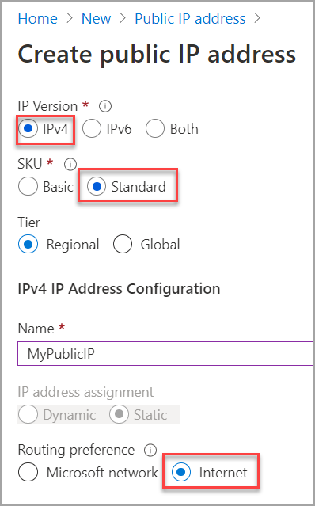
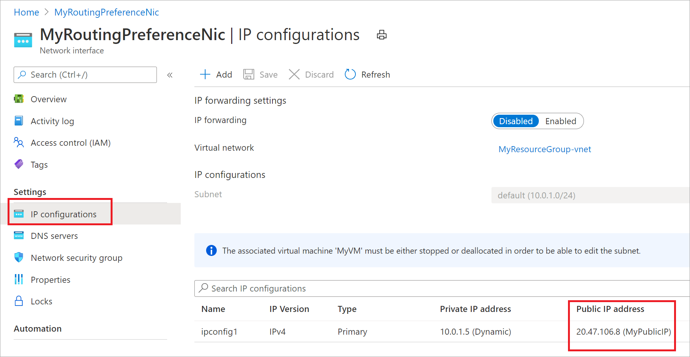

# Configure both routing preference options for a virtual machine

This article shows you how to configure both [routing preference](./routing-preference-overview.md) options (Internet and Microsoft global network) for a virtual machine (VM). This is achieved using two virtual network interfaces, one network interface with a public IP routed via the Microsoft global network, and the other one with a public IP routed via an ISP network.

## Prerequisites

Create a virtual machine with a public IP address following instructions described in [Create a virtual machine with a static public IP address using the Azure portal](./virtual-network-deploy-static-pip-arm-portal.md) using the Azure portal. The default routing preference choice for the public IP is via **Microsoft global network**. 
Once you have a virtual machine with a public IP created, add a second public IP to the VM that routes traffic via transit ISP network with its routing preference configured as **Internet**.

## Create a public IP address with a routing preference choice Internet
1. Sign in to the [Azure portal](https://portal.azure.com/).
2. Select **Create a resource**. 
3. In the search box, type *Public IP address*.
4. In the search results, select **Public IP address**. Next, in the **Public IP address** page, select **Create**.
5. In the **Routing preference** options, select **Internet**.

      

    > [!NOTE]
    > Public IP addresses are created with an IPv4 or IPv6 address. However, routing preference only supports IPV4 currently.

## Create a network interface and associate the public IP

1. Create a [network interface](./routing-preference-overview.md) using the Azure portal with default settings. 
1. [Associate the public IP to the network interface](./associate-public-ip-address-vm.md) created in the previous section. It may take a few seconds for an IP address to appear. View the public IP address assigned to the IP configuration, as shown:

    

## Attach network interface to the VM

1. [Attach the network interface created in the previous section to the virtual machine](./virtual-network-network-interface-vm.md).
2. You can now view two virtual network interfaces associated with the virtual machine, one with a public IP that is routed via Microsoft global network, and the other routed via with an ISP network as shown:
     

## Next steps
- Learn more about [public IP with routing preference](routing-preference-overview.md).
- [Configure routing preference for a VM](tutorial-routing-preference-virtual-machine-portal.md).
- [Configure routing preference for a public IP address using the PowerShell](routing-preference-powershell.md).
- Learn more about [public IP addresses](./public-ip-addresses.md#public-ip-addresses) in Azure.
- Learn more about all [public IP address settings](virtual-network-public-ip-address.md#create-a-public-ip-address).