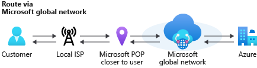
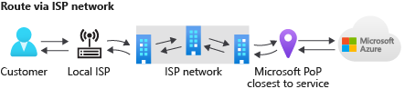

# What is routing preference (preview)?

Azure routing preference enables you to choose how your traffic routes between Azure and the Internet. You can choose to route traffic either via the Microsoft network, or, via the ISP network (public internet). These options are also referred to as *cold potato routing* and *hot potato routing* respectively. Egress data transfer price varies based on the routing selection. You can choose the routing option while creating a public IP address. The public IP address can be associated with resources such as virtual machine, virtual machine scale sets, internet-facing load balancer, etc. You can also set the routing preference for Azure storage resources such as blobs, files, web, and Azure DataLake. By default, traffic is routed via the Microsoft global network for all Azure services.

> [!IMPORTANT]
> Routing preference is currently in public preview.
> This preview version is provided without a service level agreement, and it's not recommended for production workloads. Certain features might not be supported or might have constrained capabilities. 
> For more information, see [Supplemental Terms of Use for Microsoft Azure Previews](https://azure.microsoft.com/support/legal/preview-supplemental-terms/).

## Routing via Microsoft global network

When you route your traffic via the *Microsoft global network*, traffic is delivered over one of the largest networks on the globe spanning over 160,000 miles of fiber with over 165 edge Point of Presence (POP). The network is well provisioned with multiple redundant fiber paths to ensure exceptionally high reliability and availability. The traffic engineering is managed by a software defined WAN controller that ensures low latency path selection for your traffic and offers the premium network performance.

**Ingress traffic:** The global BGP Anycast announcement ensures ingress traffic enters Microsoft network closest to the user. For example, if a user from Singapore accesses Azure resources hosted in Chicago, USA then traffic is entered into Microsoft global network in Singapore Edge POP and travels on Microsoft network to the service hosted in Chicago.

**Egress traffic:** The egress traffic follows the same principle. Traffic travels majority of its journey on Microsoft global network and exits closest to the user. For example, if traffic from Azure Chicago is destined to a user from Singapore, then traffic travels on Microsoft network from Chicago to Singapore, and exits the Microsoft network in Singapore Edge POP.

Both ingress and egress traffic stays bulk of the travel on the Microsoft global network. This is also known as *cold potato routing*.

## Routing over public Internet (ISP network)

The new routing choice *Internet routing* minimizes travel on the Microsoft global network, and uses the transit ISP network to route your traffic. This cost-optimized routing option offers network performance that is comparable to other cloud providers.

**Ingress traffic:** The ingress path uses *hot potato routing* which means that traffic enters the Microsoft network that is closest to the hosted service region. For example, if a user from Singapore accesses Azure resources hosted in Chicago then traffic travels over the public internet and enters the Microsoft global network in Chicago.

**Egress traffic:** The egress traffic follows the same principle. Traffic exits Microsoft network in the same region that the service is hosted. For example, if traffic from your service in Azure Chicago is destined to a user from Singapore, then traffic exits the Microsoft network in Chicago and travels over the public internet to the user in Singapore.

## Supported services

Public IP with Routing preference choice “Microsoft Global Network” can be associated with any Azure services. However, Public IP with Routing preference choice **Internet** can be associated with the following Azure resources:

* Virtual machine
* Virtual machine scale set
* Azure Kubernetes Service (AKS)
* Internet-facing load balancer
* Application Gateway
* Azure Firewall

For storage, primary endpoints always use the **Microsoft global network**. You can enable secondary endpoints with **Internet** as your choice for traffic routing. Supported storage services are:

* Blobs
* Files
* Web
* Azure DataLake

## Pricing
The price difference between both options is reflected in the internet egress data transfer pricing. Routing via **Microsoft global network** data transfer price is same as current internet egress price. Visit [Azure bandwidth pricing page](https://azure.microsoft.com/pricing/details/bandwidth/) for the latest pricing information. Routing via **Public Internet** is priced lower as shown in the table below:

| Egress source region | 0-5 GB/Month | 5GB-10 TB/Month | 10-50 TB/Month | 50-150 TB/Month | 150-500 TB/Month |
| --- | --- | --- | --- | --- | --- |
| Zone 1 | $0/GB | $0.085/GB | $0.065/GB | $0.06/GB | $0.04/GB |
| Zone 2 | $0/GB | $0.11/GB | $0.075/GB | $0.07/GB | $0.06/GB  |

[Contact us](https://azure.microsoft.com/overview/sales-number/) for monthly volume over 500 TB.
* Zone 1—Australia Central, Australia Central 2, Canada Central, Canada East, North Europe, West Europe, France Central, France South, Germany North (Public), Germany West Central (Public), Norway East, Norway West, Switzerland North, Switzerland West, UK South, UK West, Central US, East US, East US 2, North Central US, South Central US, West US, West US 2, and West Central US.

* Zone 2—East Asia, Southeast Asia, Australia East, Australia Southeast, Central India, South India, West India, Japan East, Japan West, Korea Central, and Korea South.

* Zone 3—Brazil South, South Africa North, South Africa West, UAE Central, and UAE North.

## Availability

Routing Preference support is available in the following regions for services such as virtual machine and internet-facing load balancer that use a public IP for internet egress - North Europe, West Europe, France South, UK South, East US, North Central US, South Central US, West US,  West Central US, Southeast Asia, Germany West Central, Switzerland West, Japan East, and Japan West.

Routing Preference support for storage account is available in the following Azure regions - France South, North Central US, and West Central US.
## Limitations

* Routing preference is only compatible with standard SKU of public IP address. Basic SKU of public IP address is not supported.
* Routing preference currently supports only IPv4 public IP addresses. IPv6 public IP addresses are not supported.
* Virtual machines with multiple NICs can have only one type of routing preference.

## Next steps

* [Configure routing preference for a VM using the Azure PowerShell](configure-routing-preference-virtual-machine-powershell.md)
* [Configure routing preference for a VM using the Azure CLI](configure-routing-preference-virtual-machine-cli.md)
