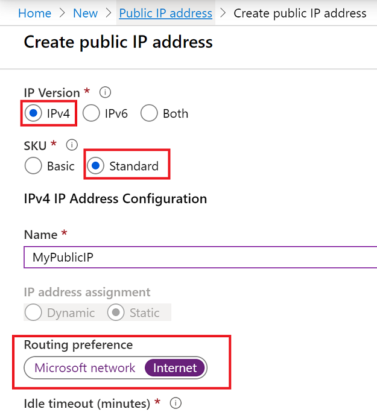

# Configure routing preference for a public IP address using the Azure portal

This article shows you how to configure routing preference via ISP network (**Internet** option) for a public IP address. After creating the public IP address, you can associate it with the following Azure resources for inbound and outbound traffic to the internet:

* Virtual machine
* Virtual machine scale set
* Azure Kubernetes Service (AKS)
* Internet-facing load balancer
* Application Gateway
* Azure Firewall

By default, the routing preference for public IP address is set to the Microsoft global network for all Azure services and can be associated with any Azure service.

> [!IMPORTANT]
> Routing preference is currently in public preview.
> This preview version is provided without a service level agreement, and it's not recommended for production workloads. Certain features might not be supported or might have constrained capabilities. 
> For more information, see [Supplemental Terms of Use for Microsoft Azure Previews](https://azure.microsoft.com/support/legal/preview-supplemental-terms/).

If you don't have an Azure subscription, create a [free account](https://azure.microsoft.com/free/?WT.mc_id=A261C142F) now.

## Register the feature for your subscription
The Routing Preference feature is currently in preview. Register the feature for your subscription using Azure PowerShell as follows:
```azurepowershell
Register-AzProviderFeature -FeatureName AllowRoutingPreferenceFeature -ProviderNamespace Microsoft.Network
```

## Create a public IP address with a routing preference
1. Sign in to the [Azure portal](https://preview.portal.azure.com/).
2. Select **Create a resource**. 
3. In the search box, type *Public IP address*.
3. In the search results, select **Public IP address**. Next, in the **Public IP address** page, select **Create**.
3. In the **Routing preference** options, select **Internet**.

      

    > [!NOTE]
    > Public IP addresses are created with an IPv4 or IPv6 address. However, routing preference only supports IPV4 currently.

You can associate the above created public IP address with a [Windows](../virtual-machines/windows/overview.md?toc=%2fazure%2fvirtual-network%2ftoc.json) or [Linux](../virtual-machines/linux/overview.md?toc=%2fazure%2fvirtual-network%2ftoc.json) virtual machine. Use the CLI section on the tutorial page: [Associate a public IP address to a virtual machine](associate-public-ip-address-vm.md#azure-cli) to associate the public IP to your VM. You can also associate the public IP address created above with an [Azure Load Balancer](../load-balancer/load-balancer-overview.md), by assigning it to the load balancer **frontend** configuration. The public IP address serves as a load-balanced virtual IP address (VIP).

## Next steps
- Learn more about [public IP with routing preference](routing-preference-overview.md).
- [Configure routing preference for a VM](tutorial-routing-preference-virtual-machine-portal.md).
- [Configure routing preference for a public IP address using the PowerShell](routing-preference-powershell.md).
- Learn more about [public IP addresses](virtual-network-ip-addresses-overview-arm.md#public-ip-addresses) in Azure.
- Learn more about all [public IP address settings](virtual-network-public-ip-address.md#create-a-public-ip-address).
