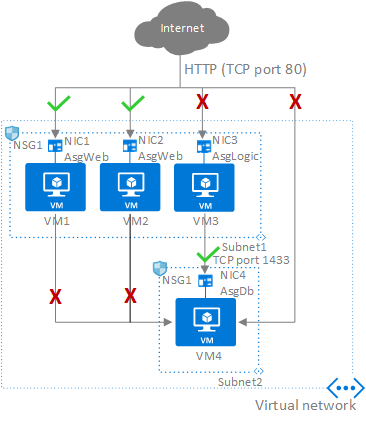
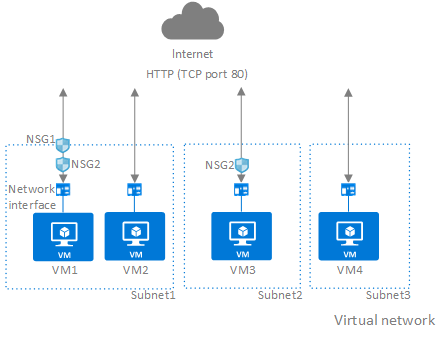

# Security groups

You can filter network traffic to and from Azure resources in an Azure [virtual network](virtual-networks-overview.md) with a network security group. A network security group contains [security rules](#security-rules) that allow or deny inbound network traffic to, or outbound network traffic from, several types of Azure resources. To learn about which Azure resources can be deployed into a virtual network and have network security groups associated to them, see [Virtual network integration for Azure services](virtual-network-for-azure-services.md). For each rule, you can specify source and destination, port, and protocol.

This article explains network security group concepts, to help you use them effectively. If you've never created a network security group, you can complete a quick [tutorial](tutorial-filter-network-traffic.md) to get some experience creating one. If you're familiar with network security groups and need to manage them, see [Manage a network security group](manage-network-security-group.md). If you're having communication problems and need to troubleshoot network security groups, see [Diagnose a virtual machine network traffic filter problem](diagnose-network-traffic-filter-problem.md). You can enable [network security group flow logs](../network-watcher/network-watcher-nsg-flow-logging-portal.md?toc=%2fazure%2fvirtual-network%2ftoc.json) to [analyze network traffic](../network-watcher/traffic-analytics.md?toc=%2fazure%2fvirtual-network%2ftoc.json) to and from resources that have an associated network security group.

## Security rules

A network security group contains zero, or as many rules as desired, within Azure subscription [limits](../azure-resource-manager/management/azure-subscription-service-limits.md?toc=%2fazure%2fvirtual-network%2ftoc.json#azure-resource-manager-virtual-networking-limits). Each rule specifies the following properties:

|Property  |Explanation  |
|---------|---------|
|Name|A unique name within the network security group.|
|Priority | A number between 100 and 4096. Rules are processed in priority order, with lower numbers processed before higher numbers, because lower numbers have higher priority. Once traffic matches a rule, processing stops. As a result, any rules that exist with lower priorities (higher numbers) that have the same attributes as rules with higher priorities are not processed.|
|Source or destination| Any, or an individual IP address, classless inter-domain routing (CIDR) block (10.0.0.0/24, for example), [service tag](service-tags-overview.md), or [application security group](#application-security-groups). If you specify an address for an Azure resource, specify the private IP address assigned to the resource. Network security groups are processed after Azure translates a public IP address to a private IP address for inbound traffic, and before Azure translates a private IP address to a public IP address for outbound traffic. Learn more about Azure [IP addresses](virtual-network-ip-addresses-overview-arm.md). Specifying a range, a service tag, or application security group, enables you to create fewer security rules. The ability to specify multiple individual IP addresses and ranges (you cannot specify multiple service tags or application groups) in a rule is referred to as [augmented security rules](#augmented-security-rules). Augmented security rules can only be created in network security groups created through the Resource Manager deployment model. You cannot specify multiple IP addresses and IP address ranges in network security groups created through the classic deployment model. Learn more about [Azure deployment models](../azure-resource-manager/management/deployment-models.md?toc=%2fazure%2fvirtual-network%2ftoc.json).|
|Protocol     | TCP, UDP, ICMP or Any.|
|Direction| Whether the rule applies to inbound, or outbound traffic.|
|Port range     |You can specify an individual or range of ports. For example, you could specify 80 or 10000-10005. Specifying ranges enables you to create fewer security rules. Augmented security rules can only be created in network security groups created through the Resource Manager deployment model. You cannot specify multiple ports or port ranges in the same security rule in network security groups created through the classic deployment model.   |
|Action     | Allow or deny        |

Network security group security rules are evaluated by priority using the 5-tuple information (source, source port, destination, destination port, and protocol) to allow or deny the traffic. A flow record is created for existing connections. Communication is allowed or denied based on the connection state of the flow record. The flow record allows a network security group to be stateful. If you specify an outbound security rule to any address over port 80, for example, it's not necessary to specify an inbound security rule for the response to the outbound traffic. You only need to specify an inbound security rule if communication is initiated externally. The opposite is also true. If inbound traffic is allowed over a port, it's not necessary to specify an outbound security rule to respond to traffic over the port.
Existing connections may not be interrupted when you remove a security rule that enabled the flow. Traffic flows are interrupted when connections are stopped and no traffic is flowing in either direction, for at least a few minutes.

There are limits to the number of security rules you can create in a network security group. For details, see [Azure limits](../azure-resource-manager/management/azure-subscription-service-limits.md?toc=%2fazure%2fvirtual-network%2ftoc.json#azure-resource-manager-virtual-networking-limits).

## Augmented security rules

Augmented security rules simplify security definition for virtual networks, allowing you to define larger and complex network security policies, with fewer rules. You can combine multiple ports and multiple explicit IP addresses and ranges into a single, easily understood security rule. Use augmented rules in the source, destination, and port fields of a rule. To simplify maintenance of your security rule definition, combine augmented security rules with [service tags](service-tags-overview.md) or [application security groups](#application-security-groups). There are limits to the number of addresses, ranges, and ports that you can specify in a rule. For details, see [Azure limits](../azure-resource-manager/management/azure-subscription-service-limits.md?toc=%2fazure%2fvirtual-network%2ftoc.json#azure-resource-manager-virtual-networking-limits).

## Service tags

A service tag represents a group of IP address prefixes from a given Azure service. It helps to minimize complexity of frequent updates on network security rules.

For more information, see [Azure service tags](service-tags-overview.md). 

## Default security rules

Azure creates the following default rules in each network security group that you create:

### Inbound

#### AllowVNetInBound

|Priority|Source|Source ports|Destination|Destination ports|Protocol|Access|
|---|---|---|---|---|---|---|
|65000|VirtualNetwork|0-65535|VirtualNetwork|0-65535|Any|Allow|

#### AllowAzureLoadBalancerInBound

|Priority|Source|Source ports|Destination|Destination ports|Protocol|Access|
|---|---|---|---|---|---|---|
|65001|AzureLoadBalancer|0-65535|0.0.0.0/0|0-65535|Any|Allow|

#### DenyAllInbound

|Priority|Source|Source ports|Destination|Destination ports|Protocol|Access|
|---|---|---|---|---|---|---|
|65500|0.0.0.0/0|0-65535|0.0.0.0/0|0-65535|Any|Deny|

### Outbound

#### AllowVnetOutBound

|Priority|Source|Source ports| Destination | Destination ports | Protocol | Access |
|---|---|---|---|---|---|---|
| 65000 | VirtualNetwork | 0-65535 | VirtualNetwork | 0-65535 | Any | Allow |

#### AllowInternetOutBound

|Priority|Source|Source ports| Destination | Destination ports | Protocol | Access |
|---|---|---|---|---|---|---|
| 65001 | 0.0.0.0/0 | 0-65535 | Internet | 0-65535 | Any | Allow |

#### DenyAllOutBound

|Priority|Source|Source ports| Destination | Destination ports | Protocol | Access |
|---|---|---|---|---|---|---|
| 65500 | 0.0.0.0/0 | 0-65535 | 0.0.0.0/0 | 0-65535 | Any | Deny |

In the **Source** and **Destination** columns, *VirtualNetwork*, *AzureLoadBalancer*, and *Internet* are [service tags](service-tags-overview.md), rather than IP addresses. In the protocol column, **Any** encompasses TCP, UDP, and ICMP. When creating a rule, you can specify TCP, UDP, ICMP or Any. *0.0.0.0/0* in the **Source** and **Destination** columns represents all addresses. Clients like Azure portal, Azure CLI, or Powershell can use * or any for this expression.
 
You cannot remove the default rules, but you can override them by creating rules with higher priorities.

## Application security groups

Application security groups enable you to configure network security as a natural extension of an application's structure, allowing you to group virtual machines and define network security policies based on those groups. You can reuse your security policy at scale without manual maintenance of explicit IP addresses. The platform handles the complexity of explicit IP addresses and multiple rule sets, allowing you to focus on your business logic. To better understand application security groups, consider the following example:

In the previous picture, *NIC1* and *NIC2* are members of the *AsgWeb* application security group. *NIC3* is a member of the *AsgLogic* application security group. *NIC4* is a member of the *AsgDb* application security group. Though each network interface in this example is a member of only one application security group, a network interface can be a member of multiple application security groups, up to the [Azure limits](../azure-resource-manager/management/azure-subscription-service-limits.md?toc=%2fazure%2fvirtual-network%2ftoc.json#azure-resource-manager-virtual-networking-limits). None of the network interfaces have an associated network security group. *NSG1* is associated to both subnets and contains the following rules:

### Allow-HTTP-Inbound-Internet

This rule is needed to allow traffic from the internet to the web servers. Because inbound traffic from the internet is denied by the [DenyAllInbound](#denyallinbound)
default security rule, no additional rule is needed for the *AsgLogic* or *AsgDb* application security groups.

|Priority|Source|Source ports| Destination | Destination ports | Protocol | Access |
|---|---|---|---|---|---|---|
| 100 | Internet | * | AsgWeb | 80 | TCP | Allow |

### Deny-Database-All

Because the [AllowVNetInBound](#allowvnetinbound) default security rule allows all communication between resources in the same virtual network, this rule is needed to deny traffic from all resources.

|Priority|Source|Source ports| Destination | Destination ports | Protocol | Access |
|---|---|---|---|---|---|---|
| 120 | * | * | AsgDb | 1433 | Any | Deny |

### Allow-Database-BusinessLogic

This rule allows traffic from the *AsgLogic* application security group to the *AsgDb* application security group. The priority for this rule is higher than the priority for the *Deny-Database-All* rule. As a result, this rule is processed before the *Deny-Database-All* rule, so traffic from the *AsgLogic* application security group is allowed, whereas all other traffic is blocked.

|Priority|Source|Source ports| Destination | Destination ports | Protocol | Access |
|---|---|---|---|---|---|---|
| 110 | AsgLogic | * | AsgDb | 1433 | TCP | Allow |

The rules that specify an application security group as the source or destination are only applied to the network interfaces that are members of the application security group. If the network interface is not a member of an application security group, the rule is not applied to the network interface, even though the network security group is associated to the subnet.

Application security groups have the following constraints:

-	There are limits to the number of application security groups you can have in a subscription, as well as other limits related to application security groups. For details, see [Azure limits](../azure-resource-manager/management/azure-subscription-service-limits.md?toc=%2fazure%2fvirtual-network%2ftoc.json#azure-resource-manager-virtual-networking-limits).
- You can specify one application security group as the source and destination in a security rule. You cannot specify multiple application security groups in the source or destination.
- All network interfaces assigned to an application security group have to exist in the same virtual network that the first network interface assigned to the application security group is in. For example, if the first network interface assigned to an application security group named *AsgWeb* is in the virtual network named *VNet1*, then all subsequent network interfaces assigned to *ASGWeb* must exist in *VNet1*. You cannot add network interfaces from different virtual networks to the same application security group.
- If you specify an application security group as the source and destination in a security rule, the network interfaces in both application security groups must exist in the same virtual network. For example, if *AsgLogic* contained network interfaces from *VNet1*, and *AsgDb* contained network interfaces from *VNet2*, you could not assign *AsgLogic* as the source and *AsgDb* as the destination in a rule. All network interfaces for both the source and destination application security groups need to exist in the same virtual network.

> [!TIP]
> To minimize the number of security rules you need, and the need to change the rules, plan out the application security groups you need and create rules using service tags or application security groups, rather than individual IP addresses, or ranges of IP addresses, whenever possible.

## How traffic is evaluated

You can deploy resources from several Azure services into an Azure virtual network. For a complete list, see [Services that can be deployed into a virtual network](virtual-network-for-azure-services.md#services-that-can-be-deployed-into-a-virtual-network). You can associate zero, or one, network security group to each virtual network [subnet](virtual-network-manage-subnet.md#change-subnet-settings) and [network interface](virtual-network-network-interface.md#associate-or-dissociate-a-network-security-group) in a virtual machine. The same network security group can be associated to as many subnets and network interfaces as you choose.

The following picture illustrates different scenarios for how network security groups might be deployed to allow network traffic to and from the internet over TCP port 80:

Reference the previous picture, along with the following text, to understand how Azure processes inbound and outbound rules for network security groups:

### Inbound traffic

For inbound traffic, Azure processes the rules in a network security group associated to a subnet first, if there is one, and then the rules in a network security group associated to the network interface, if there is one.

- **VM1**: The security rules in *NSG1* are processed, since it is associated to *Subnet1* and *VM1* is in *Subnet1*. Unless you've created a rule that allows port 80 inbound, the traffic is denied by the [DenyAllInbound](#denyallinbound) default security rule, and never evaluated by *NSG2*, since *NSG2* is associated to the network interface. If *NSG1* has a security rule that allows port 80, the traffic is then processed by *NSG2*. To allow port 80 to the virtual machine, both *NSG1* and *NSG2* must have a rule that allows port 80 from the internet.
- **VM2**: The rules in *NSG1* are processed because *VM2* is also in *Subnet1*. Since *VM2* does not have a network security group associated to its network interface, it receives all traffic allowed through *NSG1* or is denied all traffic denied by *NSG1*. Traffic is either allowed or denied to all resources in the same subnet when a network security group is associated to a subnet.
- **VM3**: Since there is no network security group associated to *Subnet2*, traffic is allowed into the subnet and processed by *NSG2*, because *NSG2* is associated to the network interface attached to *VM3*.
- **VM4**: Traffic is allowed to *VM4,* because a network security group isn't associated to *Subnet3*, or the network interface in the virtual machine. All network traffic is allowed through a subnet and network interface if they don't have a network security group associated to them.

### Outbound traffic

For outbound traffic, Azure processes the rules in a network security group associated to a network interface first, if there is one, and then the rules in a network security group associated to the subnet, if there is one.

- **VM1**: The security rules in *NSG2* are processed. Unless you create a security rule that denies port 80 outbound to the internet, the traffic is allowed by the [AllowInternetOutbound](#allowinternetoutbound) default security rule in both *NSG1* and *NSG2*. If *NSG2* has a security rule that denies port 80, the traffic is denied, and never evaluated by *NSG1*. To deny port 80 from the virtual machine, either, or both of the network security groups must have a rule that denies port 80 to the internet.
- **VM2**: All traffic is sent through the network interface to the subnet, since the network interface attached to *VM2* does not have a network security group associated to it. The rules in *NSG1* are processed.
- **VM3**: If *NSG2* has a security rule that denies port 80, the traffic is denied. If *NSG2* has a security rule that allows port 80, then port 80 is allowed outbound to the internet, since a network security group is not associated to *Subnet2*.
- **VM4**: All network traffic is allowed from *VM4,* because a network security group isn't associated to the network interface attached to the virtual machine, or to *Subnet3*.

### Intra-Subnet traffic

It's important to note that security rules in an NSG associated to a subnet can affect connectivity between VM's within it. For example, if a rule is added to *NSG1* which denies all inbound and outbound traffic, *VM1* and *VM2* will no longer be able to communicate with each other. Another rule would have to be added specifically to allow this. 

You can easily view the aggregate rules applied to a network interface by viewing the [effective security rules](virtual-network-network-interface.md#view-effective-security-rules) for a network interface. You can also use the [IP flow verify](../network-watcher/diagnose-vm-network-traffic-filtering-problem.md?toc=%2fazure%2fvirtual-network%2ftoc.json) capability in Azure Network Watcher to determine whether communication is allowed to or from a network interface. IP flow verify tells you whether communication is allowed or denied, and which network security rule allows or denies the traffic.

> [!NOTE]
> Network security groups are associated to subnets or to virtual machines and cloud services deployed in the classic deployment model, and to subnets or network interfaces in the Resource Manager deployment model. To learn more about Azure deployment models, see [Understand Azure deployment models](../azure-resource-manager/management/deployment-models.md?toc=%2fazure%2fvirtual-network%2ftoc.json).

> [!TIP]
> Unless you have a specific reason to, we recommended that you associate a network security group to a subnet, or a network interface, but not both. Since rules in a network security group associated to a subnet can conflict with rules in a network security group associated to a network interface, you can have unexpected communication problems that require troubleshooting.

## Azure platform considerations

- **Virtual IP of the host node**: Basic infrastructure services such as DHCP, DNS, IMDS, and health monitoring are provided through the virtualized host IP addresses 168.63.129.16 and 169.254.169.254. These IP addresses belong to Microsoft and are the only virtualized IP addresses used in all regions for this purpose.
- **Licensing (Key Management Service)**: Windows images running in virtual machines must be licensed. To ensure licensing, a request is sent to the Key Management Service host servers that handle such queries. The request is made outbound through port 1688. For deployments using [default route 0.0.0.0/0](virtual-networks-udr-overview.md#default-route) configuration, this platform rule will be disabled.
- **Virtual machines in load-balanced pools**: The source port and address range applied are from the originating computer, not the load balancer. The destination port and address range are for the destination computer, not the load balancer.
- **Azure service instances**: Instances of several Azure services, such as HDInsight, Application Service Environments, and Virtual Machine Scale Sets are deployed in virtual network subnets. For a complete list of services you can deploy into virtual networks, see [Virtual network for Azure services](virtual-network-for-azure-services.md#services-that-can-be-deployed-into-a-virtual-network). Ensure you familiarize yourself with the port requirements for each service before applying a network security group to the subnet the resource is deployed in. If you deny ports required by the service, the service doesn't function properly.
- **Sending outbound email**: Microsoft recommends that you utilize authenticated SMTP relay services (typically connected via TCP port 587, but often others, as well) to send email from Azure Virtual Machines. SMTP relay services specialize in sender reputation, to minimize the possibility that third-party email providers reject messages. Such SMTP relay services include, but are not limited to, Exchange Online Protection and SendGrid. Use of SMTP relay services is in no way restricted in Azure, regardless of your subscription type. 

  If you created your Azure subscription prior to November 15, 2017, in addition to being able to use SMTP relay services, you can send email directly over TCP port 25. If you created your subscription after November 15, 2017, you may not be able to send email directly over port 25. The behavior of outbound communication over port 25 depends on the type of subscription you have, as follows:

     - **Enterprise Agreement**: Outbound port 25 communication is allowed. You are able to send outbound email directly from virtual machines to external email providers, with no restrictions from the Azure platform. 
     - **Pay-as-you-go:** Outbound port 25 communication is blocked from all resources. If you need to send email from a virtual machine directly to external email providers (not using an authenticated SMTP relay), you can make a request to remove the restriction. Requests are reviewed and approved at Microsoft's discretion and are only granted after anti-fraud checks are performed. To make a request, open a support case with the issue type *Technical*, *Virtual Network Connectivity*, *Cannot send e-mail (SMTP/Port 25)*. In your support case, include details about why your subscription needs to send email directly to mail providers, instead of going through an authenticated SMTP relay. If your subscription is exempted, only virtual machines created after the exemption date are able to communicate outbound over port 25.
     - **MSDN, Azure Pass, Azure in Open, Education, BizSpark, and Free trial**: Outbound port 25 communication is blocked from all resources. No requests to remove the restriction can be made, because requests are not granted. If you need to send email from your virtual machine, you have to use an SMTP relay service.
     - **Cloud service provider**: Customers that are consuming Azure resources via a cloud service provider can create a support case with their cloud service provider, and request that the provider create an unblock case on their behalf, if a secure SMTP relay cannot be used.

  If Azure allows you to send email over port 25, Microsoft cannot guarantee email providers will accept inbound email from your virtual machine. If a specific provider rejects mail from your virtual machine, work directly with the provider to resolve any message delivery or spam filtering issues, or use an authenticated SMTP relay service.

## Next steps

* Learn how to [Create a network security group](tutorial-filter-network-traffic.md).
