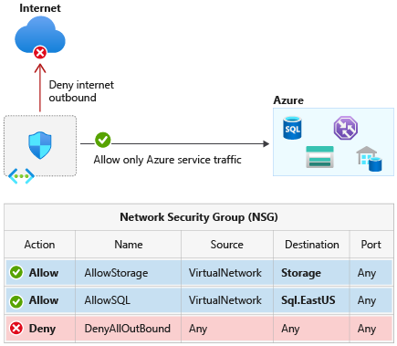

--- 
title: Azure service tags overview
titlesuffix: Azure Virtual Network
description: Learn about service tags. Service tags help minimize the complexity of security rule creation.
services: virtual-network
author: asudbring
ms.service: virtual-network
ms.topic: conceptual
ms.workload: infrastructure-services
ms.date: 1/26/2023
ms.author: allensu
---

# Virtual network service tags
<a name="network-service-tags"></a>

A service tag represents a group of IP address prefixes from a given Azure service. Microsoft manages the address prefixes encompassed by the service tag and automatically updates the service tag as addresses change, minimizing the complexity of frequent updates to network security rules.

You can use service tags to define network access controls on [network security groups](./network-security-groups-overview.md#security-rules), [Azure Firewall](../firewall/service-tags.md), and user-defined routes. Use service tags in place of specific IP addresses when you create security rules and routes. By specifying the service tag name, such as **ApiManagement**, in the appropriate *source* or *destination* field of a security rule, you can allow or deny the traffic for the corresponding service. By specifying the service tag name in the address prefix of a route, you can route traffic intended for any of the prefixes encapsulated by the service tag to a desired next hop type. 


> [!NOTE] 
> As of March 2022, using service tags in place of explicit address prefixes in [user defined routes](./virtual-networks-udr-overview.md#user-defined) is out of preview and generally available.

You can use service tags to achieve network isolation and protect your Azure resources from the general Internet while accessing Azure services that have public endpoints. Create inbound/outbound network security group rules to deny traffic to/from **Internet** and allow traffic to/from **AzureCloud** or other [available service tags](#available-service-tags) of specific Azure services.



## Available service tags

The following table includes all the service tags available for use in [network security group](./network-security-groups-overview.md#security-rules) rules.

The columns indicate whether the tag:

- Is suitable for rules that cover inbound or outbound traffic.
- Supports [regional](https://azure.microsoft.com/regions) scope.
- Is usable in [Azure Firewall](../firewall/service-tags.md) rules as a *destination* rule only for inbound or outbound traffic.

By default, service tags reflect the ranges for the entire cloud. Some service tags also allow more granular control by restricting the corresponding IP ranges to a specified region. For example, the service tag **Storage** represents Azure Storage for the entire cloud, but **Storage.WestUS** narrows the range to only the storage IP address ranges from the WestUS region. The following table indicates whether each service tag supports such regional scope, and the direction listed for each tag is a recommendation. For example, the AzureCloud tag may be used to allow inbound traffic. In most scenarios, we don't recommend allowing traffic from all Azure IPs since IPs used by other Azure customers are included as part of the service tag. 

| Tag | Purpose | Can use inbound or outbound? | Can be regional? | Can use with Azure Firewall? |
| --- | -------- |:---:|:---:|:---:|
| **ActionGroup** | Action Group. | Inbound | No | Yes |
| **ApiManagement** | Management traffic for Azure API Management-dedicated deployments. <br/><br/>**Note**: This tag represents the Azure API Management service endpoint for control plane per region. The tag enables customers to perform management operations on the APIs, Operations, Policies, NamedValues configured on the API Management service.  | Inbound | Yes | Yes |
| **ApplicationInsightsAvailability** | Application Insights Availability. | Inbound | No | Yes |
| **AppConfiguration** | App Configuration. | Outbound | No | Yes |
| **AppService**    | Azure App Service. This tag is recommended for outbound security rules to web apps and Function apps.<br/><br/>**Note**: This tag doesn't include IP addresses assigned when using IP-based SSL (App-assigned address). | Outbound | Yes | Yes |
| **AppServiceManagement** | Management traffic for deployments dedicated to App Service Environment. | Both | No | Yes |
| **AutonomousDevelopmentPlatform** | Autonomous Development Platform | Both | Yes | Yes |
| **AzureActiveDirectory** | Microsoft Entra ID. | Outbound | No | Yes |
| **AzureActiveDirectoryDomainServices** | Management traffic for deployments dedicated to Microsoft Entra Domain Services. | Both | No | Yes |
| **AzureAdvancedThreatProtection** | Azure Advanced Threat Protection. | Outbound | No | Yes |
| **AzureArcInfrastructure** | Azure Arc-enabled servers, Azure Arc-enabled Kubernetes, and Guest Configuration traffic.<br/><br/>**Note**: This tag has a dependency on the **AzureActiveDirectory**,**AzureTrafficManager**, and **AzureResourceManager** tags. | Outbound | No | Yes |
| **AzureAttestation** | Azure Attestation. | Outbound | No | Yes | 
| **AzureBackup** |Azure Backup.<br/><br/>**Note**: This tag has a dependency on the **Storage** and **AzureActiveDirectory** tags. | Outbound | No | Yes |
| **AzureBotService** | Azure Bot Service. | Outbound | No | Yes |
| **AzureCloud** | All [datacenter public IP addresses](https://www.microsoft.com/download/details.aspx?id=56519). Doesn't include IPv6. | Both | Yes | Yes |
| **AzureCognitiveSearch** | Azure Cognitive Search. <br/><br/>This tag or the IP addresses covered by this tag can be used to grant indexers secure access to data sources. For more information about indexers, see [indexer connection documentation](../search/search-indexer-troubleshooting.md#connection-errors). <br/><br/> **Note**: The IP of the search service isn't included in the list of IP ranges for this service tag and **also needs to be added** to the IP firewall of data sources. | Inbound | No | Yes |
| **AzureConnectors** | This tag represents the IP addresses used for managed connectors that make inbound webhook callbacks to the Azure Logic Apps service and outbound calls to their respective services, for example, Azure Storage or Azure Event Hubs. | Both | Yes | Yes |
| **AzureContainerAppsService** | Azure Container Apps Service | Both | Yes | No |
| **AzureContainerRegistry** | Azure Container Registry. | Outbound | Yes | Yes |
| **AzureCosmosDB** | Azure Cosmos DB. | Outbound | Yes | Yes |
| **AzureDatabricks** | Azure Databricks. | Both | No | Yes |
| **AzureDataExplorerManagement** | Azure Data Explorer Management. | Inbound | No | Yes |
| **AzureDataLake** | Azure Data Lake Storage Gen1. | Outbound | No | Yes |
| **AzureDeviceUpdate** | Device Update for IoT Hub. | Both | No | Yes |
| **AzureDevSpaces** | Azure Dev Spaces. | Outbound | No | Yes |
| **AzureDevOps** | Azure DevOps. | Inbound | Yes | Yes |
| **AzureDigitalTwins** | Azure Digital Twins.<br/><br/>**Note**: This tag or the IP addresses covered by this tag can be used to restrict access to endpoints configured for event routes. | Inbound | No | Yes |
| **AzureEventGrid** | Azure Event Grid. | Both | No | Yes |
| **AzureFrontDoor.Frontend** <br/> **AzureFrontDoor.Backend** <br/> **AzureFrontDoor.FirstParty**  | Azure Front Door. | Both | Yes | Yes |
| **AzureHealthcareAPIs**  | The IP addresses covered by this tag can be used to restrict access to Azure Health Data Services. | Both | No | Yes |
| **AzureInformationProtection** | Azure Information Protection.<br/><br/>**Note**: This tag has a dependency on the **AzureActiveDirectory**, **AzureFrontDoor.Frontend** and **AzureFrontDoor.FirstParty** tags. | Outbound | No | Yes |
| **AzureIoTHub** | Azure IoT Hub. | Outbound | Yes | Yes |
| **AzureKeyVault** | Azure Key Vault.<br/><br/>**Note**: This tag has a dependency on the **AzureActiveDirectory** tag. | Outbound | Yes | Yes |
| **AzureLoadBalancer** | The Azure infrastructure load balancer. The tag translates to the [virtual IP address of the host](./network-security-groups-overview.md#azure-platform-considerations) (168.63.129.16) where the Azure health probes originate. This only includes probe traffic, not real traffic to your backend resource. If you're not using Azure Load Balancer, you can override this rule. | Both | No | No |
| **AzureLoadTestingInstanceManagement** | This service tag is used for inbound connectivity from Azure Load Testing service to the load generation instances injected into your virtual network in the private load testing scenario. <br/><br/>**Note:** This tag is intended to be used in Azure Firewall, NSG, UDR and all other gateways for inbound connectivity. | Inbound | No | Yes |
| **AzureMachineLearning** | Azure Machine Learning. | Both | No | Yes |
| **AzureMachineLearningInference** | This service tag is used for restricting public network ingress in private network managed inferencing scenarios. | Inbound | No | Yes |
| **AzureManagedGrafana** | Azure Managed Grafana instance endpoint. | Outbound | No | Yes |
| **AzureMonitor** | Log Analytics, Application Insights, AzMon, and custom metrics (GiG endpoints).<br/><br/>**Note**: For Log Analytics, the **Storage** tag is also required. If Linux agents are used, **GuestAndHybridManagement** tag is also required. | Outbound | No | Yes |
| **AzureOpenDatasets** | Azure Open Datasets.<br/><br/>**Note**: This tag has a dependency on the **AzureFrontDoor.Frontend** and **Storage** tag. | Outbound | No | Yes |
| **AzurePlatformDNS** | The basic infrastructure (default) DNS service.<br/><br/>You can use this tag to disable the default DNS. Be cautious when you use this tag. We recommend that you read [Azure platform considerations](./network-security-groups-overview.md#azure-platform-considerations). We also recommend that you perform testing before you use this tag. | Outbound | No | No |
| **AzurePlatformIMDS** | Azure Instance Metadata Service (IMDS), which is a basic infrastructure service.<br/><br/>You can use this tag to disable the default IMDS. Be cautious when you use this tag. We recommend that you read [Azure platform considerations](./network-security-groups-overview.md#azure-platform-considerations). We also recommend that you perform testing before you use this tag. | Outbound | No | No |
| **AzurePlatformLKM** | Windows licensing or key management service.<br/><br/>You can use this tag to disable the defaults for licensing. Be cautious when you use this tag. We recommend that you read [Azure platform considerations](./network-security-groups-overview.md#azure-platform-considerations).  We also recommend that you perform testing before you use this tag. | Outbound | No | No |
| **AzureResourceManager** | Azure Resource Manager. | Outbound | No | Yes |
| **AzureSentinel** | Microsoft Sentinel. | Inbound | No | Yes |
| **AzureSignalR** | Azure SignalR. | Outbound | No | Yes |
| **AzureSiteRecovery** | Azure Site Recovery.<br/><br/>**Note**: This tag has a dependency on the **AzureActiveDirectory**, **AzureKeyVault**, **EventHub**,**GuestAndHybridManagement** and **Storage** tags. | Outbound | No | Yes |
| **AzureSphere** | This tag or the IP addresses covered by this tag can be used to restrict access to Azure Sphere Security Services. | Both | No | Yes | 
| **AzureSpringCloud** | Allow traffic to applications hosted in Azure Spring Apps. | Outbound | No | Yes |
| **AzureStack** | Azure Stack Bridge services. <br/> This tag represents the Azure Stack Bridge service endpoint per region. | Outbound | No | Yes |
| **AzureTrafficManager** | Azure Traffic Manager probe IP addresses.<br/><br/>For more information on Traffic Manager probe IP addresses, see [Azure Traffic Manager FAQ](../traffic-manager/traffic-manager-faqs.md). | Inbound | No | Yes |  
| **AzureUpdateDelivery** | For accessing Windows Updates. <br/><br/>**Note**: This tag provides access to Windows Update metadata services. To successfully download updates, you must also enable the **AzureFrontDoor.FirstParty** service tag and configure outbound security rules with the protocol and port defined as follows: <ul><li>AzureUpdateDelivery: TCP, port 443</li><li>AzureFrontDoor.FirstParty: TCP, port 80</li></ul> | Outbound | No | Yes |  
| **AzureWebPubSub** | AzureWebPubSub | Both | Yes | Yes |
| **BatchNodeManagement** | Management traffic for deployments dedicated to Azure Batch. | Both | Yes | Yes |
| **ChaosStudio** | Azure Chaos Studio. <br/><br/>**Note**: If you have enabled Application Insights integration on the Chaos Agent, the AzureMonitor tag is also required. | Both | No | Yes |
| **CognitiveServicesFrontend** | The address ranges for traffic for Azure AI services frontend portals. | Both | No | Yes |
| **CognitiveServicesManagement** | The address ranges for traffic for Azure AI services. | Both | No | Yes |
| **DataFactory**  | Azure Data Factory | Both | Yes | Yes |
| **DataFactoryManagement** | Management traffic for Azure Data Factory. | Outbound | No | Yes |
| **Dynamics365ForMarketingEmail** | The address ranges for the marketing email service of Dynamics 365. | Both | Yes | Yes |
| **Dynamics365BusinessCentral** | This tag or the IP addresses covered by this tag can be used to restrict access from/to the Dynamics 365 Business Central Services. | Both | No | Yes |
| **EOPExternalPublishedIPs** | This tag represents the IP addresses used for Security & Compliance Center PowerShell. Refer to the [Connect to Security & Compliance Center PowerShell using the EXO V2 module for more details](/powershell/exchange/connect-to-scc-powershell). | Both | No | Yes |
| **EventHub** | Azure Event Hubs. | Outbound | Yes | Yes |
| **GatewayManager** | Management traffic for deployments dedicated to Azure VPN Gateway and Application Gateway. | Inbound | No | No |
| **GuestAndHybridManagement** | Azure Automation and Guest Configuration. | Outbound | No | Yes |
| **HDInsight** | Azure HDInsight. | Inbound | Yes | Yes |
| **Internet** | The IP address space that's outside the virtual network and reachable by the public internet.<br/><br/>The address range includes the [Azure-owned public IP address space](https://www.microsoft.com/download/details.aspx?id=56519). | Both | No | No |
| **KustoAnalytics** | Kusto Analytics. | Both | No | No |
| **LogicApps** | Logic Apps. | Both | No | Yes |
| **LogicAppsManagement** | Management traffic for Logic Apps. | Inbound | No | Yes |
| **Marketplace** | Represents the entire suite of Azure 'Commercial Marketplace Experiences' services. | Both | No | Yes |
| **M365ManagementActivityApi** | The Office 365 Management Activity API provides information about various user, admin, system, and policy actions and events from Office 365 and Microsoft Entra activity logs. Customers and partners can use this information to create new or enhance existing operations, security, and compliance-monitoring solutions for the enterprise.<br/><br/>**Note**: This tag has a dependency on the **AzureActiveDirectory** tag. | Outbound | Yes | Yes |
| **M365ManagementActivityApiWebhook** | Notifications are sent to the configured webhook for a subscription as new content becomes available. | Inbound | Yes | Yes |
| **MicrosoftAzureFluidRelay** | This tag represents the IP addresses used for Azure Microsoft Fluid Relay Server. </br> **Note**: This tag has a dependency on the **AzureFrontDoor.Frontend** tag. | Outbound | No | Yes |
| **MicrosoftCloudAppSecurity** | Microsoft Defender for Cloud Apps. | Outbound | No | Yes |
| **MicrosoftContainerRegistry** | Container registry for Microsoft container images. <br/><br/>**Note**: This tag has a dependency on the **AzureFrontDoor.FirstParty** tag. | Outbound | Yes | Yes |
| **MicrosoftDefenderForEndpoint** | Microsoft Defender for Endpoint <br/></br>**Please note this service tag is currently not available and in progress. We will update once it is ready for use.**| Both | No | Yes |
| **MicrosoftPurviewPolicyDistribution** | This tag should be used within the outbound security rules for a data source (e.g. Azure SQL MI) configured with private endpoint to retrieve policies from Microsoft Purview | Outbound| No | No |
| **PowerBI** | Power BI platform backend services and API endpoints.<br/><br/>**Note:** does not include frontend endpoints at the moment (e.g., app.powerbi.com).<br/><br/>Access to frontend endpoints should be provided through AzureCloud tag (Outbound, HTTPS, can be regional). | Both | No | Yes |
| **PowerPlatformInfra** | This tag represents the IP addresses used by the infrastructure to host Power Platform services. | Outbound | Yes | Yes |
| **PowerPlatformPlex** | This tag represents the IP addresses used by the infrastructure to host Power Platform extension execution on behalf of the customer. | Inbound | Yes | Yes |
| **PowerQueryOnline** | Power Query Online. | Both | No | Yes |
| **ServiceBus** | Azure Service Bus traffic that uses the Premium service tier. | Outbound | Yes | Yes |
| **ServiceFabric** | Azure Service Fabric.<br/><br/>**Note**: This tag represents the Service Fabric service endpoint for control plane per region. This enables customers to perform management operations for their Service Fabric clusters from their VNET endpoint. (For example, https:// westus.servicefabric.azure.com). | Both | No | Yes |
| **Sql** | Azure SQL Database, Azure Database for MySQL, Azure Database for PostgreSQL, Azure Database for MariaDB, and Azure Synapse Analytics.<br/><br/>**Note**: This tag represents the service, but not specific instances of the service. For example, the tag represents the Azure SQL Database service, but not a specific SQL database or server. This tag doesn't apply to SQL managed instance. | Outbound | Yes | Yes |
| **SqlManagement** | Management traffic for SQL-dedicated deployments. | Both | No | Yes |
| **Storage** | Azure Storage. <br/><br/>**Note**: This tag represents the service, but not specific instances of the service. For example, the tag represents the Azure Storage service, but not a specific Azure Storage account. | Outbound | Yes | Yes |
| **StorageSyncService** | Storage Sync Service. | Both | No | Yes |
| **WindowsAdminCenter** | Allow the Windows Admin Center backend service to communicate with customers' installation of Windows Admin Center. | Outbound | No | Yes |
| **WindowsVirtualDesktop** | Azure Virtual Desktop (formerly Windows Virtual Desktop). | Both | No | Yes |
| **VirtualNetwork** | The virtual network address space (all IP address ranges defined for the virtual network), all connected on-premises address spaces, [peered](virtual-network-peering-overview.md) virtual networks, virtual networks connected to a [virtual network gateway](../vpn-gateway/vpn-gateway-about-vpngateways.md?toc=%2fazure%2fvirtual-network%3ftoc.json), the [virtual IP address of the host](./network-security-groups-overview.md#azure-platform-considerations), and address prefixes used on [user-defined routes](virtual-networks-udr-overview.md). This tag might also contain default routes. | Both | No | No |

> [!NOTE]
> - When using service tags with Azure Firewall, you can only create destination rules on inbound and outbound traffic. Source rules are not supported. For more information, see the [Azure Firewall Service Tags](../firewall/service-tags.md) doc.
>
> - Service tags of Azure services denote the address prefixes from the specific cloud being used. For example, the underlying IP ranges that correspond to the **Sql** tag value on the Azure Public cloud will be different from the underlying ranges on the Microsoft Azure operated by 21Vianet cloud.
>
> - If you implement a [virtual network service endpoint](virtual-network-service-endpoints-overview.md) for a service, such as Azure Storage or Azure SQL Database, Azure adds a [route](virtual-networks-udr-overview.md#optional-default-routes) to a virtual network subnet for the service. The address prefixes in the route are the same address prefixes, or CIDR ranges, as those of the corresponding service tag.


### Tags supported in the classic deployment model

The classic deployment model (before Azure Resource Manager) supports a small subset of the tags listed in the previous table. The tags in the classic deployment model are spelled differently, as shown in the following table:

| Resource Manager tag | Corresponding tag in classic deployment model |
|---|---|
| **AzureLoadBalancer** | AZURE_LOADBALANCER |
| **Internet** | INTERNET |
| **VirtualNetwork** | VIRTUAL_NETWORK |

### Tags unsupported for user defined routes (UDR)

The following is a list of tags currently unsupported for use with user defined routes (UDR).

* AzurePlatformDNS

* AzurePlatformIMDS

* AzurePlatformLKM

* VirtualNetwork

* AzureLoadBalancer

* Internet

## Service tags on-premises  

You can obtain the current service tag and range information to include as part of your on-premises firewall configurations. This information is the current point-in-time list of the IP ranges that correspond to each service tag. You can obtain the information programmatically or via a JSON file download, as described in the following sections.

### Use the Service Tag Discovery API

You can programmatically retrieve the current list of service tags together with IP address range details:

- [REST](/rest/api/virtualnetwork/servicetags/list)

- [Azure PowerShell](/powershell/module/az.network/Get-AzNetworkServiceTag)

- [Azure CLI](/cli/azure/network#az-network-list-service-tags)

For example, to retrieve all the prefixes for the Storage Service Tag, you can use the following PowerShell cmdlets: 

```azurepowershell-interactive
$serviceTags = Get-AzNetworkServiceTag -Location eastus2
$storage = $serviceTags.Values | Where-Object { $_.Name -eq "Storage" }
$storage.Properties.AddressPrefixes
```

> [!NOTE]
>
> - The API data represents those tags that can be used with NSG rules in your region. Use the API data as the source of truth for available Service Tags as it may be different than the JSON downloadable file.
> - It takes up to 4 weeks for new Service Tag data to propagate in the API results across all Azure regions. Because of this process, your API data results may be out of sync with the downloadable JSON file as the API data represents a subset of the tags currently in the downloadable JSON file.
> - You must be authenticated and have a role with read permissions for your current subscription. 

### Discover service tags by using downloadable JSON files 

You can download JSON files that contain the current list of service tags together with IP address range details. These lists are updated and published weekly. Locations for each cloud are:

- [Azure Public](https://www.microsoft.com/download/details.aspx?id=56519)

- [Azure US Government](https://www.microsoft.com/download/details.aspx?id=57063)  

- [Microsoft Azure operated by 21Vianet](https://www.microsoft.com/download/details.aspx?id=57062) 

- [Azure Germany](https://www.microsoft.com/download/details.aspx?id=57064)   

The IP address ranges in these files are in CIDR notation. 

The following AzureCloud tags don't have regional names formatted according to the normal schema: 

- AzureCloud.centralfrance (FranceCentral)

- AzureCloud.southfrance (FranceSouth)

- AzureCloud.germanywc (GermanyWestCentral)

- AzureCloud.germanyn (GermanyNorth)

- AzureCloud.norwaye (NorwayEast)

- AzureCloud.norwayw (NorwayWest)

- AzureCloud.switzerlandn (SwitzerlandNorth)

- AzureCloud.switzerlandw (SwitzerlandWest)

- AzureCloud.usstagee (EastUSSTG)

- AzureCloud.usstagec (SouthCentralUSSTG)

> [!TIP]
> 
> - You can detect updates from one publication to the next by noting increased *changeNumber* values in the JSON file. Each subsection (for example, **Storage.WestUS**) has its own *changeNumber* that's incremented as changes occur. The top level of the file's *changeNumber* is incremented when any of the subsections is changed.
>
> - For examples of how to parse the service tag information (for example, get all address ranges for Storage in WestUS), see the [Service Tag Discovery API PowerShell](/powershell/module/az.network/Get-AzNetworkServiceTag) documentation.
>
> - When new IP addresses are added to service tags, they won't be used in Azure for at least one week. This gives you time to update any systems that might need to track the IP addresses associated with service tags.

## Next steps

- Learn how to [create a network security group](tutorial-filter-network-traffic.md).
