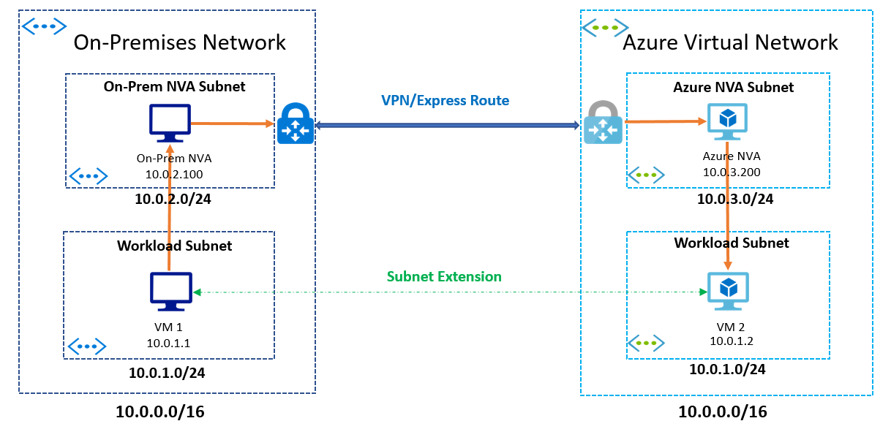

# Subnet Extension
Workload migration to the public cloud requires careful planning and coordination. One of the key considerations can be the ability to retain your IP addresses. This can be important especially if your applications have IP address dependency or you have compliance requirements to use specific IP addresses. Azure Virtual Network solves this problem for you by allowing you to create VNet and Subnets using an IP address range of your choice.

Migrations can get a bit challenging when the above requirement is coupled with an additional requirement to keep some applications on-premises. This would mean that you will have to extend your on-premises network into Azure because applications on both sides cannot change IP addresses. While extending your network is not a good practice in general, below use cases can make it necessary.

- **Phased Migration**: The most common scenario is that you want to phase your migration. You want to bring a few applications first and over time migrate rest of the applications to Azure.
- **Latency**: Low latency requirements can be another reason for keeping some applications on-premises to ensure they are as close as possible to your datacenters. 
- **Compliance**: Another use case is that you might have compliance requirements to keep some of your applications on-premises.
 
> [!NOTE] 
> We recommend that customers migrate all applications from an on-premises network to Azure, rather than splitting them across Azure and on-premises.

## Extending your Subnet to Azure
You can extend your on-premises subnets to Azure using third-party solutions. Most solutions use an overlay technology such as VXLAN to extend the layer-2 network using an layer-3 overlay network. The diagram below shows a generalized solution, where you are allowed to have the same subnet on both sides that is, Azure and on-premises. 

The IP addresses from the subnet are assigned to applications on Azure and on-premises, with no duplications. Both sides that is, Azure and on-premises have an NVA inserted in their network. When an application in Azure tries to talk to an application in on-premises network, the Azure NVA captures the packet, encapsulates it, and sends it over VPN/Express Route to the on-premises network. The on-premises NVA receives the packet, decapsulates it and forwards it to the intended recipient in its network. The return traffic uses a similar logic.

In this example, the Azure NVA and the on-premises NVA can communicate and learn about IP addresses on each side. In more complex networks, there can also be a mapping service, which maintains the mapping between the NVAs and the IP addresses behind them. When NVAs receive a packet they can query the mapping service to find out the address of the NVA that has the IP address behind it, to send the packet to the right destination.

In the next section, you will find details on third-party solutions, we have tested on Azure, and how to set them up.

## Next steps 
[Extend your subnet to Azure using vendor solutions.](https://github.com/microsoft/Azure-LISP)

 

