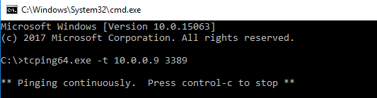
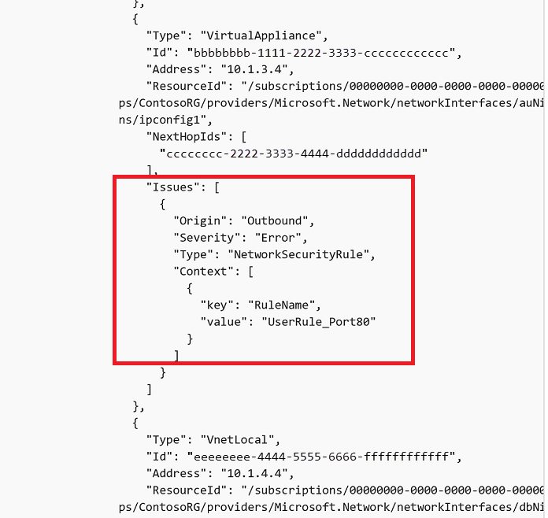
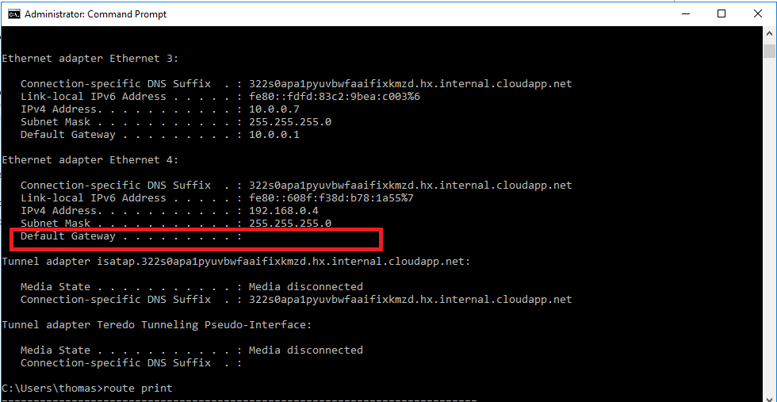
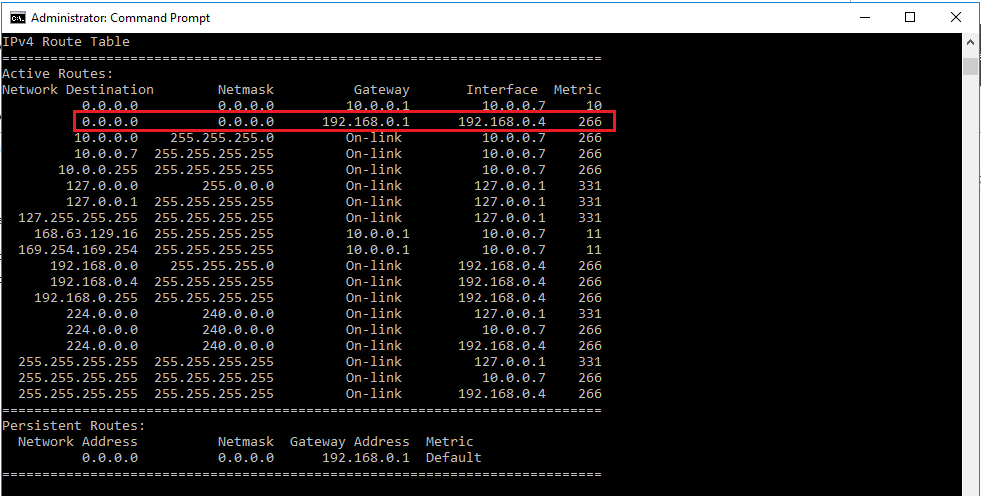
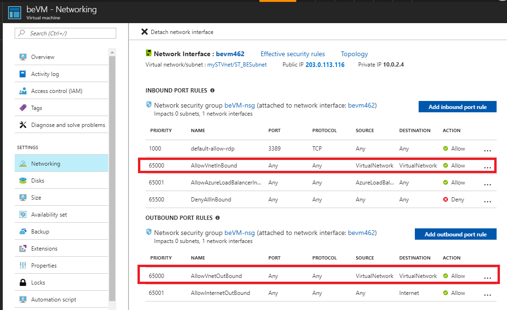
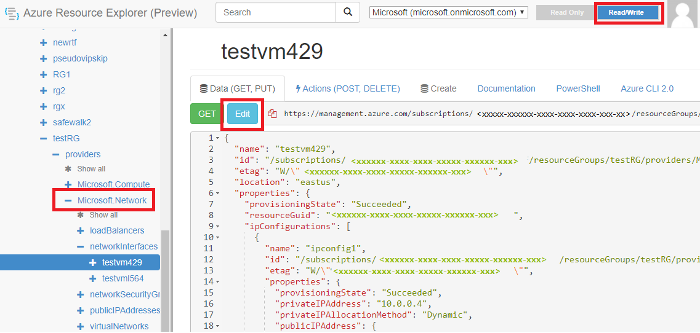
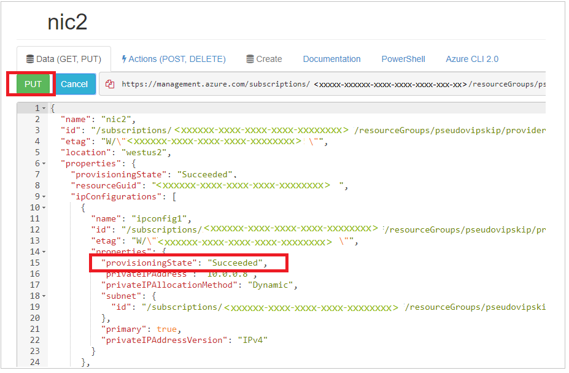

---
title:  Troubleshoot Azure VM connectivity problems
author: TobyTu
ms.author: kaushika
manager: dcscontentpm 
audience: ITPro  
ms.topic: troubleshooting  
ms.service: virtual-network
localization_priority: Normal
ms.date: 08/29/2019
--- 

# Troubleshoot Azure VM connectivity problems

This article helps administrators diagnose and resolve connectivity problems that affect Azure virtual machines (VMs).

## Problems

- [An Azure VM that’s deployed by using Resource Manager can't connect to another Azure VM in same virtual network](#azure-vm-cannot-connect-to-another-azure-vm-in-same-virtual-network).
- [An Azure VM can't connect to the second network adapter of an Azure VM in same virtual network](#azure-vm-cannot-connect-to-the-second-network-adapter-of-an-azure-vm-in-same-virtual-network).
- [An Azure VM can't connect to the internet](#azure-vm-cannot-connect-to-the-internet).

To resolve these problems, follow the steps in the following section.

## Resolution

### Azure VM cannot connect to another Azure VM in same virtual network

#### Step 1: Verify that VMs can communicate with each other.

1. Download TCping to your source VM.
2. Open a Command Prompt window.
3. Navigate to the folder in which you downloaded TCping.
4. Ping the destination from the source VM by using the following command:

    

    ```cmd
    tcping64.exe -t <destination VM address> 3389
    ```

> [!TIP]
> If the ping test is successful, go to Step 3. Otherwise, go to the next step.

#### Step 2: Check the Network security group settings.

For each VM, check for default Inbound port rules ("Allow VNet Inbound" and "Allow Load Balancer Inbound"). Make sure to also check that there are no matching blocking rules that are listed below a lower-priority rule.

> [!NOTE]
> Rules that have a lower number will be matched first. For example, if you have a rule that has priority 1000 and 6500, the rule that has priority 1000 will be matched first.

After that, try to ping the destination from the source VM again:

```cmd
tcping64.exe -t <destination VM address> 3389
```

#### Step 3: Check whether you can connect to the destination VM by using Remote Desktop or SSH.

To connect by using Remote Desktop, follow these steps.

**Windows**:

1. Sign in to the Azure portal.
2. In the left menu, select **Virtual Machines**.
3. Select the virtual machine in the list.
4. On the page for the virtual machine, select **Connect**.

For more information, see [How to connect and sign on to an Azure virtual machine running Windows](https://docs.microsoft.com/azure/virtual-machines/windows/connect-logon).

**Linux**:

For more information, see [Connect to a Linux VM in Azure](https://docs.microsoft.com/azure/virtual-machines/linux/quick-create-portal).

If the Remote Desktop or SSH connection is successful, go to next step.

#### Step 4: Perform a connectivity check.

Run a connectivity check on the source VM, and check the response.

**Windows**: [Check connectivity with Azure Network Watcher using PowerShell](https://docs.microsoft.com/azure/network-watcher/network-watcher-connectivity-powershell)

**Linux**: [Check connectivity with Azure Network Watcher using Azure CLI 2.0](https://docs.microsoft.com/azure/network-watcher/network-watcher-connectivity-cli)

The following is an example response:

```
ConnectionStatus : Unreachable
AvgLatencyInMs   :
MinLatencyInMs   :
MaxLatencyInMs   :
ProbesSent       : 100
ProbesFailed     : 100
Hops             : [
                     {
                       "Type": "Source",
                       "Id": "c5222ea0-3213-4f85-a642-cee63217c2f3",
                       "Address": "10.1.1.4",
                       "ResourceId": "/subscriptions/00000000-0000-0000-0000-000000000000/resourceGrou
                   ps/ContosoRG/providers/Microsoft.Network/networkInterfaces/appNic0/ipConfigurat
                   ions/ipconfig1",
                       "NextHopIds": [
                         "9283a9f0-cc5e-4239-8f5e-ae0f3c19fbaa"
                       ],
                       "Issues": []
                     },
                     {
                       "Type": "VirtualAppliance",
                       "Id": "9283a9f0-cc5e-4239-8f5e-ae0f3c19fbaa",
                       "Address": "10.1.2.4",
                       "ResourceId": "/subscriptions/00000000-0000-0000-0000-000000000000/resourceGrou
                   ps/ContosoRG/providers/Microsoft.Network/networkInterfaces/fwNic/ipConfiguratio
                   ns/ipconfig1",
                       "NextHopIds": [
                         "0f1500cd-c512-4d43-b431-7267e4e67017"
                       ],
                       "Issues": []
                     },
```

#### Step 5: Fix the issue in the connectivity check result.

1. In the **Hops** section of the connectivity check response that you received, check the listed **issues**.

    

2. Find the corresponding resolution in the following table, and follow the indicated steps to resolve the issues.

    |Issue type  |Value  |Resolution action |
    |---------|---------|---------|
    |NetworkSecurityRule|Name of the blocking NSG|You can [delete the NSG rule](https://docs.microsoft.com/azure/virtual-network/manage-network-security-group#delete-a-security-rule) or modify the rule as described [here](https://docs.microsoft.com/azure/virtual-network/manage-network-security-group#change-a-security-rule).|
    |UserDefinedRoute     |   Name of the blocking UDR      | If you do not require this route, delete the UDR. If you can’t delete the route, update the route by using the appropriate address prefix and next hop. You can also adjust the Network Virtual Appliance to forward traffic appropriately. For more information, see: [Virtual network traffic routing](https://docs.microsoft.com/azure/virtual-network/virtual-networks-udr-overview) and [Route network traffic with a route table using PowerShell](https://docs.microsoft.com/azure/virtual-network/virtual-network-create-udr-arm-ps).|
    |CPU    |    Usage     |     Follow these recommendations that describe in [Generic performance troubleshooting for Azure Virtual Machine running Linux or Windows](https://support.microsoft.com/en-in/help/3150851/generic-performance-troubleshooting-for-azure-virtual-machine-running).|
    |Memory    |      Usage   |    Follow the recommendations that are described in [Generic performance troubleshooting for Azure Virtual Machine running Linux or Windows](https://support.microsoft.com/en-in/help/3150851/generic-performance-troubleshooting-for-azure-virtual-machine-running).|
    |Guest Firewall    |      Name of the firewall blocking   |      Follow these steps: [Turn Windows Defender Firewall on or off](https://support.microsoft.com/help/4028544/windows-turn-windows-firewall-on-or-off).|
    |DNS Resolution     |    Name of the DNS     |    Follow these steps: [Azure DNS troubleshooting guide](https://docs.microsoft.com/azure/dns/dns-troubleshoot) and [Name resolution for resources in Azure virtual networks](https://docs.microsoft.com/azure/virtual-network/virtual-networks-name-resolution-for-vms-and-role-instances).     |
    |Socket Error    |      Not applicable   |     The specified port is already in use by another application. Try to use a different port.    |

3. Run the connectivity check again to determine whether the problem is resolved.

### Azure VM cannot connect to the second network adapter of an Azure VM in same virtual network

#### Step 1: Make sure that the second network adapter is enabled to talk outside the subnet.

By default, secondary network adapters (also known as network interface cards, or network adapters) are not configured to have a default gateway. Therefore, the traffic flow on the secondary adapter will be limited to the same subnet.



If users want to enable secondary network adapters to talk outside their own subnet, they must add an entry to the routing table to configure the gateway. To do this, follow these steps:

1. On the VM that has the second network adapter configured, open a Command Prompt window as an administrator.
2. Run the following command to add the entry in routing table:

    ```cmd
    Route add 0.0.0.0 mask 0.0.0.0 -p <Gateway IP>
    ```

    For example, if the second IP address is 192.168.0.4, the gateway IP should be 192.168.0.1. You have to run the following command:

    ```cmd
    Route add 0.0.0.0 mask 0.0.0.0 -p 192.168.0.1
    ```

3. Run route print. If the entry is added successfully, you will see an entry that resembles the following:

    

Now, try to connect to secondary network adapter. If the connection is still unsuccessful, go to next step.

#### Step 2: Check NSG settings for the network adapters.

For both the primary and secondary network adapters, check the default Inbound port rules (Allow VNet Inbound, Allow Load Balancer) to inbound on both network adapters. You should also make sure that there are no matching blocking rules that have a lower-priority rule above them.



#### Step 3: Run a connectivity check to the secondary network adapter.

1. Run a connectivity check to the secondary network adapter.
2. Run a connectivity check across the environment to make sure that the process works end to end.

For more information about how to run the connectivity check, see the following articles:

**Windows**: [Check connectivity with Azure Network Watcher using PowerShell](https://docs.microsoft.com/azure/network-watcher/network-watcher-connectivity-powershell)

**Linux**: [Check connectivity with Azure Network Watcher using Azure CLI 2.0](https://docs.microsoft.com/azure/network-watcher/network-watcher-connectivity-cli).

The following is an example response:

```
ConnectionStatus : Unreachable
AvgLatencyInMs   : 
MinLatencyInMs   : 
MaxLatencyInMs   : 
ProbesSent       : 100
ProbesFailed     : 100
Hops             : [
                     {
                       "Type": "Source",
                       "Id": "c5222ea0-3213-4f85-a642-cee63217c2f3",
                       "Address": "10.1.1.4",
                       "ResourceId": "/subscriptions/00000000-0000-0000-0000-000000000000/resourceGrou
                   ps/ContosoRG/providers/Microsoft.Network/networkInterfaces/appNic0/ipConfigurat
                   ions/ipconfig1",
                       "NextHopIds": [
                         "9283a9f0-cc5e-4239-8f5e-ae0f3c19fbaa"
                       ],
                       "Issues": []
                     },
                     {
                       "Type": "VirtualAppliance",
                       "Id": "9283a9f0-cc5e-4239-8f5e-ae0f3c19fbaa",
                       "Address": "10.1.2.4",
                       "ResourceId": "/subscriptions/00000000-0000-0000-0000-000000000000/resourceGrou
                   ps/ContosoRG/providers/Microsoft.Network/networkInterfaces/fwNic/ipConfiguratio
                   ns/ipconfig1",
                       "NextHopIds": [
                         "0f1500cd-c512-4d43-b431-7267e4e67017"
                       ],
                       "Issues": []
                     },
```

#### Step 4: Refer the table under [Step 5](#step-5-fix-the-issue-in-the-connectivity-check-result), and follow these steps to resolve the issues.

### Azure VM cannot connect to the internet

#### Step 1: Check whether the network adapter is in a failed state.

Follow these steps to check the state of the NIC:

1. Log in to the Resource Explorer portal.
2. In the left pane, select **Subscriptions**.
3. In the left pane, select the resource group that the affected network adapter or VM belongs to.
4. Go to the **Microsoft Network**.
5. Select the **Network Interfaces** option.
6. Select the affected network interface.
7. Select the **Read/Write** option at the top of the portal.
8. Select the **Edit** option.

    

    > [!NOTE]
    > After you select the **Edit** option, the “Get” option changes to a **Put** option.

    

9. Select the affected network interface, and then select the **Put** option.

    > [!NOTE]
    > After you make this selection, the **ProvisioningState** is displayed as **Updating**. The same result is shown on the regular Azure Resource Manager portal. If the operation is completed successfully, the **ProvisioningState** value changes to **Succeeded**, as shown.
10. Refresh your portal. The network adapter should be in a success state.

#### Step 2: Follow [Step 4](#step-4-perform-a-connectivity-check) to run a connectivity check.

#### Step 3: Refer the table under [Step 5](#step-5-fix-the-issue-in-the-connectivity-check-result), and follow the steps to resolve the issues.

## Next steps

[Troubleshooting connectivity problems between Azure VMs](https://docs.microsoft.com/azure/virtual-network/virtual-network-troubleshoot-connectivity-problem-between-vms)
