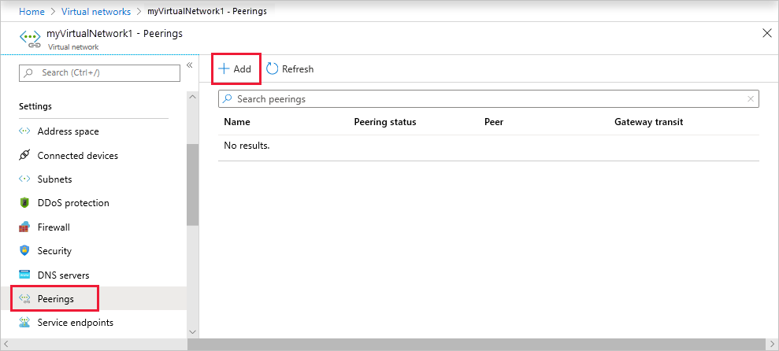
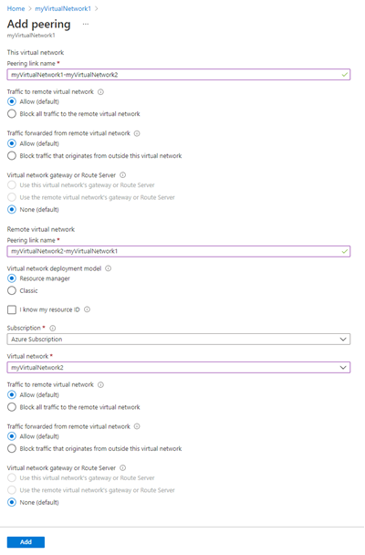
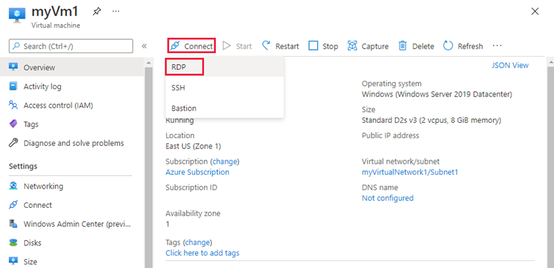

# Tutorial: Connect virtual networks with virtual network peering using the Azure portal

You can connect virtual networks to each other with virtual network peering. These virtual networks can be in the same region or different regions (also known as Global VNet peering). Once virtual networks are peered, resources in both virtual networks are able to communicate with each other, with the same latency and bandwidth as if the resources were in the same virtual network. In this tutorial, you learn how to:

> [!div class="checklist"]
> * Create two virtual networks
> * Connect two virtual networks with a virtual network peering
> * Deploy a virtual machine (VM) into each virtual network
> * Communicate between VMs

If you prefer, you can complete this tutorial using the [Azure CLI](tutorial-connect-virtual-networks-cli.md) or [Azure PowerShell](tutorial-connect-virtual-networks-powershell.md).

If you don't have an Azure subscription, create a [free account](https://azure.microsoft.com/free/?WT.mc_id=A261C142F) before you begin.

## Log in to Azure

Log in to the Azure portal at https://portal.azure.com.

## Create virtual networks

1. On the Azure portal, select **Create a resource**.
2. Select **Networking**, and then select **Virtual network**.
3. On the **Basics** tab, enter or select the following information and accept the defaults for the remaining settings:

    |Setting|Value|
    |---|---|
    |Subscription| Select your subscription.|
    |Resource group| Select **Create new** and enter *myResourceGroup*.|
    |Region| Select **East US**.|
    |Name|myVirtualNetwork1|

4. On the **IP Addresses** tab, enter 10.0.0.0/16 for the **Address Space** field. Click the **Add subnet** button below and enter *Subnet1* for **Subnet Name** and 10.0.0.0/24 for **Subnet Address range**.
5. Select **Review + Create** and then select **Create**.
   
5. Complete steps 1-5 again, with the following changes:

    |Setting|Value|
    |---|---|
    |Name|myVirtualNetwork2|
    |Address space|10.1.0.0/16|
    |Resource group| Select **Use existing** and then select **myResourceGroup**.|
    |Subnet name | Subnet2|
    |Subnet Address range|10.1.0.0/24|

## Peer virtual networks

1. In the Search box at the top of the Azure portal, begin typing *MyVirtualNetwork1*. When **myVirtualNetwork1** appears in the search results, select it.
2. Select **Peerings**, under **Settings**, and then select **Add**, as shown in the following picture:

    

3. Enter, or select, the following information, accept the defaults for the remaining settings, and then select **OK**.

    |Setting|Value|
    |---|---|
    |Name of the peering from myVirtualNetwork1 to remote virtual network|myVirtualNetwork1-myVirtualNetwork2 - When the page first loads, you'll see the phrase "remote virtual network" here. After you choose the remote virtual network, the phrase "remote virtual network" will be replaced with the name of the remote virtual network.|
    |Subscription| Select your subscription.|
    |Virtual network|myVirtualNetwork2 - To select the *myVirtualNetwork2* virtual network, select **Virtual network**, then select **myVirtualNetwork2 (myResourceGroup)**. You can select a virtual network in the same region or in a different region.|
    |Name of the peering from myVirtualNetwork2 to myVirtualNetwork1|myVirtualNetwork2-myVirtualNetwork1|

    

    The **PEERING STATUS** is *Connected*, as shown in the following picture:

    

    If you don't see the status, refresh your browser.

## Create virtual machines

Create a VM in each virtual network so that you can communicate between them in a later step.

### Create the first VM

1. On the Azure portal, select **Create a resource**.
2. Select **Compute**, and then select **Windows Server 2016 Datacenter**. You can select a different operating system, but the remaining steps assume you selected **Windows Server 2016 Datacenter**. 
3. Enter, or select, the following information for **Basics**, accept the defaults for the remaining settings, and then select **Create**:

    |Setting|Value|
    |---|---|
    |Resource group| Select **Use existing** and then select **myResourceGroup**.|
    |Name|myVm1|
    |Location| Select **East US**.|
    |User name| Enter a user name of your choosing.|
    |Password| Enter a password of your choosing. The password must be at least 12 characters long and meet the [defined complexity requirements](../virtual-machines/windows/faq.md?toc=%2fazure%2fvirtual-network%2ftoc.json#what-are-the-password-requirements-when-creating-a-vm).|
   
4. Select a VM size for the **Size** option.
5. Select the following values for under **Networking**:

    |Setting|Value|
    |---|---|
    |Virtual network| myVirtualNetwork1 - If it's not already selected, select **Virtual network** and then select **myVirtualNetwork1**.|
    |Subnet| Subnet1 - If it's not already selected, select **Subnet** and then select **Subnet1**.|
   
6. Select **Networking**. Choose **Allow selected ports** for the **Public inbound ports** option. Choose **RDP** for the **Select inbound ports** option below this. 

7. Select the **Review + Create** button in the lower, left-hand corner to start the VM deployment.

### Create the second VM

Complete steps 1-6 again, with the following changes:

|Setting|Value|
|---|---|
|Name | myVm2|
|Virtual network | myVirtualNetwork2|

The VMs take a few minutes to create. Do not continue with the remaining steps until both VMs are created.

## Communicate between VMs

1. In the *Search* box at the top of the portal, begin typing *myVm1*. When **myVm1** appears in the search results, select it.
2. Create a remote desktop connection to the *myVm1* VM by selecting **Connect**, as shown in the following picture:

      

3. To connect to the VM, open the downloaded RDP file. If prompted, select **Connect**.
4. Enter the user name and password you specified when creating the VM (you may need to select **More choices**, then **Use a different account**, to specify the credentials you entered when you created the VM), then select **OK**.
5. You may receive a certificate warning during the sign-in process. Select **Yes** to proceed with the connection.
6. In a later step, ping is used to communicate with the *myVm2* VM from the *myVm1* VM. Ping uses the Internet Control Message Protocol (ICMP), which is denied through the Windows Firewall, by default. On the *myVm1* VM, enable ICMP through the Windows firewall, so that you can ping this VM from *myVm2* in a later step, using PowerShell:

    ```powershell
    New-NetFirewallRule –DisplayName "Allow ICMPv4-In" –Protocol ICMPv4
    ```
    
    Though ping is used to communicate between VMs in this tutorial, allowing ICMP through the Windows Firewall for production deployments is not recommended.

7. To connect to the *myVm2* VM, enter the following command from a command prompt on the *myVm1* VM:

    ```
    mstsc /v:10.1.0.4
    ```
    
8. Since you enabled ping on *myVm1*, you can now ping it by IP address:

    ```
    ping 10.0.0.4
    ```
    
9. Disconnect your RDP sessions to both *myVm1* and *myVm2*.

## Clean up resources

When no longer needed, delete the resource group and all resources it contains: 

1. Enter *myResourceGroup* in the **Search** box at the top of the portal. When you see **myResourceGroup** in the search results, select it.
2. Select **Delete resource group**.
3. Enter *myResourceGroup* for **TYPE THE RESOURCE GROUP NAME:** and select **Delete**.

## Next steps

In this tutorial, you learned how to connect two networks in the same Azure region, with virtual network peering. You can also peer virtual networks in different [supported regions](virtual-network-manage-peering.md#cross-region) and in [different Azure subscriptions](create-peering-different-subscriptions.md#portal), as well as create [hub and spoke network designs](/azure/architecture/reference-architectures/hybrid-networking/hub-spoke#virtual-network-peering) with peering. To learn more about virtual network peering, see [Virtual network peering overview](virtual-network-peering-overview.md) and [Manage virtual network peerings](virtual-network-manage-peering.md).

To connect your own computer to a virtual network through a VPN, and interact with resources in a virtual network, or in peered virtual networks, see [Connect your computer to a virtual network](../vpn-gateway/vpn-gateway-howto-point-to-site-resource-manager-portal.md?toc=%2fazure%2fvirtual-network%2ftoc.json).
