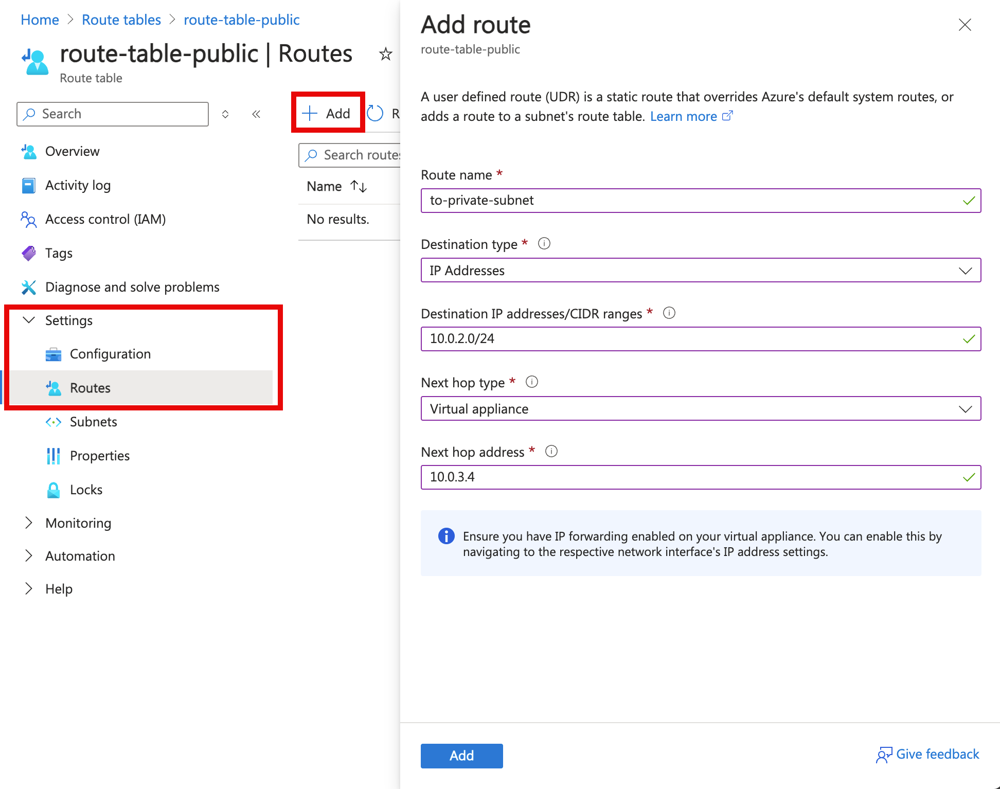

# Route network traffic with a route table using the Azure portal

Azure automatically routes traffic between all subnets within a virtual network, by default. You can create your own routes to override Azure's default routing. The ability to create custom routes is helpful if, for example, you want to route traffic between subnets through a firewall. In this article you learn how to:

> [!div class="checklist"]
> * Create a route table
> * Create a route
> * Associate a route table to a virtual network subnet
> * Test routing
> * Troubleshoot routing

If you don't have an Azure subscription, create a [free account](https://azure.microsoft.com/free/?WT.mc_id=A261C142F) before you begin.

## Log in to Azure 

Log in to the Azure portal at http://portal.azure.com.

## Create a route table

Azure routes traffic between all subnets in a virtual network, by default. To learn more about Azure's default routes, see [System routes](virtual-networks-udr-overview.md). To override Azure's default routing, you create a route table that contains routes, and associate the route table to a virtual network subnet.

1. Select **+ Create a resource** on the upper, left corner of the Azure portal.
2. Select **Networking**, and then select **Route table**.
3. Select your **Subscription** and select or enter the following information, then select **Create**:
 
     

## Create a route

A route table contains zero or more routes. 

1. In the *Search resources, services, and docs* box at the top of the portal, begin typing *myRouteTablePublic*. When **myRouteTablePublic** appears in the search results, select it.
2. Under **SETTINGS**, select **Routes** and then select **+ Add**, as shown in the following picture:

     
 
4. Under **Add route**, select or enter the following information, and then select **OK**:
    - **Route name**: *ToPrivateSubnet*
    - **Address prefix**: 10.0.1.0/24
    - **Next hop type**: Select **Virtual appliance**.
    - **Next hop address**: 10.0.2.4

    The route will direct all traffic destined to the 10.0.1.0/24 address prefix through a network virtual appliance with the IP address 10.0.2.4. The network virtual appliance and subnet with the specified address prefix are created in later steps. The route overrides Azure's default routing, which routes traffic between subnets directly. Each route specifies a next hop type. The next hop type instructs Azure how to route the traffic. In this example, the next hop type is *VirtualAppliance*. To learn more about all available next hop types in Azure, and when to use them, see [next hop types](virtual-networks-udr-overview.md#custom-routes).

## Associate a route table to a subnet

Before you can associate a route table to a subnet, you have to create a virtual network and subnet:

1. Select **+ Create a resource** on the upper, left corner of the Azure portal.
2. Select **Networking**, and then select **Virtual network**.
3. Under **Create virtual network**, select, or enter the following information, then select **Create**:
    
    - **Name**: *myVirtualNetwork*
    - **Address space**: *10.0.0.0/16*
    - **Subscription**: Select your subscription.
    - **Resource Group**: Select **Use existing** and select **myResourceGroup**.
    - **Location**: Select *East US*
    - **Subnet name**: *Public*
    - **Address range:** *10.0.0.0/24*

4. In the **Search resources, services, and docs** box at the top of the portal, begin typing *myVirtualNetwork*. When **myVirtualNetwork** appears in the search results, select it.
5. Add two additional subnets to the virtual network. Under **SETTINGS**, select **Subnets** and then select **+ Subnet**, as shown in the following picture:

     

6. Select or enter the following information, then select **OK**:
    - **Name**: Private
    - **Address space**: *10.0.1.0/24*

7. Complete steps 5 and 6 again, providing the following information:
    - **Name**: DMZ
    - **Address space**: *10.0.2.0/24*

You can associate a route table to zero or more subnets. A subnet can have zero or one route table associated to it. Outbound traffic from a subnet is routed based upon Azure's default routes, and any custom routes you've added to a route table you associate to a subnet. Associate the *myRouteTablePublic* route table to the *Public* subnet:

1. The **myVirtualNetwork - Subnets** box is displayed after completing the previous step. Under **SETTINGS**, select **Subnets** and then select **Public**.
2. As shown in the following picture, select **Route table**, then select **MyRouteTablePublic**.

     

3. Select **Save**.

## Test routing

To test routing, you'll create a virtual machine that serves as the network virtual appliance that the route you created in a previous step routes through. After creating the network virtual appliance, you'll deploy a virtual machine into the *Public* and *Private* subnets. You'll then route traffic from the *Public* subnet to the *Private* subnet through the network virtual appliance.

### Create a network virtual appliance

In a previous step, you created a route that specified a network virtual appliance as the next hop type. A virtual machine running a network application is often referred to as a network virtual appliance. In production environments, the network virtual appliance you deploy is often a pre-configured virtual machine. Several network virtual appliances are available from the [Azure Marketplace](https://azuremarketplace.microsoft.com/marketplace/apps/category/networking?search=network%20virtual%20appliance&page=1). In this article, a basic virtual machine is created.

1. Select **+ Create a resource** on the upper, left corner of the Azure portal.
2. Select **Compute**, and then select **Windows Server 2016 Datacenter**. You can select a different operating system, but the remaining steps assume you selected **Windows Server 2016 Datacenter**. 
3. Select or enter the following information for **Basics**, then select **OK**:
    - **Name**: *myVmNva*
    - **Resource group**: Select **Use existing** and then select *myResourceGroup*.
    - **Location**: Select *East US*.

    The **User name** and **Password** you enter are used in a later step. The password must be at least 12 characters long and meet the [defined complexity requirements](../virtual-machines/windows/faq.md?toc=%2fazure%2fvirtual-network%2ftoc.json#what-are-the-password-requirements-when-creating-a-vm). The **Location** and **Subscription** selected must be the same as the location and subscription the virtual network is in. It's not required that you select the same resource group that the virtual network was created in, but the same resource group is selected for this tutorial.
4. Select a VM size under **Choose a size**.
5. Select or enter the following information for **Settings**, then select **OK**:
    - **Virtual network**: Ensure that **myVirtualNetwork** is selected. If not, select **Virtual network**, then select **myVirtualNetwork** under **Choose virtual network**.
    - **Subnet**: Select **Subnet** and then select **DMZ** under **Choose subnet**.
    - **Public IP address**: Select **Public IP address** and select **None** under **Choose public IP address**. No public IP address is assigned to this virtual machine since it won't be connected to from the Internet.
6. Under **Create** in the **Summary**, select **Create** to start the virtual machine deployment.

The virtual machine takes a few minutes to create. Do not continue to the next step until Azure finishes creating the virtual machine and opens a box with information about the virtual machine.

When Azure created the virtual machine, it also created a [network interface](virtual-network-network-interface.md) in the *DMZ* subnet and attached the network interface to the virtual machine. IP forwarding must be enabled for each Azure network interface that forwards traffic destined for any IP address that isn't assigned to the network interface.

1. In the box that opened for the virtual machine after it was created, under **SETTINGS**, select **Networking**, and then select **myvmnva158** (the network interface Azure created for your virtual machine has a different number after **myvmnva**), as shown in the following picture:

     

    When you created the network virtual appliance in the *DMZ* subnet, Azure automatically created the network interface, attached the network interface to the virtual machine, and assigned the private IP address *10.0.2.4* to the network interface. 

2. Under **SETTINGS**, select **IP configurations**, select **Enabled** for **IP forwarding**, and then select **Save**, as shown in the following picture:

     

### Create virtual machines

Create two virtual machines in the virtual network so you can validate that traffic from the *Public* subnet is routed to the *Private* subnet through the network virtual appliance in a later step.

Complete steps 1-6 of [Create a network virtual appliance](#create-a-network-virtual-appliance). Use the same settings in steps 3 and 5, except for the following changes:

|Virtual machine   |Name      |Subnet      | Public IP address     |
|---------         |--------- | -----------|---------              |
|Virtual machine 1 | myVmWeb  | Public     | Accept portal default |
|virtual machine 2 | myVmMgmt | Private    | Accept portal default |

You can create the *myVmMgmt* virtual machine while Azure creates the *myVmWeb* virtual machine. Do not continue with the following steps until Azure finishes creating both virtual machines.

### Route traffic through a network virtual appliance

1. In the *Search* box at the top of the portal, begin typing *myVmMgmt*. When **myVmMgmt** appears in the search results, select it.
2. Create a remote desktop connection to the *myVmMgmt* virtual machine by selecting **Connect**, as shown in the following picture:

      

3. To connect to the VM, open the downloaded RDP file. If prompted, select **Connect**.
4. Enter the user name and password you specified when creating the virtual machine (you may need to select **More choices**, then **Use a different account**, to specify the credentials you entered when you created the virtual machine), then select **OK**.
5. You may receive a certificate warning during the sign-in process. Select **Yes** to proceed with the connection.
6. In a later step, the tracert.exe command is used to test routing. Tracert uses ICMP, which is denied through the Windows Firewall. Enable ICMP through the Windows firewall by entering the following command from a command prompt:

    ```
    netsh advfirewall firewall add rule name=Allow-ping protocol=icmpv4 dir=in action=allow
    ```

    Though tracert is used to test routing in this article, allowing ICMP through the Windows Firewall for production deployments is not recommended.
7. You enabled IP forwarding within Azure for the virtual machine's network interface in [Enable IP fowarding](#enable-ip-forwarding). Within the virtual machine, the operating system, or an application running within the virtual machine, must also be able to forward network traffic. When you deploy a network virtual appliance in a production environment, the appliance typically filters, logs, or performs some other function before forwarding traffic. In this article however, the operating system simply forwards all traffic it receives. Enable IP forwarding within the operating system of the *myVmNva* by completing the following steps from the *myVmMgmt* virtual machine:

    Remote desktop to the *myVmNva* virtual machine with the following command from a command prompt:

    ``` 
    mstsc /v:myvmnva
    ```
    
    To enable IP forwarding within the operating system, enter the following command in PowerShell:

    ```powershell
    Set-ItemProperty -Path HKLM:\SYSTEM\CurrentControlSet\Services\Tcpip\Parameters -Name IpEnableRouter -Value 1
    ```
    
    Restart the virtual machine, which will also disconnect the remote desktop session.
8. While still connected to the *myVmMgmt* virtual machine, after the *myVmNva* virtual machine restarts, create a remote desktop session to the  *myVmWeb* virtual machine with the following command:

    ``` 
    mstsc /v:myVmWeb
    ```
    
    Enable ICMP through the Windows firewall by entering the following command from a command prompt:

    ```
    netsh advfirewall firewall add rule name=Allow-ping protocol=icmpv4 dir=in action=allow
    ```

9. To test routing of network traffic to the *myVmMgmt* virtual machine from the *myVmWeb* virtual machine, enter the following command from a command prompt:

    ```
    tracert myvmmgmt
    ```

    The response is similar to the following example:
    
    ```
    Tracing route to myvmmgmt.vpgub4nqnocezhjgurw44dnxrc.bx.internal.cloudapp.net [10.0.1.4]
    over a maximum of 30 hops:
        
    1    <1 ms     *        1 ms  10.0.2.4
    2     1 ms     1 ms     1 ms  10.0.1.4
        
    Trace complete.
    ```
      
    You can see that the first hop is 10.0.2.4, which is the network virtual appliance's private IP address. The second hop is 10.0.1.4, the private IP address of the *myVmMgmt* virtual machine. The route added to the *myRouteTablePublic* route table and associated to the *Public* subnet caused Azure to route the traffic through the NVA, rather than directly to the *Private* subnet.
10.  Close the remote desktop session to the *myVmWeb* virtual machine, which leaves you still connected to the *myVmMgmt* virtual machine.
11. To test routing of network traffic to the *myVmWeb* virtual machine from the *myVmMgmt* virtual machine, enter the following command from a command prompt:

    ```
    tracert myvmweb
    ```

    The response is similar to the following example:

    ```
    Tracing route to myvmweb.vpgub4nqnocezhjgurw44dnxrc.bx.internal.cloudapp.net [10.0.0.4]
    over a maximum of 30 hops:
    
    1     1 ms     1 ms     1 ms  10.0.0.4
    
    Trace complete.
    ```

    You can see that traffic is routed directly from the *myVmMgmt* virtual machine to the *myVmWeb* virtual machine. By default, Azure routes traffic directly between subnets.
12. Close the remote desktop session to the *myVmMgmt* virtual machine.

## Troubleshoot routing

As you learned in previous steps, Azure applies default routes, that you can, optionally, override with your own routes. Sometimes, traffic may not be routed as you expect it to be. You can use the [Next hop](../network-watcher/network-watcher-check-next-hop-portal.md) capability of Azure Network Watcher to determine how Azure is routing traffic between two virtual machines. 

1. In the *Search* box at the top of the portal, begin typing *Network Watcher*. When **Network Watcher** appears in the search results, select it.
2. Under **NETWORK DIAGNOSTIC TOOLS**, select **Next hop**.
3. To test traffic routing from the *myVmWeb* (10.0.0.4) virtual machine to the *myVmMgmt* (10.0.1.4) virtual machine, select your subscription, enter the information shown in the following picture (your **Network interface** name is slightly different), and then select **Next hop**:

      

    The **Result** output informs you that the next hop IP address for traffic from *myVmWeb* to *myVmMgmt* is 10.0.2.4 (the *myVmNva* virtual machine), that the next hop type is *VirtualAppliance*, and that the route table that causes the routing is *myRouteTablePublic*.

The effective routes for each network interface are a combination of Azure's default routes and any routes you define. To see all routes effective for a network interface in a virtual machine, complete the following steps:

1. In the *Search* box at the top of the portal, begin typing *myVmWeb*. When **myVmWeb** appears in the search results, select it.
2. Under **SETTINGS**, select **Networking**, and then select **myvmweb369** (the network interface Azure created for your virtual machine has a different number after **myvmweb**).
3. Under **SUPPORT + TROUBLESHOOTING**, Select **Effective routes**, as shown in the following picture:

     

    You see Azure's default routes and the route you added in the *myRouteTablePublic* route table. To learn more about how Azure selects a route from the list of routes, see [How Azure selects a route](virtual-networks-udr-overview.md#how-azure-selects-a-route).

## Clean up resources

When no longer needed, delete the resource group and all resources it contains: 

1. Enter *myResourceGroup* in the **Search** box at the top of the portal. When you see **myResourceGroup** in the search results, select it.
2. Select **Delete resource group**.
3. Enter *myResourceGroup* for **TYPE THE RESOURCE GROUP NAME:** and select **Delete**.

## Next steps

In this article, you created a route table and associated it to a subnet. You created a network virtual appliance that routed traffic from a public subnet to a private subnet. While you can deploy many Azure resources within a virtual network, resources for some Azure PaaS services cannot be deployed into a virtual network. You can still restrict access to the resources of some Azure PaaS services to traffic only from a virtual network subnet though. Advance to the next tutorial to learn how to restrict network access to Azure PaaS resources.

> [!div class="nextstepaction"]
> [Restrict network access to PaaS resources](virtual-network-service-endpoints-configure.md#azure-portal)
