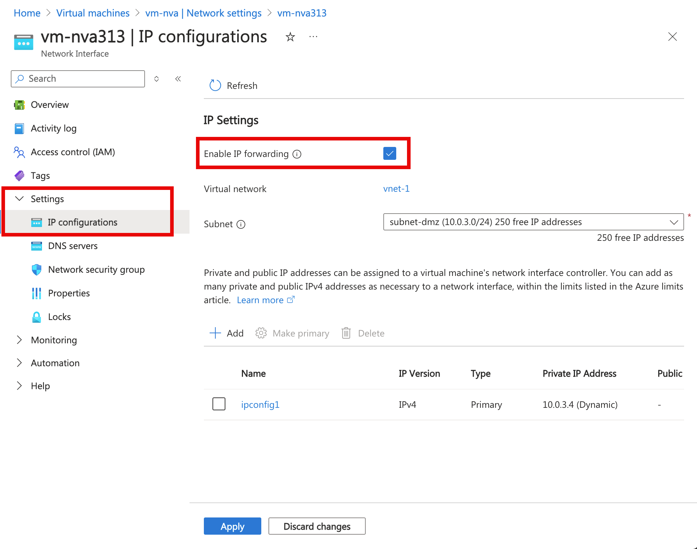

# Route network traffic with a route table using the Azure portal

Azure automatically routes traffic between all subnets within a virtual network, by default. You can create your own routes to override Azure's default routing. The ability to create custom routes is helpful if, for example, you want to route traffic between subnets through a network virtual appliance. In this article you learn how to:

> [!div class="checklist"]
> * Create a route table
> * Create a route
> * Create a virtual network with multiple subnets
> * Associate a route table to a subnet
> * Create a network virtual appliance that routes traffic
> * Deploy virtual machines into different subnets
> * Route traffic from one subnet to another through a network virtual appliance

If you don't have an Azure subscription, create a [free account](https://azure.microsoft.com/free/?WT.mc_id=A261C142F) before you begin.

## Log in to Azure 

Log in to the Azure portal at http://portal.azure.com.

## Create a route table

1. Select **+ Create a resource** on the upper, left corner of the Azure portal.
2. Select **Networking**, and then select **Route table**.
3. Enter, or select, the following information, accept the default for the remaining setting, and then select **Create**:

    |Setting|Value|
    |---|---|
    |Name|myRouteTablePublic|
    |Subscription| Select your subscription.|
    |Resource group | Select **Create new** and enter *myResourceGroup*.|
    |Location|East US|
 
     

## Create a route

1. In the *Search resources, services, and docs* box at the top of the portal, begin typing *myRouteTablePublic*. When **myRouteTablePublic** appears in the search results, select it.
2. Under **SETTINGS**, select **Routes** and then select **+ Add**, as shown in the following picture:

     
 
3. Under **Add route**.
4. Enter, or select, the following information, accept the default for the remaining settings, and then select **Create**:

    |Setting|Value|
    |---|---|
    |Route name|ToPrivateSubnet|
    |Address prefix| 10.0.1.0/24|
    |Next hop type | Select **Virtual appliance**.|
    |Next hop address| 10.0.2.4|

## Associate a route table to a subnet

Before you can associate a route table to a subnet, you have to create a virtual network and subnet, then you can associate the route table to a subnet:

1. Select **+ Create a resource** on the upper, left corner of the Azure portal.
2. Select **Networking**, and then select **Virtual network**.
3. Under **Create virtual network**, Enter, or select, the following information, accept the default for the remaining settings, and then select **Create**:

    |Setting|Value|
    |---|---|
    |Name|myVirtualNetwork|
    |Address space| 10.0.0.0/16|
    |Subscription | Select your subscription.|
    |Resource group|Select **Use existing** and then select **myResourceGroup**.|
    |Location|Select *East US*|
    |Subnet name|Public|
    |Address range|10.0.0.0/24|
    
4. In the **Search resources, services, and docs** box at the top of the portal, begin typing *myVirtualNetwork*. When **myVirtualNetwork** appears in the search results, select it.
5. Add two additional subnets to the virtual network. Under **SETTINGS**, select **Subnets** and then select **+ Subnet**, as shown in the following picture:

     

6. Select or enter the following information, then select **OK**:

    |Setting|Value|
    |---|---|
    |Name|Private|
    |Address space| 10.0.1.0/24|

7. Complete steps 5 and 6 again, providing the following information:

    |Setting|Value|
    |---|---|
    |Name|DMZ|
    |Address space| 10.0.2.0/24|

8. The **myVirtualNetwork - Subnets** box is displayed after completing the previous step. Under **SETTINGS**, select **Subnets** and then select **Public**.
9. As shown in the following picture, select **Route table**, then select **MyRouteTablePublic**:

     

10. Select **Save**.

## Create a network virtual appliance

1. Select **+ Create a resource** on the upper, left corner of the Azure portal.
2. Select **Compute**, and then select **Windows Server 2016 Datacenter**. You can select a different operating system, but the remaining steps assume you selected **Windows Server 2016 Datacenter**. 
3. Select or enter the following information for **Basics**, then select **OK**:

    |Setting|Value|
    |---|---|
    |Name|myVmNva|
    |User name|Enter a user name of your choosing.|
    |Password|Enter a password of your choosing. The password must be at least 12 characters long and meet the [defined complexity requirements](../virtual-machines/windows/faq.md?toc=%2fazure%2fvirtual-network%2ftoc.json#what-are-the-password-requirements-when-creating-a-vm).|
    |Resource group| Select **Use existing** and then select *myResourceGroup*.|
    |Location|Select **East US**.|
4. Select a VM size under **Choose a size**.
5. Select or enter the following information for **Settings**, then select **OK**:

    |Setting|Value|
    |---|---|
    |Virtual network|myVirtualNetwork - If it's not selected, select **Virtual network**, then select **myVirtualNetwork** under **Choose virtual network**.|
    |Subnet|Select **Subnet** and then select **DMZ** under **Choose subnet**. |
    |Public IP address| Select **Public IP address** and select **None** under **Choose public IP address**. No public IP address is assigned to this virtual machine since it won't be connected to from the Internet.
6. Under **Create** in the **Summary**, select **Create** to start the virtual machine deployment.

The virtual machine takes a few minutes to create. Do not continue to the next step until Azure finishes creating the virtual machine and opens a box with information about the virtual machine.

1. In the box that opened for the virtual machine after it was created, under **SETTINGS**, select **Networking**, and then select **myvmnva158** (the network interface Azure created for your virtual machine has a different number after **myvmnva**), as shown in the following picture:

     

2. For a network interface to be able to forward network traffic sent to it, that is not destined for its own IP address, IP forwarding must be enabled for the network interface. Under **SETTINGS**, select **IP configurations**, select **Enabled** for **IP forwarding**, and then select **Save**, as shown in the following picture:

     

## Create virtual machines

Create two virtual machines in the virtual network so you can validate that traffic from the *Public* subnet is routed to the *Private* subnet through the network virtual appliance in a later step.

Complete steps 1-6 of [Create a network virtual appliance](#create-a-network-virtual-appliance). Use the same settings in steps 3 and 5, except for the following changes:

|Virtual machine   |Name      |Subnet      | Public IP address     |
|---------         |--------- | -----------|---------              |
|Virtual machine 1 | myVmPublic  | Public     | Accept portal default |
|virtual machine 2 | myVmPrivate | Private    | Accept portal default |

You can create the *myVmPrivate* virtual machine while Azure creates the *myVmPublic* virtual machine. Do not continue with the following steps until Azure finishes creating both virtual machines.

## Route traffic through a network virtual appliance

1. In the *Search* box at the top of the portal, begin typing *myVmPrivate*. When **myVmPrivate** appears in the search results, select it.
2. Create a remote desktop connection to the *myVmPrivate* virtual machine by selecting **Connect**, as shown in the following picture:

      

3. To connect to the VM, open the downloaded RDP file. If prompted, select **Connect**.
4. Enter the user name and password you specified when creating the virtual machine (you may need to select **More choices**, then **Use a different account**, to specify the credentials you entered when you created the virtual machine), then select **OK**.
5. You may receive a certificate warning during the sign-in process. Select **Yes** to proceed with the connection.
6. In a later step, the tracert.exe command is used to test routing. Tracert uses the internet control message protocol (ICMP), which is denied through the Windows Firewall. Enable ICMP through the Windows firewall by entering the following command from PowerShell:

    ```powershell
    New-NetFirewallRule –DisplayName “Allow ICMPv4-In” –Protocol ICMPv4
    ```

    Though tracert is used to test routing in this article, allowing ICMP through the Windows Firewall for production deployments is not recommended.
7. You enabled IP forwarding within Azure for the virtual machine's network interface in [Enable IP fowarding](#enable-ip-forwarding). Within the virtual machine, the operating system, or an application running within the virtual machine, must also be able to forward network traffic. Enable IP forwarding within the operating system of the *myVmNva* VM by completing the following steps from the *myVmPrivate* virtual machine:

    Remote desktop to the *myVmNva* virtual machine with the following command from a command prompt:

    ``` 
    mstsc /v:myvmnva
    ```
    
    To enable IP forwarding within the operating system, enter the following command in PowerShell:

    ```powershell
    Set-ItemProperty -Path HKLM:\SYSTEM\CurrentControlSet\Services\Tcpip\Parameters -Name IpEnableRouter -Value 1
    ```
    
    Restart the virtual machine, which will also disconnect the remote desktop session.
8. While still connected to the *myVmPrivate* virtual machine, after the *myVmNva* virtual machine restarts, create a remote desktop session to the  *myVmPublic* virtual machine with the following command:

    ``` 
    mstsc /v:myVmPublic
    ```
    
    Enable ICMP through the Windows firewall by entering the following command from PowerShell:

    ```powershell
    New-NetFirewallRule –DisplayName “Allow ICMPv4-In” –Protocol ICMPv4
    ```

9. To test routing of network traffic to the *myVmPrivate* virtual machine from the *myVmPublic* virtual machine, enter the following command from PowerShell:

    ```
    tracert myVmPrivate
    ```

    The response is similar to the following example:
    
    ```
    Tracing route to myVmPrivate.vpgub4nqnocezhjgurw44dnxrc.bx.internal.cloudapp.net [10.0.1.4]
    over a maximum of 30 hops:
        
    1    <1 ms     *        1 ms  10.0.2.4
    2     1 ms     1 ms     1 ms  10.0.1.4
        
    Trace complete.
    ```
      
    You can see that the first hop is 10.0.2.4, which is the network virtual appliance's private IP address. The second hop is 10.0.1.4, the private IP address of the *myVmPrivate* virtual machine. The route added to the *myRouteTablePublic* route table and associated to the *Public* subnet caused Azure to route the traffic through the NVA, rather than directly to the *Private* subnet.
10.  Close the remote desktop session to the *myVmPublic* virtual machine, which leaves you still connected to the *myVmPrivate* virtual machine.
11. To test routing of network traffic to the *myVmPublic* virtual machine from the *myVmPrivate* virtual machine, enter the following command from a command prompt:

    ```
    tracert myVmPublic
    ```

    The response is similar to the following example:

    ```
    Tracing route to myVmPublic.vpgub4nqnocezhjgurw44dnxrc.bx.internal.cloudapp.net [10.0.0.4]
    over a maximum of 30 hops:
    
    1     1 ms     1 ms     1 ms  10.0.0.4
    
    Trace complete.
    ```

    You can see that traffic is routed directly from the *myVmPrivate* virtual machine to the *myVmPublic* virtual machine. By default, Azure routes traffic directly between subnets.
12. Close the remote desktop session to the *myVmPrivate* virtual machine.

## Clean up resources

When no longer needed, delete the resource group and all resources it contains: 

1. Enter *myResourceGroup* in the **Search** box at the top of the portal. When you see **myResourceGroup** in the search results, select it.
2. Select **Delete resource group**.
3. Enter *myResourceGroup* for **TYPE THE RESOURCE GROUP NAME:** and select **Delete**.

## Next steps

In this article, you created a route table and associated it to a subnet. You created a simple network virtual appliance that routed traffic from a public subnet to a private subnet. Deploy a variety of pre-configured network virtual appliances that perform network functions such as firewall and WAN optimization from the [Azure Marketplace](https://azuremarketplace.microsoft.com/marketplace/apps/category/networking). Before deploying route tables for production use, it's recommended that you thoroughly familiarize yourself with [Routing in Azure](virtual-networks-udr-overview.md), [Manage route tables](manage-route-table.md), and [Azure limits](../azure-subscription-service-limits.md?toc=%2fazure%2fvirtual-network%2ftoc.json#azure-resource-manager-virtual-networking-limits).


While you can deploy many Azure resources within a virtual network, resources for some Azure PaaS services cannot be deployed into a virtual network. You can still restrict access to the resources of some Azure PaaS services to traffic only from a virtual network subnet though. Advance to the next tutorial to learn how to restrict network access to Azure PaaS resources.

> [!div class="nextstepaction"]
> [Restrict network access to PaaS resources](virtual-network-service-endpoints-configure.md#azure-portal)
