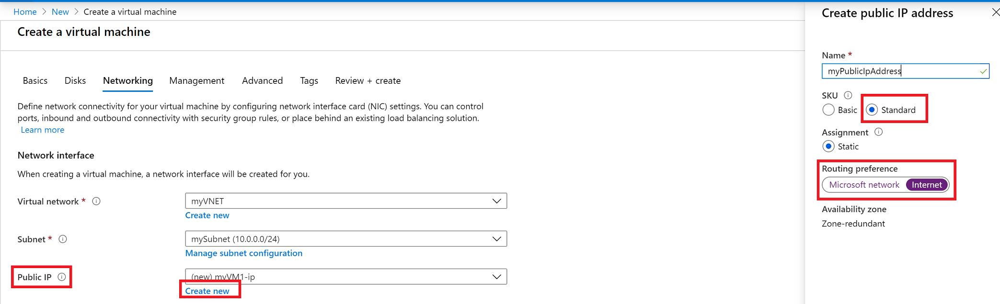
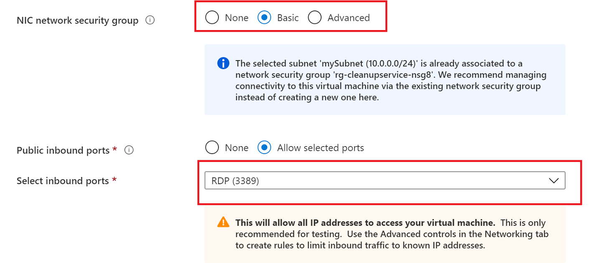
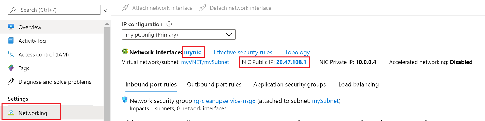

# Configure routing preference for a VM using the Azure portal

This article shows you how to configure routing preference for a virtual machine. Internet bound traffic from the VM will be routed via the ISP network when you choose **Internet** as your routing preference option . The default routing is via the Microsoft global network.

This article shows you how to create a virtual machine with a public IP that is set to route traffic via the public internet using the Azure portal.

> [!IMPORTANT]
> Routing preference is currently in public preview.
> This preview version is provided without a service level agreement, and it's not recommended for production workloads. Certain features might not be supported or might have constrained capabilities. 
> For more information, see [Supplemental Terms of Use for Microsoft Azure Previews](https://azure.microsoft.com/support/legal/preview-supplemental-terms/).

## Register the feature for your subscription
The Routing Preference feature is currently in preview. You must register the feature for your subscription using Azure PowerShell as follows:
```azurepowershell
Register-AzProviderFeature -FeatureName AllowRoutingPreferenceFeature ProviderNamespace Microsoft.Network
```

## Sign in to Azure

Sign in to the [Azure portal](https://preview.portal.azure.com/).

## Create a virtual machine

1. Select **+ Create a resource** found on the upper, left corner of the Azure portal.
2. Select **Compute**, and then select **Windows Server 2016 VM**, or another operating system of your choosing.
3. Enter, or select, the following information, accept the defaults for the remaining settings, and then select **OK**:

    |Setting|Value|
    |---|---|
    |Name|myVM|
    |User name| Enter a user name of your choosing.|
    |Password| Enter a password of your choosing. The password must be at least 12 characters long and meet the [defined complexity requirements](../virtual-machines/windows/faq.md?toc=%2fazure%2fvirtual-network%2ftoc.json#what-are-the-password-requirements-when-creating-a-vm).|
    |Subscription| Select your subscription.|
    |Resource group| Select **Use existing** and select **myResourceGroup**.|
    |Location| Select **East US**|

4. Select a size for the VM and then select **Select**.
5. Under **Networking** tab, click on **Create new** for **Public IP address**.
6. Enter *myPublicIpAddress*, select sku as **Standard**, and then select routing preference **Internet** and then hit **ok**, as shown in the following picture:

   

6. Select a port, or no ports under **Select public inbound ports**. Portal 3389 is selected, to enable remote access to the Windows Server virtual machine from the internet. Opening port 3389 from the internet is not recommended for production workloads.

   

7. Accept the remaining default settings and select **OK**.
8. On the **Summary** page, select **Create**. The virtual machine takes a few minutes to deploy.
9. Once the virtual machine is deployed, enter *myPublicIpAddress* in the search box at the top of the portal. When **myPublicIpAddress** appears in the search results, select it.
10. You can view the public IP address that is assigned, and that the address is assigned to the **myVM** virtual machine, as shown in the following picture:

    

11. Select **Networking**, then click on nic **mynic** and then select the public ip address to confirm that the routing preference is assigned as **Internet**.
    

## Clean up resources

When no longer needed, delete the resource group and all of the resources it contains:

1. Enter *myResourceGroup* in the **Search** box at the top of the portal. When you see **myResourceGroup** in the search results, select it.
2. Select **Delete resource group**.
3. Enter *myResourceGroup* for **TYPE THE RESOURCE GROUP NAME:** and select **Delete**.

## Next steps
- Learn more about [public IP with routing preference](routing-preference-overview.md).
- Learn more about [public IP addresses](virtual-network-ip-addresses-overview-arm.md#public-ip-addresses) in Azure.
- Learn more about all [public IP address settings](virtual-network-public-ip-address.md#create-a-public-ip-address).
