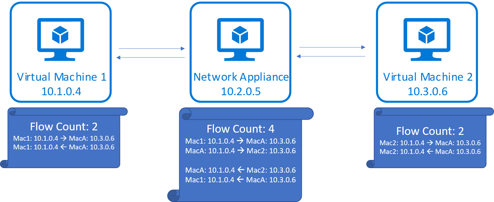
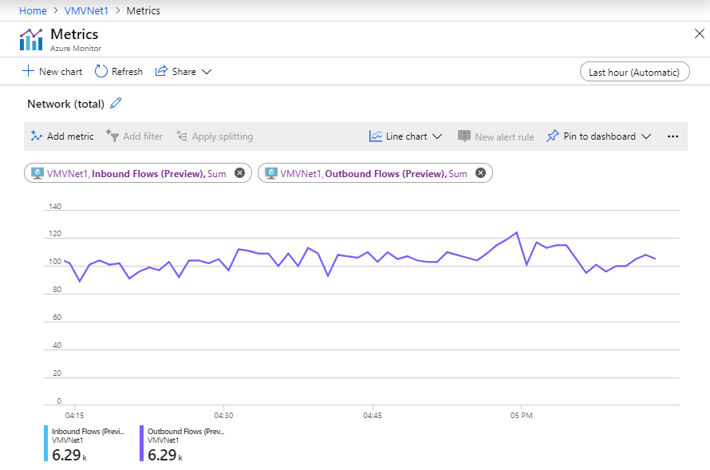

# Virtual machine network bandwidth

Azure offers a variety of VM sizes and types, each with a different mix of performance capabilities. One capability is network throughput (or bandwidth), measured in megabits per second (Mbps). Because virtual machines are hosted on shared hardware, the network capacity must be shared fairly among the virtual machines sharing the same hardware. Larger virtual machines are allocated relatively more bandwidth than smaller virtual machines.
 
The network bandwidth allocated to each virtual machine is metered on egress (outbound) traffic from the virtual machine. All network traffic leaving the virtual machine is counted toward the allocated limit, regardless of destination. For example, if a virtual machine has a 1,000 Mbps limit, that limit applies whether the outbound traffic is destined for another virtual machine in the same virtual network, or outside of Azure.
 
Ingress is not metered or limited directly. However, there are other factors, such as CPU and storage limits, which can impact a virtual machine’s ability to process incoming data.

Accelerated networking is a feature designed to improve network performance, including latency, throughput, and CPU utilization. While accelerated networking can improve a virtual machine’s throughput, it can do so only up to the virtual machine’s allocated bandwidth. To learn more about Accelerated networking, see Accelerated networking for [Windows](create-vm-accelerated-networking-powershell.md) or [Linux](create-vm-accelerated-networking-cli.md) virtual machines.
 
Azure virtual machines must have one, but may have several, network interfaces attached to them. Bandwidth allocated to a virtual machine is the sum of all outbound traffic across all network interfaces attached to a virtual machine. In other words, the allocated bandwidth is per virtual machine, regardless of how many network interfaces are attached to the virtual machine. To learn how many network interfaces different Azure VM sizes support, see Azure [Windows](../virtual-machines/sizes.md?toc=%2fazure%2fvirtual-network%2ftoc.json) and [Linux](../virtual-machines/sizes.md?toc=%2fazure%2fvirtual-network%2ftoc.json) VM sizes. 

## Expected network throughput

Expected outbound throughput and the number of network interfaces supported by each VM size is detailed in Azure [Windows](../virtual-machines/sizes.md?toc=%2fazure%2fvirtual-network%2ftoc.json) and [Linux](../virtual-machines/sizes.md?toc=%2fazure%2fvirtual-network%2ftoc.json) VM sizes. Select a type, such as  General purpose, then select a size-series on the resulting page, such as the Dv2-series. Each series has a table with networking specifications in the last column titled,
**Max NICs / Expected network performance (Mbps)**. 

The throughput limit applies to the virtual machine. Throughput is unaffected by the following factors:
- **Number of network interfaces**: The bandwidth limit is cumulative of all outbound traffic from the virtual machine.
- **Accelerated networking**: Though the feature can be helpful in achieving the published limit, it does not change the limit.
- **Traffic destination**: All destinations count toward the outbound limit.
- **Protocol**: All outbound traffic over all protocols counts towards the limit.

## Network Flow Limits

In addition to bandwidth, the number of network connections present on a VM at any given time can affect its network performance. The Azure networking stack maintains state for each direction of a TCP/UDP connection in data structures called ‘flows’. A typical TCP/UDP connection will have 2 flows created, one for the inbound and another for the outbound direction. 

Data transfer between endpoints requires creation of several flows in addition to those that perform the data transfer. Some examples are flows created for DNS resolution and flows created for load balancer health probes. Also note that network virtual appliances (NVAs) such as gateways, proxies, firewalls, will see flows being created for connections terminated at the appliance and originated by the appliance. 

## Flow Limits and Active Connections Recommendations

Today, the Azure networking stack supports 1M total flows (500k inbound and 500k outbound) for a VM. Total active connections that can be handled by a VM in different scenarios are as follows.
- VMs that belongs to VNET can handle 500k ***active connections*** for all VM sizes with 500k ***active flows in each direction***.  
- VMs with network virtual appliances (NVAs) such as gateway, proxy, firewall can handle 250k ***active connections*** with 500k ***active flows in each direction*** due to the forwarding and additional new flow creation on new connection setup to the next hop as shown in the above diagram. 

Once this limit is hit, additional connections are dropped. Connection establishment and termination rates can also affect network performance as connection establishment and termination shares CPU with packet processing routines. We recommend that you benchmark workloads against expected traffic patterns and scale out workloads appropriately to match your performance needs.

Metrics are available in [Azure Monitor](../azure-monitor/essentials/metrics-supported.md#microsoftcomputevirtualmachines) to track the number of network flows and the flow creation rate on your VM or VMSS instances.

Connection establishment and termination rates can also affect network performance as connection establishment and termination shares CPU with packet processing routines. 
We recommend that you benchmark workloads against expected traffic patterns and scale out workloads appropriately to match your performance needs. 

## Next steps

- [Optimize network throughput for a virtual machine operating system](virtual-network-optimize-network-bandwidth.md)
- [Test network throughput](virtual-network-bandwidth-testing.md) for a virtual machine.