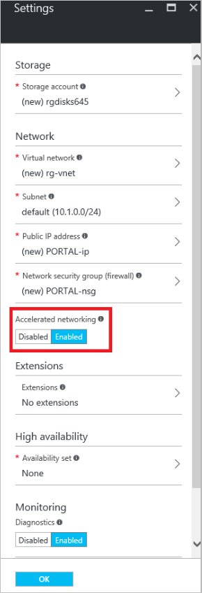
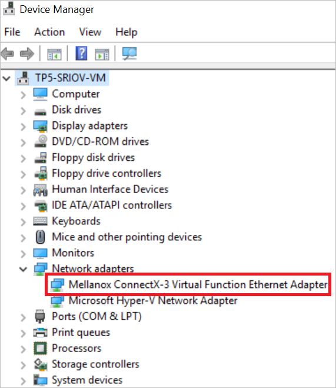

<properties 
   pageTitle="Accelerated networking for a virtual machine - Portal | Microsoft Azure"
   description="Learn how to configure Accelerated Networking for an Azure virtual machine using the Azure Portal."
   services="virtual-network"
   documentationCenter="na"
   authors="jimdial"
   manager="carmonm"
   editor=""
   tags="azure-resource-manager"
/>
<tags 
   ms.service="virtual-network"
   ms.devlang="na"
   ms.topic="article"
   ms.tgt_pltfrm="na"
   ms.workload="infrastructure-services"
   ms.date="09/26/2016"
   ms.author="jdial" />

# Accelerated networking for a virtual machine

> [AZURE.SELECTOR]
- [Azure Portal](virtual-network-accelerated-networking-portal.md)
- [PowerShell](virtual-network-accelerated-networking-powershell.md)

Accelerated Networking enables Single Root I/O Virtualization (SR-IOV) to a virtual machine (VM), greatly improving its networking performance. This high-performance path bypasses the host from the datapath reducing latency, jitter, and CPU utilization for use with the most demanding network workloads on supported VM types. This article explains how to use the Azure Portal to configure Accelerated Networking in the Azure Resource Manager deployment model. You can also create a VM with Accelerated Networking using Azure PowerShell. To learn how, click the PowerShell box at the top of this article.

The following picture shows communication between two virtual machines (VM) with and without Accelerated Networking:

Without Accelerated Networking, all networking traffic in and out of the VM must traverse the host and the virtual switch. The virtual switch provides all policy enforcement, such as network security groups, access control lists, isolation, and other network virtualized services to network traffic. To learn more, read the [Hyper-V Network Virtualization and Virtual Switch](https://technet.microsoft.com/library/jj945275.aspx) article.

With Accelerated Networking, network traffic arrives at the network card (NIC) and is then forwarded to the VM. All network policies that the virtual switch applies without Accelerated Networking are offloaded and applied in hardware. Applying policy in hardware enables the NIC to forward network traffic directly to the VM, bypassing the host and the virtual switch, while maintaining all the policy it applied in the host.

The benefits of Accelerated Networking only apply to the VM that it is enabled on. For the best results, it is ideal to enable this feature on at least two VMs connected to the same VNet. When communicating across VNets or connecting on-premises, this feature has a minimal impact to overall latency.

[AZURE.INCLUDE [virtual-network-preview](../../includes/virtual-network-preview.md)]

##Benefits

- **Lower Latency / Higher packets per second (pps):** Removing the virtual switch from the datapath removes the time packets spend in the host for policy processing and increases the number of packets that can be processed inside the VM.
- **Reduced jitter:** Virtual switch processing depends on the amount of policy that needs to be applied and the workload of the CPU that is doing the processing. Offloading the policy enforcement to the hardware removes that variability by delivering packets directly to the VM, removing the host to VM communication and all software interrupts and context switches.
- **Decreased CPU utilization:** Bypassing the virtual switch in the host leads to less CPU utilization for processing network traffic.

## Limitations

The following limitations exist when using this capability:
 
- **Network interface creation:** Accelerated networking can only be enabled for a new network interface.  It cannot be enabled on an existing network interface.
- **VM creation:** A network interface with accelerated networking enabled can only be attached to a VM when the VM is created. The network interface cannot be attached to an existing VM.
- **Regions:** Offered in the West Central US and West Europe Azure regions only. The set of regions will expand in the future.
- **Supported operating system:** Microsoft Windows Server 2012 R2 and Windows Server 2016 Technical Preview 5. Linux and Windows Server 2012 support will be added soon.
- **VM Size:** Standard_D15_v2 and Standard_DS15_v2 are the only supported VM instance sizes. For more information, see the [Windows VM sizes](../virtual-machines/virtual-machines-windows-sizes.md) article. The set of supported VM instance sizes will expand in the future.

Changes to these limitations will be announced through the [Azure Virtual Networking updates](https://azure.microsoft.com/updates/accelerated-networking-in-preview) page.

## Create a Windows VM with Accelerated Networking

1. Register for the preview by sending an email to [Accelerated Networking Subscriptions](mailto:axnpreview@microsoft.com?subject=Request%20to%20enable%20subscription%20%3csubscription%20id%3e) with your subscription ID and intended use. Do not complete the remaining steps until after you receive an e-mail notifying you that you've been accepted into the preview.
2. Login to the Azure Portal at http://portal.azure.com.
3. Create a VM by completing the steps in the [Create a Windows VM](../virtual-machines/virtual-machines-windows-hero-tutorial.md) article selecting the following options:
	- Select an operating system listed in the Limitations section of this article.
	- Select a location (region) listed in the Limitations section of this article.
	- Select a VM size listed in the Limitations section of this article. If one of the supported sizes isn't listed, click **View all** in the **Choose a size** blade to select a size from an expanded list.
	- In the **Settings** blade, click *Enabled* for **Accelerated networking**, as shown in the following picture:

		

	>[AZURE.NOTE] The Accelerated Networking option will only be visible if you've:
	>
	>- Been accepted into the preview
	>- Selected supported operating system, location, and VM sizes mentioned in the Limitations section of this article.

5. Once the VM is created, download the [Accelerated Networking driver](https://gallery.technet.microsoft.com/Azure-Accelerated-471b5d84), connect and login to the VM, and run the driver installer inside the VM.
6. Right-click the Windows button and click **Device Manager**. Verify that the **Mellanox ConnectX-3 Virtual Function Ethernet Adapter** appears under the **Network** option when expanded, as shown in the following picture:

	