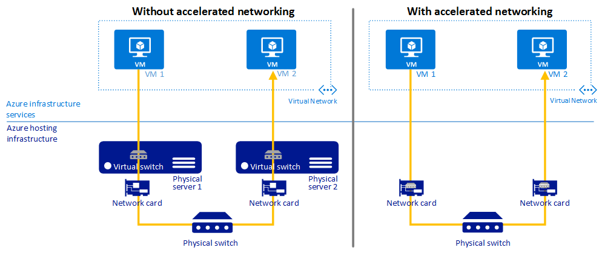

---
title: Accelerated networking for a virtual machine - PowerShell | Microsoft Docs
description: Learn how to configure Accelerated Networking for an Azure virtual machine using PowerShell.
services: virtual-network
documentationcenter: na
author: jimdial
manager: timlt
editor: ''
tags: azure-resource-manager

ms.assetid: a0b63599-c23b-40b5-a8ab-23af8b07dded
ms.service: virtual-network
ms.devlang: na
ms.topic: article
ms.tgt_pltfrm: na
ms.workload: infrastructure-services
ms.date: 09/23/2016
ms.author: jdial
ms.custom: H1Hack27Feb2017

---
# Accelerated networking for a virtual machine using PowerShell
> [!div class="op_single_selector"]
> * [Azure Portal](virtual-network-accelerated-networking-portal.md)
> * [PowerShell](virtual-network-accelerated-networking-powershell.md)
> 
> 

Accelerated Networking enables Single Root I/O Virtualization (SR-IOV) to a virtual machine (VM), greatly improving its networking performance. This high-performance path bypasses the host from the datapath reducing latency, jitter, and CPU utilization for use with the most demanding network workloads on supported VM types. This article explains how to use Azure PowerShell to configure Accelerated Networking in the Azure Resource Manager deployment model. You can also create a VM with Accelerated Networking using the Azure Portal. To learn how, click the Azure Portal box at the top of this article.

The following picture shows communication between two virtual machines (VM) with and without Accelerated Networking:

Without Accelerated Networking, all networking traffic in and out of the VM must traverse the host and the virtual switch. The virtual switch provides all policy enforcement, such as network security groups, access control lists, isolation, and other network virtualized services to network traffic. To learn more, read the [Hyper-V Network Virtualization and Virtual Switch](https://technet.microsoft.com/library/jj945275.aspx) article.

With Accelerated Networking, network traffic arrives at the network card (NIC) and is then forwarded to the VM. All network policies that the virtual switch applies without Accelerated Networking are offloaded and applied in hardware. Applying policy in hardware enables the NIC to forward network traffic directly to the VM, bypassing the host and the virtual switch, while maintaining all the policy it applied in the host.

The benefits of Accelerated Networking only apply to the VM that it is enabled on. For the best results, it is ideal to enable this feature on at least two VMs connected to the same VNet.  When communicating across VNets or connecting on-premises, this feature has a minimal impact to overall latency.

[!INCLUDE [virtual-network-preview](../../includes/virtual-network-preview.md)]

## Benefits
* **Lower Latency / Higher packets per second (pps):** Removing the virtual switch from the datapath removes the time packets spend in the host for policy processing and increases the number of packets that can be processed inside the VM.
* **Reduced jitter:** Virtual switch processing depends on the amount of policy that needs to be applied and the workload of the CPU that is doing the processing. Offloading the policy enforcement to the hardware removes that variability by delivering packets directly to the VM, removing the host to VM communication and all software interrupts and context switches.
* **Decreased CPU utilization:** Bypassing the virtual switch in the host leads to less CPU utilization for processing network traffic.

## Limitations
The following limitations exist when using this capability:

* **Network interface creation:** Accelerated networking can only be enabled for a new network interface.  It cannot be enabled on an existing network interface.
* **VM creation:** A network interface with accelerated networking enabled can only be attached to a VM when the VM is created. The network interface cannot be attached to an existing VM.
* **Regions:** Offered in the West Central US and West Europe Azure regions only. The set of regions will expand in the future.
* **Supported operating system:** Microsoft Windows Server 2012 R2 and Windows Server 2016 Technical Preview 5. Linux and Windows Server 2012 support will be added soon.
* **VM Size:** Standard_D15_v2 and Standard_DS15_v2 are the only supported VM instance sizes. For more information, see the [Windows VM sizes](../virtual-machines/windows/sizes.md?toc=%2fazure%2fvirtual-machines%2fwindows%2ftoc.json) article. The set of supported VM instance sizes will expand in the future.

Changes to these limitations will be announced through the [Azure Virtual Networking updates](https://azure.microsoft.com/updates/accelerated-networking-in-preview) page.

## Create a Windows VM with Accelerated Networking
1. Open a PowerShell command prompt and complete the remaining steps in this section within a single PowerShell session. If you don't already have PowerShell installed and configured, complete the steps in the [How to install and configure Azure PowerShell](/powershell/azure/overview) article.
2. To register for the preview, send an email to [Accelerated Networking Subscriptions](mailto:axnpreview@microsoft.com?subject=Request%20to%20enable%20subscription%20%3csubscription%20id%3e) with your subscription ID and intended use. Do not complete the remaining steps until after you receive an e-mail notifying you that you've been accepted into the preview.
3. Register the capability with your subscription by entering the following commands:
   
        Register-AzureRmProviderFeature -FeatureName AllowAcceleratedNetworkingFeature -ProviderNamespace Microsoft.Network
        Register-AzureRmResourceProvider -ProviderNamespace Microsoft.Network
4. Replace *westcentralus* with the name of another location supported by this capability listed in the [Limitations](#limitations) section of this article (if desired). Enter the following command to set a variable for the location:
   
        $locName = "westcentralus"
5. Replace *RG1* with a name for the resource group that will contain the new network interface and enter the following commands to create it:
   
        $rgName = "RG1"
        New-AzureRmResourceGroup -Name $rgName -Location $locName
6. Change *VM1-NIC1* to what you want to name the network interface and then enter the following command:
   
        $NICName = "VM1-NIC1"
7. The network interface must be connected to a subnet within an existing Azure Virtual Network (VNet) in the same location and [subscription](../azure-glossary-cloud-terminology.md#subscription) as the network interface. Learn more about VNets by reading the [Virtual network overview](virtual-networks-overview.md) article if you're not familiar with them. To create a VNet, complete the steps in the [Create a VNet](virtual-networks-create-vnet-arm-ps.md) article. Change the "values" of the following $Variables to the name of the VNet and subnet you want to connect the network interface to.
   
        $VNetName   = "VNet1"
        $SubnetName = "Subnet1"
   
    If you don't know the name of an existing VNet in the location you chose in step 3, enter the following commands:
   
        $VirtualNetworks = Get-AzureRmVirtualNetwork
        $VirtualNetworks | Where-Object {$_.Location -eq $locName} | Format-Table Name, Location
   
    If the list returned is empty, you need to create a VNet in the location. To create a VNet, complete the steps in the [Create a virtual network](virtual-networks-create-vnet-arm-ps.md) article.
   
    To get the name of the subnets within the VNet, type the following commands and replace *Subnet1* above with the name of a subnet:
   
        $VNet = Get-AzureRmVirtualNetwork -Name $VNetName -ResourceGroupName $rgName
        $VNet.Subnets | Format-Table Name, AddressPrefix
8. Enter the following commands to retrieve the VNet and subnet and assign them to variables.
   
        $VNet = Get-AzureRmVirtualNetwork -Name $VNetName -ResourceGroupName $rgName
        $Subnet = $VNet.Subnets | Where-Object { $_.Name -eq $SubnetName }
9. Identify an existing public IP address resource that can be associated to the network interface so you can connect to it over the Internet. If you don't want to access the VM with the network interface over the Internet, you can skip this step. Without a public IP address, you must connect to the VM from another VM connected to the same VNet. 
   
    Change *PIP1* to the name of an existing public IP address resource that exists in the location you're creating the network interface in and that isn't currently associated with another network interface. If necessary, change $rgName to the name of the resource group the public IP address resource exists in and enter the following command:
   
        $PIP1 = Get-AzureRmPublicIPAddress -Name "PIP1" -ResourceGroupName $rgName
   
    Enter the following commands if you don't know the name of an existing public IP address resource:
   
        $PublicIPAddresses = Get-AzureRmPublicIPAddress
        $PublicIPAddresses | Where-Object { $_.Location -eq $locName } |Format-Table Name, Location, IPAddress, IpConfiguration
   
    If the **IPConfiguration** column has no value in the output returned, the public IP address resource is not associated with an existing network interface and can be used. If the list is blank, or there are no available public IP address resources, you can create one using the New-AzureRmPublicIPAddress command.
   
   > [!NOTE]
   > Public IP addresses have a nominal fee. Learn more about pricing by reading the [IP address pricing](https://azure.microsoft.com/pricing/details/ip-addresses) page.
   > 
   > 
10. If you chose not to add a public IP address resource to the interface, remove *-PublicIPAddress $PIP1* at the end of the command that follows. Create the network interface with accelerated networking by entering the following command:
    
        $nic = New-AzureRmNetworkInterface -Location $locName -Name $NICName -ResourceGroupName $rgName -Subnet $Subnet -EnableAcceleratedNetworking -PublicIpAddress $PIP1 
11. Assign the network interface to a VM when creating the VM by following the instructions in steps 3 and 6 of the [Create a VM](../virtual-machines/virtual-machines-windows-ps-create.md?toc=%2fazure%2fvirtual-machines%2fwindows%2ftoc.json) article. In step 6-2, replace *Standard_A1* with one of the VM sizes listed in the [Limitations](#limitations) section of this article.
    
    > [!NOTE]
    > If you changed the *name* of the $locName, $rgName, or $nic variables in this article, step 6 in the Create a VM article will fail. You can however, change the *values* of the variables.
    > 
    > 
12. Once the VM is created, download the [Accelerated Networking driver](https://gallery.technet.microsoft.com/Azure-Accelerated-471b5d84), connect to the VM, and run the driver installer inside the VM.
13. Right-click the Windows button and click **Device Manager**. Verify that the **Mellanox ConnectX-3 Virtual Function Ethernet Adapter** appears under the **Network** option when expanded, as shown in the following picture:
    
    

