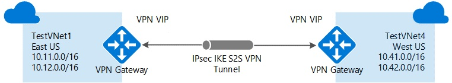
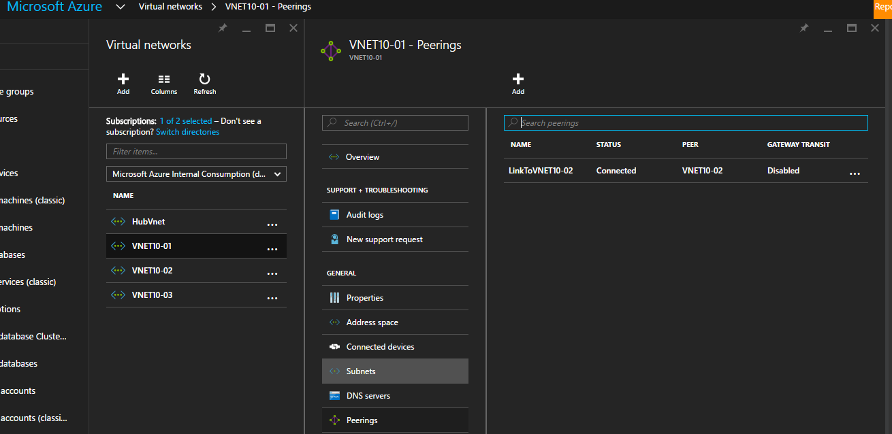
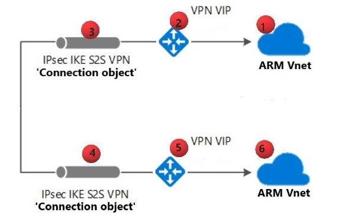
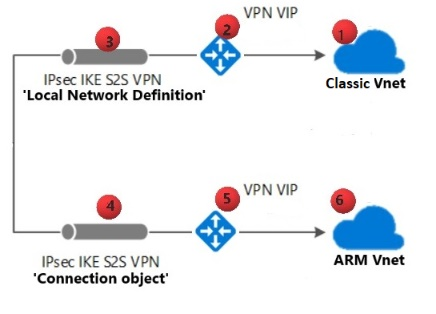
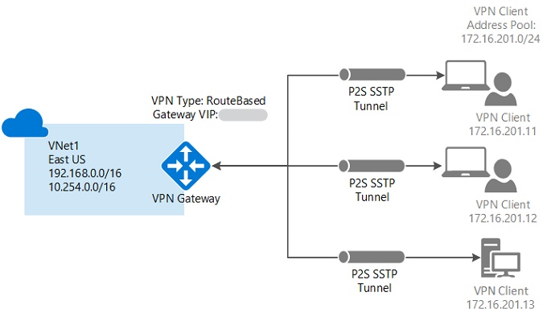
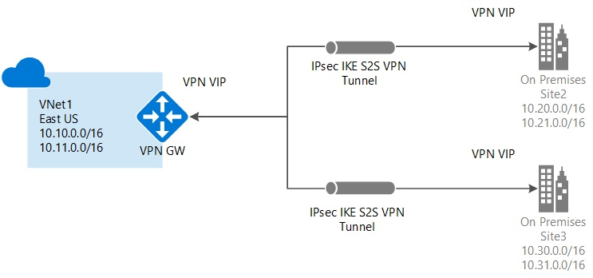
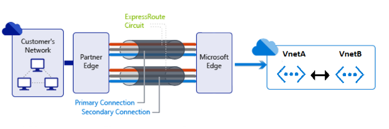

# Configure and validate virtual network or VPN connections

This walkthrough provides step-by-step guidance to configure and validate various Azure VPN and virtual network deployments. Scenarios include transit routing, network-to-network connections, Border Gateway Protocol (BGP), multisite connections, and point-to-site connections.

Azure VPN gateways enable flexibility in arranging almost any kind of connected virtual network topology in Azure. For example, you can connect virtual networks:

- Across regions.
- Between virtual network types (Azure Resource Manager versus classic).
- Within Azure or within an on-premises hybrid environment.
- In different subscriptions. 

## Network-to-network VPN connection

Connecting a virtual network to another virtual network (network-to-network) via VPN is similar to connecting a virtual network to an on-premises site location. Both connectivity types use a VPN gateway to provide a secure tunnel through IPsec and IKE. The virtual networks can be in the same or different regions, and from the same or different subscriptions.


 
If your virtual networks are in the same region, you might want to consider connecting them by using virtual network peering. Virtual network peering doesn't use a VPN gateway. It increases throughput and decreases latency. To configure a virtual network peering connection, select **Configure and validate VNet Peering**.

If your virtual networks were created through the Azure Resource Manger deployment model, select **Configure and validate a Resource Manager VNet to a Resource Manager VNet connection** to configure a VPN connection.

If one of the virtual networks was created through the Azure classic deployment model, and the other was created through Resource Manager, select **Configure and validate a classic VNet to a Resource Manager VNet connection** to configure a VPN connection.

### Configure virtual network peering for two virtual networks in the same region

Before you start to implement and configure Azure virtual network peering, make sure that you meet the following prerequisites:

* The peered virtual networks must exist in the same Azure region.
* The peered virtual networks must have IP address spaces that don't overlap.
* Virtual network peering is between two virtual networks. There's no derived transitive relationship across peerings. For example, if VNetA is peered with VNetB, and VNetB is peered with VNetC, VNetA is *not* peered with VNetC.

When you meet the requirements, you can follow [Tutorial: Connect virtual networks with virtual network peering by using the Azure portal](./tutorial-connect-virtual-networks-portal.md) to create and configure the peering.

To check the peering configuration, use the following method:

1. Sign in to the [Azure portal](https://portal.azure.com/) by using an account that has the necessary [roles and permissions](virtual-network-manage-peering.md#permissions).
2. In the box that contains the text **Search resources** at the top of the portal, type **virtual networks**. When **Virtual networks** appears in the search results, select it.
3. In the **Virtual networks** blade that appears, select the virtual network for which you want to create a peering.
4. In the pane that appears for the virtual network, select **Peerings** in the **Settings** section.
5. Select a peering and view the configuration results.


 
For Azure PowerShell, run the command [Get-AzureRmVirtualNetworkPeering](/powershell/module/azurerm.network/get-azurermvirtualnetworkpeering) to get the virtual network peering. Here's an example:

```
PS C:\Users\User1> Get-AzureRmVirtualNetworkPeering -VirtualNetworkName Vnet10-01 -ResourceGroupName dev-vnets
Name                             : LinkToVNET10-02
Id                               : /subscriptions/GUID/resourceGroups/dev-vnets/providers/Microsoft.Network/virtualNetworks/VNET10-01/virtualNetworkPeerings/LinkToVNET10-0
2
Etag                             : W/"GUID"
ResourceGroupName                : dev-vnets
VirtualNetworkName               : vnet10-01
ProvisioningState                : Succeeded
RemoteVirtualNetwork             : {
                                  "Id": "/subscriptions/GUID/resourceGroups/DEV-VNET
                                   s/providers/Microsoft.Network/virtualNetworks/VNET10-02"
                                   }
AllowVirtualNetworkAccess        : True
AllowForwardedTraffic            : False
AllowGatewayTransit              : False
UseRemoteGateways                : False
RemoteGateways                   : null
RemoteVirtualNetworkAddressSpace : null
```

### Connect a Resource Manager virtual network to another Resource Manager virtual network

You can configure a connection from one Resource Manager virtual network to another Resource Manager virtual network directly. Or you can configure the connection by using IPsec.

### Configure a VPN connection between Resource Manager virtual networks

To configure a connection between Resource Manager virtual networks without IPsec, see [Configure a network-to-network VPN gateway connection by using the Azure portal](../vpn-gateway/vpn-gateway-howto-vnet-vnet-resource-manager-portal.md).

To configure a connection with IPsec between two Resource Manager virtual networks, follow steps 1 to 5 in [Create a site-to-site connection in the Azure portal](../vpn-gateway/tutorial-site-to-site-portal.md) for each virtual network.

> [!Note]
> These steps work only for virtual networks in the same subscription. If your virtual networks are in different subscriptions, you must use PowerShell to make the connection. See the [PowerShell](../vpn-gateway/vpn-gateway-vnet-vnet-rm-ps.md) article.

### Validate the VPN connection between Resource Manager virtual networks



To check that your VPN connection is configured correctly, follow these instructions.

> [!Note] 
> The numbers after virtual network components in these steps correspond to the numbers in the preceding diagram.

1. Make sure there are no overlapping address spaces in the connected virtual networks.
2. Verify that the address range for the Azure Resource Manager virtual network (1) is defined accurately in the **Connection object** instance (4).
3. Verify that the address range for the Azure Resource Manager virtual network (6) is defined accurately in the **Connection object** instance (3).
4. Verify that the pre-shared keys are matching on the connection objects.
5. Verify that the Azure Resource Manager virtual network gateway VIP (2) is defined accurately in the **Connection object** instance (4).
6. Verify that the Azure Resource Manager virtual network gateway VIP (5) is defined accurately in the **Connection object** instance (3).

### Connect a classic virtual network to a Resource Manager virtual network

You can create a connection between virtual networks that are in different subscriptions and in different regions. You can also connect virtual networks that already have connections to on-premises networks, as long as you have configured the gateway type as route-based.

To configure a connection between a classic virtual network and a Resource Manager virtual network, see [Connect virtual networks from different deployment models by using the Azure portal](../vpn-gateway/vpn-gateway-connect-different-deployment-models-portal.md).



To check the configuration when you connect a classic virtual network to an Azure Resource Manager virtual network, follow these instructions.

> [!Note] 
> The numbers after virtual network components in these steps correspond to the numbers in the preceding diagram. 

1. Make sure there are no overlapping address spaces in the connected virtual networks.
2. Verify that the address range for the Azure Resource Manager virtual network (6) is defined accurately in the classic local network definition (3).
3. Verify that the address range for the classic virtual network (1) is defined accurately in the Azure Resource Manager **Connection object** instance (4).
4. Verify that the classic virtual network gateway VIP (2) is defined accurately in the Azure Resource Manager **Connection object** instance (4).
5. Verify that the Azure Resource Manager virtual network gateway (5) is defined accurately in the classic **Local Network Definition** instance (3).
6. Verify that the pre-shared keys are matching on both connected virtual networks:
   - Classic virtual network: **Local Network Definition** (3)
   - Azure Resource Manager virtual network: **Connection object** (4)

## Create a point-to-site VPN connection

A point-to-site (*P2S* in the following diagram) configuration lets you create a secure connection from an individual client computer to a virtual network. Point-to-site connections are useful when you want to connect to your virtual network from a remote location, such as from home or a conference. They're also useful when you have only a few clients that need to connect to a virtual network. 

The point-to-site VPN connection is initiated from the client computer through the native Windows VPN client. Connecting clients use certificates to authenticate.



Point-to-site connections don't require a VPN device. They create the VPN connection over Secure Socket Tunneling Protocol (SSTP). You can connect a point-to-site connection to a virtual network by using various deployment tools and deployment models:

* [Configure a point-to-site connection to a virtual network by using the Azure portal](../vpn-gateway/vpn-gateway-howto-point-to-site-resource-manager-portal.md)
* [Configure a point-to-site connection to a virtual network by using the Azure portal (classic)](../vpn-gateway/vpn-gateway-howto-point-to-site-classic-azure-portal.md)
* [Configure a point-to-site connection to a virtual network by using PowerShell](../vpn-gateway/vpn-gateway-howto-point-to-site-rm-ps.md)

### Validate your point-to-site connection

The article [Troubleshooting: Azure point-to-site connection problems](../vpn-gateway/vpn-gateway-troubleshoot-vpn-point-to-site-connection-problems.md) walks through common issues with point-to-site connections.

## Create a multisite VPN connection

You can add a site-to-site (*S2S* in the following diagram) connection to a virtual network that already has a site-to-site connection, point-to-site connection, or network-to-network connection. This kind of connection is often called a *multisite* configuration. 



Azure currently works with two deployment models: Resource Manager and classic. The two models aren't completely compatible with each other. To configure a multisite connection with different models, see the following articles:

* [Add a site-to-site connection to a virtual network with an existing VPN gateway connection](../vpn-gateway/vpn-gateway-howto-multi-site-to-site-resource-manager-portal.md)
* [Add a site-to-site connection to a virtual network with an existing VPN gateway connection (classic)](../vpn-gateway/vpn-gateway-multi-site.md)

> [!Note]
> The steps in those articles don't apply to Azure ExpressRoute and site-to-site coexisting connection configurations. For more information, see [ExpressRoute and site-to-site coexisting connections](../expressroute/expressroute-howto-coexist-resource-manager.md).

## Configure transit routing

Transit routing is a specific routing scenario where you connect multiple networks in a daisy-chain topology. This routing enables resources in virtual networks at either end of the chain to communicate with one another through virtual networks in between. Without transit routing, networks or devices peered through a hub can't reach one another.

### Configure transit routing in a point-to-site connection

Imagine a scenario in which you want to configure a site-to-site VPN connection between VNetA and VNetB. You also want to configure a point-to-site VPN for the client to connect to the gateway of VNetA. Then, you want to enable transit routing for the point-to-site clients to connect to VNetB, which passes through VNetA. 

This scenario is supported when BGP is enabled on the site-to-site VPN between VNetA and VNetB. For more information, see [About point-to-site VPN routing](../vpn-gateway/vpn-gateway-about-point-to-site-routing.md).

### Configure transit routing in an ExpressRoute connection

Azure ExpressRoute lets you extend your on-premises networks into the Microsoft cloud over a dedicated private connection facilitated by a connectivity provider. With ExpressRoute, you can establish connections to Microsoft cloud services, such as Microsoft Azure, Microsoft 365, and Dynamics 365. For more information, see [ExpressRoute overview](../expressroute/expressroute-introduction.md).



> [!Note]
> We recommend that if VNetA and VNetB are in the same geopolitical region, you [link both virtual networks to the ExpressRoute circuit](../expressroute/expressroute-howto-linkvnet-arm.md) instead of configuring transit routing. If your virtual networks are in different geopolitical regions, you can also link them to your circuit directly if you have [ExpressRoute Premium](../expressroute/expressroute-faqs.md#expressroute-premium). 

If you have ExpressRoute and site-to-site coexistence, transit routing isn't supported. For more information, see [Configure ExpressRoute and site-to-site by using PowerShell](../expressroute/expressroute-howto-coexist-resource-manager.md).

If you have enabled ExpressRoute to connect your local networks to an Azure virtual network, you can enable peering between the virtual networks where you want to have transit routing. To allow your local networks to connect to the remote virtual network, you must configure [virtual network peering](./virtual-network-peering-overview.md#gateways-and-on-premises-connectivity). 

> [!Note]
> Virtual network peering is available only for virtual networks in the same region.

To check whether you have configured transit routing for virtual network peering, follow these instructions:

1. Sign in to the [Azure portal](https://portal.azure.com/) by using an account that has the necessary [roles and permissions](virtual-network-manage-peering.md#permissions).
2. [Create a peering between VNetA and VNetB](./tutorial-connect-virtual-networks-portal.md) as shown in the earlier diagram. 
3. In the pane that appears for the virtual network, select **Peerings** in the **Settings** section.
4. Select the peering you want to view. Then, select **Configuration** to validate that you have enabled **Allow Gateway Transit** on the VNetA network connected to the ExpressRoute circuit and **Use Remote Gateway** on the remote VNetB network not connected to the ExpressRoute circuit.

### Configure transit routing in a virtual network peering connection

When virtual networks are peered, you can also configure the gateway in the peered virtual network as a transit point to an on-premises network. To configure a transit route in virtual network peering, see [Network-to-network connections](../vpn-gateway/vpn-gateway-vnet-vnet-rm-ps.md?toc=%2fazure%2fvirtual-network%2ftoc.json).

> [!Note]
> Gateway transit isn't supported in the peering relationship between virtual networks created through different deployment models. Both virtual networks in the peering relationship must have been created through Resource Manager for gateway transit to work.

To check whether you have configured a transit route for virtual network peering, follow these instructions:

1. Sign in to the [Azure portal](https://portal.azure.com/) by using an account that has the necessary [roles and permissions](virtual-network-manage-peering.md#permissions).
2. In the box that contains the text **Search resources** at the top of the portal, type **virtual networks**. When **Virtual networks** appears in the search results, select it.
3. In the **Virtual networks** blade that appears, select the virtual network for which you want to check the peering setting.
4. In the pane that appears for the virtual network that you selected, select **Peerings** in the **Settings** section.
5. Select the peering that you want to view. Validate that you have enabled **Allow gateway transit** and **Use remote gateways** under **Configuration**.


### Configure transit routing in a network-to-network connection

To configure transit routing between virtual networks, you must enable BGP on all intermediate network-to-network connections by using the Resource Manager deployment model and PowerShell. For instructions, see [How to configure BGP on Azure VPN gateways by using PowerShell](../vpn-gateway/vpn-gateway-bgp-resource-manager-ps.md).

Transit traffic through Azure VPN gateways is possible through the classic deployment model, but that relies on statically defined address spaces in the network configuration file. BGP isn't yet supported with Azure virtual networks and VPN gateways through the classic deployment model. Without BGP, manually defining transit address spaces is error prone, and we don't recommend it.

> [!Note]
> You configure classic network-to-network connections by using the Azure classic portal, or by using a network configuration file in the classic portal. You can't create or modify a classic virtual network through the Azure Resource Manager deployment model or the Azure portal. For more information on transit routing for classic virtual networks, see the [Microsoft Developer blog](/archive/blogs/igorpag/hubspoke-daisy-chain-and-full-mesh-vnet-topologies-in-azure-arm-using-vpn-v1).

### Configure transit routing in a site-to-site connection

To configure transit routing between your on-premises network and a virtual network with a site-to-site connection, you must enable BGP on all intermediate site-to-site connections by using the Resource Manager deployment model and PowerShell. See [How to configure BGP on Azure VPN gateways by using PowerShell](../vpn-gateway/vpn-gateway-bgp-resource-manager-ps.md) for instructions.

Transit traffic through Azure VPN gateways is possible through the classic deployment model, but that relies on statically defined address spaces in the network configuration file. BGP isn't yet supported with Azure virtual networks and VPN gateways through the classic deployment model. Without BGP, manually defining transit address spaces is error prone, and we don't recommend it.

> [!Note]
> You configure classic site-to-site connections by using the Azure classic portal, or by using a network configuration file in the classic portal. You can't create or modify a classic virtual network through the Azure Resource Manager deployment model or the Azure portal. For more information on transit routing for classic virtual networks, see the [Microsoft Developer blog](/archive/blogs/igorpag/hubspoke-daisy-chain-and-full-mesh-vnet-topologies-in-azure-arm-using-vpn-v1).

## Configure BGP for a VPN gateway

BGP is the standard routing protocol used on the internet to exchange routing and reachability information between two or more networks. When BGP is used in the context of Azure virtual networks, it enables the Azure VPN gateways and your on-premises VPN devices, known as BGP peers or neighbors. They exchange "routes" that will inform both gateways on the availability and reachability for those prefixes to go through the gateways or routers involved. 

BGP can also enable transit routing among multiple networks by propagating routes that a BGP gateway learns from one BGP peer to all other BGP peers. For more information, see [Overview of BGP with Azure VPN Gateway](../vpn-gateway/vpn-gateway-bgp-overview.md).

### Configure BGP for a VPN connection

To configure a VPN connection that uses BGP, see [How to configure BGP on Azure VPN gateways by using PowerShell](../vpn-gateway/vpn-gateway-bgp-resource-manager-ps.md).

Enable BGP on the virtual network gateway by creating an autonomous system (AS) number for it. Basic gateways don't support BGP. To check the SKU of the gateway, go to the **Overview** section of the **VPN Gateway** blade in the Azure portal. If your SKU is **Basic**, you have to change the SKU (see [Resizing the gateway](/powershell/module/azurerm.network/resize-azurermvirtualnetworkgateway)) to **VpnGw1**. 

Checking the SKU will cause 20 to 30 minutes of downtime. As soon as the gateway has the correct SKU, you can add the AS number by using the [Set-AzureRmVirtualNetworkGateway](/powershell/module/azurerm.network/set-azurermvirtualnetworkgateway) PowerShell commandlet. After you configure the AS number, a BGP peer IP for the gateway will be provided automatically.

You must manually provide `LocalNetworkGateway` with an AS number and a BGP peer address. You can set the `ASN` and `-BgpPeeringAddress` values by using either the [New-AzureRmLocalNetworkGateway](/powershell/module/azurerm.network/new-azurermlocalnetworkgateway) or the [Set-AzureRmLocalNetworkGateway](/powershell/module/azurerm.network/set-azurermlocalnetworkgateway) PowerShell commandlet. Some AS numbers are reserved for Azure, and you can't use them as described in [About BGP with Azure VPN Gateway](../vpn-gateway/vpn-gateway-bgp-overview.md#faq).

The connection object must have BGP enabled. You can set the `-EnableBGP` value to `$True` through [New-AzureRmVirtualNetworkGatewayConnection](/powershell/module/azurerm.network/new-azurermvirtualnetworkgatewayconnection) or [Set-AzureRmVirtualNetworkGatewayConnection](/powershell/module/azurerm.network/set-azurermvirtualnetworkgatewayconnection).

### Validate the BGP configuration

To check whether BGP is configured correctly, you can run the `get-AzureRmVirtualNetworkGateway` and `get-AzureRmLocalNetworkGateway` commandlets. Then you'll notice BGP-related output in the `BgpSettingsText` part. For example:

```
{

"Asn": AsnNumber,

"BgpPeeringAddress": "IP address",

"PeerWeight": 0

}
```

## Create a highly available active/active VPN connection

The key differences between the active/active and active/standby gateways are:

* You must create two gateway IP configurations with two public IP addresses.
* You must set the **EnableActiveActiveFeature** flag.
* The gateway SKU must be **VpnGw1**, **VpnGw2**, or **VpnGw3**.

To achieve high availability for cross-premises and network-to-network connectivity, you should deploy multiple VPN gateways and establish multiple parallel connections between your networks and Azure. For an overview of connectivity options and topology, see [Highly available cross-premises and network-to-network connectivity](../vpn-gateway/vpn-gateway-highlyavailable.md).

To create active/active cross-premises and network-to-network connections, follow the instructions in [Configure active/active S2S VPN connections with Azure VPN gateways](../vpn-gateway/vpn-gateway-activeactive-rm-powershell.md) to configure an Azure VPN gateway in active/active mode.

> [!Note]  
> * When you add addresses to the local network gateway for BGP-enabled active/active mode, *add only the /32 addresses of the BGP peers*. If you add more addresses, they will be considered static routes and take precedence over BGP routes.
> * You must use different BGP AS numbers for your on-premises networks that are connecting to Azure. (If they're the same, you have to change your virtual network AS number if your on-premises VPN device already uses the ASN to peer with other BGP neighbors.)

## Change an Azure VPN gateway type after deployment

You can't change an Azure virtual network gateway type from policy-based to route-based or the other way directly. You must first delete the gateway. After that, the IP address and the pre-shared key won't be preserved. Then you can create a new gateway of the desired type. 

To delete and create a gateway, follow these steps:

1. Delete any connections associated with the original gateway.
2. Delete the gateway by using the Azure portal, PowerShell, or classic PowerShell: 
   * [Delete a virtual network gateway by using the Azure portal](../vpn-gateway/vpn-gateway-delete-vnet-gateway-portal.md)
   * [Delete a virtual network gateway by using PowerShell](../vpn-gateway/vpn-gateway-delete-vnet-gateway-powershell.md)
   * [Delete a virtual network gateway by using PowerShell (classic)](../vpn-gateway/vpn-gateway-delete-vnet-gateway-classic-powershell.md)
3. Follow the steps in [Create the VPN gateway](../vpn-gateway/tutorial-site-to-site-portal.md#VNetGateway) to create the new gateway of the desired type and complete the VPN setup.

> [!Note]
> This process will take around 60 minutes.

## Next steps

* [Troubleshooting connectivity problems between Azure VMs](./virtual-network-troubleshoot-connectivity-problem-between-vms.md)
