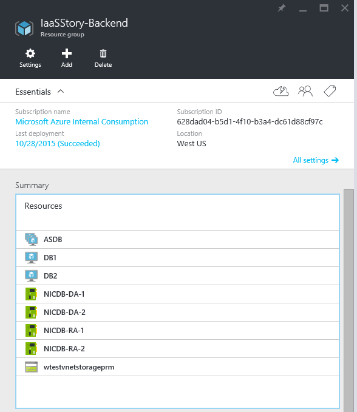

---
title: Create a VM with multiple NICs - Azure Resource Manager template | Microsoft Docs
description: Create a VM with multiple NICs using an Azure Resource Manager template.
services: virtual-network
documentationcenter: na
author: jimdial
manager: timlt
editor: ''
tags: azure-resource-manager

ms.assetid: 486f7dd5-cf2f-434c-85d1-b3e85c427def
ms.service: virtual-network
ms.devlang: na
ms.topic: article
ms.tgt_pltfrm: na
ms.workload: infrastructure-services
ms.date: 02/02/2016
ms.author: jdial
ms.custom: H1Hack27Feb2017

---
# Create a VM with multiple NICs using a template
[!INCLUDE [virtual-network-deploy-multinic-arm-selectors-include.md](../../includes/virtual-network-deploy-multinic-arm-selectors-include.md)]

[!INCLUDE [virtual-network-deploy-multinic-intro-include.md](../../includes/virtual-network-deploy-multinic-intro-include.md)]

> [!NOTE]
> Azure has two different deployment models for creating and working with resources:  [Resource Manager and classic](../resource-manager-deployment-model.md).  This article covers using the Resource Manager deployment model, which Microsoft recommends for most new deployments instead of the [classic deployment model](virtual-network-deploy-multinic-classic-ps.md).
> 

[!INCLUDE [virtual-network-deploy-multinic-scenario-include.md](../../includes/virtual-network-deploy-multinic-scenario-include.md)]

The following steps use a resource group named *IaaSStory* for the WEB servers and a resource group named *IaaSStory-BackEnd* for the DB servers.

## Prerequisites
Before you can create the DB servers, you need to create the *IaaSStory* resource group with all the necessary resources for this scenario. To create these resources, complete the following steps:

1. Navigate to [the template page](https://github.com/Azure/azure-quickstart-templates/tree/master/IaaS-Story/11-MultiNIC).
2. In the template page, to the right of **Parent resource group**, click **Deploy to Azure**.
3. If needed, change the parameter values, then follow the steps in the Azure preview portal to deploy the resource group.

> [!IMPORTANT]
> Make sure your storage account names are unique. You cannot have duplicate storage account names in Azure.
> 

## Understand the deployment template
Before you deploy the template provided with this documentation, make sure you understand what it does. The following steps provide a good overview of the template:

1. Navigate to [the template page](https://github.com/Azure/azure-quickstart-templates/tree/master/IaaS-Story/11-MultiNIC).
2. Click **azuredeploy.json** to open the template file.
3. Notice the *osType* parameter listed below. This parameter is used to select what VM image to use for the database server, along with multiple operating system related settings.

	```json
	"osType": {
	  "type": "string",
	  "defaultValue": "Windows",
	  "allowedValues": [
		"Windows",
		"Ubuntu"
	  ],
	  "metadata": {
	  "description": "Type of OS to use for VMs: Windows or Ubuntu."
	  }
	},
	```

4. Scroll down to the list of variables, and check the definition for the **dbVMSetting** variables, listed below. It receives one of the array elements contained in the **dbVMSettings** variable. If you are familiar with software development terminology, you can view the **dbVMSettings** variable as a hash table, or a dictionary.

	```json
	"dbVMSetting": "[variables('dbVMSettings')[parameters('osType')]]"
	```

5. Suppose you decide to deploy Windows VMs running SQL in the back-end. Then the value for **osType** would be *Windows*, and the **dbVMSetting** variable would contain the element listed below, which represents the first value in the **dbVMSettings** variable.

	```json
	"Windows": {
	  "vmSize": "Standard_DS3",
	  "publisher": "MicrosoftSQLServer",
	  "offer": "SQL2014SP1-WS2012R2",
	  "sku": "Standard",
	  "version": "latest",
	  "vmName": "DB",
	  "osdisk": "osdiskdb",
	  "datadisk": "datadiskdb",
	  "nicName": "NICDB",
	  "ipAddress": "192.168.2.",
	  "extensionDeployment": "",
	  "avsetName": "ASDB",
	  "remotePort": 3389,
	  "dbPort": 1433
	},
	```

6. Notice the **vmSize** contains the value *Standard_DS3*. Only certain VM sizes allow for the use of multiple NICs. You can verify which VM sizes support multiple NICs by reading the [Windows VM sizes](../virtual-machines/windows/sizes.md?toc=%2fazure%2fvirtual-machines%2fwindows%2ftoc.json) and [Linux VM sizes](../virtual-machines/linux/sizes.md?toc=%2fazure%2fvirtual-machines%2flinux%2ftoc.json) articles.

7. Scroll down to **resources** and notice the first element. It describes a storage account. This storage account will be used to maintain the data disks used by each database VM. In this scenario, each database VM has an OS disk stored in regular storage, and two data disks stored in SSD (premium) storage.

	```json
	{
	  "apiVersion": "2015-05-01-preview",
	  "type": "Microsoft.Storage/storageAccounts",
	  "name": "[parameters('prmStorageName')]",
	  "location": "[variables('location')]",
	  "tags": {
		"displayName": "Storage Account - Premium"
	  },
	  "properties": {
	  "accountType": "[parameters('prmStorageType')]"
	  }
	},
	```

8. Scroll down to the next resource, as listed below. This resource represents the NIC used for database access in each database VM. Notice the use of the **copy** function in this resource. The template allows you to deploy as many VMs as you want, based on the **dbCount** parameter. Therefore you need to create the same amount of NICs for database access, one for each VM.

	```json
	{
	"apiVersion": "2015-06-15",
	"type": "Microsoft.Network/networkInterfaces",
	"name": "[concat(variables('dbVMSetting').nicName,'-DA-', copyindex(1))]",
	"location": "[variables('location')]",
	"tags": {
	  "displayName": "NetworkInterfaces - DB DA"
	},
	"copy": {
	  "name": "dbniccount",
	  "count": "[parameters('dbCount')]"
	},
	"properties": {
	  "ipConfigurations": [
		{
		  "name": "ipconfig1",
		  "properties": {
			"privateIPAllocationMethod": "Static",
			"privateIPAddress": "[concat(variables('dbVMSetting').ipAddress,copyindex(4))]",
			"subnet": {
			  "id": "[variables('backEndSubnetRef')]"
			}
		  }
		 }
	   ] 
	 }
	},
	```

9. Scroll down to the next resource, as listed below. This resource represents the NIC used for management in each database VM. Once again, you need one of these NICs for each database VM. Notice the **networkSecurityGroup** element, linking an NSG that allows access to RDP/SSH to this NIC only.

	```json
	{
	  "apiVersion": "2015-06-15",
	  "type": "Microsoft.Network/networkInterfaces",
	  "name": "[concat(variables('dbVMSetting').nicName, '-RA-',copyindex(1))]",
	  "location": "[variables('location')]",
	  "tags": {
	    "displayName": "NetworkInterfaces - DB RA"
	},
	"copy": {
	  "name": "dbniccount",
	  "count": "[parameters('dbCount')]"
	},
	"properties": {
	  "ipConfigurations": [
	    {
		  "name": "ipconfig1",
		  "properties": {
			"networkSecurityGroup": {
			 "id": "[resourceId('Microsoft.Network/networkSecurityGroups', parameters('remoteAccessNSGName'))]"
			 },
			 "privateIPAllocationMethod": "Static",
			 "privateIPAddress": "[concat(variables('dbVMSetting').ipAddress,copyindex(54))]",
			 "subnet": {
			  "id": "[variables('backEndSubnetRef')]"
			 }
		   }
		  }
		]
	  }
	},
```

10. Scroll down to the next resource, as listed below. This resource represents an availability set to be shared by all database VMs. That way, you guarantee that there will always be one VM in the set running during maintenance.

	```json
	{
	  "apiVersion": "2015-06-15",
	  "type": "Microsoft.Compute/availabilitySets",
	  "name": "[variables('dbVMSetting').avsetName]",
	  "location": "[variables('location')]",
	  "tags": {
	    "displayName": "AvailabilitySet - DB"
	  }
	},
	```

11. Scroll down to the next resource. This resource represents the database VMs, as seen in the first few lines listed below. Notice the use of the **copy** function again, ensuring that multiple VMs are created based on the **dbCount** parameter. Also notice the **dependsOn** collection. It lists two NICs being necessary to be created before the VM is deployed, along with the availability set, and the storage account.

	```json
	"apiVersion": "2015-06-15",
	"type": "Microsoft.Compute/virtualMachines",
	"name": "[concat(variables('dbVMSetting').vmName,copyindex(1))]",
	"location": "[variables('location')]",
	"dependsOn": [
	  "[concat('Microsoft.Network/networkInterfaces/', variables('dbVMSetting').nicName,'-DA-', copyindex(1))]",
	  "[concat('Microsoft.Network/networkInterfaces/', variables('dbVMSetting').nicName,'-RA-', copyindex(1))]",
	  "[concat('Microsoft.Compute/availabilitySets/', variables('dbVMSetting').avsetName)]",
	  "[concat('Microsoft.Storage/storageAccounts/', parameters('prmStorageName'))]"
	],
	"tags": {
	  "displayName": "VMs - DB"
	},
	"copy": {
	  "name": "dbvmcount",
	  "count": "[parameters('dbCount')]"
	},
	```

12. Scroll down in the VM resource to the **networkProfile** element, as listed below. Notice that there are two NICs being reference for each VM. When you create multiple NICs for a VM, you must set the **primary** property of one of the NICs to *true*, and the rest to *false*.

	```json
	"networkProfile": {
	  "networkInterfaces": [
		{
		  "id": "[resourceId('Microsoft.Network/networkInterfaces', concat(variables('dbVMSetting').nicName,'-DA-',copyindex(1)))]",
		  "properties": { "primary": true }
		},
		{
		  "id": "[resourceId('Microsoft.Network/networkInterfaces', concat(variables('dbVMSetting').nicName,'-RA-',copyindex(1)))]",
		  "properties": { "primary": false }
		}
	  ]
	}
	```

## Deploy the ARM template by using click to deploy

> [!IMPORTANT]
> Make sure you follow the [pre-requisites](#Pre-requisites) steps before following the instructions below.
> 

The sample template available in the public repository uses a parameter file containing the default values used to generate the scenario described above. To deploy this template using click to deploy, follow [this link](https://github.com/Azure/azure-quickstart-templates/tree/master/IaaS-Story/11-MultiNIC), to the right of **Backend resource group (see documentation)** click **Deploy to Azure**, replace the default parameter values if necessary, and follow the instructions in the portal.

The figure below shows the contents of the new resource group, after deployment.



## Deploy the template by using PowerShell
To deploy the template you downloaded by using PowerShell, install and configure PowerShell by completing the steps in the [Install and configure PowerShell](/powershell/azure/overview) article and then complete the following steps:

Run the **`New-AzureRmResourceGroup`** cmdlet to create a resource group using the template.

```powershell
New-AzureRmResourceGroup -Name IaaSStory-Backend -Location uswest `
TemplateFile 'https://raw.githubusercontent.com/Azure/azure-quickstart-templates/master/IaaS-Story/11-MultiNIC/azuredeploy.json' `
-TemplateParameterFile 'https://raw.githubusercontent.com/Azure/azure-quickstart-templates/master/IaaS-Story/11-MultiNIC/azuredeploy.parameters.json'
```

Expected output:

	ResourceGroupName : IaaSStory-Backend
	Location          : westus
	ProvisioningState : Succeeded
	Tags              :
	Permissions       :
						Actions  NotActions
						=======  ==========
						*
		Resources         :
						Name                 Type                                 Location
						===================  ===================================  ========
						ASDB                 Microsoft.Compute/availabilitySets   westus  
						DB1                  Microsoft.Compute/virtualMachines    westus  
						DB2                  Microsoft.Compute/virtualMachines    westus  
						NICDB-DA-1           Microsoft.Network/networkInterfaces  westus  
						NICDB-DA-2           Microsoft.Network/networkInterfaces  westus  
						NICDB-RA-1           Microsoft.Network/networkInterfaces  westus  
						NICDB-RA-2           Microsoft.Network/networkInterfaces  westus  
						wtestvnetstorageprm  Microsoft.Storage/storageAccounts    westus  
	ResourceId        : /subscriptions/xxxxxxxx-xxxx-xxxx-xxxx-xxxxxxxxxxxx/resourceGroups/IaaSStory-Backend

## Deploy the template by using the Azure CLI
To deploy the template by using the Azure CLI, follow the steps below.

1. If you have never used Azure CLI, see [Install and Configure the Azure CLI](../cli-install-nodejs.md) and follow the instructions up to the point where you select your Azure account and subscription.
2. Run the **`azure config mode`** command to switch to Resource Manager mode, as shown below.

	```azurecli
	azure config mode arm
	```

	The expected output follows:

		info:    New mode is arm

3. Open the [parameter file](https://raw.githubusercontent.com/Azure/azure-quickstart-templates/master/IaaS-Story/11-MultiNIC/azuredeploy.parameters.json), select its contents, and save it to a file in your computer. For this example, we saved the parameters file to *parameters.json*.
4. Run the **`azure group deployment create`** cmdlet to deploy the new VNet by using the template and parameter files you downloaded and modified above. The list shown after the output explains the parameters used.

	```azurecli
	azure group create -n IaaSStory-Backend -l westus --template-uri https://raw.githubusercontent.com/Azure/azure-quickstart-templates/master/IaaS-Story/11-MultiNIC/azuredeploy.json -e parameters.json
	```

    Expected output:
   
        info:    Executing command group create
        + Getting resource group IaaSStory-Backend
        + Creating resource group IaaSStory-Backend
        info:    Created resource group IaaSStory-Backend
        + Initializing template configurations and parameters
        + Creating a deployment
        info:    Created template deployment "azuredeploy"
        data:    Id:                  /subscriptions/xxxxxxxx-xxxx-xxxx-xxxx-xxxxxxxxxxxx/resourceGroups/IaaSStory-Backend
        data:    Name:                IaaSStory-Backend
        data:    Location:            westus
        data:    Provisioning State:  Succeeded
        data:    Tags: null
        data:
        info:    group create command OK

