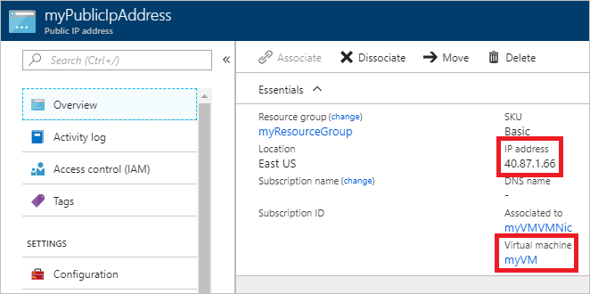

# Create a virtual machine with a static public IP address using the Azure portal

You can create a virtual machine with a static public IP address. A public IP address enables you to communicate to a virtual machine from the internet. Assign a static public IP address, rather than a dynamic address, to ensure that the address never changes. Learn more about [static public IP addresses](virtual-network-ip-addresses-overview-arm.md#allocation-method). To change a public IP address assigned to an existing virtual machine from dynamic to static, or to work with private IP addresses, see [Add, change, or remove IP addresses](virtual-network-network-interface-addresses.md). Public IP addresses have a [nominal charge](https://azure.microsoft.com/pricing/details/ip-addresses), and there is a [limit](../azure-subscription-service-limits.md?toc=%2fazure%2fvirtual-network%2ftoc.json#azure-resource-manager-virtual-networking-limits) to the number of public IP addresses that you can use per subscription.

## Sign in to Azure

Sign in to the Azure portal at https://portal.azure.com.

## Create a virtual machine

1. Select **+ Create a resource** found on the upper, left corner of the Azure portal.
2. Select **Compute**, and then select **Windows Server 2016 VM**, or another operating system of your choosing.
3. Enter, or select, the following information, accept the defaults for the remaining settings, and then select **OK**:

    |Setting|Value|
    |---|---|
    |Name|myVM|
    |User name| Enter a user name of your choosing.|
    |Password| Enter a password of your choosing. The password must be at least 12 characters long and meet the [defined complexity requirements](../virtual-machines/windows/faq.md?toc=%2fazure%2fvirtual-network%2ftoc.json#what-are-the-password-requirements-when-creating-a-vm).|
    |Subscription| Select your subscription.|
    |Resource group| Select **Use existing** and select **myResourceGroup**.|
    |Location| Select **East US**|

4. Select a size for the VM and then select **Select**.
5. Under **Settings**, select **Public IP address**.
6. Enter *myPublicIpAddress*, select **Static**, and then select **OK**, as shown in the following picture:

   

   If the public IP address must be a standard SKU, select **Standard** under **SKU**. Learn more about [Public IP address SKUs](virtual-network-ip-addresses-overview-arm.md#sku). If the virtual machine will be added to the back-end pool of a public Azure Load Balancer, the SKU of the virtual machine's public IP address must match the SKU of the load balancer's public IP address. For details, see [Azure Load Balancer](../load-balancer/load-balancer-overview.md?toc=%2fazure%2fvirtual-network%2ftoc.json#skus).

6. Select a port, or no ports under **Select public inbound ports**. Portal 3389 is selected, to enable remote access to the Windows Server virtual machine from the internet. Opening port 3389 from the internet is not recommended for production workloads.

   

7. Accept the remaining default settings and select **OK**.
8. On the **Summary** page, select **Create**. The virtual machine takes a few minutes to deploy.
9. Once the virtual machine is deployed, enter *myPublicIpAddress* in the search box at the top of the portal. When **myPublicIpAddress** appears in the search results, select it.
10. You can view the public IP address that is assigned, and that the address is assigned to the **myVM** virtual machine, as shown in the following picture:

    

    Azure assigned a public IP address from addresses used in the region you created the virtual machine in. You can download the list of ranges (prefixes) for the Azure [Public](https://www.microsoft.com/download/details.aspx?id=56519), [US government](https://www.microsoft.com/download/details.aspx?id=57063), [China](https://www.microsoft.com/download/details.aspx?id=57062), and [Germany](https://www.microsoft.com/download/details.aspx?id=57064) clouds.

11. Select **Configuration** to confirm that the assignment is **Static**.

    

> [!WARNING]
> Do not modify the IP address settings within the virtual machine's operating system. The operating system is unaware of Azure public IP addresses. Though you can add private IP address settings to the operating system, we recommend not doing so unless necessary, and not until after reading [Add a private IP address to an operating system](virtual-network-network-interface-addresses.md#private).

## Clean up resources

When no longer needed, delete the resource group and all of the resources it contains:

1. Enter *myResourceGroup* in the **Search** box at the top of the portal. When you see **myResourceGroup** in the search results, select it.
2. Select **Delete resource group**.
3. Enter *myResourceGroup* for **TYPE THE RESOURCE GROUP NAME:** and select **Delete**.

## Next steps

- Learn more about [public IP addresses](virtual-network-ip-addresses-overview-arm.md#public-ip-addresses) in Azure
- Learn more about all [public IP address settings](virtual-network-public-ip-address.md#create-a-public-ip-address)
- Learn more about [private IP addresses](virtual-network-ip-addresses-overview-arm.md#private-ip-addresses) and assigning a [static private IP address](virtual-network-network-interface-addresses.md#add-ip-addresses) to an Azure virtual machine
- Learn more about creating [Linux](../virtual-machines/windows/tutorial-manage-vm.md?toc=%2fazure%2fvirtual-network%2ftoc.json) and [Windows](../virtual-machines/windows/tutorial-manage-vm.md?toc=%2fazure%2fvirtual-network%2ftoc.json) virtual machines