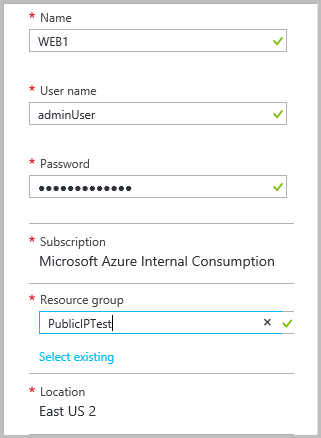
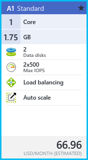
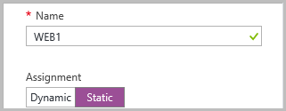
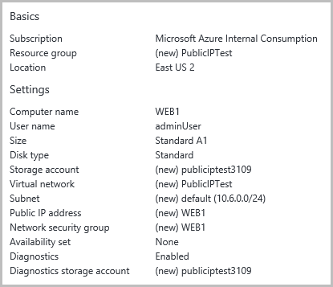
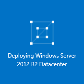
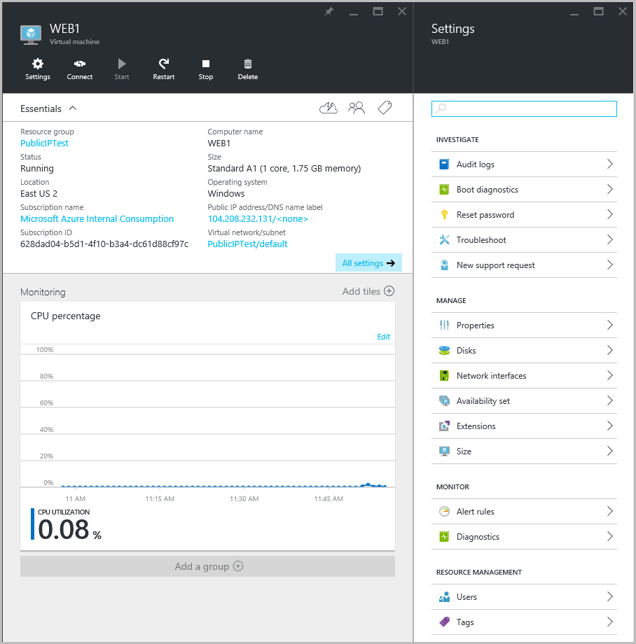

# Create a VM with a static public IP address using the Azure portal

> [!div class="op_single_selector"]
> * [Azure portal](virtual-network-deploy-static-pip-arm-portal.md)
> * [PowerShell](virtual-network-deploy-static-pip-arm-ps.md)
> * [Azure CLI](virtual-network-deploy-static-pip-arm-cli.md)
> * [Template](virtual-network-deploy-static-pip-arm-template.md)
> * [PowerShell (Classic)](virtual-networks-reserved-public-ip.md)

[!INCLUDE [virtual-network-deploy-static-pip-intro-include.md](../../includes/virtual-network-deploy-static-pip-intro-include.md)]

> [!NOTE]
> Azure has two different deployment models for creating and working with resources:  [Resource Manager and classic](../resource-manager-deployment-model.md). This article covers using the Resource Manager deployment model, which Microsoft recommends for most new deployments instead of the classic deployment model.

[!INCLUDE [virtual-network-deploy-static-pip-scenario-include.md](../../includes/virtual-network-deploy-static-pip-scenario-include.md)]

## Create a VM with a static public IP

To create a VM with a static public IP address in the Azure portal, complete the following steps:

1. From a browser, navigate to the [Azure portal](https://portal.azure.com) and, if necessary, sign in with your Azure account.
2. On the top left hand corner of the portal, click **New**>>**Compute**>**Windows Server 2012 R2 Datacenter**.
3. In the **Select a deployment model** list, select **Resource Manager** and click **Create**.
4. In the **Basics** blade, enter the VM information as shown below, and then click **OK**.
   
    
5. In the **Choose a size** blade, click **A1 Standard** as shown below, and then click **Select**.
   
    
6. In the **Settings** blade, click **Public IP address**, then in the **Create public IP address** blade, under **Assignment**, click **Static** as shown below. And then click **OK**.
   
    
7. In the **Settings** blade, click **OK**.
8. Review the **Summary** blade, as shown below, and then click **OK**.
   
    
9. Notice the new tile in your dashboard.
   
    
10. Once the VM is created, the **Settings** blade will be displayed as shown below
    
    

