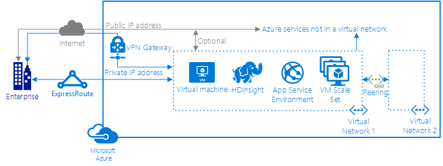

# Deploy Azure resources into virtual networks

You can communicate with most Azure resources over the Internet through public IP addresses. When you deploy resources in a [virtual network](virtual-networks-overview.md), you can communicate with the resources privately, through private IP addresses. Consider the following picture:

Deploying resources within a virtual network provides the following capabilities:

- Resources within the virtual network can communicate with each other privately, through private IP addresses.
- Resources within the virtual network can communicate over the Azure infrastructure network to the public IP addresses of Azure services not in a virtual network. Communication between any Azure resources does not traverse the Internet.
- If resources within a virtual network are assigned a public IP address, the resource can be accessed from the Internet.
- On-premises resources can access resources in a virtual network using private IP addresses over a secure [IPSec tunnel (VPN Gateway)](../vpn-gateway/vpn-gateway-about-vpngateways.md?toc=%2fazure%2fvirtual-network%2ftoc.json#s2smulti) or [ExpressRoute](../expressroute/expressroute-introduction.md?toc=%2fazure%2fvirtual-network%2ftoc.json).
- You can assign [network security groups](virtual-networks-nsg.md) to subnets or individual resources within virtual networks that control the type of network traffic that can flow in and out of resources.
- You can control how outbound traffic is [routed](virtual-networks-udr-overview.md) from each subnet within a virtual network.
- Virtual networks can be [peered](virtual-network-peering-overview.md) to enable resources in the virtual networks to communicate with each other, using private IP addresses.

## Resources that can be deployed into a virtual network

The resources in the list that follows can be deployed to a virtual network. Because Microsoft manages aspects of many of the services listed, each service has specific requirements for routing and the types of traffic that must be allowed into and out of subnets. Familiarize yourself with the requirements for each resource by clicking any resource in the following list:
 
- Virtual machines: [Linux](../virtual-machines/linux/infrastructure-networking-guidelines.md?toc=%2fazure%2fvirtual-network%2ftoc.json) or [Windows](../virtual-machines/windows/infrastructure-networking-guidelines.md?toc=%2fazure%2fvirtual-network%2ftoc.json)
- [Service fabric](../service-fabric/service-fabric-patterns-networking.md?toc=%2fazure%2fvirtual-network%2ftoc.json#existingvnet)
- [Virtual machine scale sets](../virtual-machine-scale-sets/virtual-machine-scale-sets-mvss-existing-vnet.md?toc=%2fazure%2fvirtual-network%2ftoc.json)
- [HDInsight](../hdinsight/hdinsight-extend-hadoop-virtual-network.md?toc=%2fazure%2fvirtual-network%2ftoc.json)
- [App Service Environment](../app-service-web/web-sites-integrate-with-vnet.md?toc=%2fazure%2fvirtual-network%2ftoc.json)
- [RemoteApp](../remoteapp/remoteapp-planvnet.md?toc=%2fazure%2fvirtual-network%2ftoc.json)
- [RedisCache](../redis-cache/cache-how-to-premium-vnet.md?toc=%2fazure%2fvirtual-network%2ftoc.json)
- [API Management](../api-management/api-management-using-with-vnet.md?toc=%2fazure%2fvirtual-network%2ftoc.json)
- [VPN Gateway](../vpn-gateway/vpn-gateway-about-vpngateways.md?toc=%2fazure%2fvirtual-network%2ftoc.json)
- [Application Gateway (internal)](../application-gateway/application-gateway-ilb-arm.md?toc=%2fazure%2fvirtual-network%2ftoc.json)
- [Azure Container Service Engine](../container-service/container-service-intro.md?toc=%2fazure%2fvirtual-network%2ftoc.json): The Azure Container Service creates a default virtual network. You can create a custom virtual network to use with the [Azure Container Service Engine](https://github.com/Azure/acs-engine/tree/master/examples/vnet).
- [Azure Active Directory Domain Services](../active-directory-domain-services/active-directory-ds-getting-started-vnet.md?toc=%2fazure%2fvirtual-network%2ftoc.json): Virtual network (classic) only
- [Azure Batch](../batch/batch-api-basics.md?toc=%2fazure%2fvirtual-network%2ftoc.json#virtual-network-vnet-and-firewall-configuration): Virtual network (classic) only
- [Cloud services](https://msdn.microsoft.com/library/azure/jj156091): Virtual network (classic) only

You can deploy an [internal Azure Load balancer](../load-balancer/load-balancer-internal-overview.md?toc=%2fazure%2fvirtual-network%2ftoc.json) to load balance many of the resources in the previous list. In some cases, the service automatically creates and deploys a load balancer when you create a resource.

