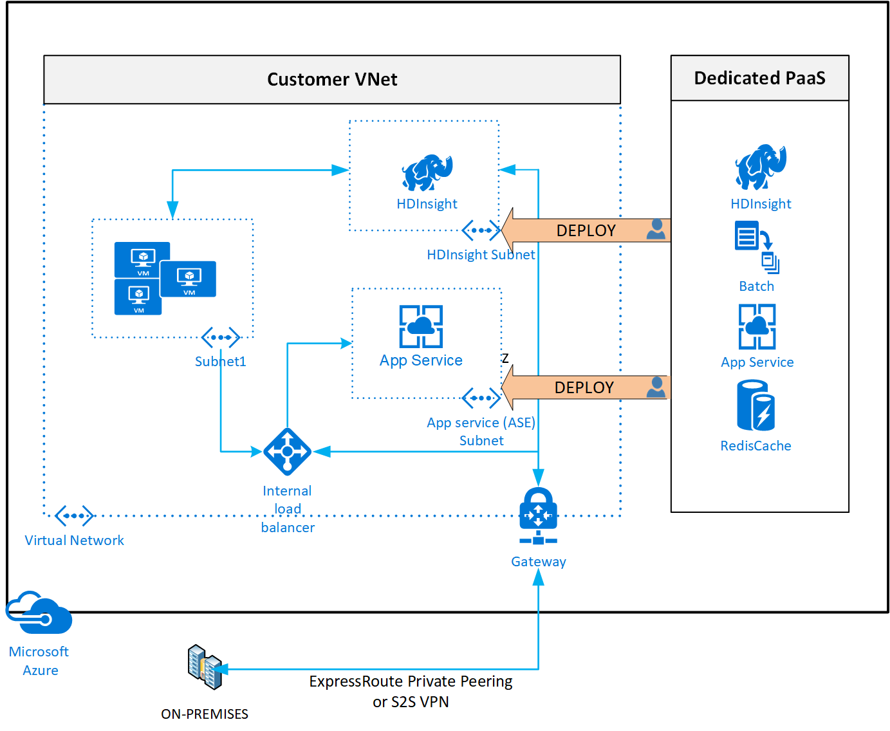

# Deploy dedicated Azure services into virtual networks

When you deploy dedicated Azure services in a [virtual network](virtual-networks-overview.md), you can communicate with the service resources privately, through private IP addresses.

Deploying services within a virtual network provides the following capabilities:

- Resources within the virtual network can communicate with each other privately, through private IP addresses. Example, directly transferring data between HDInsight and SQL Server running on a virtual machine, in the virtual network.
- On-premises resources can access resources in a virtual network using private IP addresses over a [Site-to-Site VPN (VPN Gateway)](../vpn-gateway/design.md?toc=%2fazure%2fvirtual-network%2ftoc.json#s2smulti) or [ExpressRoute](../expressroute/expressroute-introduction.md?toc=%2fazure%2fvirtual-network%2ftoc.json).
- Virtual networks can be [peered](virtual-network-peering-overview.md) to enable resources in the virtual networks to communicate with each other, using private IP addresses.
- Service instances in a virtual network are typically fully managed by the Azure service. This includes monitoring the health of the resources  and scaling with load.
- Service instances are deployed into a subnet in a virtual network. Inbound and outbound network access for the subnet must be opened through [network security groups](security-overview.md#network-security-groups), per guidance provided by the service.
- Certain services also impose restrictions on the subnet they are deployed in, limiting the application of policies, routes or combining VMs and service resources within the same subnet. Check with each service on the specific restrictions as they may change over time. Examples of such services are Azure NetApp Files, Dedicated HSM, Azure Container Instances, App Service. 
- Optionally, services might require a [delegated subnet](virtual-network-manage-subnet.md#add-a-subnet) as an explicit identifier that a subnet can host a particular service. By delegating, services get explicit permissions to create service-specific resources in the delegated subnet.
- See an example of a REST API response on a [virtual network with a delegated subnet](https://docs.microsoft.com/rest/api/virtualnetwork/virtualnetworks/get#get-virtual-network-with-a-delegated-subnet). A comprehensive list of services that are using the delegated subnet model can be obtained via the [Available Delegations](https://docs.microsoft.com/rest/api/virtualnetwork/availabledelegations/list) API.

### Services that can be deployed into a virtual network

|Category|Service| Dedicated1 Subnet
|-|-|-|
| Compute | Virtual machines: [Linux](../virtual-machines/linux/infrastructure-networking-guidelines.md?toc=%2fazure%2fvirtual-network%2ftoc.json) or [Windows](../virtual-machines/windows/infrastructure-networking-guidelines.md?toc=%2fazure%2fvirtual-network%2ftoc.json)  [Virtual machine scale sets](../virtual-machine-scale-sets/virtual-machine-scale-sets-mvss-existing-vnet.md?toc=%2fazure%2fvirtual-network%2ftoc.json) [Cloud Service](https://msdn.microsoft.com/library/azure/jj156091): Virtual network (classic) only  [Azure Batch](../batch/nodes-and-pools.md?toc=%2fazure%2fvirtual-network%2ftoc.json#virtual-network-vnet-and-firewall-configuration)| No   No   No   No2
| Network | [Application Gateway - WAF](../application-gateway/application-gateway-ilb-arm.md?toc=%2fazure%2fvirtual-network%2ftoc.json) [VPN Gateway](../vpn-gateway/vpn-gateway-about-vpngateways.md?toc=%2fazure%2fvirtual-network%2ftoc.json) [Azure Firewall](../firewall/overview.md?toc=%2fazure%2fvirtual-network%2ftoc.json)  [Network Virtual Appliances](/windows-server/networking/sdn/manage/use-network-virtual-appliances-on-a-vn) | Yes   Yes   Yes   No
|Data|[RedisCache](../azure-cache-for-redis/cache-how-to-premium-vnet.md?toc=%2fazure%2fvirtual-network%2ftoc.json) [Azure SQL Managed Instance](../azure-sql/managed-instance/connectivity-architecture-overview.md?toc=%2fazure%2fvirtual-network%2ftoc.json)| Yes   Yes   
|Analytics | [Azure HDInsight](../hdinsight/hdinsight-extend-hadoop-virtual-network.md?toc=%2fazure%2fvirtual-network%2ftoc.json) [Azure Databricks](../azure-databricks/what-is-azure-databricks.md?toc=%2fazure%2fvirtual-network%2ftoc.json) |No2   No2   
| Identity | [Azure Active Directory Domain Services](../active-directory-domain-services/active-directory-ds-getting-started-vnet.md?toc=%2fazure%2fvirtual-network%2ftoc.json) |No  
| Containers | [Azure Kubernetes Service (AKS)](../aks/concepts-network.md?toc=%2fazure%2fvirtual-network%2ftoc.json) [Azure Container Instance (ACI)](https://www.aka.ms/acivnet) [Azure Container Service Engine](https://github.com/Azure/acs-engine) with Azure Virtual Network CNI [plug-in](https://github.com/Azure/acs-engine/tree/master/examples/vnet) [Azure Functions](../azure-functions/functions-networking-options.md#virtual-network-integration) |No2  Yes    No   Yes
| Web | [API Management](../api-management/api-management-using-with-vnet.md?toc=%2fazure%2fvirtual-network%2ftoc.json) [Web Apps](../app-service/web-sites-integrate-with-vnet.md?toc=%2fazure%2fvirtual-network%2ftoc.json) [App Service Environment](../app-service/web-sites-integrate-with-vnet.md?toc=%2fazure%2fvirtual-network%2ftoc.json) [Azure Logic Apps](../logic-apps/connect-virtual-network-vnet-isolated-environment-overview.md?toc=%2fazure%2fvirtual-network%2ftoc.json) |Yes   Yes   Yes   Yes
| Hosted | [Azure Dedicated HSM](../dedicated-hsm/index.yml?toc=%2fazure%2fvirtual-network%2ftoc.json) [Azure NetApp Files](../azure-netapp-files/azure-netapp-files-introduction.md?toc=%2fazure%2fvirtual-network%2ftoc.json) |Yes   Yes  
| | |

1 'Dedicated' implies that only service specific resources can be deployed in this subnet and cannot be combined with customer VM/VMSSs   
2 It is recommended as a best practice to have these services in a dedicated subnet, but not a mandatory requirement imposed by the service.
