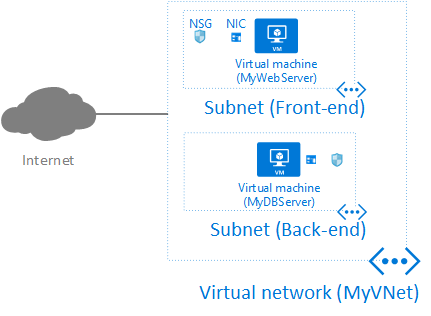
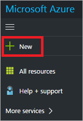
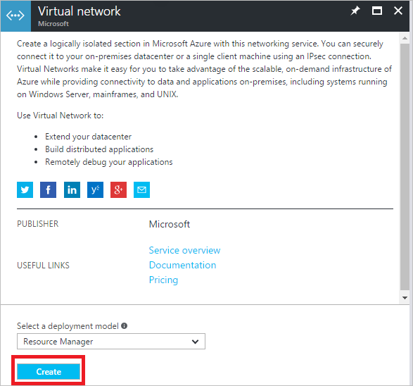

# Create a virtual network

An Azure virtual network (VNet) is a representation of your own network in the cloud. You can control your Azure network settings and define DHCP address blocks, DNS settings, security policies, and routing. You can segment your VNet into subnets and connect Azure Virtual Machines (VM) and other Azure resources to the VNet, similar to how you connect on-premises resources to your on-premises networks, as shown in the following picture:

Read the [Virtual Network overview](virtual-networks-overview.md) article if you’re not familiar with VNet concepts. In this exercise you will deploy the configuration shown in the previous picture by completing the following tasks:

1. [Create a VNet with two subnets](#create-vnet)
2. [Create two VMs, each with one network interface (NIC)](#create-vms), and associate a network security group (NSG) to each NIC
3. [Communicate to and from the VMs](#communicate-with-vms)
4. [Delete all resources](#delete-resources). You will incur charges for some of the resources created in this exercise while they're provisioned. To minimize the charges, after you complete the exercise, be sure to complete the steps in this section to delete the resources you create.

Upon completion of this exercise, you will have a basic understanding of how you can use a VNet. Next steps are provided so you can learn more about how to use VNets at a deeper level.

## Create a virtual network with two subnets

Complete the following steps to create a virtual network with two subnets. Different subnets are typically used to control the flow of traffic between subnets.

1. Login to the [Azure portal](<https://portal.azure.com>). You can sign-up for a [free one-month trial](https://azure.microsoft.com/en-us/free/) if you don’t already have an account.
2. In the **Favorites** pane, click **New**, as shown in the following picture:
	
3. In the **New** blade, click **Networking**. In the **Networking** blade, click **Virtual network**, as shown in the following picture:
	
4.  In the **Virtual network** blade, leave *Resource Manager* selected as the deployment model, and click **Create**, as shown in the following picture:
	
5.  In the **Create virtual network blade** that appears, enter the following values, then click **Create**:

	|**Setting**|**Value**|**Details**|
	|---|---|---|
	|**Name**|*MyVNet*|The name must be unique within the resource group.|
	|**Address space**|*10.0.0.0/16*|You can specify any address space you like in CIDR notation.|
	|**Subnet name**|*Front-end*|The subnet name must be unique within the virtual network.|
	|**Subnet address range**|*10.0.0.0/24*| The range you specify must exist within the address space you defined for the virtual network.|
	|**Subscription**|*[Your subscription]*|Select a subscription to create the VNet in. A VNet exists within a single subscription.|
	|**Resource group**|**Create new:** *MyRG*|Create a new resource group. The resource group name must be unique within the subscription you selected. Read the [Resource Manager](../azure-resource-manager/resource-group-overview.md#resource-groups) overview article to learn more about resource groups.|
	|**Location**|*West US*| Typically the location that is closest to your physical location is selected.|

	The VNet takes a few seconds to create. Once it’s created, you’ll see the Azure portal dashboard.

6. With the virtual network created, in the Azure portal **Favorites** pane, click **All resources**. Click the **MyVNet** virtual network in the **All resources** blade. If the subscription you selected already has several resources in it, you can enter *MyVNet* in the **Filter by name…** box to easily access the VNet.
7. The **MyVNet** blade opens and displays information about the VNet, as shown in the following picture:
	
8. As shown in the previous picture, click **Subnets** to display a list of the subnets within the VNet. The only subnet that exists is **Front-end**, the subnet you created in step 5.
9. In the MyVNet - Subnets blade, click **+ Subnet** to create a new subnet with the following information and click **OK** to create the subnet:

	|**Setting**|**Value**|**Details**|
	|---|---|---|
	|**Name**|*Back-end*|The name must be unique within the virtual network.|
	|**Address range**|*10.0.1.0/24*|The range you specify must exist within the address space you defined for the virtual network.|
	|**Network security group** and **Route table**|*None* (default)|Network security groups (NSG)s are covered later in this article. Read the [User-defined routes](virtual-networks-udr-overview.md) article to learn more about user-defined routes.|

10. After the new subnet is added to the VNet, you can close the **MyVNet – Subnets** blade, then close the **All resources** blade.

## Create virtual machines

With the VNet and subnets created, you can create the VMs. For this exercise, both VMs run the Windows Server operating system, though they can run any operating system supported by Azure.

### Create the web server VM

1. In the Azure portal favorites pane, click **New**, **Compute**, then **Windows Server 2016 Datacenter**.
2. In the **Windows Server 2016 Datacenter** blade, click **Create**.
3. In the **Basics** blade that appears, enter or select the following values and click **OK**:

	|**Setting**| **Value**|**Details**|
	|---|---|---|
	|**Name**|*MyWebServer*|This VM serves as a web server that the Internet communicates with.|
	|**VM disk type**|*SSD*|
	|**User name**|*Your choice*|
	|**Password and Confirm password**|*Your choice*|
	| **Subscription**|*<Your subscription>*|This must be the same subscription that you selected in step 5 of the [Create a virtual network with two subnets](#create-vnet) section of this article. The VNet you connect a VM to must exist in the same subscription as the VM.|
	|**Resource group**|**Use existing:** Select *MyRG*|Though we’re using the same resource group as we did for the VNet, the resources don’t have to exist in the same resource group.|
	|**Location**|*West US*|This must be the same location that you specified in step 5 of the [Create a virtual network with two subnets](#create-vnet) section of this article. VMs and the VNets they connect to must exist in the same location.|

4. In the **Choose a size** blade, click *DS1\_V2 Standard* and click **Select**. Read the [Windows VM sizes](../virtual-machines/virtual-machines-windows-sizes.md?toc=%2fazure%2fvirtual-network%2ftoc.json) article for a list of all Windows VM sizes supported by Azure.
5. In the **Settings** blade, enter or select the following values and click **OK**:

	|**Setting**|**Value**|**Details**|
	|---|---|---|
	|**Storage: Use managed disks**|*Yes*||
	|**Virtual network**| Select *MyVNet*|You can select any VNet that exists in the same location as the VM you’re creating. Read the [Virtual network](virtual-networks-overview.md) article to learn more about VNets and subnets.|
	|**Subnet**|Select *Front-end*|You can select any subnet that exists within the VNet.|
	|**Public IP address**|Accept the default|A public IP address enables you to connect to the VM from the Internet. Read the [IP addresses](virtual-network-ip-addresses-overview-arm.md#public-ip-addresses) article to learn more about public IP addresses.|
	|**Network security group (firewall)**|Accept the default|Click the **(new) MyWebServer-nsg** default NSG that the portal will create to view its settings. In the **Create network security group** blade that opens, notice that it has one inbound rule that allows TCP/3389 (RDP) traffic from any source IP address.|
	|**All other values**|Accept the defaults|Read the [About VMs](../virtual-machines/virtual-machines-windows-overview.md?toc=%2fazure%2fvirtual-network%2ftoc.json) article to learn more about the remaining settings.|

	Network security groups (NSG) enable you to create inbound/outbound rules for the type of network traffic that can flow to and from the VM. By default, all inbound traffic to the VM is denied. If you were creating this VM for production use, you might add additional inbound rules for TCP/80 (HTTP) and TCP/443 (HTTPS), since this is a web server. There is no rule for outbound traffic because by default, all outbound traffic is allowed. You can add/remove rules to control traffic per your policies. Read the [Network security groups](virtual-networks-nsg.md) article to learn more about NSGs. 

6.  In the **Summary** blade, review the settings and click **OK** to create the VM. You will see a status tile on the portal dashboard as the VM creates. It may take a few minutes to create. You don’t need to wait for it to complete however, you can continue to the next step while it creates.

### Create the database server VM

1.  In the Favorites pane, click **NewComputeWindows Server 2016 Datacenter**.
2.  In the **Windows Server 2016 Datacenter** blade, click **Create**.
3.  In the **Basics blade**, enter or select the following values and click **OK**:

	|**Setting**|**Value**|**Details**|
	|---|---|---|
	|**Name**|*MyDBServer*|This VM serves as a database server that the web server communicates with, but that the Internet cannot communicate with.|
	|**VM disk type**|*SSD*||
	|**User name**|Your choice||
	|**Password and Confirm password**|Your choice||
	|**Subscription**|<Your subscription>|This must be the same subscription that you selected in Step 5 of the [Create a virtual network with two subnets](#create-vnet) section of this article.|
	|**Resource group**|**Use existing:** Select *MyRG*|Though we’re using the same resource group as we did for the VNet, the resources don’t have to exist in the same resource group.|
	|**Location**|*West US*|This must be the same location that you specified in step 5 of the [Create a virtual network with two subnets](#create-vnet) section of this article.|

4.  In the **Choose a size** blade, click *DS1\_V2 Standard* and click **Select**.
5.  In the **Settings** blade, enter or select the following values and click **OK**:

	|**Setting**|**Value**|**Details**|
	|----|----|---|
	|**Storage: Use managed disks**|*Yes*||
	|**Virtual network**|Select *MyVNet*|You can select any VNet that exists in the same location as the VM you’re creating.|
	|**Subnet**|Select *Back-end* by clicking on the Subnet box, then selecting **Back-end** from the **Choose a subnet** blade|You can select any subnet that exists within the VNet.|
	|**Public IP address**|None – Click the default address, then click **None** from the **Choose public IP address** blade|Without a public IP address, you can only connect to the VM from another VM connected to the same VNet. You cannot connect to it directly from the Internet.|
	|**Network security group (firewall)**|Accept the default| Like the default NSG created for the MyWebServer VM, this NSG also has the same default inbound rule.|
	|**All other values**|Accept the defaults||

6.  In the **Summary** blade, review the settings and click **OK** to create the VM. You will see a status box on the portal dashboard as the VM creates. It may take a few minutes to create.

## Review resources

Though you created one VNet and two VMs, the Azure portal created several additional resources for you in the MyRG resource group. Review the contents of the MyRG resource group by completing the following steps:

1. In the **Favorites** pane, click **More services**.
2. In the **More services** pane, type *Resource groups* in the box that has the word *Filter* in it. Click on **Resource groups** when you see it in the filtered list.
3. In the **Resource groups** pane, click the *MyRG* resource group. If you have a lot of existing resource groups in your subscription you can type *MyRG* in the box that contains the text *Filter by name…* to quickly access the MyRG resource group.
4.  In the **MyRG** blade, you’ll see that the resource group contains twelve resources, as shown in the following picture:
	

Read the [Virtual machine](../virtual-machines/virtual-machines-windows-overview.md?toc=%2fazure%2fvirtual-network%2ftoc.json), [Disk](../storage/storage-about-disks-and-vhds-windows?toc=%2fazure%2fvirtual-network%2ftoc.json), and [Storage account](../storage/storage-introduction.md?toc=%2fazure%2fvirtual-network%2ftoc.json) overview articles to learn more about those resources. You can see the two default NSGs the portal created for you. You can also see that the portal created two network interface (NIC) resources. A NIC enables a VM to communicate with other resources over the VNet. Read the [NIC](virtual-network-network-interface-overview.md) article to learn more about NICs. The portal also created one Public IP address resource. Public IP addresses are one setting for a public IP address resource. Read the [IP addresses(virtual-network-ip-addresses-overview-arm.md#public-ip-addresses) article to learn more about public IP addresses.

##VM communication

With your VNet and two VMs created, you can now communicate with the VMs by completing the steps in the following sections:

### Connect to the MyWebServer VM from the Internet

Complete the following steps to connect to the MyWebServer VM from the Internet:

1. In the portal, open the MyRG resource group by completing the steps in the [Review resources](#review) section of this article.
2. In the **MyRG** blade, click the **MyWebServer** VM.
3. In the **MyWebServer** blade, click **Connect**, as shown in the following picture:
	
4. Allow your browser to download the *MyWebServer.rdp* file, then open it.
5. If you receive a dialog box informing you that the publisher of the remote connection cannot be verified, click **Connect**.
6. When entering your credentials, ensure you login with the user name and password you specified in step 3 of the [Create the web server VM](#create-web-vm) section of this article. If the **Windows Security** box that appears doesn’t list the correct credentials, you may need to click **More choices**, then **Use a different account** so you can specify the correct user name and password). Click **OK** to connect to the VM.
7. If you receive a **Remote Desktop Connection** box informing you that the identity of the remote computer cannot be verified, click **Yes**.
8. You are now connected to the MyWebServer VM from the Internet. Leave the remote desktop connection open to complete the steps in the next section.

The remote connection is to the public IP address assigned to the public IP address resource the portal created in step 5 of the [Create a virtual network with two subnets](#create-vnet) section of this article. The connection is allowed because the default rule created in the **MyWebServer-nsg** NSG permitted TCP/3389 (RDP) inbound to the VM from any source IP address. If you try to connect to the VM over any other port, the connection will fail, unless you add additional inbound rules to the NSG allowing the additional ports.

>[!NOTE]
>If you add additional inbound rules to the NSG, you’ll also need to ensure the ports are open on the Windows firewall, or the connection will fail.
>

### Connect to the Internet from the MyWebServer VM

Connect outbound to the Internet from the MyWebServer VM by completing the following steps:

1. If you don’t already have a remote connection to the MyWebServerVM open, make a remote connection to the VM by completing the steps in the [Connect to the MyWebServer VM from the Internet](connect-from-internet) section of this article.
2. From the Windows desktop, open Internet Explorer. In the **Set up Internet Explorer 11** dialog box, click **Don’t use recommended settings**, then click **OK**. It’s recommended to accept the recommended settings for a production server.
3. In the Internet Explorer address bar, enter [bing.com](http:www.bing.com). If you receive an Internet Explorer dialog box, click **Add**, then **Add** in the **Trusted sites** dialog box and click **Close**. Repeat this process for any other Internet Explorer dialog boxes.
4. At the Bing search page, enter *whatsmyipaddress*, then click the magnifying glass button. Bing returns the public IP address assigned to the public IP address resource created by the portal when you created the VM. If you examine the settings for the **MyWebServer-ip** resource, you see this as the assigned IP address, as shown in the following picture (though the IP address your VM is assigned is different):
	
5.  Leave the remote desktop connection open to complete the steps in the next section.

You are able to connect to the Internet from the VM because all outbound connectivity from the VM is allowed by default. You can limit outbound connectivity by adding addition rules to the NSG applied to the NIC, to the subnet the NIC is connected to, or both.

If the VM is put in the stopped (deallocated) state using the portal, the public IP address can change. If you require that the public IP address always be the same, you can use the static allocation method for the IP address, rather than the dynamic allocation method (which is the default). Read the [IP address types and allocation methods](virtual-network-ip-addresses-overview-arm.md) article to learn more about the differences between allocation methods.

### Connect to the MyDBServer VM from the MyWebServer VM

Complete the following steps to connect to the MyDBServer VM from the MyWebServer VM

1. If you don’t already have a remote connection to the MyWebServer VM open, make a remote connection to the VM by completing the steps in the [Connect to the MyWebServer VM from the Internet](connect-from-internet) section of this article.
2. Click the Start button in the lower-left corner of the Windows desktop, then start typing *remote desktop*. As soon as the Start menu list displays **Remote Desktop Connection**, click it.
3. In the **Remote Desktop Connection** dialog box, enter *MyDBServer* for the computer name and click **Connect**.
4. Enter the user name and passwords you entered in step step 3 of the [Create the database server VM](#create-database-vm) section of this article, then click **OK**.
5. If you receive a dialog box informing you that the identity of the remote computer cannot be verified, click **Yes**.
6. Leave the remote desktop connection to both servers open to complete the steps in the next section.

You were able to make the connection to the MyDBServer VM from the MyWebServer VM because:

- TCP/3389 inbound connections are enabled for any source IP in the default NSG created in step 5 of the [Create the database server VM](#create-database-vm) section of this article.
- You initiated the connection from the MyWebServer VM, which is connected to the same VNet as the MyDBServer VM. To communicate with a VM that doesn’t have a public IP address assigned to it, you must connect from another VM connected to the same VNet, even if the VM is connected to a different subnet.
- Even though the VMs are connected to different subnets, Azure creates default routes that enable connectivity between subnets. You can override the default routes by creating your own however. Read the [User-defined routes]( virtual-networks-udr-overview.md) article to learn more about routing in Azure.

If you try to initiate a remote connection to the MyDBServer VM from the Internet, as you did in the [Connect to the MyWebServer VM from the
Internet](#connect-from-internet) section of this article, you’ll notice that the **Connect** option is grayed out. Connect is grayed out because there is no public IP address assigned to the VM, so inbound connections to it from the Internet are not possible.

### Connect to the Internet from the MyDBServer virtual machine

Connect outbound to the Internet from the MyDBServer VM by completing the following steps:

1. If you don’t already have a remote connection to the MyDBServer VM open from the MyWebServer VM, complete the steps in the [Connect to the MyDBServer VM from the MyWebServer VM](#webserver-to-dbserver) section of this article.
2. From the Windows desktop on the MyDBServer VM, open Internet Explorer and respond to the dialog boxes as you did in steps 2 and 3 of the [Connect to the Internet from the MyWebServer VM](#connect-to-internet) section of this article.
3. In the address bar, enter [bing.com](http:www.bing.com).
4. Click **Add** in the Internet Explorer dialog box that appears, then **Add**, then **Close** in the **Trusted** sites dialog box. Complete these steps in any additional dialog boxes appear.
5. At the Bing search page, enter *whatsmyipaddress*, then click the magnifying glass button. Bing returns the public IP address currently assigned to the VM by the Azure infrastructure. 6. Close the remote desktop to the MyDBServer VM from the MyWebServer VM, then close the remote connection to the MyWebServer VM.

The outbound connection to the Internet is allowed because all outbound traffic is allowed by default. This is true even though a public IP address resource is not assigned to the MyDBServer VM. You are not able to connect to this IP address from the Internet however, like you were able to for the MyWebServer VM that has a public IP address resource assigned.

## Delete all resources

To delete all resources created in this article, complete the following steps:

1. To view the MyRG resource group created in this article, complete steps 1-3 in the [Review resources](#review) section of this article. Once again, review the resources in the resource group. If you created the MyRG resource group, per previous steps, you’ll see the twelve resources shown in the picture in step 3.
2. In the MyRG blade, click the **Delete** button.
3. The portal will ask you to type the name of the resource group to confirm that you want to delete it. If you see resources other than those shown in step 3 from the [Review resources](#review) section of this article, click **Cancel**. If you see only the eleven resources created as part of this article, type *MyRG* for the resource group name, then click **Delete**. Deleting a resource group deletes all resources within the resource group, so always be sure to confirm the contents of a resource group before deleting it. The portal deletes all resources contained within the resource group, then deletes the resource group itself. This process takes several minutes.

## Next steps

In this exercise, you created a VNet and two VMs. You specified come custom settings during VM creation, and accepted several default settings. Before deploying production VNets and VMs we recommend that you read the following articles to understand all settings for the following resources created in this article:

- [Virtual networks](virtual-networks-overview.md)
- [Public IP addresses](virtual-network-ip-addresses-overview-arm.md#public-ip-addresses)
- [Network interfaces](virtual-network-network-interface-overview.md)
- [Network security groups](virtual-networks-nsg.md)
- [Virtual machines](../virtual-machines/virtual-machines-windows-overview.md?toc=%2fazure%2fvirtual-network%2ftoc.json)
