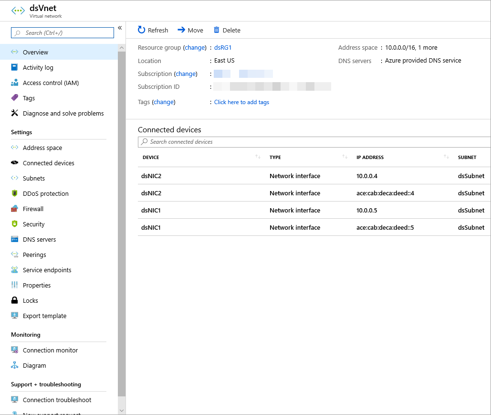

# Deploy an IPv6 dual stack application in Azure - PowerShell (Preview)

This article shows you how to deploy a dual stack (IPv4 + IPv6) application in Azure that includes a dual stack virtual network and subnet, a load balancer with dual (IPv4 + IPv6) front-end configurations, VMs with NICs that have a dual IP configuration, network security group, and public IPs.

> [!Important]
> IPv6 support for Azure Virtual Network is currently in public preview. This preview is provided without a service level agreement and is not recommended for production workloads. Certain features may not be supported or may have constrained capabilities. See the [Supplemental Terms of Use for Microsoft Azure Previews](https://azure.microsoft.com/support/legal/preview-supplemental-terms/) for details.

[!INCLUDE [cloud-shell-try-it.md](../../includes/cloud-shell-try-it.md)]

If you choose to install and use PowerShell locally, this article requires the Azure PowerShell module version 6.9.0 or later. Run `Get-Module -ListAvailable Az` to find the installed version. If you need to upgrade, see [Install Azure PowerShell module](/powershell/azure/install-Az-ps). If you are running PowerShell locally, you also need to run `Connect-AzAccount` to create a connection with Azure.

## Prerequisites
Before you deploy a dual stack application in Azure, you must configure your subscription for this preview feature using the following Azure PowerShell:

Register as follows:
```azurepowershell
Register-AzProviderFeature -FeatureName AllowIPv6VirtualNetwork -ProviderNamespace Microsoft.Network
```
It takes up to 30 minutes for feature registration to complete. You can check your registration status by running the following Azure PowerShell command:
Check on the registration as follows:
```azurepowershell
Get-AzProviderFeature -FeatureName AllowIPv6VirtualNetwork -ProviderNamespace Microsoft.Network
```
After the registration is complete, run the following command:

```azurepowershell
Register-AzResourceProvider -ProviderNamespace Microsoft.Network
```

## Create a resource group

Before you can create your dual-stack virtual network, you must create a resource group with [New-AzResourceGroup](/powershell/module/az.resources/new-azresourcegroup). The following example creates a resource group named *myRGDualStack* in the *east us* location:

```azurepowershell-interactive
   $rg = New-AzResourceGroup `
  -ResourceGroupName "dsRG1"  `
  -Location "east us"
```

## Create IPv4 and IPv6 public IP addresses
To access your virtual machines from the Internet, you need IPv4 and IPv6 public IP addresses for the load balancer. Create public IP addresses with [New-AzPublicIpAddress](/powershell/module/az.network/new-azpublicipaddress). The following example creates IPv4 and IPv6 public IP address named *dsPublicIP_v4* and *dsPublicIP_v6* in the *dsRG1* resource group:

```azurepowershell-interactive
$PublicIP_v4 = New-AzPublicIpAddress `
  -Name "dsPublicIP_v4" `
  -ResourceGroupName $rg.ResourceGroupName `
  -Location $rg.Location  `
  -AllocationMethod Dynamic `
  -IpAddressVersion IPv4
  
$PublicIP_v6 = New-AzPublicIpAddress `
  -Name "dsPublicIP_v6" `
  -ResourceGroupName $rg.ResourceGroupName `
  -Location $rg.Location  `
  -AllocationMethod Dynamic `
  -IpAddressVersion IPv6
```
To access your virtual machines using a RDP connection, create a IPV4 public IP addresses for the virtual machines with [New-AzPublicIpAddress](/powershell/module/az.network/new-azpublicipaddress).

```azurepowershell-interactive
  $RdpPublicIP_1 = New-AzPublicIpAddress `
  -Name "RdpPublicIP_1" `
  -ResourceGroupName $rg.ResourceGroupName `
  -Location $rg.Location  `
  -AllocationMethod Dynamic `
  -IpAddressVersion IPv4
  
  $RdpPublicIP_2 = New-AzPublicIpAddress `
   -Name "RdpPublicIP_2" `
   -ResourceGroupName $rg.ResourceGroupName `
   -Location $rg.Location  `
   -AllocationMethod Dynamic `
   -IpAddressVersion IPv4
```

## Create Basic Load Balancer

In this section, you configure dual frontend IP (IPv4 and IPv6) and the back-end address pool for the load balancer and then create a Basic Load Balancer.

### Create front-end IP

Create a front-end IP with [New-AzLoadBalancerFrontendIpConfig](/powershell/module/az.network/new-azloadbalancerfrontendipconfig). The following example creates IPv4 and IPv6 frontend IP configurations named *dsLbFrontEnd_v4* and *dsLbFrontEnd_v6*:

```azurepowershell-interactive
$frontendIPv4 = New-AzLoadBalancerFrontendIpConfig `
  -Name "dsLbFrontEnd_v4" `
  -PublicIpAddress $PublicIP_v4

$frontendIPv6 = New-AzLoadBalancerFrontendIpConfig `
  -Name "dsLbFrontEnd_v6" `
  -PublicIpAddress $PublicIP_v6

```

### Configure back-end address pool

Create a back-end address pool with [New-AzLoadBalancerBackendAddressPoolConfig](/powershell/module/az.network/new-azloadbalancerbackendaddresspoolconfig). The VMs attach to this back-end pool in the remaining steps. The following example creates back-end address pools named *dsLbBackEndPool_v4* and *dsLbBackEndPool_v6* to include VMs with both IPV4 and IPv6 NIC configurations:

```azurepowershell-interactive
$backendPoolv4 = New-AzLoadBalancerBackendAddressPoolConfig `
-Name "dsLbBackEndPool_v4"

$backendPoolv6 = New-AzLoadBalancerBackendAddressPoolConfig `
-Name "dsLbBackEndPool_v6"
```

### Create a load balancer rule

A load balancer rule is used to define how traffic is distributed to the VMs. You define the frontend IP configuration for the incoming traffic and the backend IP pool to receive the traffic, along with the required source and destination port. To make sure only healthy VMs receive traffic, you can optionally define a health probe. Basic load balancer uses an IPv4 probe to assess health for both IPv4 and IPv6 endpoints on the VMs. Standard load balancer includes support for explicitly IPv6 health probes.

Create a load balancer rule with [Add-AzLoadBalancerRuleConfig](/powershell/module/az.network/add-azloadbalancerruleconfig). The following example creates load balancer rules named *dsLBrule_v4* and *dsLBrule_v6* and balances traffic on *TCP* port *80* to the IPv4 and IPv6 frontend IP configurations:

```azurepowershell-interactive
$lbrule_v4 = New-AzLoadBalancerRuleConfig `
  -Name "dsLBrule_v4" `
  -FrontendIpConfiguration $frontendIPv4 `
  -BackendAddressPool $backendPoolv4 `
  -Protocol Tcp `
  -FrontendPort 80 `
  -BackendPort 80

$lbrule_v6 = New-AzLoadBalancerRuleConfig `
  -Name "dsLBrule_v6" `
  -FrontendIpConfiguration $frontendIPv6 `
  -BackendAddressPool $backendPoolv6 `
  -Protocol Tcp `
  -FrontendPort 80 `
  -BackendPort 80
```

### Create load balancer

Create the Basic Load Balancer with [New-AzLoadBalancer](/powershell/module/az.network/new-azloadbalancer). The following example creates a public Basic Load Balancer named *myLoadBalancer* using the IPv4 and IPv6 frontend IP configurations, backend pools, and load-balancing rules that you created in the preceding steps:

```azurepowershell-interactive
$lb = New-AzLoadBalancer `
-ResourceGroupName $rg.ResourceGroupName `
-Location $rg.Location  `
-Name "MyLoadBalancer" `
-Sku "Basic" `
-FrontendIpConfiguration $frontendIPv4,$frontendIPv6 `
-BackendAddressPool $backendPoolv4,$backendPoolv6 `
-LoadBalancingRule $lbrule_v4,$lbrule_v6

```

## Create network resources
Before you deploy some VMs and can test your balancer, you must create supporting network resources - availability set, network security group, virtual network, and virtual NICs. 
### Create an availability set
To improve the high availability of your app, place your VMs in an availability set.

Create an availability set with [New-AzAvailabilitySet](/powershell/module/az.compute/new-azavailabilityset). The following example creates an availability set named *myAvailabilitySet*:

```azurepowershell-interactive
$avset = New-AzAvailabilitySet `
  -ResourceGroupName $rg.ResourceGroupName `
  -Location $rg.Location  `
  -Name "dsAVset" `
  -PlatformFaultDomainCount 2 `
  -PlatformUpdateDomainCount 2 `
  -Sku aligned
```

### Create network security group

Create a network security group for the rules that will govern inbound and outbound communication in your VNET.

#### Create a network security group rule for port 3389

Create a network security group rule to allow RDP connections through port 3389 with [New-AzNetworkSecurityRuleConfig](/powershell/module/az.network/new-aznetworksecurityruleconfig).

```azurepowershell-interactive
$rule1 = New-AzNetworkSecurityRuleConfig `
-Name 'myNetworkSecurityGroupRuleRDP' `
-Description 'Allow RDP' `
-Access Allow `
-Protocol Tcp `
-Direction Inbound `
-Priority 100 `
-SourceAddressPrefix * `
-SourcePortRange * `
-DestinationAddressPrefix * `
-DestinationPortRange 3389
```
#### Create a network security group rule for port 80

Create a network security group rule to allow internet connections through port 80 with [New-AzNetworkSecurityRuleConfig](/powershell/module/az.network/new-aznetworksecurityruleconfig).

```azurepowershell-interactive
$rule2 = New-AzNetworkSecurityRuleConfig `
  -Name 'myNetworkSecurityGroupRuleHTTP' `
  -Description 'Allow HTTP' `
  -Access Allow `
  -Protocol Tcp `
  -Direction Inbound `
  -Priority 200 `
  -SourceAddressPrefix * `
  -SourcePortRange 80 `
  -DestinationAddressPrefix * `
  -DestinationPortRange 80
```
#### Create a network security group

Create a network security group with [New-AzNetworkSecurityGroup](/powershell/module/az.network/new-aznetworksecuritygroup).

```azurepowershell-interactive
$nsg = New-AzNetworkSecurityGroup `
-ResourceGroupName $rg.ResourceGroupName `
-Location $rg.Location  `
-Name "dsNSG1"  `
-SecurityRules $rule1,$rule2
```
### Create a virtual network

Create a virtual network with [New-AzVirtualNetwork](/powershell/module/az.network/new-azvirtualnetwork). The following example creates a virtual network named *myVnet* with *mySubnet*:

```azurepowershell-interactive
# Create dual stack subnet
$subnet = New-AzVirtualNetworkSubnetConfig `
-Name "dsSubnet" `
-AddressPrefix "10.0.0.0/24","ace:cab:deca:deed::/64"

# Create the virtual network
$vnet = New-AzVirtualNetwork `
  -ResourceGroupName $rg.ResourceGroupName `
  -Location $rg.Location  `
  -Name "dsVnet" `
  -AddressPrefix "10.0.0.0/16","ace:cab:deca::/48"  `
  -Subnet $subnet
```

### Create NICs

Create virtual NICs with [New-AzNetworkInterface](/powershell/module/az.network/new-aznetworkinterface). The following example creates two virtual NICs both with IPv4 and IPv6 configurations. (One virtual NIC for each VM you create for your app in the following steps).

```azurepowershell-interactive
  $Ip4Config=New-AzNetworkInterfaceIpConfig `
    -Name dsIp4Config `
    -Subnet $vnet.subnets[0] `
    -PrivateIpAddressVersion IPv4 `
    -LoadBalancerBackendAddressPool $backendPoolv4 `
    -PublicIpAddress  $RdpPublicIP_1
  	
  $Ip6Config=New-AzNetworkInterfaceIpConfig `
    -Name dsIp6Config `
    -Subnet $vnet.subnets[0] `
    -PrivateIpAddressVersion IPv6 `
    -LoadBalancerBackendAddressPool $backendPoolv6
    
  $NIC_1 = New-AzNetworkInterface `
    -Name "dsNIC1" `
    -ResourceGroupName $rg.ResourceGroupName `
    -Location $rg.Location  `
    -NetworkSecurityGroupId $nsg.Id `
    -IpConfiguration $Ip4Config,$Ip6Config 
    
  $Ip4Config=New-AzNetworkInterfaceIpConfig `
    -Name dsIp4Config `
    -Subnet $vnet.subnets[0] `
    -PrivateIpAddressVersion IPv4 `
    -LoadBalancerBackendAddressPool $backendPoolv4 `
    -PublicIpAddress  $RdpPublicIP_2  

  $NIC_2 = New-AzNetworkInterface `
    -Name "dsNIC2" `
    -ResourceGroupName $rg.ResourceGroupName `
    -Location $rg.Location  `
    -NetworkSecurityGroupId $nsg.Id `
    -IpConfiguration $Ip4Config,$Ip6Config 

```

### Create virtual machines

Set an administrator username and password for the VMs with [Get-Credential](https://msdn.microsoft.com/powershell/reference/5.1/microsoft.powershell.security/Get-Credential):

```azurepowershell-interactive
$cred = get-credential -Message "DUAL STACK VNET SAMPLE:  Please enter the Administrator credential to log into the VMs."
```

Now you can create the VMs with [New-AzVM](/powershell/module/az.compute/new-azvm). The following example creates two VMs and the required virtual network components if they do not already exist. 

```azurepowershell-interactive
$vmsize = "Standard_A2"
$ImagePublisher = "MicrosoftWindowsServer"
$imageOffer = "WindowsServer"
$imageSKU = "2016-Datacenter"

$vmName= "dsVM1"
$VMconfig1 = New-AzVMConfig -VMName $vmName -VMSize $vmsize -AvailabilitySetId $avset.Id 3> $null | Set-AzVMOperatingSystem -Windows -ComputerName $vmName -Credential $cred -ProvisionVMAgent 3> $null | Set-AzVMSourceImage -PublisherName $ImagePublisher -Offer $imageOffer -Skus $imageSKU -Version "latest" 3> $null | Set-AzVMOSDisk -Name "$vmName.vhd" -CreateOption fromImage  3> $null | Add-AzVMNetworkInterface -Id $NIC_1.Id  3> $null 
$VM1 = New-AzVM -ResourceGroupName $rg.ResourceGroupName  -Location $rg.Location  -VM $VMconfig1 

$vmName= "dsVM2"
$VMconfig2 = New-AzVMConfig -VMName $vmName -VMSize $vmsize -AvailabilitySetId $avset.Id 3> $null | Set-AzVMOperatingSystem -Windows -ComputerName $vmName -Credential $cred -ProvisionVMAgent 3> $null | Set-AzVMSourceImage -PublisherName $ImagePublisher -Offer $imageOffer -Skus $imageSKU -Version "latest" 3> $null | Set-AzVMOSDisk -Name "$vmName.vhd" -CreateOption fromImage  3> $null | Add-AzVMNetworkInterface -Id $NIC_2.Id  3> $null 
$VM2 = New-AzVM -ResourceGroupName $rg.ResourceGroupName  -Location $rg.Location  -VM $VMconfig2
```

## Determine IP addresses of the IPv4 and IPv6 endpoints
Get all Network Interface Objects in the resource group to summarize the IP's used in this deployment with `get-AzNetworkInterface`. Also, get the Load Balancer's frontend addresses of the IPv4 and IPv6 endpoints with `get-AzpublicIpAddress`.

```azurepowershell-interactive
$rgName= "dsRG1"
$NICsInRG= get-AzNetworkInterface -resourceGroupName $rgName 
write-host `nSummary of IPs in this Deployment: 
write-host ******************************************
foreach ($NIC in $NICsInRG) {
 
    $VMid= $NIC.virtualmachine.id 
    $VMnamebits= $VMid.split("/") 
    $VMname= $VMnamebits[($VMnamebits.count-1)] 
    write-host `nPrivate IP addresses for $VMname 
    $IPconfigsInNIC= $NIC.IPconfigurations 
    foreach ($IPconfig in $IPconfigsInNIC) {
 
        $IPaddress= $IPconfig.privateipaddress 
        write-host "    "$IPaddress 
        IF ($IPconfig.PublicIpAddress.ID) {
 
            $IDbits= ($IPconfig.PublicIpAddress.ID).split("/")
            $PipName= $IDbits[($IDbits.count-1)]
            $PipObject= get-azPublicIpAddress -name $PipName -resourceGroup $rgName
            write-host "    "RDP address:  $PipObject.IpAddress
                 }
         }
 }
 
 
 
  write-host `nPublic IP addresses on Load Balancer:
 
  (get-AzpublicIpAddress -resourcegroupname $rgName | where { $_.name -notlike "RdpPublicIP*" }).IpAddress
```
The following figure shows a sample output that lists the private IPv4 and IPv6 addresses of the two VMs, and the frontend IPv4 and IPv6 IP addresses of the Load Balancer.


## View IPv6 dual stack virtual network in Azure portal
You can view the IPv6 dual stack virtual network in Azure portal as follows:
1. In the portal's search bar, enter *dsVnet*.
2. When **myVirtualNetwork** appears in the search results, select it. This launches the **Overview** page of the dual stack virtual network named *dsVnet*. The dual stack virtual network shows the two NICs with both IPv4 and IPv6 configurations located in the dual stack subnet named *dsSubnet*.

  

> [!NOTE]
> The IPv6 for Azure virtual network is available in the Azure portal in read-only for this preview release.

## Clean up resources

When no longer needed, you can use the [Remove-AzResourceGroup](/powershell/module/az.resources/remove-azresourcegroup) command to remove the resource group, VM, and all related resources.

```azurepowershell-interactive
Remove-AzResourceGroup -Name dsRG1
```

## Next steps

In this article, you created a Basic Load Balancer with a dual frontend IP configuration (IPv4 and IPv6). You also created a two virtual machines that included NICs with dual IP configurations (IPV4 + IPv6) that were added to the back-end pool of the load balancer. To learn more about IPv6 support in Azure virtual networks, see [What is IPv6 for Azure Virtual Network?](ipv6-overview.md)