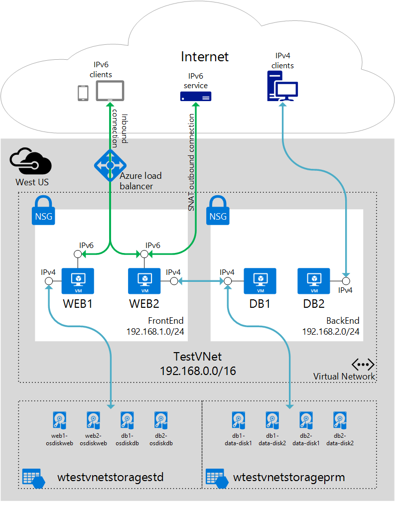

<properties 
   pageTitle="IPv6 Overview | Microsoft Azure"
   description="Learn about IPv6 addressing in Azure"
   services="virtual-network"
   documentationCenter="na"
   authors="telmosampaio"
   manager="carmonm"
   editor="tysonn" />
<tags 
   ms.service="virtual-network"
   ms.devlang="na"
   ms.topic="article"
   ms.tgt_pltfrm="na"
   ms.workload="infrastructure-services"
   ms.date="03/04/2016"
   ms.author="telmos" />

# IPv6 support in Azure

The IPv6 protocol was initially introduced in 1998 by the Internet Engineering Task Force (IETF) to address the limitation of 32-bit IPv4 addresses on the public Internet. With the increased number of Internet-connected mobile devices, and the rise of the Internet of Things (IoT), IPv6 addresses are becoming more frequent on the public Internet.

>[AZURE.IMPORTANT] IPv6 in Azure is currently in private preview, and it is not available for all customers. This page will be updated once the feature becomes available to all customers.

You can use IPv6 addresses on your Azure IaaS VMs in Resource Manager deployments for outbound and inbound connectivity to the public Internet. The following list describes the IPv6 capabilities in Azure.

- **IaaS VMs in Resource Manager**
	- VMs have both an IPv4 and an IPv6 endpoint.
	- VMs can connected to the Internet through a load balancer public IP for inbound (load balancer and NAT) connectivity, and outbound (SNAT) connections.
	- VMs connect to all Azure services by using their IPv4 endpoints.
	- VMs only use IPv4 endpoints for East-West communication.
- **Azure DNS**
	- Azure DNS supports IPv6, and provides AAAA records, along with IPv4 A records.
	- Azure DNS responds to queires witht he AAAA and A records for lookups, when both exist. 
- **Office365**
	- Office365 services support IPv6.
	- You can connect from your on-premises network to IPv6 resources in Office365 by using an ExpressRoute circuit.

## IaaS VMs in Resource Manager

You can only take advantage of IPv6 connectivity by using the Resource Management deployment model. Although every VM in a Resource Manager deployment has IPv4 and IPv6 endpoints, the IPv6 endpoint can only be used for connection with the public Internet through a load balancer as seen below. 

## Azure DNS

You can host IPv6 AAAA records in Azure DNS. When Azure DNS receives a query for a resource, it responds with all available records for the host name. For instance, if you have an A record and an AAAA record for a given hostname (i.e. www.contoso.com), Azure DNS sends both addresses as a response to the query. It is up to the DNS client to decide whether to use the IPv4 or IPv6 endpoint for connectivity, once it receives the response from Azure DNS, or any other DNS server that supports AAAA records.

>[AZURE.NOTE] Windows computers always try to connect by using IPv6 before attempting an IPv4 connection.

## Office 365

You can use IPv6 connectivity between your on-premises network and Office365 by using an ExpressRoute circuit and Microsoft peering. Make sure you understand [how ExpressRoute works](../expressroute/expressroute-introduction.md) in connection with Microsoft peering.

## Next steps

- Learn about [Azure DNS](../dns/dns-overview.md).
- Learn about [ExpressRoute](../expressroute/expressroute-introduction.md).
