# Manage NSGs using the portal

> [!div class="op_single_selector"]
> * [Portal](virtual-network-manage-nsg-arm-portal.md)
> * [PowerShell](virtual-network-manage-nsg-arm-ps.md)
> * [Azure CLI](virtual-network-manage-nsg-arm-cli.md)
>

[!INCLUDE [virtual-network-manage-nsg-intro-include.md](../../includes/virtual-network-manage-nsg-intro-include.md)]

> [!NOTE]
> Azure has two different deployment models for creating and working with resources:  [Resource Manager and classic](../resource-manager-deployment-model.md). This article covers using the Resource Manager deployment model, which Microsoft recommends for most new deployments instead of the classic deployment model.
>

[!INCLUDE [virtual-network-manage-nsg-arm-scenario-include.md](../../includes/virtual-network-manage-nsg-arm-scenario-include.md)]

## Retrieve Information
You can view your existing NSGs, retrieve rules for an existing NSG, and find out what resources an NSG is associated to.

### View existing NSGs

To view all existing NSGs in a subscription, complete the following steps:

1. From a browser, navigate to http://portal.azure.com and, if necessary, sign in with your Azure account.

2. Click **Browse >** > **Network security groups**.

	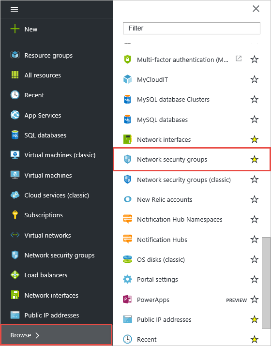

3. Check the list of NSGs in the **Network security groups** blade.

	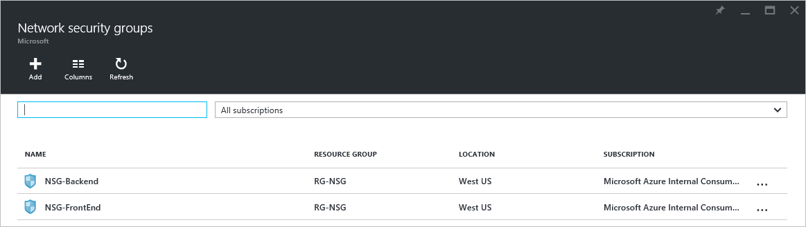

### View NSGs in a resource group

To view the list of NSGs in the **RG-NSG** resource group, complete the following steps:

1. Click **Resource groups >** > **RG-NSG** > **...**.

	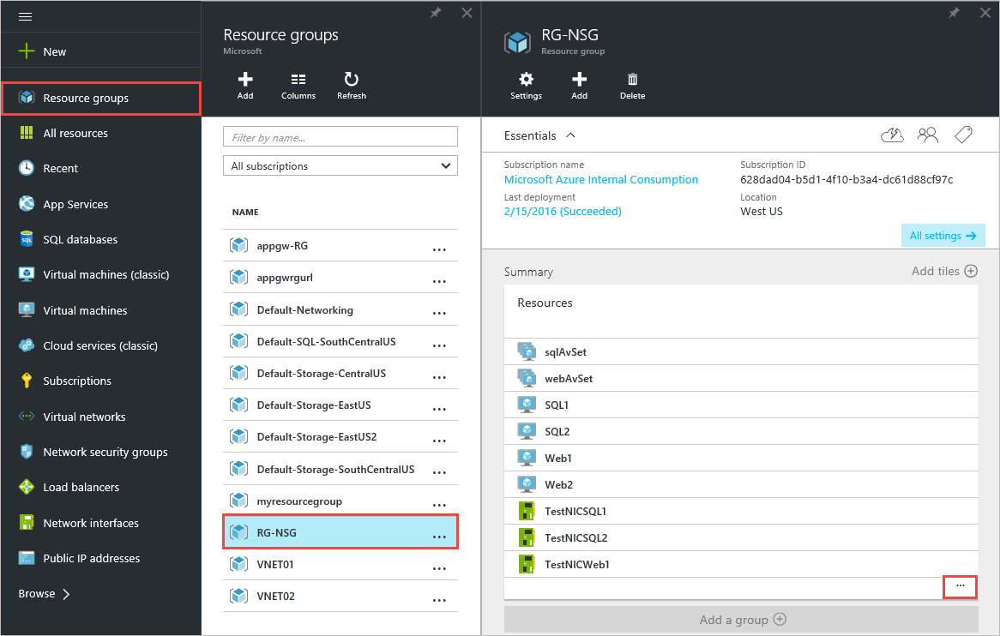

2. In the list of resources, look for items displaying the NSG icon, as shown in the **Resources** blade below.

	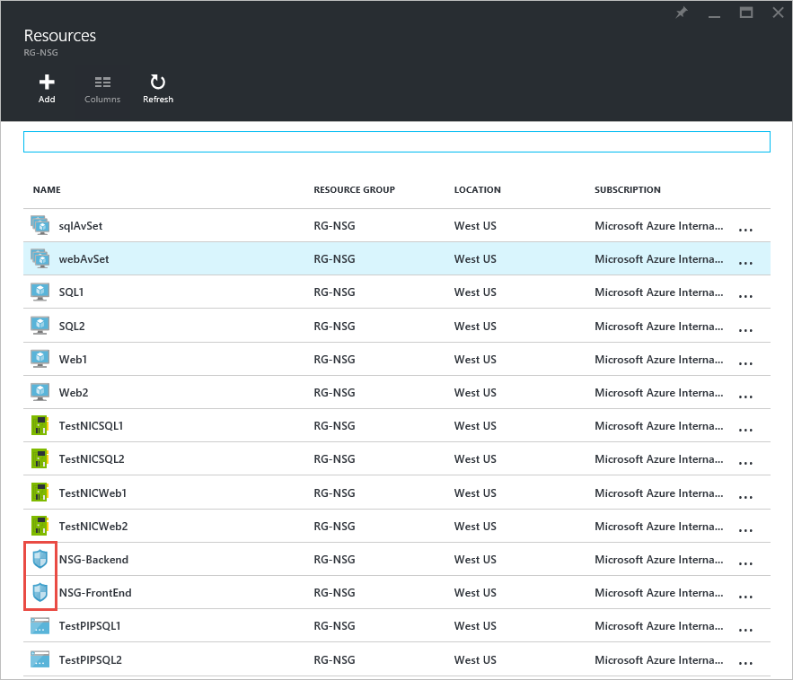

### List all rules for an NSG

To view the rules of an NSG named **NSG-FrontEnd**, complete the following steps:

1. From the **Network security groups** blade, or the **Resources** blade shown above, click **NSG-FrontEnd**.

2. In the **Settings** tab, click **Inbound security rules**.

	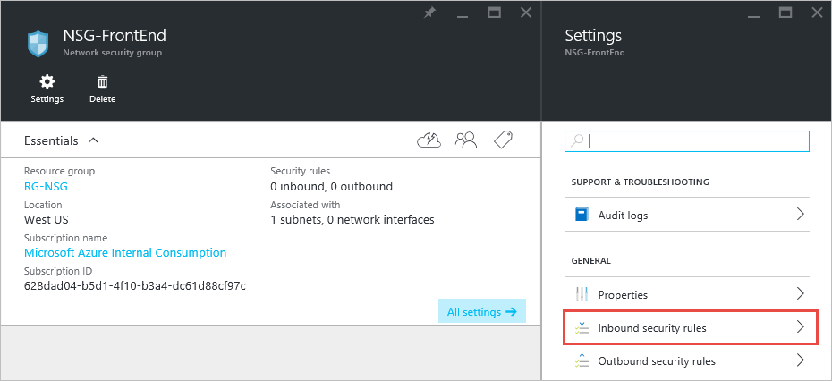

3. The **Inbound security rules** blade is displayed as shown below.

	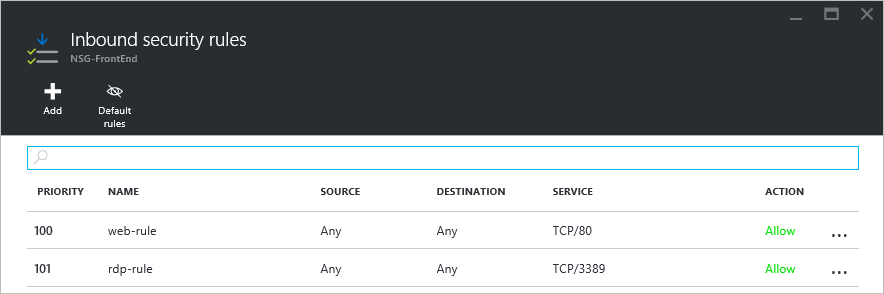

4. In the **Settings** tab, click **Outbound security rules** to see the outbound rules.

	> [!NOTE]
	> To view default rules, click the **Default rules** icon at the top of the blade that displays the rules.
	>

### View NSGs associations

To view what resources the **NSG-FrontEnd** NSG is associate with, complete the following steps:

1. From the **Network security groups** blade, or the **Resources** blade shown above, click **NSG-FrontEnd**.

2. In the **Settings** tab, click **Subnets** to view what subnets are associated to the NSG.

	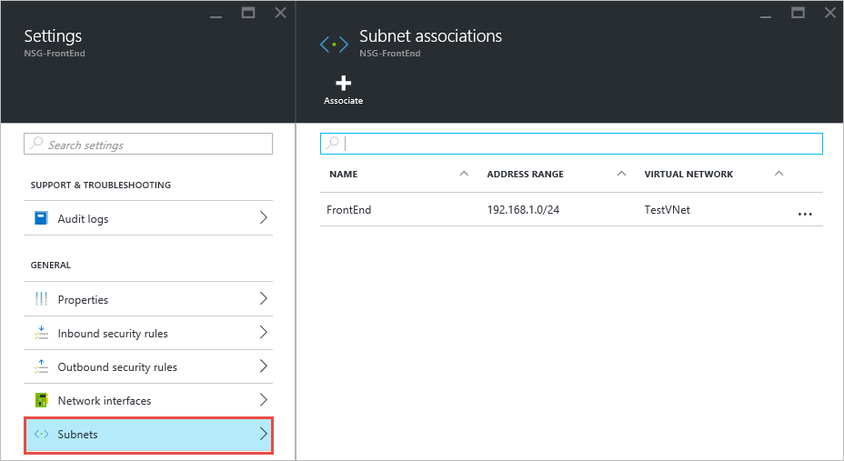

3. In the **Settings** tab, click **Network interfaces** to view what NICs are associated to the NSG.

## Manage rules
You can add rules to an existing NSG, edit existing rules, and remove rules.

### Add a rule
To add a rule allowing **inbound** traffic to port **443** from any machine to the **NSG-FrontEnd** NSG, complete the following steps:

1. From the **Network security groups** blade, or the **Resources** blade shown above, click **NSG-FrontEnd**.
2. In the **Settings** tab, click **Inbound security rules**.
3. In the **Inbound security rules** blade, click **Add**. Then, in the **Add inbound security rule** blade, fill the values as shown below, and then click **OK**.

	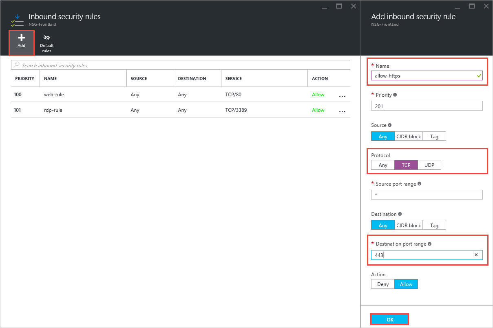

	After a few seconds, notice the new rule in the **Inbound security rules** blade.

	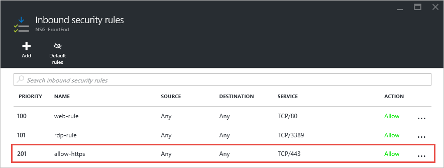

### Change a rule
To change the rule created above to allow inbound traffic from the **Internet** only, complete the following steps:

1. From the **Network security groups** blade, or the **Resources** blade shown above, click **NSG-FrontEnd**.
2. In the **Settings** tab, click the rule created above.
3. In the **allow-https** blade, change the **Source** property as shown below, and then click **Save**.

	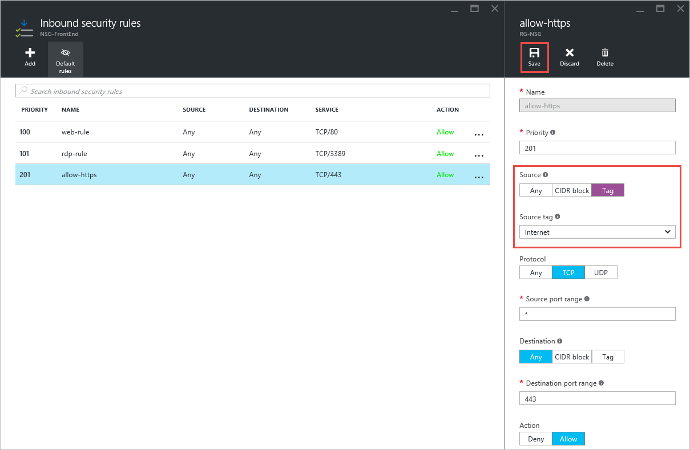

### Delete a rule

To delete the rule created above, complete the following steps:

1. From the **Network security groups** blade, or the **Resources** blade shown above, click **NSG-FrontEnd**.
2. In the **Settings** tab, click the rule created above.
3. In the **allow-https** blade, click **Delete**, and then click **Yes**.

	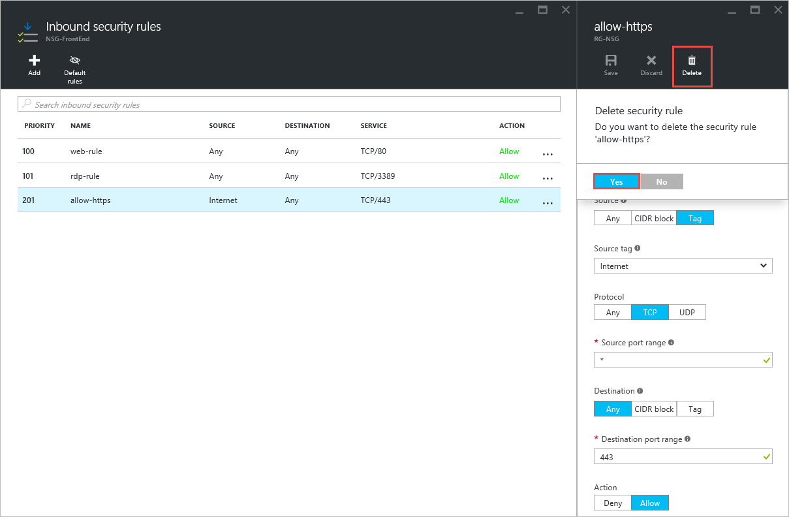

## Manage associations
You can associate an NSG to subnets and NICs. You can also dissociate an NSG from any resource it's associated to.

### Associate an NSG to a NIC
To associate the **NSG-FrontEnd** NSG to the **TestNICWeb1** NIC, complete the following steps:

1. From the **Network security groups** blade, or the **Resources** blade shown above, click **NSG-FrontEnd**.
2. In the **Settings** tab, click **Network interfaces** > **Associate** > **TestNICWeb1**.

	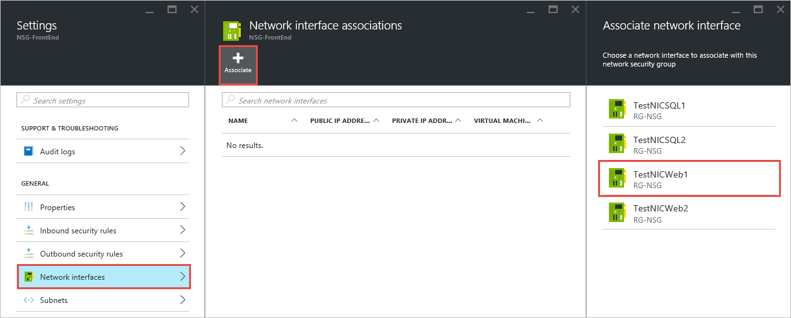

### Dissociate an NSG from a NIC

To dissociate the **NSG-FrontEnd** NSG from the **TestNICWeb1** NIC, complete the following steps:

1. From the Azure portal, click **Resource groups >** > **RG-NSG** > **...** > **TestNICWeb1**.

2. In the **TestNICWeb1** blade, click **Change security...** > **None**.

	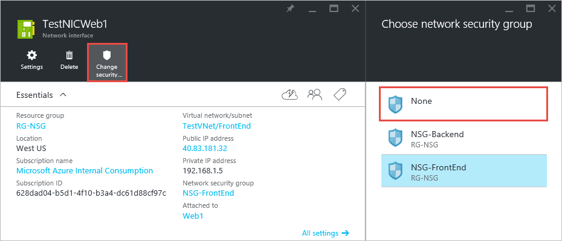

> [!NOTE]
> You can also use this blade to associate the NIC to any existing NSG.
>

### Dissociate an NSG from a subnet

To dissociate the **NSG-FrontEnd** NSG from the **FrontEnd** subnet, complete the following steps:

1. From the Azure portal, click **Resource groups >** > **RG-NSG** > **...** > **TestVNet**.

2. In the **Settings** blade, click **Subnets** > **FrontEnd** > **Network security group** > **None**.

	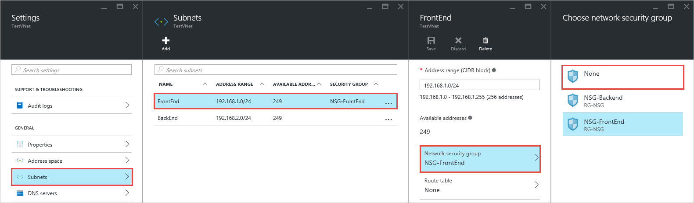

3. In the **FrontEnd** blade, click **Save**.

	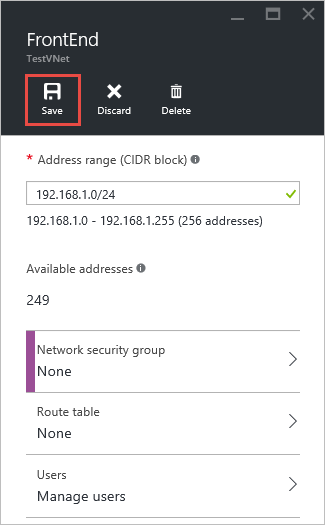

### Associate an NSG to a subnet

To associate the **NSG-FrontEnd** NSG to the **FronEnd** subnet again, complete the following steps:

1. From the Azure portal, click **Resource groups >** > **RG-NSG** > **...** > **TestVNet**.
2. In the **Settings** blade, click **Subnets** > **FrontEnd** > **Network security group** > **NSG-FrontEnd**.
3. In the **FrontEnd** blade, click **Save**.

> [!NOTE]
> You can also associate an NSG to a subnet from thh NSG's **Settings** blade.
>

## Delete an NSG
You can only delete an NSG if it's not associated to any resource. To delete an NSG, complete the following steps:.

1. From the Azure portal, click **Resource groups >** > **RG-NSG** > **...** > **NSG-FrontEnd**.
2. In the **Settings** blade, click **Network interfaces**.
3. If there are any NICs listed, click the NIC, and follow step 2 in [Dissociate an NSG from a NIC](#Dissociate-an-NSG-from-a-NIC).
4. Repeat step 3 for each NIC.
5. In the **Settings** blade, click **Subnets**.
6. If there are any subnets listed, click the subnet and follow steps 2 and 3 in [Dissociate an NSG from a subnet](#Dissociate-an-NSG-from-a-subnet).
7. Scrolls left to the **NSG-FrontEnd** blade, then click **Delete** > **Yes**.

	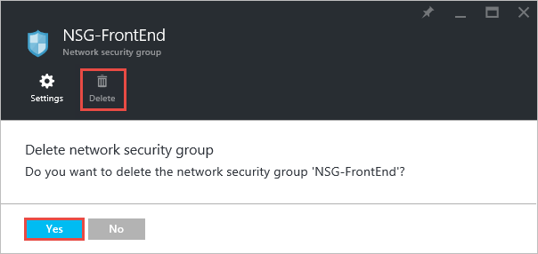

## Next steps
* [Enable logging](virtual-network-nsg-manage-log.md) for NSGs.
