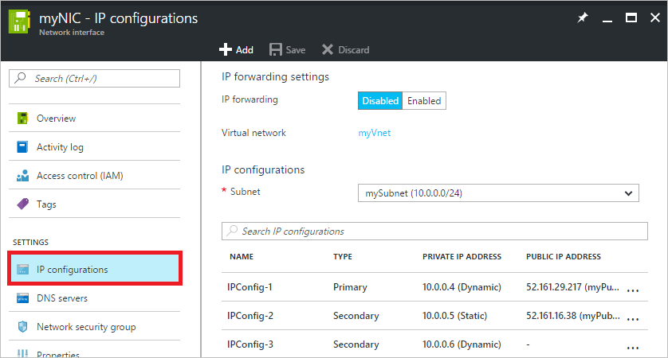
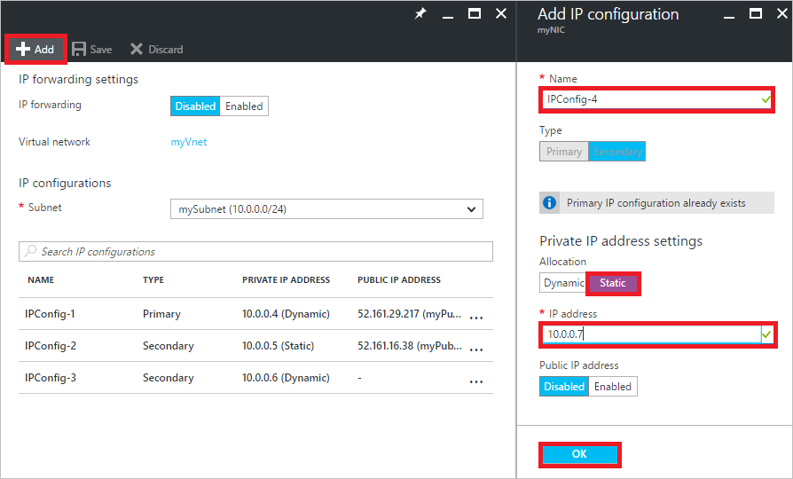
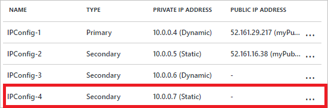
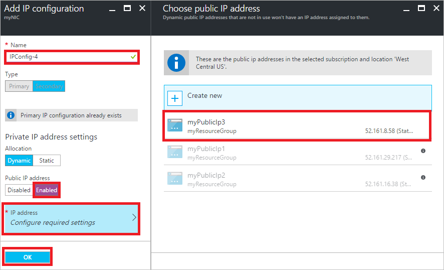
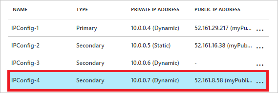
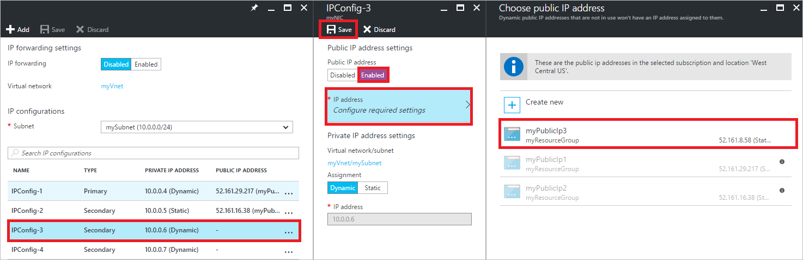

# Assign multiple IP addresses to virtual machines using the Azure portal

> [!div class="op_single_selector"]
> * [Portal](virtual-network-multiple-ip-addresses-portal.md)
> * [PowerShell](virtual-network-multiple-ip-addresses-powershell.md)
> * [CLI](virtual-network-multiple-ip-addresses-cli.md)
>

An Azure Virtual Machine (VM) has one or more network interfaces (NIC) attached to it. Any NIC can have one or more static or dynamic public and private IP addresses assigned to it. Assigning multiple IP addresses to a VM enables the following capabilities:

* Hosting multiple websites or services with different IP addresses and SSL certificates on a single server.
* Serve as a network virtual appliance, such as a firewall or load balancer.
* The ability to add any of the private IP addresses for any of the NICs to an Azure Load Balancer back-end pool. In the past, only the primary IP address for the primary NIC could be added to a back-end pool. To learn more about how to load balance multiple IP configurations, read the [Load balancing multiple IP configurations](../load-balancer/load-balancer-multiple-ip.md) article.

Every NIC attached to a VM has one or more IP configurations associated to it. Each configuration is assigned one static or dynamic private IP address. Each configuration may also have one public IP address resource associated to it. A public IP address resource has either a dynamic or static IP address assigned to it. To learn more about IP addresses in Azure, read the [IP addresses in Azure](virtual-network-ip-addresses-overview-arm.md) article.

This article explains how to use the Azure portal to assign multiple IP addresses to a VM created through the Azure Resource Manager deployment model. Multiple IP addresses cannot be assigned to resources created through the classic deployment model. To learn more about Azure deployment models, read the [Understand deployment models](../resource-manager-deployment-model.md) article.

[!INCLUDE [virtual-network-preview](../../includes/virtual-network-preview.md)]

## Scenario
A VM with a single NIC is created and connected to a virtual network. The VM requires three different *private* IP addresses and two *public* IP addresses. The IP addresses are assigned to the following IP configurations:

* **IPConfig-1:** Assigns a *dynamic* private IP address (default) and a *static* public IP address.
* **IPConfig-2:** Assigns a *static* private IP address and a *static* public IP address.
* **IPConfig-3:** Assigns a *dynamic* private IP address and no public IP address.
  
	

The IP configurations are associated to the NIC when the NIC is created and the NIC is attached to the VM when the VM is created. The types of IP addresses used for the scenario are for illustration. You can assign whatever IP address and assignment types you require.

## Create a VM with multiple IP addresses

If you want to create a VM with multiple IP addresses, you must create it using PowerShell or the Azure CLI. Click the PowerShell or CLI options at the top of this article to learn how. You can create a VM with a single static private IP address and (optionally) a single public IP address using the portal by following the steps in the [Create a Windows VM](../virtual-machines/virtual-machines-windows-hero-tutorial.md) or [Create a Linux VM](../virtual-machines/virtual-machines-linux-quick-create-portal.md) articles. After you create the VM, you can change the IP address types and add additional IP addresses using the portal by following steps in the [Add IP addresses to a VM](#add) section of this article.

## Add IP addresses to a VM

You can add private and public IP addresses to a NIC by completing the steps that follow. The examples in the following sections assume that you already have a VM with the three IP configurations described in the [scenario](#Scenario) in this article, but it's not required that you do.

> [!NOTE]
> Though this article assigns all IP configurations to a single NIC, you can also assign multiple IP configurations to any NIC in a VM. To learn how to create a VM with multiple NICs, read the [Create a VM with multiple NICs](virtual-network-deploy-multinic-arm-ps.md) article.

### Core steps

1. Register for the preview by sending an email to [Multiple IPs](mailto:MultipleIPsPreview@microsoft.com?subject=Request%20to%20enable%20subscription%20%3csubscription%20id%3e) with your subscription ID and intended use. Do not attempt to complete the remaining steps:
	- Until you receive an e-mail notifying you that you've been accepted into the preview
	- Without following the instructions in the email you receive
2. Browse to the Azure portal at https://portal.azure.com and sign into it, if necessary.
3. In the portal, click **More services** > type *virtual machines* in the filter box, and then click **Virtual machines**.
4. In the **Virtual machines** blade, click the VM you want to add IP addresses to. Click **Network interfaces** in the virtual machine blade that appears, and then select the network interface you want to add the IP addresses to. In the example shown in the following picture, the NIC named *myNIC* from the VM named *myVM* is selected:

	

5. In the blade that appears for the NIC you selected, click **IP configurations**, as shown in the following picture:

	

Complete the steps in one of the sections that follow, based on the type of IP address you want to add.

### **Add a private IP address**

Complete the following steps to add a new private IP address:

1. Complete the steps in the [Core steps](#coreadd) section of this article.
2. Click **Add**. In the **Add IP configuration** blade that appears, create an IP configuration named *IPConfig-4* with *10.0.0.7* as a *Static* private IP address then click **OK**, as shown in the following picture:

	

	> [!NOTE]
	> When adding a static IP address, you must specify an unused, valid address on the subnet the NIC is connected to. If the address you select is not available, the portal will show an X for the IP address and you'll need to select a different one.

	If you prefer that the private IP address **Allocation method** be *Dynamic*, select it instead and you won't need to specify an IP address.
3. Once you click OK, the blade will close and you'll see the new IP configuration listed, as shown in the following picture:

	

	Click **OK** to close the **Add IP configuration** blade.
4. You can click **Add** to add additional IP configurations, or close all open blades to finish adding IP addresses.
5. Add the private IP addresses to the VM operating system by completing the steps for your operating system in the [Add IP addresses to a VM operating system](#os-config) section of this article.

### Add a public IP address

A public IP address is added by associating a public IP address resource to either a new IP configuration or an existing IP configuration.

> [!NOTE]
> Public IP addresses have a nominal fee. To learn more about IP address pricing, read the [IP address pricing](https://azure.microsoft.com/pricing/details/ip-addresses) page. There is a limit to the number of public IP addresses that can be used in a subscription. To learn more about the limits, read the [Azure limits](../azure-subscription-service-limits.md#networking-limits) article.
> 

### Create a public IP address resource

A public IP address is one setting for a public IP address resource. If you have a public IP address resource that is not currently associated to an IP configuration that you want to associate to an IP configuration, skip the following steps and complete the steps in one of the sections that follow, as you require. If you don't have an available public IP address resource, complete the following steps to create one:

1. Browse to the Azure portal at https://portal.azure.com and sign into it, if necessary.
3. In the portal, click **New** > **Networking** > **Public IP address**.
4. In the **Create public IP address** blade that appears, enter a **Name**, select an **IP address assignment** type, a **Subscription**, a **Resource group**, and a **Location**, then click **Create**, as shown in the following picture:

	

5. Complete the steps in one of the sections that follow to associate the public IP address resource to an IP configuration.

#### Associate the public IP address resource to a new IP configuration

1. Complete the steps in the [Core steps](#coreadd) section of this article.
2. Click **Add**. In the **Add IP configuration** blade that appears, create an IP configuration named *IPConfig-4*. Enable the **Public IP address** and select an existing, available public IP address resource from the **Choose public IP address** blade that appears, as shown in the following picture:

	

	Once you've selected the public IP address resource, click **OK** and the blade will close. If you don't have an existing public IP address, you can create one by completing the steps in the [Create a public IP address resource](#create-public-ip) section of this article. 

3. Review the new IP configuration, as shown in the following picture:

	

	> [!NOTE]
	> Even though a private IP address wasn't explicitly assigned, one was automatically assigned to the IP configuration, because all IP configurations must have a private IP address.
	>

4. You can click **Add** to add additional IP configurations, or close all open blades to finish adding IP addresses.
5. Add the private IP address to the VM operating system by completing the steps for your operating system in the [Add IP addresses to a VM operating system](#os-config) section of this article. Do not add the public IP address to the operating system.

#### Associate the public IP address resource to an existing IP configuration

1. Complete the steps in the [Core steps](#coreadd) section of this article.
2. Select the IP configuration you want to add the public IP address resource to, enable the Public IP address, and select an existing, available public IP address resource. In the example shown in the following picture, the *myPublicIp3* public IP address resource is associated to *IPConfig-3*.

	

	Once you've selected the public IP address resource, click **Save** and the blades will close. If you don't have an existing public IP address, you can create one by completing the steps in the [Create a public IP address resource](#create-public-ip) section of this article.

3. Review the new IP configuration, as shown in the following picture:

	

4. You can click **Add** to add additional IP configurations, or close all open blades to finish adding IP addresses. Do not add the public IP address to the operating system.

[!INCLUDE [virtual-network-multiple-ip-addresses-os-config.md](../../includes/virtual-network-multiple-ip-addresses-os-config.md)]
