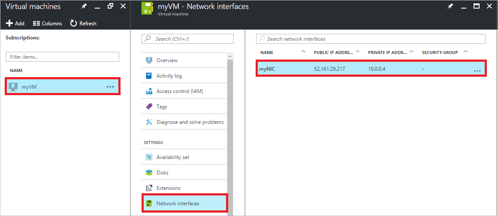

# Assign multiple IP addresses to virtual machines using the Azure portal

> [!INCLUDE [virtual-network-multiple-ip-addresses-intro.md](../../includes/virtual-network-multiple-ip-addresses-intro.md)]
> 
> This article explains how to create a virtual machine (VM) through the Azure Resource Manager deployment model using the Azure portal. Multiple IP addresses cannot be assigned to resources created through the classic deployment model. To learn more about Azure deployment models, read the [Understand deployment models](../resource-manager-deployment-model.md) article.

[!INCLUDE [virtual-network-multiple-ip-addresses-scenario.md](../../includes/virtual-network-multiple-ip-addresses-scenario.md)]

## Create a VM with multiple IP addresses

If you want to create a VM with multiple IP addresses, or a static private IP address, you must create it using PowerShell or the Azure CLI. To learn how, click the PowerShell or CLI options at the top of this article. You can create a VM with a single dynamic private IP address and (optionally) a single public IP address. Use the portal by following the steps in the [Create a Windows VM](../virtual-machines/virtual-machines-windows-hero-tutorial.md) or [Create a Linux VM](../virtual-machines/linux/quick-create-portal.md) articles. After you create the VM, you can change the IP address type from dynamic to static and add additional IP addresses using the portal by following steps in the [Add IP addresses to a VM](#add) section of this article.

## Add IP addresses to a VM

You can add private and public IP addresses to an Azure network interface by completing the steps that follow. The examples in the following sections assume that you already have a VM with the three IP configurations described in the [scenario](#scenario), but it's not required.

### Core steps

1. Browse to the Azure portal at https://portal.azure.com and sign into it, if necessary.
2. In the portal, click **More services** > type *virtual machines* in the filter box, and then click **Virtual machines**.
3. In the **Virtual machines** pane, click the VM you want to add IP addresses to. Click **Network interfaces** in the virtual machine pane that appears, and then select the network interface you want to add the IP addresses to. In the example shown in the following picture, the NIC named *myNIC* from the VM named *myVM* is selected:

	

4. In the pane that appears for the NIC you selected, click **IP configurations**.

Complete the steps in one of the sections that follow, based on the type of IP address you want to add.

### **Add a private IP address**

Complete the following steps to add a new private IP address:

1. Complete the steps in the [Core steps](#coreadd) section of this article.
2. Click **Add**. In the **Add IP configuration** pane that appears, create an IP configuration named *IPConfig-4* with *10.0.0.7* as a *Static* private IP address, then click **OK**.

	> [!NOTE]
	> When adding a static IP address, you must specify an unused, valid address on the subnet the NIC is connected to. If the address you select is not available, the portal displays an X for the IP address and you must select a different one.

3. Once you click OK, the pane closes and you see the new IP configuration listed. Click **OK** to close the **Add IP configuration** pane.
4. You can click **Add** to add additional IP configurations, or close all open blades to finish adding IP addresses.
5. Add the private IP addresses to the VM operating system by completing the steps in the [Add IP addresses to a VM operating system](#os-config) section of this article.

### Add a public IP address

A public IP address is added by associating a public IP address resource to either a new IP configuration or an existing IP configuration.

> [!NOTE]
> Public IP addresses have a nominal fee. To learn more about IP address pricing, read the [IP address pricing](https://azure.microsoft.com/pricing/details/ip-addresses) page. There is a limit to the number of public IP addresses that can be used in a subscription. To learn more about the limits, read the [Azure limits](../azure-subscription-service-limits.md#networking-limits) article.
> 

### Create a public IP address resource

A public IP address is one setting for a public IP address resource. If you have a public IP address resource that is not currently associated to an IP configuration that you want to associate to an IP configuration, skip the following steps and complete the steps in one of the sections that follow, as you require. If you don't have an available public IP address resource, complete the following steps to create one:

1. Browse to the Azure portal at https://portal.azure.com and sign into it, if necessary.
3. In the portal, click **Create a resource** > **Networking** > **Public IP address**.
4. In the **Create public IP address** pane that appears, enter a **Name**, select an **IP address assignment** type, a **Subscription**, a **Resource group**, and a **Location**, then click **Create**, as shown in the following picture:

	

5. Complete the steps in one of the sections that follow to associate the public IP address resource to an IP configuration.

#### Associate the public IP address resource to a new IP configuration

1. Complete the steps in the [Core steps](#coreadd) section of this article.
2. Click **Add**. In the **Add IP configuration** pane that appears, create an IP configuration named *IPConfig-4*. Enable the **Public IP address** and select an existing, available public IP address resource from the **Choose public IP address** pane that appears.

	Once you've selected the public IP address resource, click **OK** and the pane closes. If you don't have an existing public IP address, you can create one by completing the steps in the [Create a public IP address resource](#create-public-ip) section of this article. 

3. Review the new IP configuration. Even though a private IP address wasn't explicitly assigned, one was automatically assigned to the IP configuration, because all IP configurations must have a private IP address.
4. You can click **Add** to add additional IP configurations, or close all open blades to finish adding IP addresses.
5. Add the private IP address to the VM operating system by completing the steps for your operating system in the [Add IP addresses to a VM operating system](#os-config) section of this article. Do not add the public IP address to the operating system.

#### Associate the public IP address resource to an existing IP configuration

1. Complete the steps in the [Core steps](#coreadd) section of this article.
2. Click the IP configuration you want to add the public IP address resource to.
3. In the IPConfig pane that appears, click **IP address**.
4. In the **Choose public IP address** pane that appears, select a public IP address.
5. Click **Save** and the panes close. If you don't have an existing public IP address, you can create one by completing the steps in the [Create a public IP address resource](#create-public-ip) section of this article.
3. Review the new IP configuration.
4. You can click **Add** to add additional IP configurations, or close all open blades to finish adding IP addresses. Do not add the public IP address to the operating system.

[!INCLUDE [virtual-network-multiple-ip-addresses-os-config.md](../../includes/virtual-network-multiple-ip-addresses-os-config.md)]
