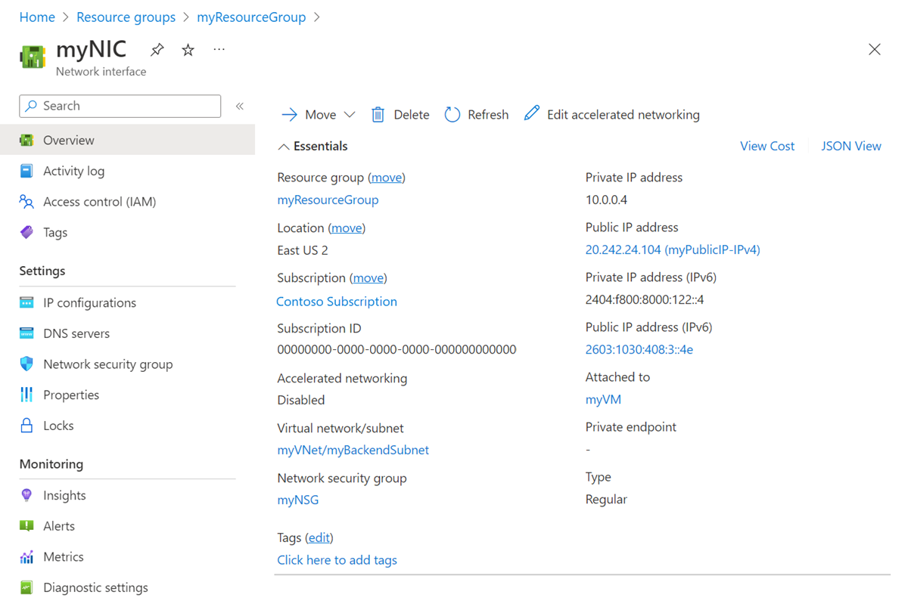

---
title: Create, change, or delete an Azure network interface | Microsoft Docs
description: Learn what a network interface is and how to create, change settings for, and delete one.
services: virtual-network
documentationcenter: na
author: jimdial
manager: jeconnoc
editor: ''
tags: azure-resource-manager

ms.assetid:
ms.service: virtual-network
ms.devlang: NA
ms.topic: article
ms.tgt_pltfrm: na
ms.workload: infrastructure-services
ms.date: 07/24/2017
ms.author: jdial

---

# Create, change, or delete a network interface

Learn how to create, change settings for, and delete a network interface. A network interface enables an Azure Virtual Machine to communicate with internet, Azure, and on-premises resources. When creating a virtual machine using the Azure portal, the portal creates one network interface with default settings for you. You may instead choose to create network interfaces with custom settings and add one or more network interfaces to a virtual machine when you create it. You may also want to change default network interface settings for an existing network interface. This article explains how to create a network interface with custom settings, change existing settings, such as network filter (network security group) assignment, subnet assignment, DNS server settings, and IP forwarding, and delete a network interface.

If you need to add, change, or remove IP addresses for a network interface, see [Manage IP addresses](virtual-network-network-interface-addresses.md). If you need to add network interfaces to, or remove network interfaces from virtual machines, see [Add or remove network interfaces](virtual-network-network-interface-vm.md).

## Before you begin

Complete the following tasks before completing steps in any section of this article:

- If you don't already have an Azure account, sign up for a [free trial account](https://azure.microsoft.com/free).
- If using the portal, open https://portal.azure.com, and log in with your Azure account.
- If using PowerShell commands to complete tasks in this article, either run the commands in the [Azure Cloud Shell](https://shell.azure.com/powershell), or by running PowerShell from your computer. The Azure Cloud Shell is a free interactive shell that you can use to run the steps in this article. It has common Azure tools preinstalled and configured to use with your account. This tutorial requires the Azure PowerShell module version 5.4.1 or later. Run `Get-Module -ListAvailable AzureRM` to find the installed version. If you need to upgrade, see [Install Azure PowerShell module](/powershell/azure/install-azurerm-ps). If you are running PowerShell locally, you also need to run `Connect-AzureRmAccount` to create a connection with Azure.
- If using Azure Command-line interface (CLI) commands to complete tasks in this article, either run the commands in the [Azure Cloud Shell](https://shell.azure.com/bash), or by running the CLI from your computer. This tutorial requires the Azure CLI version 2.0.28 or later. Run `az --version` to find the installed version. If you need to install or upgrade, see [Install Azure CLI](/cli/azure/install-azure-cli). If you are running the Azure CLI locally, you also need to run `az login` to create a connection with Azure.

The account you log into, or connect to Azure with, must be assigned to the [network contributor](../role-based-access-control/built-in-roles.md?toc=%2fazure%2fvirtual-network%2ftoc.json#network-contributor) role or to a [custom role](../role-based-access-control/custom-roles.md?toc=%2fazure%2fvirtual-network%2ftoc.json) that is assigned the appropriate actions listed in [Permissions](#permissions).

## Create a network interface

When creating a virtual machine using the Azure portal, the portal creates a network interface with default settings for you. If you'd rather specify all your network interface settings, you can create a network interface with custom settings and attach the network interface to a virtual machine when creating the virtual machine (using PowerShell or the Azure CLI). You can also create a network interface and add it to an existing virtual machine (using PowerShell or the Azure CLI). To learn how to create a virtual machine with an existing network interface or to add to, or remove network interfaces from existing virtual machines, see [Add or remove network interfaces](virtual-network-network-interface-vm.md). Before creating a network interface, you must have an existing [virtual network](manage-virtual-network.md#create-a-virtual-network) in the same location and subscription you create a network interface in.

1. In the box that contains the text *Search resources* at the top of the Azure portal, type *network interfaces*. When **network interfaces** appear in the search results, select it.
2. Select **+ Add** under **Network interfaces**.
3. Enter, or select values for the following settings, then select **Create**:

	|Setting|Required?|Details|
	|---|---|---|
	|Name|Yes|The name must be unique within the resource group you select. Over time, you'll likely have several network interfaces in your Azure subscription. For suggestions when creating a naming convention to make managing several network interfaces easier, see [Naming conventions](/azure/architecture/best-practices/naming-conventions?toc=%2fazure%2fvirtual-network%2ftoc.json#naming-rules-and-restrictions). The name cannot be changed after the network interface is created.|
	|Virtual network|Yes|Select the virtual network for the network interface. You can only assign a network interface to a virtual network that exists in the same subscription and location as the network interface. Once a network interface is created, you cannot change the virtual network it is assigned to. The virtual machine you add the network interface to must also exist in the same location and subscription as the network interface.|
	|Subnet|Yes|Select a subnet within the virtual network you selected. You can change the subnet the network interface is assigned to after it's created.|
	|Private IP address assignment|Yes| In this setting, you're choosing the assignment method for the IPv4 address. Choose from the following assignment methods: **Dynamic:** When selecting this option, Azure automatically assigns the next available address from the address space of the subnet you selected. **Static:** When selecting this option, you must manually assign an available IP address from within the address space of the subnet you selected. Static and dynamic addresses do not change until you change them or the network interface is deleted. You can change the assignment method after the network interface is created. The Azure DHCP server assigns this address to the network interface within the operating system of the virtual machine.|
	|Network security group|No| Leave set to **None**, select an existing [network security group](security-overview.md), or [create a network security group](tutorial-filter-network-traffic.md). Network security groups enable you to filter network traffic in and out of a network interface. You can apply zero or one network security group to a network interface. Zero or one network security group can also be applied to the subnet the network interface is assigned to. When a network security group is applied to a network interface and the subnet the network interface is assigned to, sometimes unexpected results occur. To troubleshoot network security groups applied to network interfaces and subnets, see [Troubleshoot network security groups](diagnose-network-traffic-filter-problem.md).|
	|Subscription|Yes|Select one of your Azure [subscriptions](../azure-glossary-cloud-terminology.md?toc=%2fazure%2fvirtual-network%2ftoc.json#subscription). The virtual machine you attach a network interface to and the virtual network you connect it to must exist in the same subscription.|
    |Private IP address (IPv6)|No| If you select this checkbox, an IPv6 address is assigned to the network interface, in addition to the IPv4 address assigned to the network interface. See the [IPv6](#IPv6) section of this article for important information about use of IPv6 with network interfaces. You cannot select an assignment method for the IPv6 address. If you choose to assign an IPv6 address, it is assigned with the dynamic method.
    |IPv6 name (only appears when the **Private IP address (IPv6)** checkbox is checked) |Yes, if the **Private IP address (IPv6)** checkbox is checked.| This name is assigned to a secondary IP configuration for the network interface. To learn more about IP configurations, see [View network interface settings](#view-network-interface-settings).|
	|Resource group|Yes|Select an existing [resource group](../azure-glossary-cloud-terminology.md?toc=%2fazure%2fvirtual-network%2ftoc.json#resource-group) or create one. A network interface can exist in the same, or different resource group, than the virtual machine you attach it to, or the virtual network you connect it to.|
	|Location|Yes|The virtual machine you attach a network interface to and the virtual network you connect it to must exist in the same [location](https://azure.microsoft.com/regions), also referred to as a region.|

The portal doesn't provide the option to assign a public IP address to the network interface when you create it, though the portal does create a public IP address and assign it to a network interface when you create a virtual machine using the portal. To learn how to add a public IP address to the network interface after creating it, see [Manage IP addresses](virtual-network-network-interface-addresses.md). If you want to create a network interface with a public IP address, you must use the CLI or PowerShell to create the network interface.

The portal doesn't provide the option to assign the network interface to application security groups when creating a network interface, but the Azure CLI and PowerShell do. You can assign an existing network interface to an application security group using the portal however, as long as the network interface is attached to a virtual machine. To learn how to assign a network interface to an application security group, see [Add to or remove from application security groups](#add-to-or-remove-from-application-security-groups).

>[!Note]
> Azure assigns a MAC address to the network interface only after the network interface is attached to a virtual machine and the virtual machine is started the first time. You cannot specify the MAC address that Azure assigns to the network interface. The MAC address remains assigned to the network interface until the network interface is deleted or the private IP address assigned to the primary IP configuration of the primary network interface is changed. To learn more about IP addresses and IP configurations, see [Manage IP addresses](virtual-network-network-interface-addresses.md)

**Commands**

|Tool|Command|
|---|---|
|CLI|[az network nic create](/cli/azure/network/nic#az_network_nic_create)|
|PowerShell|[New-AzureRmNetworkInterface](/powershell/module/azurerm.network/new-azurermnetworkinterface#create)|

## View network interface settings

You can view and change most settings for a network interface after it's created. The portal does not display the DNS suffix or application security group membership for the network interface. You can use the PowerShell or Azure CLI [commands](#view-settings-commands) to view the DNS suffix and application security group membership.

1. In the box that contains the text *Search resources* at the top of the Azure portal, type *network interfaces*. When **network interfaces** appear in the search results, select it.
2. Select the network interface you want to view or change settings for from the list.
3. The following items are listed for the network interface you selected:
	- **Overview:** Provides information about the network interface, such as the IP addresses assigned to it, the virtual network/subnet the network interface is assigned to, and the virtual machine the network interface is attached to (if it's attached to one). The following picture shows the overview settings for a network interface named **mywebserver256**:
		
    You can move a network interface to a different resource group or subscription by selecting (**change**) next to the **Resource group** or **Subscription name**. If you move the network interface, you must move all resources related to the network interface with it. If the network interface is attached to a virtual machine, for example, you must also move the virtual machine, and other virtual machine-related resources. To move a network interface, see [Move resource to a new resource group or subscription](../azure-resource-manager/resource-group-move-resources.md?toc=%2fazure%2fvirtual-network%2ftoc.json#use-portal). The article lists prerequisites, and how to move resources using the Azure portal, PowerShell, and the Azure CLI.
	- **IP configurations:** Public and private IPv4 and IPv6 addresses assigned to IP configurations are listed here. If an IPv6 address is assigned to an IP configuration, the address is not displayed. To learn more about IP configurations and how to add and remove IP addresses, see [Configure IP addresses for an Azure network interface](virtual-network-network-interface-addresses.md). IP forwarding and subnet assignment are also configured in this section. To learn more about these settings, see [Enable or disable IP forwarding](#enable-or-disable-ip-forwarding) and [Change subnet assignment](#change-subnet-assignment).
	- **DNS servers:** You can specify which DNS server a network interface is assigned by the Azure DHCP servers. The network interface can inherit the setting from the virtual network the network interface is assigned to, or have a custom setting that overrides the setting for the virtual network it's assigned to. To modify what's displayed, see [Change DNS servers](#change-dns-servers).
	- **Network security group (NSG):** Displays which NSG is associated to the network interface (if any). An NSG contains inbound and outbound rules to filter network traffic for the network interface. If an NSG is associated to the network interface, the name of the associated NSG is displayed. To modify what's displayed, see [Associate or dissociate a network security group](#associate-or-dissociate-a-network-security-group).
	- **Properties:** Displays key settings about the network interface, including its MAC address (blank if the network interface isn't attached to a virtual machine), and the subscription it exists in.
	- **Effective security rules:**  Security rules are listed if the network interface is attached to a running virtual machine, and an NSG is associated to the network interface, the subnet it's assigned to, or both. To learn more about what's displayed, see [View effective security rules](#view-effective-security-rules). To learn more about NSGs, see [Network security groups](security-overview.md).
	- **Effective routes:** Routes are listed if the network interface is attached to a running virtual machine. The routes are a combination of the Azure default routes, any user-defined routes, and any BGP routes that may exist for the subnet the network interface is assigned to. To learn more about what's displayed, see [View effective routes](#view-effective-routes). To learn more about Azure default routes and user-defined routes, see [Routing overview](virtual-networks-udr-overview.md).
	- **Common Azure Resource Manager settings:**  To learn more about common Azure Resource Manager settings, see [Activity log](../monitoring-and-diagnostics/monitoring-overview-activity-logs.md), [Access control (IAM)](../azure-resource-manager/resource-group-overview.md?toc=%2fazure%2fvirtual-network%2ftoc.json#access-control), [Tags](../azure-resource-manager/resource-group-using-tags.md?toc=%2fazure%2fvirtual-network%2ftoc.json), [Locks](../azure-resource-manager/resource-group-lock-resources.md?toc=%2fazure%2fvirtual-network%2ftoc.json), and [Automation script](../azure-resource-manager/resource-manager-export-template.md?toc=%2fazure%2fvirtual-network%2ftoc.json#export-the-template-from-resource-group).

**Commands**

If an IPv6 address is assigned to a network interface, the PowerShell output returns the fact that the address is assigned, but it doesn't return the assigned address. Similarly, the CLI returns the fact that the address is assigned, but returns *null* in its output for the address.

|Tool|Command|
|---|---|
|CLI|[az network nic list](/cli/azure/network/nic#az_network_nic_list) to view network interfaces in the subscription; [az network nic show](/cli/azure/network/nic#az_network_nic_show) to view settings for a network interface|
|PowerShell|[Get-AzureRmNetworkInterface](/powershell/module/azurerm.network/get-azurermnetworkinterface) to view network interfaces in the subscription or view settings for a network interface|

## Change DNS servers

The DNS server is assigned by the Azure DHCP server to the network interface within the virtual machine operating system. The DNS server assigned is whatever the DNS server setting is for a network interface. To learn more about name resolution settings for a network interface, see [Name resolution for virtual machines](virtual-networks-name-resolution-for-vms-and-role-instances.md). The network interface can inherit the settings from the virtual network, or use its own unique settings that override the setting for the virtual network.

1. In the box that contains the text *Search resources* at the top of the Azure portal, type *network interfaces*. When **network interfaces** appear in the search results, select it.
2. Select the network interface that you want to change a DNS server for from the list.
3. Select **DNS servers** under **SETTINGS**.
4. Select either:
	- **Inherit from virtual network**: Choose this option to inherit the DNS server setting defined for the virtual network the network interface is assigned to. At the virtual network level, either a custom DNS server or the Azure-provided DNS server is defined. The Azure-provided DNS server can resolve hostnames for resources assigned to the same virtual network. FQDN must be used to resolve for resources assigned to different virtual networks.
	- **Custom**: You can configure your own DNS server to resolve names across multiple virtual networks. Enter the IP address of the server you want to use as a DNS server. The DNS server address you specify is assigned only to this network interface and overrides any DNS setting for the virtual network the network interface is assigned to.
5. Select **Save**.

**Commands**

|Tool|Command|
|---|---|
|CLI|[az network nic update](/cli/azure/network/nic#az_network_nic_update)|
|PowerShell|[Set-AzureRmNetworkInterface](/powershell/module/azurerm.network/set-azurermnetworkinterface)|

## Enable or disable IP forwarding

IP forwarding enables the virtual machine a network interface is attached to:
- Receive network traffic not destined for one of the IP addresses assigned to any of the IP configurations assigned to the network interface.
- Send network traffic with a different source IP address than the one assigned to one of a network interface's IP configurations.

The setting must be enabled for every network interface that is attached to the virtual machine that receives traffic that the virtual machine needs to forward. A virtual machine can forward traffic whether it has multiple network interfaces or a single network interface attached to it. While IP forwarding is an Azure setting, the virtual machine must also run an application able to forward the traffic, such as firewall, WAN optimization, and load balancing applications. When a virtual machine is running network applications, the virtual machine is often referred to as a network virtual appliance. You can view a list of ready to deploy network virtual appliances in the [Azure Marketplace](https://azuremarketplace.microsoft.com/marketplace/apps/category/networking?page=1&subcategories=appliances). IP forwarding is typically used with user-defined routes. To learn more about user-defined routes, see [User-defined routes](virtual-networks-udr-overview.md).

1. In the box that contains the text *Search resources* at the top of the Azure portal, type *network interfaces*. When **network interfaces** appear in the search results, select it.
2. Select the network interface that you want to enable or disable IP forwarding for.
3. Select **IP configurations** in the **SETTINGS** section.
4. Select **Enabled** or **Disabled** (default setting) to change the setting.
5. Select **Save**.

**Commands**

|Tool|Command|
|---|---|
|CLI|[az network nic update](/cli/azure/network/nic#az_network_nic_update)|
|PowerShell|[Set-AzureRmNetworkInterface](/powershell/module/azurerm.network/set-azurermnetworkinterface)|

## Change subnet assignment

You can change the subnet, but not the virtual network, that a network interface is assigned to.

1. In the box that contains the text *Search resources* at the top of the Azure portal, type *network interfaces*. When **network interfaces** appear in the search results, select it.
2. Select the network interface that you want to change subnet assignment for.
3. Select **IP configurations** under **SETTINGS**. If any private IP addresses for any IP configurations listed have **(Static)** next to them, you must change the IP address assignment method to dynamic by completing the steps that follow. All private IP addresses must be assigned with the dynamic assignment method to change the subnet assignment for the network interface. If the addresses are assigned with the dynamic method, continue to step five. If any IPv4 addresses are assigned with the static assignment method, complete the following steps to change the assignment method to dynamic:
	- Select the IP configuration you want to change the IPv4 address assignment method for from the list of IP configurations.
	- Select **Dynamic** for the private IP address **Assignment** method. You cannot assign an IPv6 address with the static assignment method.
	- Select **Save**.
4. Select the subnet you want to move the network interface to from the **Subnet** drop-down list.
5. Select **Save**. New dynamic addresses are assigned from the subnet address range for the new subnet. After assigning the network interface to a new subnet, you can assign a static IPv4 address from the new subnet address range if you choose. To learn more about adding, changing, and removing IP addresses for a network interface, see [Manage IP addresses](virtual-network-network-interface-addresses.md).

**Commands**

|Tool|Command|
|---|---|
|CLI|[az network nic ip-config update](/cli/azure/network/nic/ip-config#az_network_nic_ip_config_update)|
|PowerShell|[Set-AzureRmNetworkInterfaceIpConfig](/powershell/module/azurerm.network/set-azurermnetworkinterfaceipconfig)|

## Add to or remove from application security groups

You can only add a network interface to, or remove a network interface from an application security group using the portal if the network interface is attached to a virtual machine. You can use PowerShell or the Azure CLI to add a network interface to, or remove a network interface from an application security group, whether the network interface is attached to a virtual machine or not. Learn more about [Application security groups](security-overview.md#application-security-groups) and how to [create an application security group](manage-network-security-group.md#create-an-application-security-group).

1. In the *Search resources, services, and docs* box at the top of the portal, begin typing the name of a virtual machine that has a network interface that you want to add to, or remove from, an application security group. When the name of your VM appears in the search results, select it.
2. Under **SETTINGS**, select **Networking**.  Select **Configure the application security groups**, select the application security groups that you want to add the network interface to, or unselect the application security groups that you want to remove the network interface from, and then select **Save**. Only network interfaces that exist in the same virtual network can be added to the same application security group. The application security group must exist in the same location as the network interface.

**Commands**

|Tool|Command|
|---|---|
|CLI|[az network nic update](/cli/azure/network/nic#az_network_nic_update)|
|PowerShell|[Set-AzureRmNetworkInterface](/powershell/module/azurerm.network/set-azurermnetworkinterface)|

## Associate or dissociate a network security group

1. In the search box at the top of the portal, enter *network interfaces* in the search box. When **network interfaces** appear in the search results, select it.
2. Select the network interface in the list that you want to associate a network security group to, or dissociate a network security group from.
3. Select **Network security group** under **SETTINGS**.
4. Select **Edit**.
5. Select **Network security group** and then select the network security group you want to associate to the network interface, or select **None**, to dissociate a network security group.
6. Select **Save**.

**Commands**

- Azure CLI: [az network nic update](/cli/azure/network/nic#az-network-nic-update)
- PowerShell: [Set-AzureRmNetworkInterface](/powershell/module/azurerm.network/set-azurermnetworkinterface)

## Delete a network interface

You can delete a network interface as long as it's not attached to a virtual machine. If a network interface is attached to a virtual machine, you must first place the virtual machine in the stopped (deallocated) state, then detach the network interface from the virtual machine. To detach a network interface from a virtual machine, complete the steps in [Detach a network interface from a virtual machine](virtual-network-network-interface-vm.md#remove-a-network-interface-from-a-vm). You cannot detach a network interface from a virtual machine if it's the only network interface attached to the virtual machine however. A virtual machine must always have at least one network interface attached to it. Deleting a virtual machine detaches all network interfaces attached to it, but does not delete the network interfaces.

1. In the box that contains the text *Search resources* at the top of the Azure portal, type *network interfaces*. When **network interfaces** appear in the search results, select it.
2. Select **...** on the right side of the network interface you want to delete from the list of network interfaces.
3. Select **Delete**.
4. Select **Yes** to confirm deletion of the network interface.

When you delete a network interface, any MAC or IP addresses assigned to it are released.

**Commands**

|Tool|Command|
|---|---|
|CLI|[az network nic delete](/cli/azure/network/nic#az_network_nic_delete)|
|PowerShell|[Remove-AzureRmNetworkInterface](/powershell/module/azurerm.network/remove-azurermnetworkinterface)|

## Resolve connectivity issues

If you are unable to communicate to or from a virtual machine, network security group security rules or routes effective for a network interface, may be causing the problem. You have the following options to help resolve the issue:

### View effective security rules

The effective security rules for each network interface attached to a virtual machine are a combination of the rules you've created in a network security group and [default security rules](security-overview.md#default-security-rules). Understanding the effective security rules for a network interface may help you determine why you're unable to communicate to or from a virtual machine. You can view the effective rules for any network interface that is attached to a running virtual machine.

1. In the search box at the top of the portal, enter the name of a virtual machine you want to view effective security rules for. If you don't know the name of a virtual machine, enter *virtual machines* in the search box. When **Virtual machines** appear in the search results, select it, and then select a virtual machine from the list.
2. Select **Networking** under **SETTINGS**.
3. Select the name of a network interface.
4. Select **Effective security rules** under **SUPPORT + TROUBLESHOOTING**.
5. Review the list of effective security rules to determine if the correct rules exist for your required inbound and outbound communication. Learn more about what you see in the list in [Network security group overview](security-overview.md).

The IP flow verify feature of Azure Network Watcher can also help you determine if security rules are preventing communication between a virtual machine and an endpoint. To learn more, see [IP flow verify](../network-watcher/diagnose-vm-network-traffic-filtering-problem.md?toc=%2fazure%2fvirtual-network%2ftoc.json).

**Commands**

- Azure CLI: [az network nic list-effective-nsg](/cli/azure/network/nic#az-network-nic-list-effective-nsg)
- PowerShell: [Get-AzureRmEffectiveNetworkSecurityGroup](/powershell/module/azurerm.network/get-azurermeffectivenetworksecuritygroup) 

### View effective routes

The effective routes for the network interfaces attached to a virtual machine are a combination of default routes, any routes you've created, and any routes propagated from on-premises networks via BGP through an Azure virtual network gateway. Understanding the effective routes for a network interface may help you determine why you're unable to communicate to or from a virtual machine. You can view the effective routes for any network interface that is attached to a running virtual machine.

1. In the search box at the top of the portal, enter the name of a virtual machine you want to view effective security rules for. If you don't know the name of a virtual machine, enter *virtual machines* in the search box. When **Virtual machines** appear in the search results, select it, and then select a virtual machine from the list.
2. Select **Networking** under **SETTINGS**.
3. Select the name of a network interface.
4. Select **Effective routes** under **SUPPORT + TROUBLESHOOTING**.
5. Review the list of effective routes to determine if the correct routes exist for your required inbound and outbound communication. Learn more about what you see in the list in [Routing overview](virtual-networks-udr-overview.md).

The next hop feature of Azure Network Watcher can also help you determine if routes are preventing communication between a virtual machine and an endpoint. To learn more, see [Next hop](../network-watcher/diagnose-vm-network-routing-problem.md?toc=%2fazure%2fvirtual-network%2ftoc.json).

**Commands**

- Azure CLI: [az network nic show-effective-route-table](/cli/azure/network/nic#az-network-nic-show-effective-route-table)
- PowerShell: [Get-AzureRmEffectiveRouteTable](/powershell/module/azurerm.network/get-azurermeffectiveroutetable)

## Permissions

To perform tasks on network interfaces, your account must be assigned to the [network contributor](../role-based-access-control/built-in-roles.md?toc=%2fazure%2fvirtual-network%2ftoc.json#network-contributor) role or to a [custom](../role-based-access-control/custom-roles.md?toc=%2fazure%2fvirtual-network%2ftoc.json) role that is assigned the appropriate permissions listed in the following table:

| Action                                                                     | Name                                                      |
| ---------                                                                  | -------------                                             |
| Microsoft.Network/networkInterfaces/read                                   | Get network interface                                     |
| Microsoft.Network/networkInterfaces/write                                  | Create or update network interface                        |
| Microsoft.Network/networkInterfaces/join/action                            | Attach a network interface to a virtual machine           |
| Microsoft.Network/networkInterfaces/delete                                 | Delete network interface                                  |
| Microsoft.Network/networkInterfaces/joinViaPrivateIp/action                | Join a resource to a network interface via a servi...     |
| Microsoft.Network/networkInterfaces/effectiveRouteTable/action             | Get network interface effective route table               |
| Microsoft.Network/networkInterfaces/effectiveNetworkSecurityGroups/action  | Get network interface effective security groups           |
| Microsoft.Network/networkInterfaces/loadBalancers/read                     | Get network interface load balancers                      |
| Microsoft.Network/networkInterfaces/serviceAssociations/read               | Get service association                                   |
| Microsoft.Network/networkInterfaces/serviceAssociations/write              | Create or update a service association                    |
| Microsoft.Network/networkInterfaces/serviceAssociations/delete             | Delete service association                                |
| Microsoft.Network/networkInterfaces/serviceAssociations/validate/action    | Validate service association                              |
| Microsoft.Network/networkInterfaces/ipconfigurations/read                  | Get network interface IP configuration                    |

## Next steps

- Create a VM with multiple NICs using the [Azure CLI](../virtual-machines/linux/multiple-nics.md?toc=%2fazure%2fvirtual-network%2ftoc.json) or [PowerShell](../virtual-machines/windows/multiple-nics.md?toc=%2fazure%2fvirtual-network%2ftoc.json)
- Create a single NIC VM with multiple IPv4 addresses using the [Azure CLI](virtual-network-multiple-ip-addresses-cli.md) or [PowerShell](virtual-network-multiple-ip-addresses-powershell.md)
- Create a single NIC VM with a private IPv6 address (behind an Azure Load Balancer) using the [Azure CLI](../load-balancer/load-balancer-ipv6-internet-cli.md?toc=%2fazure%2fvirtual-network%2ftoc.json), [PowerShell](../load-balancer/load-balancer-ipv6-internet-ps.md?toc=%2fazure%2fvirtual-network%2ftoc.json), or [Azure Resource Manager template](../load-balancer/load-balancer-ipv6-internet-template.md?toc=%2fazure%2fvirtual-network%2ftoc.json)
- Create a network interface using [PowerShell](powershell-samples.md) or [Azure CLI](cli-samples.md) sample scripts, or using Azure [Resource Manager template](template-samples.md)
- Create and apply [Azure policy](policy-samples.md) for virtual networks