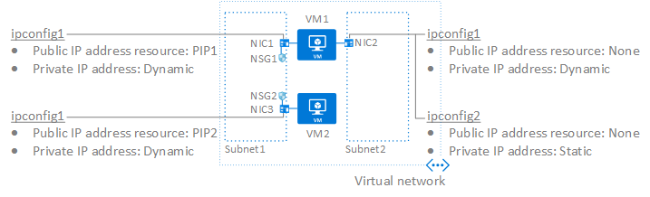

---
title: Azure network interfaces | Microsoft Docs
description: Learn how to create and delete network interfaces (NIC) and assign public and private IP addresses to NICs. Learn how to attach and detach NICs from Azure Virtual Machines.
services: virtual-network
documentationcenter: na
author: jimdial
manager: timlt
editor: ''
tags: azure-resource-manager

ms.assetid:
ms.service: virtual-network
ms.devlang: na
ms.topic: article
ms.tgt_pltfrm: na
ms.workload: infrastructure-services
ms.date: 03/14/2017
ms.author: jdial

---

# Network interfaces

Learn about network interfaces (NIC) and how to work with them. A NIC is the interconnection between an Azure Virtual Machine (VM) and the underlying software network. The following picture illustrates the capability that a NIC provides:

This article explains how to work with the concepts shown in the picture. Click any of the following concepts to go directly to that section of the article:

- [Network interfaces](#nics): A NIC is connected to one subnet within an Azure Virtual Network (VNet). In the picture, **VM1** has two NICs attached to it and **VM2** has one NIC attached to it. Each NIC is connected to the same VNet, but to different subnets. This section provides steps to list existing NICs, and create, change, and delete NICs.
- [IP configurations](#ip-configs): One or more IP configurations are associated to each NIC. Each IP configuration has a private IP address assigned to it. An IP configuration may have a public IP address associated to it. In the picture, **NIC1** and **NIC3** each have one IP configuration associated to them, while **NIC2** has two IP configurations associated to it. The IP configuration assigned to NIC1 and NIC3 have public IP addresses assigned, whereas neither IP configuration assigned to NIC2 has a public IP address assigned to it. This section provides steps to create, change, and delete IP configurations with private IP addresses assigned using the static and dynamic assignment methods. This section also provides steps to associate and disassociate public IP addresses to and from an IP configuration.
- [Network security groups](#nsgs): Network security groups (NSG) contain one or more inbound or outbound security rules. The rules control the type of network traffic that can flow into and out of a network interface, a subnet, or both. In the picture, **NIC1** and **NIC3** have an NSG associated to them, whereas **NIC2** does not. This section provides steps to view the NSGs applied to a NIC, add an NSG to a NIC, and remove an NSG from a NIC.
- [Virtual machines](#vms): A VM has at least one NIC attached to it, but can have several NICs attached to it, depending on the VM size. To see how many NICs each VM size supports, read the [Windows](../virtual-machines/windows/sizes.md) or [Linux](../virtual-machines/linux/sizes.md) VM sizes articles. This section provides steps to create single and multi-NIC VMs, as well as attach and detach NICs to and from existing VMs.

If you're new to NICs and VMs in Azure, we recommend you complete the exercise in the [Create your first Azure Virtual Network](virtual-network-get-started-vnet-subnet.md) before reading this article. The exercise helps familiarize you with VNets and VMs.

This article applies to VMs and NICs created through the Azure Resource Manager deployment model. Microsoft recommends creating resources through the Resource Manager deployment model, rather than the classic deployment model. Read the [Understand Azure deployment models](../azure-resource-manager/resource-manager-deployment-model.md?toc=%2fazure%2fvirtual-network%2ftoc.json) article if you're not familiar with the differences between the two models.

The remaining sections of this article provide steps to complete all NIC-related tasks. Each section lists:
- Steps to complete the task within the Azure portal. To complete the steps, you must be logged in to the [Azure portal](http://portal.azure.com). Sign up for a [free trial account](https://azure.microsoft.com/free) if you don't already have one.
- Commands to complete the task using Azure PowerShell with links to the command reference for the command. Install and configure PowerShell by completing the steps in the [How to Install and Configure Azure PowerShell](/powershell/azure/overview) article. To get help for PowerShell commands, with examples, type `get-help <command> -full`.
- Commands to complete the task using the Azure Command-line interface (CLI) with links to the command reference for the command. Install the Azure CLI by completing the steps in the [How to Install and Configure the Azure CLI 2.0](/cli/azure/install-azure-cli?toc=%2fazure%2fvirtual-network%2ftoc.json) article. To get help for CLI commands, type `az <command> -h`.

## Network interfaces
Complete the steps in the following sections to create, view, change, and delete network interfaces and settings:

### Create a network interface

A NIC may be attached to a VM, or exist on its own. To learn how to attach a NIC to a VM, read the [Attach a NIC to a virtual machine](#vm-attach-nic) section of this article.

To create a NIC, complete the following steps:

1. Log in to the [Azure portal](https://portal.azure.com) with an account that is assigned (at a minimum) permissions for the Network Contributor role for your subscription. Read the [Built-in roles for Azure role-based access control](../active-directory/role-based-access-built-in-roles.md?toc=%2fazure%2fvirtual-network%2ftoc.json#network-contributor) article to learn more about assigning roles and permissions to accounts.
2. In the box that contains the text *Search resources* at the top of the Azure portal, type *network interfaces*. When **network interfaces** appears in the search results, click it.
3. In the **Network interfaces** blade that appears, click **+ Add**.
4. In the **Create network interface** blade that appears, enter, or select values for the following settings then click **Create**:

	|**Setting**|**Required?**|**Details**|
	|---|---|---|
	|**Name**|Yes|The name cannot be changed after the NIC is created. The name must be unique within the resource group you select. Read the [Naming conventions](/azure/architecture/best-practices/naming-conventions?toc=%2fazure%2fvirtual-network%2ftoc.json#naming-rules-and-restrictions) article for naming suggestions.|
	|**Virtual network**|Yes|You can only connect a NIC to a VNet that exists in the same subscription and location as the NIC. The VM the NIC is attached to must also exist in the same location and subscription as the NIC. If no VNets are listed, you need to create one. To create a VNet, complete the steps in the [Virtual network](virtual-networks-create-vnet-arm-pportal.md) article. Once a NIC is created, you cannot change the VNet it is connected to.|
	|**Subnet**|Yes|Select a subnet within the VNet you selected. You can change the subnet the NIC is connected to after it's created.|
	|**Private IP address assignment**|Yes| A private IP address is assigned by the Azure DHCP server to the NIC when it's created. The DHCP server assigns an available address from the subnet address range defined for the subnet you connect the NIC to. **Dynamic:** Azure may assign a different address to a NIC when the VM it's attached to is started after having been in the stopped (deallocated) state. The address remains the same if the VM is restarted without having been in the stopped (deallocated) state. **Static:** Static addresses do not change until you change them or the NIC is deleted. You can change the assignment method after the NIC is created.|
	|**Network security group**|No|Network security groups enable you to control the flow of network traffic in and out of a NIC. To learn more about NSGs, read the [Network security groups](virtual-networks-nsg.md) article. You can apply zero or one network security group (NSG) to a NIC. Zero or one NSG can also be applied to the subnet the NIC is connected to. When an NSG is applied to a NIC and the subnet it's connected to, sometimes unexpected results occur. To troubleshoot NSGs applied to NICs, read the [Troubleshoot NSGs](virtual-network-nsg-troubleshoot-portal.md#view-effective-security-rules-for-a-network-interface) article.|
	|**Subscription**|Yes| The VM you attach a NIC to and the VNet you connect it to must exist in the same subscription.|
	|**Resource group**|Yes| The NIC can exist in the same, or different resource group, than the VM you attach it to, or the VNet you connect it to.|
	|**Location**|Yes|The VM you attach a NIC to and the VNet you connect it to must exist in the same location.|

The Azure portal creates a primary IP configuration named **ipconfig1** with a dynamic private IP address, and associates it to the NIC you create. To learn more about IP configurations, read the [IP configurations](#ip-configs) section of this article. You cannot specify the name of the IP configuration the portal creates, assign a static private IP address, or assign a public IP address when creating the NIC. If you create the NIC using PowerShell or the CLI, you can specify the name of the IP configuration, a static IP address, and assign a public IP address. You can change the private IP address assignment method and whether a public IP address is associated to the NIC after the NIC is created. To change settings after a NIC is created, complete the steps in the [Change an IP configuration](#change-ip-config) section of this article.

>[!Note]
> Azure assigns a MAC address to the NIC only after the NIC is attached to a VM and the VM is started the first time. You cannot specify the MAC address that Azure assigns to the NIC. The MAC address remains assigned to the NIC until the NIC is deleted or the private IP address assigned to the primary IP configuration of the primary NIC is changed. To learn more about IP configurations, read the [IP configurations](#ip-configs) section of this article.

|**Tool**|**Command**|
|:---|:---|
|**CLI**|[az network nic create](/cli/azure/network/nic?toc=%2fazure%2fvirtual-network%2ftoc.json#create)|
|**PowerShell**|[New-AzureRmNetworkInterface](/powershell/module/azurerm.network/nic)|

### View and change network interfaces and settings

To view and change network interfaces and settings, complete the following steps:

1. Log in to the [Azure portal](https://portal.azure.com) with an account that is assigned (at a minimum) permissions for the Network Contributor role for your subscription. Read the [Built-in roles for Azure role-based access control](../active-directory/role-based-access-built-in-roles.md?toc=%2fazure%2fvirtual-network%2ftoc.json#network-contributor) article to learn more about assigning roles and permissions to accounts.
2. In the box that contains the text *Search resources* at the top of the Azure portal, type *network interfaces*. When **network interfaces** appears in the search results, click it.
3. In the **Network interfaces** blade that appears, click the NIC you want to view or change settings for.
4. The following settings are listed in the blade that appears for the NIC you selected:
	- **Overview:** Provides information about the NIC, such as the IP addresses assigned to it, the VNet/subnet the NIC is connected to, and the VM the NIC is attached to (if it's attached to one).The following picture shows the overview settings for a NIC named **mywebserver256**:
		
	- **IP configurations:** A NIC has at least one IP configuration assigned to it, but can have several IP configurations assigned to it. To learn about the maximum number of IP configurations supported for a NIC, read the [Azure limits](../azure-subscription-service-limits.md?toc=%2fazure%2fvirtual-network%2ftoc.json#azure-resource-manager-virtual-networking-limits) article. Each IP configuration has one assigned private IP address, and may have one public IP address associated to it. To modify what's displayed, complete the steps in the [Add a secondary IP configuration to a NIC](#create-ip-config), [Change an IP configuration](#change-ip-config), or [Delete an IP configuration](#delete-ip-config) sections of this article.
	- **DNS servers:** You can specify which DNS server a NIC is assigned by the Azure DHCP servers. Choose between the Azure internal DNS server or a custom DNS server. To modify what's displayed, complete the steps in the [Change DNS settings for a NIC](#dns) section of this article.
	- **Network security group (NSG):** Displays whether an NSG is associated to the NIC. If an NSG is associated to the NIC, the name of the associated NSG is displayed. To modify what's displayed, complete the steps in the [Associate an NSG to or disassociate an NSG from a network interface](#associate-nsg) section of this article.
	- **Properties:** Displays key settings about the NIC, to include its MAC address and the subscription it exists in. You can move a NIC to a different resource group or subscription, as long as you also move all resources related to the NIC. If the NIC is attached to a VM, for example, you must also move the VM and any additional resources related to it. To move a NIC, read the [Move resource to a new resource group or subscription](../azure-resource-manager/resource-group-move-resources.md?toc=%2fazure%2fvirtual-network%2ftoc.json#use-portal) article. It lists prerequisites, and how to move resources using the Azure portal, PowerShell, and the Azure CLI.
	- **Effective security rules:**  Security rules are listed if the NIC is attached to a running VM, and an NSG is associated to the NIC, the subnet it's connected to, or both. To learn more about what's displayed, read the [Troubleshoot network security groups](virtual-network-nsg-troubleshoot-portal.md#view-effective-security-rules-for-a-network-interface) article . To learn more about NSGs, read the [Network security groups](virtual-networks-nsg.md) article.
	- **Effective routes:** Routes are listed if the NIC is attached to a running VM. The routes are a combination of the Azure default routes, any user-defined routes, and any BGP routes that may exist for the subnet the NIC is connected to. To learn more about what's displayed, read the [Troubleshoot routes](virtual-network-routes-troubleshoot-portal.md#view-effective-routes-for-a-network-interface) article. To learn more about user-defined routes, read the [User-defined routes](virtual-networks-udr-overview.md) article.
	- **Common Azure Resource Manager settings:**  To learn more about common Azure Resource Manager settings, read the [Activity log](../azure-resource-manager/resource-group-overview.md?toc=%2fazure%2fvirtual-network%2ftoc.json#activity-logs), [Access control (IAM)](../azure-resource-manager/resource-group-overview.md?toc=%2fazure%2fvirtual-network%2ftoc.json#access-control), [Tags](../azure-resource-manager/resource-group-overview.md?toc=%2fazure%2fvirtual-network%2ftoc.json#tags), [Locks](../azure-resource-manager/resource-group-lock-resources.md?toc=%2fazure%2fvirtual-network%2ftoc.json), and [Automation script](../azure-resource-manager/resource-manager-export-template.md?toc=%2fazure%2fvirtual-network%2ftoc.json#export-the-template-from-resource-group) articles.

|**Tool**|**Command**|
|---|---|
|**CLI**|[az network nic list](/cli/azure/network/nic?toc=%2fazure%2fvirtual-network%2ftoc.json#list) to view NICs in the subscription; [az network nic show](/cli/azure/network/nic?toc=%2fazure%2fvirtual-network%2ftoc.json#show) to view settings for a NIC|
|**PowerShell**|[Get-AzureRmNetworkInterface](/powershell/module/azurerm.network/get-azurermnetworkinterface) to view NICs in the subscription or view settings for a NIC|

### Change DNS settings for a NIC

To change the DNS settings for a NIC, complete the following steps. The DNS server is assigned to the VM by the Azure DHCP server. To learn more about name resolution settings for a NIC, read the [Name resolution for VMs](virtual-networks-name-resolution-for-vms-and-role-instances.md) article.

1. Complete steps 1-3 in the [View and change network interfaces and settings](#view-nics) section of this article for the NIC you want to change settings for.
2. In the blade for the NIC you selected, click **DNS servers**.
3. Click either:
	- **Inherit from virtual network (default)**: Choose this option to inherit the DNS server setting defined for the virtual network the NIC is connected to. At the VNet level, either a custom DNS server or the Azure-provided DNS server is defined. The Azure-provided DNS server can resolve names for resources connected to the same VNet, but not for resources connected to different VNets.
	- **Custom**: You can configure your own DNS server to resolve names across multiple VNets. Enter the IP address of the server you want to use as a DNS server. The DNS server address you specify is assigned only to this NIC and overrides any DNS setting for the VNet the NIC is connected to.
4. Click **Save**.

|**Tool**|**Command**|
|---|---|
|**CLI**|[az network nic update](/cli/azure/network/nic?toc=%2fazure%2fvirtual-network%2ftoc.json#update)|
|**PowerShell**|[Set-AzureRmNetworkInterface](/powershell/module/azurerm.network/set-azurermnetworkinterface)|

### Change IP forwarding for a NIC

IP forwarding enables the VM a NIC is attached to:
- Receive network traffic not destined for one of the IP addresses assigned to any of the IP configurations assigned to the NIC.
- Send network traffic with a different source IP address than the one assigned to one of its IP configurations.

The setting must be enabled for every NIC attached to the VM that receives traffic that the VM needs to forward. A VM can forward traffic whether it has multiple NICs or a single NIC attached to it. While IP forwarding is an Azure setting, the VM must also run an application able to forward the traffic, such as firewall, WAN optimization, and load balancing applications. When a VM is running network applications, the VM is often referred to as a network virtual appliance (NVA). You can view a list of ready to deploy NVAs in the [Azure Marketplace](https://azuremarketplace.microsoft.com/marketplace/apps/category/networking?page=1&subcategories=appliances). IP forwarding is typically used with user-defined routes. To learn more about user-defined routes, read the [User-defined routes](virtual-networks-udr-overview.md) article.

To change IP forwarding settings for a NIC, complete the following steps:

1. Complete steps 1-3 in the [View and change network interfaces and settings](#view-nics) section of this article for the NIC you want to modify.
2. In the blade for the NIC you selected, click IP configurations
3. Click **Enabled** or **Disabled** (default setting) to change the setting.
4. Click **Save**.

|**Tool**|**Command**|
|---|---|
|**CLI**|[az network nic update](/cli/azure/network/nic?toc=%2fazure%2fvirtual-network%2ftoc.json#update)|
|**PowerShell**|[Set-AzureRmNetworkInterface](/powershell/module/azurerm.network/set-azurermnetworkinterface)|

### Change the subnet a NIC is connected to

You can change the subnet, but not the VNet, that a NIC is connected to. To change the subnet, all IP configurations associated to the NIC must be assigned dynamic private IP addresses. To change the subnet a NIC is connected to, complete the following steps:

1. Complete steps 1-3 in the [View and change network interfaces and settings](#view-nics) section of this article for the NIC you want to connect to a different subnet.
2. Click **IP configurations** in the blade for the NIC you selected. If any private IP addresses for any IP configurations listed have a private IP address assigned with the static method, you must change the method to dynamic by completing the steps that follow. If the addresses are assigned with the dynamic method, continue to step three:
	- Click the static IP address for the IP configuration you want to change from the list of IP configurations.
	- In the blade that appears for the IP configuration, click **Dynamic** for the **Assignment** method.
	- Click **Save**.
3. Select the subnet you want to connect the NIC to from the **Subnet** drop-down list.
4. Click **Save**. New dynamic addresses are assigned from the net subnet address range. If you choose, you can then assign static IP addresses from the new subnet address range.

|**Tool**|**Command**|
|---|---|
|**CLI**|[az network nic ip-config update](/cli/azure/network/nic/ip-config?toc=%2fazure%2fvirtual-network%2ftoc.json#update)|
|**PowerShell**|[Set-AzureRmNetworkInterfaceIpConfig](/powershell/module/azurerm.network/set-azurermnetworkinterfaceipconfig)|

### Delete a network interface

You can delete a NIC as long as it's not attached to a VM. If it is attached to a VM, you must first detach it from the VM before you can delete it. To detach a NIC from a VM, complete the steps in the [Detach a NIC from a virtual machine](#vm-detach-nic) section of this article.

1. Complete steps 1-2 in the [View and change network interfaces and settings](#view-nics) section of this article for the NIC you want to delete.
2. Right-click the NIC you want to delete and click **Delete**.
3. Click **Yes** to confirm deletion of the NIC.

When you delete a NIC, any MAC or IP addresses assigned to it are released.

|**Tool**|**Command**|
|---|---|
|**CLI**|[az network nic delete](/cli/azure/network/nic?toc=%2fazure%2fvirtual-network%2ftoc.json#delete)|
|**PowerShell**|[Remove-AzureRmNetworkInterface](/powershell/module/azurerm.network/remove-azurermnetworkinterface)|

## IP configurations
Each NIC has at least one IP configuration, referred to as the **Primary** configuration. A NIC may also have one or more *secondary* IP configurations associated to it. There are limits to the number of IP addresses that you can assign to a NIC. For details, read the [Azure limits](../azure-subscription-service-limits.md?toc=%2fazure%2fvirtual-network%2ftoc.json#azure-resource-manager-virtual-networking-limits) article. Each IP configuration:
- Has one private IP address assigned to it using the static or dynamic assignment method. Dynamic IP addresses may change if a VM is started after being in the stopped (deallocated) state. Static IP addresses are released from a NIC only if the NIC is deleted.
- May have one public IP address associated to it.

The Azure DHCP servers assign the private IP address for the primary IP configuration of the NIC to the NIC within the VM operating system.

Assigning multiple IP addresses to a NIC is helpful in scenarios such as:
- Hosting multiple websites or services with different IP addresses and SSL certificates on a single server.
- A VM serving as a network virtual appliance, such as a firewall or load balancer.
- The ability to add any of the private IP addresses for any of the NICs to an Azure Load Balancer back-end pool. In the past, only the primary IP address for the primary NIC could be added to a back-end pool. To learn more about how to load balance multiple IP configurations, read the [Load balancing multiple IP configurations](../load-balancer/load-balancer-multiple-ip.md?toc=%2fazure%2fvirtual-network%2ftoc.json) article.

There is a limited number of public IP addresses that can be used within a subscription and a limited number of private IP addresses that can be assigned to a NIC. To learn more about these limits, read the [Azure limits](../azure-subscription-service-limits.md?toc=%2fazure%2fvirtual-network%2ftoc.json#azure-resource-manager-virtual-networking-limits) article.

### Add a secondary IP configuration to a NIC

You can add as many IP configurations as necessary to a NIC, within the limits listed in the [Azure limits](../azure-subscription-service-limits.md?toc=%2fazure%2fvirtual-network%2ftoc.json#azure-resource-manager-virtual-networking-limits) article. To add an IP configuration to a NIC, complete the following steps:

1. Complete steps 1-3 in the [View network interface settings](#view-nics) section of this article for the NIC you want to add an IP configuration to.
2. Click **IP configurations** in the blade for the NIC you selected.
3. Click **+ Add** in the blade that opens for IP configurations.
4. Specify the following, then click **OK** to close the **Add IP configuration** blade:

	|**Setting**|**Required?**|**Details**|
	|---|---|---|
	|**Name**|Yes|Must be unique for the NIC|
	|**Type**|Yes|Since you're adding an IP configuration to an existing NIC, and each NIC must have a primary IP configuration, your only option is **Secondary**.|
	|**Private IP address assignment method**|Yes|**Dynamic** addresses can change if the VM is restarted after having been in the stopped (deallocated) state. **Static** addresses aren't released until the NIC is deleted. Specify an IP address from the subnet address space range that is not currently in use by another IP configuration.|
	|**Public IP address**|No|**Disabled:** No public IP address resource is currently associated to the IP configuration. **Enabled:** Select an existing Public IP address, or create a new one. To learn how to create a public IP address, read the [Public IP addresses](virtual-network-public-ip-address.md#create) article.|
5. Manually add secondary private IP addresses to the VM operating system by completing the instructions in the [Assign multiple IP addresses to virtual machines](virtual-network-multiple-ip-addresses-portal.md#os-config) article. Do not add any public IP addresses to the VM operating system.

|**Tool**|**Command**|
|---|---|
|**CLI**|[az network nic ip-config create](/cli/azure/network/nic/ip-config?toc=%2fazure%2fvirtual-network%2ftoc.json#create)|
|**PowerShell**|[Add-AzureRmNetworkInterfaceIpConfig](/powershell/module/azurerm.network/add-azurermnetworkinterfaceipconfig)|

### Change an IP configuration

To change the private and public IP address settings for any primary or secondary IP configuration, complete the following steps:

1. Complete steps 1-3 in the [View network interface settings](#view-nics) section of this article for the NIC you want to modify.
2. Click **IP configurations** in the blade for the NIC you selected.
3. Click the IP configuration you want to modify from the list in the blade that opens for IP configurations.
4. Change the settings, as desired, using the information about the settings in the [Add an IP configuration](#create-ip-config) section of this article, then click **Save** to close the blade for the IP config you selected.

>[!NOTE]
>If the primary NIC has multiple IP configurations and you change the private IP address of the primary IP configuration, you must manually reassign all secondary IP addresses to the NIC within Windows (not required for Linux). To manually assign IP addresses to a NIC within an operating system, read the [Assign multiple IP addresses to virtual machines](virtual-network-multiple-ip-addresses-portal.md#os-config) article. Do not add any public IP addresses to the VM operating system.

>[!WARNING]
>To change the private IP address of a secondary IP configuration associated with a secondary NIC, the steps above must be completed only after the VM is stopped and deallocated.

|**Tool**|**Command**|
|---|---|
|**CLI**|[az network nic ip-config update](/cli/azure/network/nic/ip-config?toc=%2fazure%2fvirtual-network%2ftoc.json#update)|
|**PowerShell**|[Set-AzureRmNetworkInterfaceIpConfig](/powershell/module/azurerm.network/set-azurermnetworkinterfaceipconfig)|

### Delete a secondary IP configuration from a NIC

Complete the following steps to delete a secondary IP configuration from a NIC:

1. Complete steps 1-3 in the [View network interface settings](#view-nics) section of this article for the NIC you want to modify.
2. Click **IP configurations** in the blade for the NIC you selected.
3. Right-click the secondary IP configuration you want to delete and click **Delete**. If the configuration had a public IP address resource associated to it, the resource is dissociated from the IP configuration, but the resource is not deleted.
4. Close the **IP configurations** blade.

|**Tool**|**Command**|
|---|---|
|**CLI**|[az network nic ip-config delete](/cli/azure/network/nic/ip-config?toc=%2fazure%2fvirtual-network%2ftoc.json#delete)|
|**PowerShell**|[Remove-AzureRmNetworkInterfaceIpConfig](/powershell/module/azurerm.network/remove-azurermnetworkinterfaceipconfig)|

## Network security groups
A network security group (NSG) contains a list of inbound and outbound rules that allow or deny network traffic to a NIC. A NIC, and the subnet the NIC is connected to, are not required to have an NSG associated. An NSG can be associated to a NIC, the subnet the NIC is connected to, or both however. NSGs with rules applicable to all NICs connected to the subnet are typically associated to subnets. An NSG with more granular rules might then be applied to individual NICs. To learn more about network security groups, read the [Network security groups](virtual-networks-nsg.md) article.

### Associate an NSG to or disassociate an NSG from a network interface

To associate an NSG to a NIC or disassociate an NSG from a NIC, complete the following steps:

1. Complete steps 1-3 in the [View and change network interfaces and settings](#view-nics) section of this article for the NIC you want to associate or disassociate an NSG to or from.
2. In the blade for the NIC you selected, click **Network security group**. A blade appears with **Edit** at the top of it. If no NSG is currently associated to the NIC, **Network security group** *None* is displayed. If an NSG is currently associated to a NIC, **Network security group** *NSG-Name* (where NSG-Name is the name of the NSG currently associated to the NIC) is displayed.
3. Click **Edit**.
4. Click **Network security group**. If no network security groups are listed, it's because none exist in your subscription. To create an NSG, complete the steps in the [Network security groups](virtual-networks-create-nsg-arm-pportal.md) article.
5. In the **Choose network security group** blade that appears, click an existing NSG from the list to associate that NSG to the NIC, or click **None**, to disassociate an NSG currently associated to a NIC.
6. Click **Save**.

|**Tool**|**Command**|
|---|---|
|**CLI**|[az network nic update](/cli/azure/network/nic?toc=%2fazure%2fvirtual-network%2ftoc.json#update)|
|**PowerShell**|[Set-AzureRmNetworkInterface](/powershell/module/azurerm.network/set-azurermnetworkinterface)|

## Attach and detach NICs to or from a virtual machine

You can attach an existing NIC to a VM when you create it or you can attach an existing NIC to an existing VM. You can also detach a NIC from an existing VM that has at least two NICs. Though the portal creates a NIC when you create a VM, it does not allow you to:

- Specify an existing NIC to attach when creating the VM
- Create a VM with multiple NICs attached
- Specify a name for the NIC (the portal creates the NIC with a default name)
- Specify that the private IP address assignment method is static. The portal automatically assigns a dynamic private IP address, though you can change the assignment method after the portal creates the NIC.

You can use PowerShell or the CLI to create a NIC or VM with all the previous attributes that you cannot use the portal for. Before completing the tasks in the following sections, consider the following constraints and behaviors:

- Different VM sizes support different numbers of NICs. To learn more about how many NICs each VM size supports, read the [Linux](../virtual-machines/linux/sizes.md?toc=%2fazure%2fvirtual-network%2ftoc.json) or [Windows](../virtual-machines/virtual-machines-windows-sizes.md?toc=%2fazure%2fvirtual-network%2ftoc.json) VM sizes articles. 
- In the past, NICs could only be added to VMs that supported multiple NICs and were created with at least two NICs. You could not add a NIC to a VM that was created with one NIC, even if the VM size supported multiple NICs. Conversely, you could only remove NICs from a VM with at least three NICs attached to it, because VMs created with at least two NICs always had to have at least two NICs attached. Neither of these constraints apply anymore. You can now create a VM with any number of NICs (up to the number supported by the VM size) and add or remove any number of NICs, as long as the VM always has at least one attached NIC. 
- By default, the first NIC attached to a VM is defined as the *primary* NIC. All other NICs attached to the VM are *secondary* NICs.
- By default, all outbound traffic from the VM is sent out the IP address assigned to the primary IP configuration of the primary NIC. You can of course, control which IP address is used for outbound traffic within the VM's operating system.
- In the past, all VMs within the same availability set were required to have a single, or multiple, NICs. VMs with any number of NICs can now exist in the same availability set. A VM can only be added to an availability set when it's created though. To learn more about availability sets, read the [Manage the availability of Windows virtual machines in Azure](../virtual-machines/windows/manage-availability.md?toc=%2fazure%2fvirtual-network%2ftoc.json#configure-multiple-virtual-machines-in-an-availability-set-for-redundancy) article.
- While NICs attached to the same VM can be connected to different subnets within a VNet, the NICs must all be connected to the same VNet.
- You can add any IP address for any IP configuration of any primary or secondary NIC to an Azure Load Balancer back-end pool. In the past, only the primary IP address for the primary NIC could be added to a back-end pool.
- Deleting a VM does not delete the NICs attached to it. When a VM is deleted, the NICs are detached from the VM. You can attach the NICs to different VMs, or delete them.

### Attach one or more NICs when creating a virtual machine

You cannot attach existing NICs to a new VM, or create a VM with multiple NICs using the Azure portal. You can use the following Azure CLI or PowerShell commands to attach one or more existing NICs when creating a VM:

- **CLI:** [az vm create](/cli/azure/vm?toc=%2fazure%2fvirtual-network%2ftoc.json#create)
- **PowerShell:** [New-AzureRmVM](/powershell/module/azurerm.compute/new-azurermvm)

###  View NICs attached to a virtual machine

1. Log in to the [Azure portal](https://portal.azure.com) with an account that is assigned the Owner, Contributor, or Network Contributor role for your subscription. Read the [Built-in roles for Azure role-based access control](../active-directory/role-based-access-built-in-roles.md?toc=%2fazure%2fvirtual-network%2ftoc.json#network-contributor) article to learn more about assigning roles to accounts.
2. In the box that contains the text *Search resources* at the top of the Azure portal, type *virtual machines*. When **virtual machines** appears in the search results, click it.
3. In the **Virtual machines** blade that appears, click the name of the VM you want to view attached network interfaces for.
4. In the **Virtual machine** blade that appears for the VM you selected, click **Network interfaces**.

|**Tool**|**Command**|
|---|---|
|**CLI**|[az vm show](/cli/azure/vm?toc=%2fazure%2fvirtual-network%2ftoc.json#show)|
|**PowerShell**|[Get-AzureRmVM](/powershell/module/azurerm.compute/get-azurermvm)|

### Attach a NIC to an existing virtual machine

The VM you want to attach a NIC to must support multiple NICs and be in the stopped (deallocated) state. You cannot attach NICs to an existing VM using the Azure portal. You can use the following Azure CLI or PowerShell commands to attach NICs to VMs:

- **CLI:** [az vm nic add](/cli/azure/vm/nic?toc=%2fazure%2fvirtual-network%2ftoc.json#add)
- **PowerShell:** [Add-AzureRmVMNetworkInterface](/powershell/module/azurerm.compute/add-azurermvmnetworkinterface)

### Detach a NIC from an existing virtual machine

The VM you want to detach a NIC from must be in the stopped (deallocated) state and must currently have at least two attached NICs. You can detach any NIC, but the VM must always have at least one NIC attached. If you detach a primary NIC, Azure assigns the primary attribute to a remaining attached NIC that's been attached to the VM the longest. You can also designate any NIC as the primary yourself. You cannot detach NICs from a VM, nor set the primary attribute for a NIC using the Azure portal, though you can accomplish both operations using the CLI or PowerShell. You can use the following Azure CLI or PowerShell commands to detach NICs from VMs:

- **CLI:** [az vm nic remove](/cli/azure/vm/nic?toc=%2fazure%2fvirtual-network%2ftoc.json#remove)
- **PowerShell:** [Remove-AzureRMVMNetworkInterface](/powershell/module/azurerm.compute/remove-azurermvmnetworkinterface)

## Next Steps
To create a VM with multiple NICs or IP configurations using scripts, read the following articles:

|**Task**|**Tool**|
|---|---|
|**Create a VM with multiple NICs**|[CLI](virtual-network-deploy-multinic-arm-cli.md) and [PowerShell](virtual-network-deploy-multinic-arm-ps.md)|
|**Create a single NIC VM with multiple IP addresses assigned to it**|[CLI](virtual-network-multiple-ip-addresses-cli.md) and [PowerShell](virtual-network-multiple-ip-addresses-powershell.md)|
