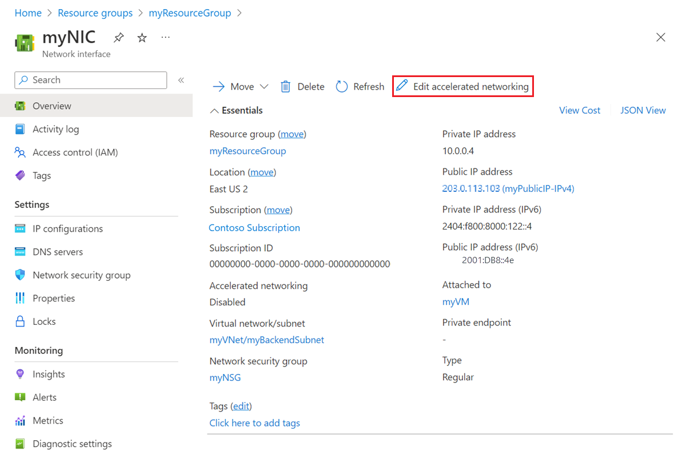

# Network interface settings and tasks

Learn how to create, change settings for, and delete a network interface (NIC). A NIC enables an Azure Virtual Machine (VM) to communicate with Internet, Azure, and on-premises resources. When creating a VM using the Azure portal, the portal creates one NIC with default settings for you. You may instead choose to create NICs with custom settings and add one or more to VMs when you create them. You may also want to change default NIC settings for existing NICs. This article explains how to create NICs with custom settings, and change existing NIC settings, such as network filter assignment (network security groups), subnet assignment, DNS server settings, and IP forwarding. 

If you need to add, change, or remove IP addresses for a NIC, read the [Add, change, or remove IP addresses](virtual-network-network-interface-addresses.md) article. If you need to add NICs to, or remove NICs from VMs, read the [Add or remove NICs](virtual-network-network-interface-vm.md) article. 

## Before you begin

Complete the following tasks before completing any steps in any section of this article:

- Review the [Azure limits](../azure-subscription-service-limits.md?toc=%2fazure%2fvirtual-network%2ftoc.json#azure-resource-manager-virtual-networking-limits) article to learn about limits for NICs.
- Log in to the Azure portal, Azure command-line interface (CLI), or Azure PowerShell with an Azure account. If you don't already have an Azure account, sign up for a [free trial account](https://azure.microsoft.com/free).
- If using PowerShell commands to complete tasks in this article, install and configure Azure PowerShell by completing the steps in the [How to install and configure Azure PowerShell](/powershell/azureps-cmdlets-docs?toc=%2fazure%2fvirtual-network%2ftoc.json) article. Ensure you have the most recent version of the Azure PowerShell commandlets installed. To get help for PowerShell commands, with examples, type `get-help <command> -full`.
- If using Azure Command-line interface (CLI) commands to complete tasks in this article, install and configure the Azure CLI by completing the steps in the [How to install and configure the Azure CLI](/cli/azure/install-azure-cli?toc=%2fazure%2fvirtual-network%2ftoc.json) article. Ensure you have the most recent version of the Azure CLI installed. To get help for CLI commands, type `az <command> --help`.

## Create a NIC
When creating a VM using the Azure portal, the portal creates a NIC with default settings for you. If you'd rather specify all your NIC settings, you can create a NIC with custom settings and attach the NIC to a VM when creating a VM. You can also create a NIC and add it to an existing VM. To learn how to create a VM with an existing NIC or to add to, or remove NICs from existing VMs, read the [Add or remove NICs](virtual-network-network-interface-vm.md) article. Before creating a NIC, you must have an existing virtual network (VNet) in the same location and subscription you create a NIC in. To learn how to create a VNet, read the [Create a VNet](virtual-networks-create-vnet-arm-pportal.md) article.

1. Log in to the [Azure portal](https://portal.azure.com) with an account that is assigned (at a minimum) permissions for the Network Contributor role for your subscription. Read the [Built-in roles for Azure role-based access control](../active-directory/role-based-access-built-in-roles.md?toc=%2fazure%2fvirtual-network%2ftoc.json#network-contributor) article to learn more about assigning roles and permissions to accounts.
2. In the box that contains the text *Search resources* at the top of the Azure portal, type *network interfaces*. When **network interfaces** appears in the search results, click it.
3. In the **Network interfaces** blade that appears, click **+ Add**.
4. In the **Create network interface** blade that appears, enter, or select values for the following settings, then click **Create**:

	|Setting|Required?|Details|
	|---|---|---|
	|Name|Yes|The name must be unique within the resource group you select. Over time, you'll likely have several NICs in your Azure subscription. Read the [Naming conventions](/azure/architecture/best-practices/naming-conventions?toc=%2fazure%2fvirtual-network%2ftoc.json#naming-rules-and-restrictions) article for suggestions when creating a naming convention to make managing several NICs easier. The name cannot be changed after the NIC is created.|
	|Virtual network|Yes|Select a VNet to connect the NIC to. You can only connect a NIC to a VNet that exists in the same subscription and location as the NIC. Once a NIC is created, you cannot change the VNet it is connected to. The VM you add the NIC to must also exist in the same location and subscription as the NIC.|
	|Subnet|Yes|Select a subnet within the VNet you selected. You can change the subnet the NIC is connected to after it's created.|
	|Private IP address assignment|Yes| Choose from the following assignment methods: **Dynamic:** When selecting this option, Azure automatically assigns an available address from the address space of the subnet you selected. Azure may assign a different address to a NIC when the VM it's in is started after having been in the stopped (deallocated) state. The address remains the same if the VM is restarted without having been in the stopped (deallocated) state. **Static:** When selecting this option, you must manually assign an available IP address from within the address space of the subnet you selected. Static addresses do not change until you change them or the NIC is deleted. You can change the assignment method after the NIC is created. The Azure DHCP server assigns this address to the NIC within the operating system of the VM.|
	|Network security group|No| Leave set to **None**, select an existing network security group (NSG), or create an NSG. NSGs enable you to filter network traffic in and out of a NIC. To learn more about NSGs, read the [Network security groups](virtual-networks-nsg.md) article. To create an NSG, read the [Create an NSG](virtual-networks-create-nsg-arm-pportal.md) article. You can apply zero or one NSG to a NIC. Zero or one NSG can also be applied to the subnet the NIC is connected to. When an NSG is applied to a NIC and the subnet the NIC is connected to, sometimes unexpected results occur. To troubleshoot NSGs applied to NICs and subnets, read the [Troubleshoot NSGs](virtual-network-nsg-troubleshoot-portal.md#view-effective-security-rules-for-a-network-interface) article.|
	|Subscription|Yes|Select one of your Azure [subscriptions](../azure-glossary-cloud-terminology.md?toc=%2fazure%2fvirtual-network%2ftoc.json#subscription). The VM you attach a NIC to and the VNet you connect it to must exist in the same subscription.|
	|Resource group|Yes|Select an existing [resource group](../azure-glossary-cloud-terminology.md?toc=%2fazure%2fvirtual-network%2ftoc.json#resource-group) or create one. A NIC can exist in the same, or different resource group, than the VM you attach it to, or the VNet you connect it to.|
	|Location|Yes|The VM you attach a NIC to and the VNet you connect it to must exist in the same [location](https://azure.microsoft.com/regions), also referred to as a region.|

The portal doesn't provide the option to assign a public IP address to the NIC when you create it, though it does assign a public IP address to a NIC when you create a VM using the portal. To learn how to add a public IP address to the NIC after creating it, read the [Add, change, or remove IP addresses](virtual-network-network-interface-addresses.md) article. If you want to create a NIC with a public IP address, you must use the CLI or PowerShell to create the NIC.

>[!Note]
> Azure assigns a MAC address to the NIC only after the NIC is attached to a VM and the VM is started the first time. You cannot specify the MAC address that Azure assigns to the NIC. The MAC address remains assigned to the NIC until the NIC is deleted or the private IP address assigned to the primary IP configuration of the primary NIC is changed. To learn more about IP addresses and IP configurations, read the [Add, change, or remove IP addresses](virtual-network-network-interface-addresses.md) article.

**Commands**

|Tool|Command|
|---|---|
|CLI|[az network nic create](/cli/azure/network/nic?toc=%2fazure%2fvirtual-network%2ftoc.json#create)|
|PowerShell|[New-AzureRmNetworkInterface](/powershell/resourcemanager/azurerm.network/v3.4.0/new-azurermnetworkinterface/cli/azure/network/nic?toc=%2fazure%2fvirtual-network%2ftoc.json#create)|

## View NIC settings

You can view and change most settings for a NIC.

1. Log in to the [Azure portal](https://portal.azure.com) with an account that is assigned (at a minimum) permissions for the Network Contributor role for your subscription. Read the [Built-in roles for Azure role-based access control](../active-directory/role-based-access-built-in-roles.md?toc=%2fazure%2fvirtual-network%2ftoc.json#network-contributor) article to learn more about assigning roles and permissions to accounts.
2. In the box that contains the text *Search resources* at the top of the Azure portal, type *network interfaces*. When **network interfaces** appears in the search results, click it.
3. In the **Network interfaces** blade that appears, click the NIC you want to view or change settings for.
4. The following settings are listed in the blade that appears for the NIC you selected:
	- **Overview:** Provides information about the NIC, such as the IP addresses assigned to it, the VNet/subnet the NIC is connected to, and the VM the NIC is attached to (if it's attached to one). The following picture shows the overview settings for a NIC named **mywebserver256**:
		
    You can move a NIC to a different resource group or subscription by clicking (**change**) next to the **Resource group** or **Subscription name**. If you move the NIC, you must move all resources related to the NIC with it. If the NIC is attached to a VM, for example, you must also move the VM, and other VM-related resources. To move a NIC, read the [Move resource to a new resource group or subscription](../azure-resource-manager/resource-group-move-resources.md?toc=%2fazure%2fvirtual-network%2ftoc.json#use-portal) article. The article lists prerequisites, and how to move resources using the Azure portal, PowerShell, and the Azure CLI.
	- **IP configurations:** Public and private IP addresses are assigned to one or more IP configurations for a NIC. To learn more about the maximum number of IP configurations supported for a NIC, read the [Azure limits](../azure-subscription-service-limits.md?toc=%2fazure%2fvirtual-network%2ftoc.json#azure-resource-manager-virtual-networking-limits) article. Each IP configuration has one assigned private IP address, and may have one public IP address associated to it. To add, change, or delete IP configurations from the NIC, complete the steps in the [Add a secondary IP configuration to a NIC](virtual-network-network-interface-addresses.md#create-ip-config), [Change an IP configuration](virtual-network-network-interface-addresses.md#change-ip-config), or [Delete an IP configuration](virtual-network-network-interface-addresses.md#delete-ip-config) sections of the [Add, change, or remove IP addresses](virtual-network-network-interface-addresses.md) article. IP forwarding and subnet assignment are also configured in this section. To learn more about these settings, read the [Enable-disable IP forwarding](#ip-forwarding) and [Change subnet assignment](#subnet) sections of this article.
	- **DNS servers:** You can specify which DNS server a NIC is assigned by the Azure DHCP servers. The NIC can inherit the setting from the VNet the NIC is connected to, or have a custom setting that overrides the setting for the VNet it's connected to. To modify what's displayed, complete the steps in the [Change DNS servers](#dns) section of this article.
	- **Network security group (NSG):** Displays which NSG is associated to the NIC (if any). An NSG contains inbound and outbound rules to filter network traffic for the NIC. If an NSG is associated to the NIC, the name of the associated NSG is displayed. To modify what's displayed, complete the steps in the [Associate an NSG to or disassociate an NSG from a network interface](#associate-nsg) section of this article.
	- **Properties:** Displays key settings about the NIC, including its MAC address (blank if the NIC isn't attached to a VM), and the subscription it exists in.
	- **Effective security rules:**  Security rules are listed if the NIC is attached to a running VM, and an NSG is associated to the NIC, the subnet it's connected to, or both. To learn more about what's displayed, read the [Troubleshoot network security groups](virtual-network-nsg-troubleshoot-portal.md#view-effective-security-rules-for-a-network-interface) article. To learn more about NSGs, read the [Network security groups](virtual-networks-nsg.md) article.
	- **Effective routes:** Routes are listed if the NIC is attached to a running VM. The routes are a combination of the Azure default routes, any user-defined routes (UDR), and any BGP routes that may exist for the subnet the NIC is connected to. To learn more about what's displayed, read the [Troubleshoot routes](virtual-network-routes-troubleshoot-portal.md#view-effective-routes-for-a-network-interface) article. To learn more about Azure default and UDRs, read the [User-defined routes](virtual-networks-udr-overview.md) article.
	- **Common Azure Resource Manager settings:**  To learn more about common Azure Resource Manager settings, read the [Activity log](../azure-resource-manager/resource-group-overview.md?toc=%2fazure%2fvirtual-network%2ftoc.json#activity-logs), [Access control (IAM)](../azure-resource-manager/resource-group-overview.md?toc=%2fazure%2fvirtual-network%2ftoc.json#access-control), [Tags](../azure-resource-manager/resource-group-overview.md?toc=%2fazure%2fvirtual-network%2ftoc.json#tags), [Locks](../azure-resource-manager/resource-group-lock-resources.md?toc=%2fazure%2fvirtual-network%2ftoc.json), and [Automation script](../azure-resource-manager/resource-manager-export-template.md?toc=%2fazure%2fvirtual-network%2ftoc.json#export-the-template-from-resource-group) articles.

**Commands**

|Tool|Command|
|---|---|
|CLI|[az network nic list](/cli/azure/network/nic?toc=%2fazure%2fvirtual-network%2ftoc.json#list) to view NICs in the subscription; [az network nic show](/cli/azure/network/nic?toc=%2fazure%2fvirtual-network%2ftoc.json#show) to view settings for a NIC|
|PowerShell|[Get-AzureRmNetworkInterface](/powershell/resourcemanager/azurerm.network/v3.4.0/get-azurermnetworkinterface?toc=%2fazure%2fvirtual-network%2ftoc.json) to view NICs in the subscription or view settings for a NIC|

## Change DNS servers

The DNS server is assigned by the Azure DHCP server to the NIC within the VM operating system. The DNS server assigned is whatever the DNS server setting is for a NIC. To learn more about name resolution settings for a NIC, read the [Name resolution for VMs](virtual-networks-name-resolution-for-vms-and-role-instances.md) article. The NIC can inherit the settings from the VNet, or use its own unique settings that override the setting for the VNet.

1. Log in to the [Azure portal](https://portal.azure.com) with an account that is assigned (at a minimum) permissions for the Network Contributor role for your subscription. Read the [Built-in roles for Azure role-based access control](../active-directory/role-based-access-built-in-roles.md?toc=%2fazure%2fvirtual-network%2ftoc.json#network-contributor) article to learn more about assigning roles and permissions to accounts.
2. In the box that contains the text *Search resources* at the top of the Azure portal, type *network interfaces*. When **network interfaces** appears in the search results, click it.
3. In the **Network interfaces** blade that appears, click the NIC you want to view or change settings for.
4. In the blade for the NIC you selected, click **DNS servers** under **SETTINGS**.
5. Click either:
	- **Inherit from virtual network (default)**: Choose this option to inherit the DNS server setting defined for the virtual network the NIC is connected to. At the VNet level, either a custom DNS server or the Azure-provided DNS server is defined. The Azure-provided DNS server can resolve hostnames for resources connected to the same VNet. FQDN must be used to resolve for resources connected to different VNets.
	- **Custom**: You can configure your own DNS server to resolve names across multiple VNets. Enter the IP address of the server you want to use as a DNS server. The DNS server address you specify is assigned only to this NIC and overrides any DNS setting for the VNet the NIC is connected to.
6. Click **Save**.

**Commands**

|Tool|Command|
|---|---|
|CLI|[az network nic update](/cli/azure/network/nic?toc=%2fazure%2fvirtual-network%2ftoc.json#update)|
|PowerShell|[Set-AzureRmNetworkInterface](/powershell/resourcemanager/azurerm.network/v3.4.0/set-azurermnetworkinterface?toc=%2fazure%2fvirtual-network%2ftoc.json)|

## Enable-disable IP forwarding

IP forwarding enables the VM a NIC is attached to:
- Receive network traffic not destined for one of the IP addresses assigned to any of the IP configurations assigned to the NIC.
- Send network traffic with a different source IP address than the one assigned to one of a NIC's IP configurations.

The setting must be enabled for every NIC attached to the VM that receives traffic that the VM needs to forward. A VM can forward traffic whether it has multiple NICs or a single NIC attached to it. While IP forwarding is an Azure setting, the VM must also run an application able to forward the traffic, such as firewall, WAN optimization, and load balancing applications. When a VM is running network applications, the VM is often referred to as a network virtual appliance (NVA). You can view a list of ready to deploy NVAs in the [Azure Marketplace](https://azuremarketplace.microsoft.com/marketplace/apps/category/networking?page=1&subcategories=appliances). IP forwarding is typically used with user-defined routes. To learn more about user-defined routes, read the [User-defined routes](virtual-networks-udr-overview.md) article.

1. Log in to the [Azure portal](https://portal.azure.com) with an account that is assigned (at a minimum) permissions for the Network Contributor role for your subscription. Read the [Built-in roles for Azure role-based access control](../active-directory/role-based-access-built-in-roles.md?toc=%2fazure%2fvirtual-network%2ftoc.json#network-contributor) article to learn more about assigning roles and permissions to accounts.
2. In the box that contains the text *Search resources* at the top of the Azure portal, type *network interfaces*. When **network interfaces** appears in the search results, click it.
3. In the **Network interfaces** blade that appears, click the NIC you want to enable or disable IP forwarding for.
4. In the blade for the NIC you selected, click **IP configurations** in the **SETTINGS** section.
5. Click **Enabled** or **Disabled** (default setting) to change the setting.
6. Click **Save**.

**Commands**

|Tool|Command|
|---|---|
|CLI|[az network nic update](/cli/azure/network/nic?toc=%2fazure%2fvirtual-network%2ftoc.json#update)|
|PowerShell|[Set-AzureRmNetworkInterface](/powershell/resourcemanager/azurerm.network/v3.4.0/set-azurermnetworkinterface?toc=%2fazure%2fvirtual-network%2ftoc.json)|

## Change subnet assignment

You can change the subnet, but not the VNet, that a NIC is connected to.

1. Log in to the [Azure portal](https://portal.azure.com) with an account that is assigned (at a minimum) permissions for the Network Contributor role for your subscription. Read the [Built-in roles for Azure role-based access control](../active-directory/role-based-access-built-in-roles.md?toc=%2fazure%2fvirtual-network%2ftoc.json#network-contributor) article to learn more about assigning roles and permissions to accounts.
2. In the box that contains the text *Search resources* at the top of the Azure portal, type *network interfaces*. When **network interfaces** appears in the search results, click it.
3. In the **Network interfaces** blade that appears, click the NIC you want to view or change settings for.
4. Click **IP configurations** under **SETTINGS** in the blade for the NIC you selected. If any private IP addresses for any IP configurations listed have **(Static)** next to them, you must change the IP address assignment method to dynamic by completing the steps that follow. All private IP addresses must be assigned with the dynamic assignment method to change the subnet assignment for the NIC. If the addresses are assigned with the dynamic method, continue to step five. If any addresses are assigned with the static assignment method, complete the following steps to change the assignment method to dynamic:
	- Click the IP configuration you want to change the IP address assignment method for from the list of IP configurations.
	- In the blade that appears for the IP configuration, click **Dynamic** for the **Assignment** method.
	- Click **Save**.
5. Select the subnet you want to connect the NIC to from the **Subnet** drop-down list.
6. Click **Save**. New dynamic addresses are assigned from the subnet address range for the new subnet. After assigning the NIC to a new subnet, you can assign a static IP address from the new subnet address range if you choose. To learn more about adding, changing, and removing IP addresses for a NIC, read the [Add, change, or remove IP addresses](virtual-network-network-interface-addresses.md) article.

**Commands**

|Tool|Command|
|---|---|
|CLI|[az network nic ip-config update](/cli/azure/network/nic/ip-config?toc=%2fazure%2fvirtual-network%2ftoc.json#update)|
|PowerShell|[Set-AzureRmNetworkInterfaceIpConfig](/powershell/resourcemanager/azurerm.network/v3.4.0/set-azurermnetworkinterfaceipconfig?toc=%2fazure%2fvirtual-network%2ftoc.json)|

## Delete a NIC

You can delete a NIC as long as it's not attached to a VM. If it is attached to a VM, you must first place the VM in the stopped (deallocated) state, then detach the NIC from the VM, before you can delete the NIC. To detach a NIC from a VM, complete the steps in the [Detach a NIC from a virtual machine](virtual-network-network-interface-vm.md#vm-remove-nic) section of the [Add or remove network interfaces](virtual-network-network-interface-vm.md) article. Deleting a VM detaches all NICs attached to it, but does not delete the NICs.

1. Log in to the [Azure portal](https://portal.azure.com) with an account that is assigned (at a minimum) permissions for the Network Contributor role for your subscription. Read the [Built-in roles for Azure role-based access control](../active-directory/role-based-access-built-in-roles.md?toc=%2fazure%2fvirtual-network%2ftoc.json#network-contributor) article to learn more about assigning roles and permissions to accounts.
2. In the box that contains the text *Search resources* at the top of the Azure portal, type *network interfaces*. When **network interfaces** appears in the search results, click it.
3. Right-click the NIC you want to delete and click **Delete**.
4. Click **Yes** to confirm deletion of the NIC.

When you delete a NIC, any MAC or IP addresses assigned to it are released.

**Commands**

|Tool|Command|
|---|---|
|CLI|[az network nic delete](/cli/azure/network/nic?toc=%2fazure%2fvirtual-network%2ftoc.json#delete)|
|PowerShell|[Remove-AzureRmNetworkInterface](/powershell/resourcemanager/azurerm.network/v3.1.0/remove-azurermnetworkinterface?toc=%2fazure%2fvirtual-network%2ftoc.json)|

## Next steps
To create a VM with multiple NICs or IP addresses, read the following articles:

**Commands**

|Task|Tool|
|---|---|
|Create a VM with multiple NICs|[CLI](/virtual-machines/linux/multiple-nics.md?toc=%2fazure%2fvirtual-network%2ftoc.json#create-supporting-resources)|
||[PowerShell](/virtual-machines/linux/multiple-nics.md?toc=%2fazure%2fvirtual-network%2ftoc.json#create-core-resources)|
|Create a single NIC VM with multiple IP addresses|[CLI](virtual-network-multiple-ip-addresses-cli.md)|
||[PowerShell](virtual-network-multiple-ip-addresses-powershell.md)|
