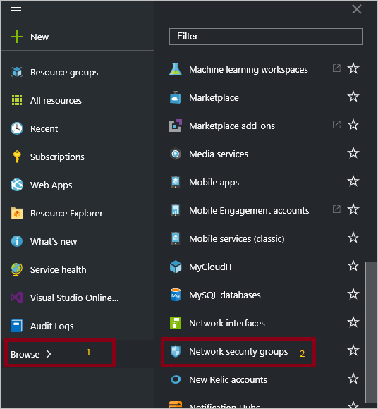
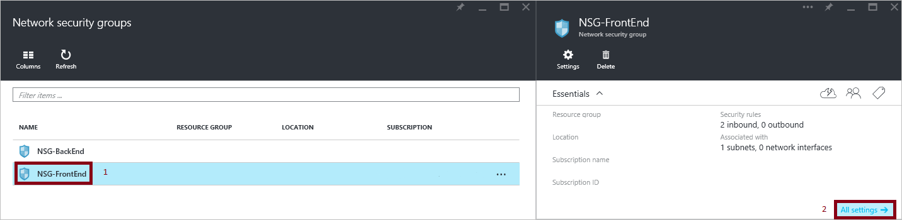
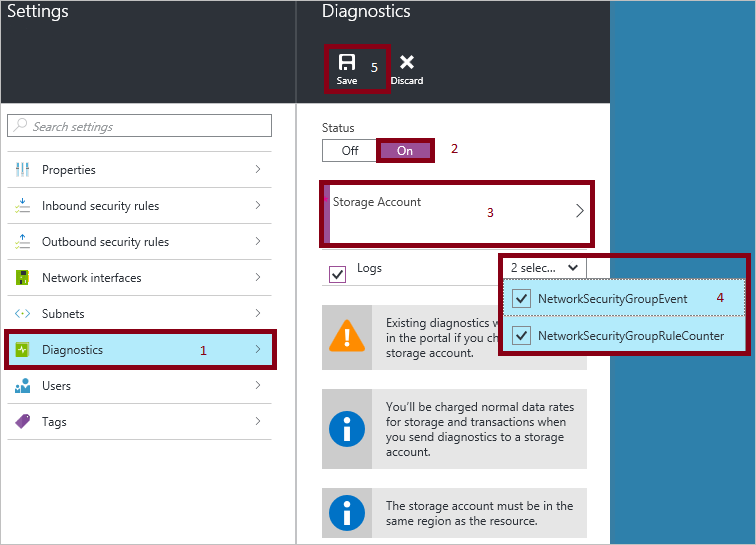

<properties
   pageTitle="Monitor operations, events, and counters for NSGs | Microsoft Azure"
   description="Learn how to enable counters, events, and operational logging for NSGs"
   services="virtual-network"
   documentationCenter="na"
   authors="telmosampaio"
   manager="carmonm"
   editor="tysonn"
   tags="azure-resource-manager"
/>
<tags
   ms.service="virtual-network"
   ms.devlang="na"
   ms.topic="article"
   ms.tgt_pltfrm="na"
   ms.workload="infrastructure-services"
   ms.date="07/14/2016"
   ms.author="telmos" />

#Log analytics for network security groups (NSGs)

You can use different types of logs in Azure to manage and troubleshoot NSGs. Some of these logs can be accessed through the portal, and all logs can be extracted from an Azure blob storage, and viewed in different tools, such as [Log Analytics](../log-analytics/log-analytics-azure-networking-analytics.md), Excel and PowerBI. You can learn more about the different types of logs from the list below.

- **Audit logs:** You can use [Azure Audit Logs](../azure-portal/insights-debugging-with-events.md) (formerly known as Operational Logs) to view all operations being submitted to your Azure subscription(s), and their status. Audit logs are enabled by default, and can be viewed in the Azure preview portal.
- **Event logs:** You can use this log to view what NSG rules are applied to VMs and instance roles based on MAC address. The status for these rules is collected every 60 seconds.
- **Counter logs:** You can use this log to view how many times each NSG rule was applied to deny or allow traffic.

>[AZURE.WARNING] Logs are only available for resources deployed in the Resource Manager deployment model. You cannot use logs for resources in the classic deployment model. For a better understanding of the two models, reference the [Understanding Resource Manager deployment and classic deployment](../resource-manager-deployment-model.md) article.

##Enable logging
Audit logging is automatically enabled at all times for every Resource Manager resource. You need to enable event and counter logging to start collecting the data available through those logs. To enable logging, follow the steps below.

1.  Sign-in to the [Azure portal](https://portal.azure.com). If you don't already have an existing network security group, [create an NSG](virtual-networks-create-nsg-arm-ps.md) before you continue.

2.  In the preview portal, click **Browse** >> **Network security groups**.

	

3. Select an existing network security group.

	

4. In the **Settings** blade, click **Diagnostics**, and then in the **Diagnostics** pane, next to **Status**, click **On**
5. In the **Settings** blade, click **Storage Account**, and either select an existing storage account, or create a new one.  

>[AZURE.INFORMATION] Audit logs do not require a separate storage account. The use of storage for event and rule logging will incur service charges.

6. In the drop-down list just under **Storage Account**, select whether you want to log events, counters, or both, and then click **Save**.

	

## Audit log
This log (formerly known as the "operational log") is generated by Azure by default.  The logs are preserved for 90 days in Azure’s Event Logs store. Learn more about these logs by reading the [View events and audit logs](../azure-portal/insights-debugging-with-events.md) article.

## Counter log
This log is only generated if you've enabled it on a per NSG basis as detailed above. The data is stored in the storage account you specified when you enabled the logging. Each rule applied to resources is logged in JSON format, as seen below.

	{
		"time": "2015-09-11T23:14:22.6940000Z",
		"systemId": "e22a0996-e5a7-4952-8e28-4357a6e8f0c5",
		"category": "NetworkSecurityGroupRuleCounter",
		"resourceId": "/SUBSCRIPTIONS/D763EE4A-9131-455F-8C5E-876035455EC4/RESOURCEGROUPS/INSIGHTOBONRP/PROVIDERS/MICROSOFT.NETWORK/NETWORKSECURITYGROUPS/NSGINSIGHTOBONRP",
		"operationName": "NetworkSecurityGroupCounters",
		"properties": {
			"vnetResourceGuid":"{DD0074B1-4CB3-49FA-BF10-8719DFBA3568}",
			"subnetPrefix":"10.0.0.0/24",
			"macAddress":"001517D9C43C",
			"ruleName":"DenyAllOutBound",
			"direction":"Out",
			"type":"block",
			"matchedConnections":0
			}
	}

## Event log
This log is only generated if you've enabled it on a per NSG basis as detailed above. The data is stored in the storage account you specified when you enabled the logging. The following data is logged:

	{
		"time": "2015-09-11T23:05:22.6860000Z",
		"systemId": "e22a0996-e5a7-4952-8e28-4357a6e8f0c5",
		"category": "NetworkSecurityGroupEvent",
		"resourceId": "/SUBSCRIPTIONS/D763EE4A-9131-455F-8C5E-876035455EC4/RESOURCEGROUPS/INSIGHTOBONRP/PROVIDERS/MICROSOFT.NETWORK/NETWORKSECURITYGROUPS/NSGINSIGHTOBONRP",
		"operationName": "NetworkSecurityGroupEvents",
		"properties": {
			"vnetResourceGuid":"{DD0074B1-4CB3-49FA-BF10-8719DFBA3568}",
			"subnetPrefix":"10.0.0.0/24",
			"macAddress":"001517D9C43C",
			"ruleName":"AllowVnetOutBound",
			"direction":"Out",
			"priority":65000,
			"type":"allow",
			"conditions":{
				"destinationPortRange":"0-65535",
				"sourcePortRange":"0-65535",
				"destinationIP":"10.0.0.0/8,172.16.0.0/12,169.254.0.0/16,192.168.0.0/16,168.63.129.16/32",
				"sourceIP":"10.0.0.0/8,172.16.0.0/12,169.254.0.0/16,192.168.0.0/16,168.63.129.16/32"
			}
		}
	}

## View and analyze the audit log
You can view and analyze audit log data using any of the following methods:

- **Azure tools:** Retrieve information from the audit logs through Azure PowerShell, the Azure Command Line Interface (CLI), the Azure REST API, or the Azure preview portal.  Step-by-step instructions for each method are detailed in the [Audit operations with Resource Manager](../resource-group-audit.md) article.
- **Power BI:** If you don't already have a [Power BI](https://powerbi.microsoft.com/pricing) account, you can try it for free. Using the [Azure Audit Logs content pack for Power BI](https://powerbi.microsoft.com/documentation/powerbi-content-pack-azure-audit-logs/) you can analyze your data with pre-configured dashboards that you can use as-is, or customize.

## View and analyze the counter and event log

Azure [Log Analytics](../log-analytics/log-analytics-azure-networking-analytics.md) can collect the counter and event log files from your Blob storage account and includes visualizations and powerful search capabilities to analyze your logs.

You can also connect to your storage account and retrieve the JSON log entries for event and counter logs. Once you download the JSON files, you can convert them to CSV and view in Excel, PowerBI, or any other data visualization tool.

>[AZURE.TIP] If you are familiar with Visual Studio and basic concepts of changing values for constants and variables in C#, you can use the [log converter tools](https://github.com/Azure-Samples/networking-dotnet-log-converter) available from Github.

## Next steps

- Visualize counter and event logs with [Log Analytics](../log-analytics/log-analytics-azure-networking-analytics.md)
- [Visualize your Azure Audit Logs with Power BI](http://blogs.msdn.com/b/powerbi/archive/2015/09/30/monitor-azure-audit-logs-with-power-bi.aspx) blog post.
- [View and analyze Azure Audit Logs in Power BI and more](https://azure.microsoft.com/blog/analyze-azure-audit-logs-in-powerbi-more/) blog post.
