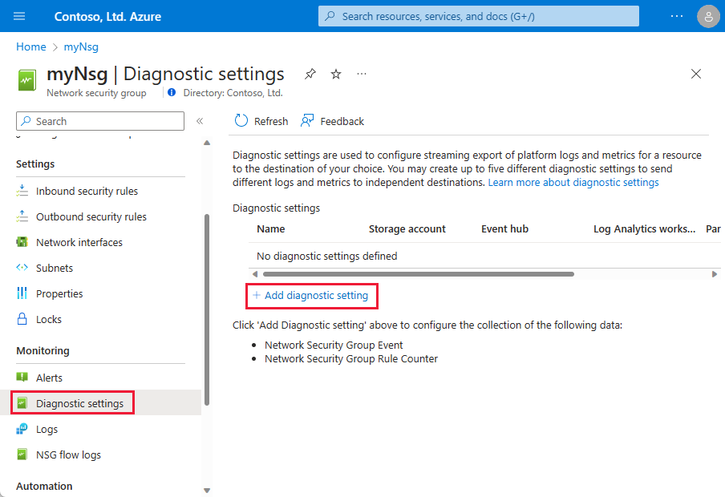

# Diagnostic logging for a network security group

A network security group (NSG) includes rules that allow or deny traffic to a virtual network subnet, network interface, or both. When you enable diagnostic logging for an NSG, you can log the following categories of information:

* **Event:** Entries are logged for which NSG rules are applied to VMs, based on MAC address. The status for these rules is collected every 60 seconds.
* **Rule counter:** Contains entries for how many times each NSG rule is applied to deny or allow traffic.

Diagnostic logs are only available for NSGs deployed through the Azure Resource Manager deployment model. You cannot enable diagnostic logging for NSGs deployed through the classic deployment model. For a better understanding of the two models, see [Understanding Azure deployment models](../resource-manager-deployment-model.md?toc=%2fazure%2fvirtual-network%2ftoc.json).

Diagnostic logging is enabled separately for *each* NSG you want to collect diagnostic data for. If you're interested in operational, or activity, logs instead, see Azure [activity logging](../azure-monitor/platform/activity-logs-overview.md?toc=%2fazure%2fvirtual-network%2ftoc.json).

## Enable logging

You can use the [Azure Portal](#azure-portal), [PowerShell](#powershell), or the [Azure CLI](#azure-cli) to enable diagnostic logging.

### Azure Portal

1. Sign in to the [portal](https://portal.azure.com).
2. Select **All services**, then type *network security groups*. When **Network security groups** appear in the search results, select it.
3. Select the NSG you want to enable logging for.
4. Under **MONITORING**, select **Diagnostics logs**, and then select **Turn on diagnostics**, as shown in the following picture:

   

5. Under **Diagnostics settings**, enter, or select the following information, and then select **Save**:

    | Setting                                                                                     | Value                                                          |
    | ---------                                                                                   |---------                                                       |
    | Name                                                                                        | A name of your choosing.  For example: *myNsgDiagnostics*      |
    | **Archive to a storage account**, **Stream to an event hub**, and **Send to Log Analytics** | You can select as many destinations as you choose. To learn more about each, see [Log destinations](#log-destinations).                                                                                                                                           |
    | LOG                                                                                         | Select either, or both log categories. To learn more about the data logged for each category, see [Log categories](#log-categories).                                                                                                                                             |
6. View and analyze logs. For more information, see [View and analyze logs](#view-and-analyze-logs).

### PowerShell

[!INCLUDE [updated-for-az](../../includes/updated-for-az.md)]

You can run the commands that follow in the [Azure Cloud Shell](https://shell.azure.com/powershell), or by running PowerShell from your computer. The Azure Cloud Shell is a free interactive shell. It has common Azure tools preinstalled and configured to use with your account. If you run PowerShell from your computer, you need the Azure PowerShell module, version 1.0.0 or later. Run `Get-Module -ListAvailable Az` on your computer, to find the installed version. If you need to upgrade, see [Install Azure PowerShell module](/powershell/azure/install-az-ps). If you are running PowerShell locally, you also need to run `Connect-AzAccount` to sign in to Azure with an account that has the [necessary permissions](virtual-network-network-interface.md#permissions).

To enable diagnostic logging, you need the Id of an existing NSG. If you don't have an existing NSG, you can create one with [New-AzNetworkSecurityGroup](/powershell/module/az.network/new-aznetworksecuritygroup).

Retrieve the network security group that you want to enable diagnostic logging for with [Get-AzNetworkSecurityGroup](/powershell/module/az.network/get-aznetworksecuritygroup). For example, to retrieve an NSG named *myNsg* that exists in a resource group named *myResourceGroup*, enter the following command:

```azurepowershell-interactive
$Nsg=Get-AzNetworkSecurityGroup `
  -Name myNsg `
  -ResourceGroupName myResourceGroup
```

You can write diagnostic logs to three destination types. For more information, see [Log destinations](#log-destinations). In this article, logs are sent to the *Log Analytics* destination, as an example. Retrieve an existing Log Analytics workspace with [Get-AzOperationalInsightsWorkspace](/powershell/module/az.operationalinsights/get-azoperationalinsightsworkspace). For example, to retrieve an existing workspace named *myWorkspace* in a resource group named *myWorkspaces*, enter the following command:

```azurepowershell-interactive
$Oms=Get-AzOperationalInsightsWorkspace `
  -ResourceGroupName myWorkspaces `
  -Name myWorkspace
```

If you don't have an existing workspace, you can create one with [New-AzOperationalInsightsWorkspace](/powershell/module/az.operationalinsights/new-azoperationalinsightsworkspace).

There are two categories of logging you can enable logs for. For more information, see [Log categories](#log-categories). Enable diagnostic logging for the NSG with [Set-AzDiagnosticSetting](/powershell/module/az.monitor/set-azdiagnosticsetting). The following example logs both event and counter category data to the workspace for an NSG, using the IDs for the NSG and workspace you retrieved previously:

```azurepowershell-interactive
Set-AzDiagnosticSetting `
  -ResourceId $Nsg.Id `
  -WorkspaceId $Oms.ResourceId `
  -Enabled $true
```

If you only want to log data for one category or the other, rather than both, add the `-Categories` option to the previous command, followed by *NetworkSecurityGroupEvent* or *NetworkSecurityGroupRuleCounter*. If you want to log to a different [destination](#log-destinations) than a Log Analytics workspace, use the appropriate parameters for an Azure [Storage account](../azure-monitor/platform/archive-diagnostic-logs.md?toc=%2fazure%2fvirtual-network%2ftoc.json) or [Event Hub](../azure-monitor/platform/diagnostic-logs-stream-event-hubs.md?toc=%2fazure%2fvirtual-network%2ftoc.json).

View and analyze logs. For more information, see [View and analyze logs](#view-and-analyze-logs).

### Azure CLI

You can run the commands that follow in the [Azure Cloud Shell](https://shell.azure.com/bash), or by running the Azure CLI from your computer. The Azure Cloud Shell is a free interactive shell. It has common Azure tools preinstalled and configured to use with your account. If you run the CLI from your computer, you need version 2.0.38 or later. Run `az --version` on your computer, to find the installed version. If you need to upgrade, see [Install Azure CLI](/cli/azure/install-azure-cli?view=azure-cli-latest). If you are running the CLI locally, you also need to run `az login` to sign in to Azure with an account that has the [necessary permissions](virtual-network-network-interface.md#permissions).

To enable diagnostic logging, you need the Id of an existing NSG. If you don't have an existing NSG, you can create one with [az network nsg create](/cli/azure/network/nsg#az-network-nsg-create).

Retrieve the network security group that you want to enable diagnostic logging for with [az network nsg show](/cli/azure/network/nsg#az-network-nsg-show). For example, to retrieve an NSG named *myNsg* that exists in a resource group named *myResourceGroup*, enter the following command:

```azurecli-interactive
nsgId=$(az network nsg show \
  --name myNsg \
  --resource-group myResourceGroup \
  --query id \
  --output tsv)
```

You can write diagnostic logs to three destination types. For more information, see [Log destinations](#log-destinations). In this article, logs are sent to the *Log Analytics* destination, as an example. For more information, see [Log categories](#log-categories).

Enable diagnostic logging for the NSG with [az monitor diagnostic-settings create](/cli/azure/monitor/diagnostic-settings#az-monitor-diagnostic-settings-create). The following example logs both event and counter category data to an existing workspace named *myWorkspace*, which exists in a resource group named *myWorkspaces*, and the ID of the NSG you retrieved previously:

```azurecli-interactive
az monitor diagnostic-settings create \
  --name myNsgDiagnostics \
  --resource $nsgId \
  --logs '[ { "category": "NetworkSecurityGroupEvent", "enabled": true, "retentionPolicy": { "days": 30, "enabled": true } }, { "category": "NetworkSecurityGroupRuleCounter", "enabled": true, "retentionPolicy": { "days": 30, "enabled": true } } ]' \
  --workspace myWorkspace \
  --resource-group myWorkspaces
```

If you don't have an existing workspace, you can create one using the [Azure portal](../azure-monitor/learn/quick-create-workspace.md?toc=%2fazure%2fvirtual-network%2ftoc.json) or [PowerShell](/powershell/module/az.operationalinsights/new-azoperationalinsightsworkspace). There are two categories of logging you can enable logs for.

If you only want to log data for one category or the other, remove the category you don't want to log data for in the previous command. If you want to log to a different [destination](#log-destinations) than a Log Analytics workspace, use the appropriate parameters for an Azure [Storage account](../azure-monitor/platform/archive-diagnostic-logs.md?toc=%2fazure%2fvirtual-network%2ftoc.json) or [Event Hub](../azure-monitor/platform/diagnostic-logs-stream-event-hubs.md?toc=%2fazure%2fvirtual-network%2ftoc.json).

View and analyze logs. For more information, see [View and analyze logs](#view-and-analyze-logs).

## Log destinations

Diagnostics data can be:
- [Written to an Azure Storage account](../azure-monitor/platform/archive-diagnostic-logs.md?toc=%2fazure%2fvirtual-network%2ftoc.json), for auditing or manual inspection. You can specify the retention time (in days) using resource diagnostic settings.
- [Streamed to an Event hub](../azure-monitor/platform/diagnostic-logs-stream-event-hubs.md?toc=%2fazure%2fvirtual-network%2ftoc.json) for ingestion by a third-party service, or custom analytics solution, such as PowerBI.
- [Written to Azure Monitor logs](../azure-monitor/platform/collect-azure-metrics-logs.md?toc=%2fazure%2fvirtual-network%2ftoc.json#azure-diagnostics-direct-to-log-analytics).

## Log categories

JSON-formatted data is written for the following log categories:

### Event

The event log contains information about which NSG rules are applied to VMs, based on MAC address. The following data is logged for each event. In the following example, the data is logged for a virtual machine with the IP address 192.168.1.4 and a MAC address of 00-0D-3A-92-6A-7C:

```json
{
	"time": "[DATE-TIME]",
	"systemId": "[ID]",
	"category": "NetworkSecurityGroupEvent",
	"resourceId": "/SUBSCRIPTIONS/[SUBSCRIPTION-ID]/RESOURCEGROUPS/[RESOURCE-GROUP-NAME]/PROVIDERS/MICROSOFT.NETWORK/NETWORKSECURITYGROUPS/[NSG-NAME]",
	"operationName": "NetworkSecurityGroupEvents",
	"properties": {
		"vnetResourceGuid":"[ID]",
		"subnetPrefix":"192.168.1.0/24",
		"macAddress":"00-0D-3A-92-6A-7C",
		"primaryIPv4Address":"192.168.1.4",
		"ruleName":"[SECURITY-RULE-NAME]",
		"direction":"[DIRECTION-SPECIFIED-IN-RULE]",
		"priority":"[PRIORITY-SPECIFIED-IN-RULE]",
		"type":"[ALLOW-OR-DENY-AS-SPECIFIED-IN-RULE]",
		"conditions":{
			"protocols":"[PROTOCOLS-SPECIFIED-IN-RULE]",
			"destinationPortRange":"[PORT-RANGE-SPECIFIED-IN-RULE]",
			"sourcePortRange":"[PORT-RANGE-SPECIFIED-IN-RULE]",
			"sourceIP":"[SOURCE-IP-OR-RANGE-SPECIFIED-IN-RULE]",
			"destinationIP":"[DESTINATION-IP-OR-RANGE-SPECIFIED-IN-RULE]"
			}
		}
}
```

### Rule counter

The rule counter log contains information about each rule applied to resources. The following example data is logged each time a rule is applied. In the following example, the data is logged for a virtual machine with the IP address 192.168.1.4 and a MAC address of 00-0D-3A-92-6A-7C:

```json
{
	"time": "[DATE-TIME]",
	"systemId": "[ID]",
	"category": "NetworkSecurityGroupRuleCounter",
	"resourceId": "/SUBSCRIPTIONS/[SUBSCRIPTION ID]/RESOURCEGROUPS/[RESOURCE-GROUP-NAME]/PROVIDERS/MICROSOFT.NETWORK/NETWORKSECURITYGROUPS/[NSG-NAME]",
	"operationName": "NetworkSecurityGroupCounters",
	"properties": {
		"vnetResourceGuid":"[ID]",
		"subnetPrefix":"192.168.1.0/24",
		"macAddress":"00-0D-3A-92-6A-7C",
		"primaryIPv4Address":"192.168.1.4",
		"ruleName":"[SECURITY-RULE-NAME]",
		"direction":"[DIRECTION-SPECIFIED-IN-RULE]",
		"type":"[ALLOW-OR-DENY-AS-SPECIFIED-IN-RULE]",
		"matchedConnections":125
		}
}
```

> [!NOTE]
> The source IP address for the communication is not logged. You can enable [NSG flow logging](../network-watcher/network-watcher-nsg-flow-logging-portal.md) for an NSG however, which logs all of the rule counter information, as well as the source IP address that initiated the communication. NSG flow log data is written to an Azure Storage account. You can analyze the data with the [traffic analytics](../network-watcher/traffic-analytics.md) capability of Azure Network Watcher.

## View and analyze logs

To learn how to view diagnostic log data, see [Azure Diagnostic Logs overview](../azure-monitor/platform/diagnostic-logs-overview.md?toc=%2fazure%2fvirtual-network%2ftoc.json). If you send diagnostics data to:
- **Azure Monitor logs**: You can use the [network security group analytics](../azure-monitor/insights/azure-networking-analytics.md?toc=%2fazure%2fvirtual-network%2ftoc.json#azure-network-security-group-analytics-solution-in-azure-monitor
) solution for enhanced insights. The solution provides visualizations for NSG rules that allow or deny traffic, per MAC address, of the network interface in a virtual machine.
- **Azure Storage account**: Data is written to a PT1H.json file. You can find the:
  - Event log in the following path: `insights-logs-networksecuritygroupevent/resourceId=/SUBSCRIPTIONS/[ID]/RESOURCEGROUPS/[RESOURCE-GROUP-NAME-FOR-NSG]/PROVIDERS/MICROSOFT.NETWORK/NETWORKSECURITYGROUPS/[NSG NAME]/y=[YEAR]/m=[MONTH/d=[DAY]/h=[HOUR]/m=[MINUTE]`
  - Rule counter log in the following path: `insights-logs-networksecuritygrouprulecounter/resourceId=/SUBSCRIPTIONS/[ID]/RESOURCEGROUPS/[RESOURCE-GROUP-NAME-FOR-NSG]/PROVIDERS/MICROSOFT.NETWORK/NETWORKSECURITYGROUPS/[NSG NAME]/y=[YEAR]/m=[MONTH/d=[DAY]/h=[HOUR]/m=[MINUTE]`

## Next steps

- Learn more about [Activity logging](../azure-monitor/platform/diagnostic-logs-overview.md?toc=%2fazure%2fvirtual-network%2ftoc.json), previously known as audit or operational logs. Activity logging is enabled by default for NSGs created through either Azure deployment model. To determine which operations were completed on NSGs in the activity log, look for entries that contain the following resource types:
  - Microsoft.ClassicNetwork/networkSecurityGroups
  - Microsoft.ClassicNetwork/networkSecurityGroups/securityRules
  - Microsoft.Network/networkSecurityGroups
  - Microsoft.Network/networkSecurityGroups/securityRules
- To learn how to log diagnostic information, to include the source IP address for each flow, see [NSG flow logging](../network-watcher/network-watcher-nsg-flow-logging-portal.md?toc=%2fazure%2fvirtual-network%2ftoc.json).