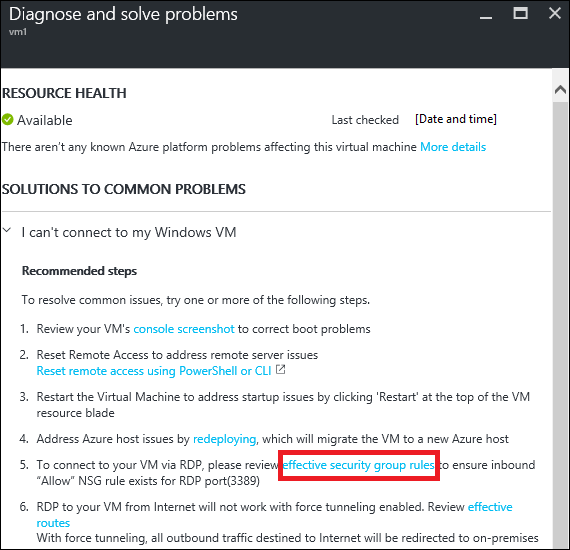
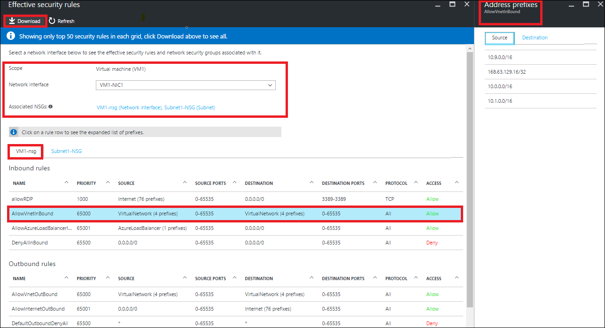
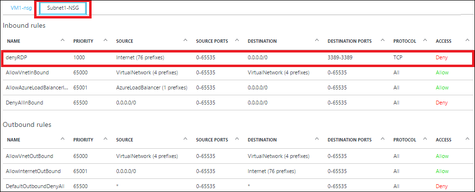
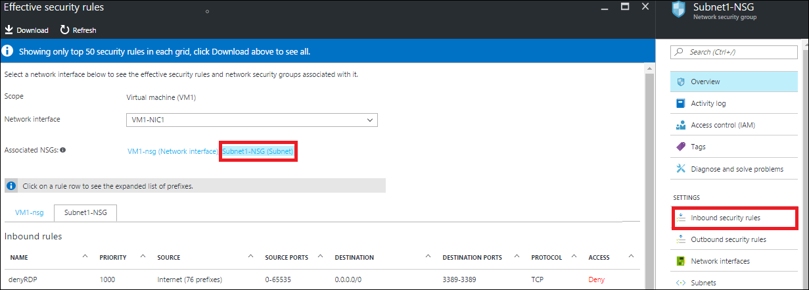
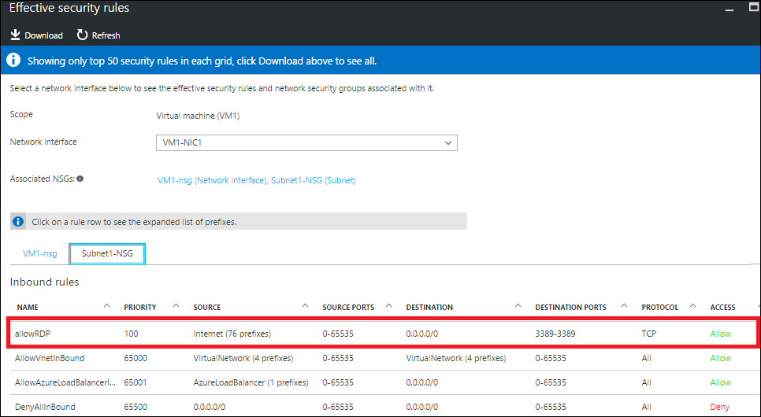
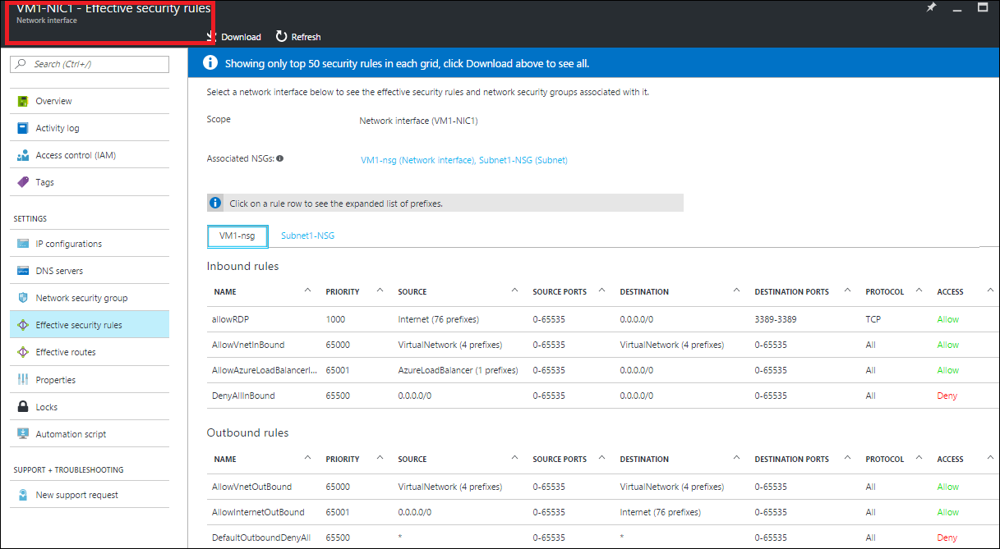
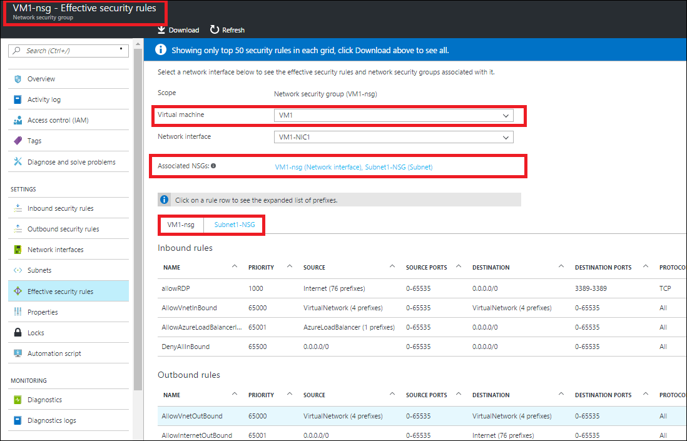

# Troubleshoot Network Security Groups using the Azure Portal
> [!div class="op_single_selector"]
> * [Azure Portal](virtual-network-nsg-troubleshoot-portal.md)
> * [PowerShell](virtual-network-nsg-troubleshoot-powershell.md)
> 
> 

If you configured Network Security Groups (NSGs) on your virtual machine (VM) and are experiencing VM connectivity issues, this article provides an overview of diagnostics capabilities for NSGs to help troubleshoot further.

NSGs enable you to control the types of traffic that flow in and out of your virtual machines (VMs). NSGs can be applied to subnets in an Azure Virtual Network (VNet), network interfaces (NIC), or both. The effective rules applied to a NIC are an aggregation of the rules that exist in the NSGs applied to a NIC and the subnet it is connected to. Rules across these NSGs can sometimes conflict with each other and impact a VM's network connectivity.  

You can view all the effective security rules from your NSGs, as applied on your VM's NICs. This article shows how to troubleshoot VM connectivity issues using these rules in the Azure Resource Manager deployment model. If you're not familiar with VNet and NSG concepts, read the [Virtual network](virtual-networks-overview.md) and [Network security groups](virtual-networks-nsg.md) overview articles.

## Using Effective Security Rules to troubleshoot VM traffic flow
The scenario that follows is an example of a common connection problem:

A VM named *VM1* is part of a subnet named *Subnet1* within a VNet named *WestUS-VNet1*. An attempt to connect to the VM using RDP over TCP port 3389 fails. NSGs are applied at both the NIC *VM1-NIC1* and the subnet *Subnet1*. Traffic to TCP port 3389 is allowed in the NSG associated with the network interface *VM1-NIC1*, however TCP ping to VM1's port 3389 fails.

While this example uses TCP port 3389, the following steps can be used to determine inbound and outbound connection failures over any port.

### View effective security rules for a virtual machine
Complete the following steps to troubleshoot NSGs for a VM:

You can view full list of the effective security rules on a NIC, from the VM itself. You can also add, modify, and delete both NIC and subnet NSG rules from the effective rules blade, if you have permissions to perform these operations.

1. Login to the Azure portal at https://portal.azure.com.
2. Click **More services**, then click **Virtual machines** in the list that appears.
3. Select a VM to troubleshoot from the list that appears and a VM blade with options appears.
4. Click **Diagnose & solve problems** and then select a common problem. For this example, **I can’t connect to my Windows VM** is selected. 
   
    
5. Steps appear under the problem, as shown in the following picture: 
   
    
   
    Click *effective security group rules* in the list of recommended steps.
6. The **Get effective security rules** blade appears, as shown in the following picture:
   
    
   
    Notice the following sections of the picture:
   
   * **Scope:** Set to *VM1*, the VM selected in step 3.
   * **Network interface:** *VM1-NIC1* is selected. A VM can have multiple network interfaces (NIC). Each NIC can have unique effective security rules. When troubleshooting, you may need to view the effective security rules for each NIC.
   * **Associated NSGs:** NSGs can be applied to both the NIC and the subnet the NIC is connected to. In the picture, an NSG has been applied to both the NIC and the subnet it's connected to. You can click on the NSG names to directly modify rules in the NSGs.
   * **VM1-nsg tab:** The list of rules displayed in the picture is for the NSG applied to the NIC. Several default rules are created by Azure whenever an NSG is created. You can't remove the default rules, but you can override them with rules of higher priority. To learn more about default rules, read the [NSG overview](virtual-networks-nsg.md#default-rules) article.
   * **DESTINATION column:** Some of the rules have text in the column, while others have address prefixes. The text is the name of default tags applied to the security rule when it was created. The tags are system-provided identifiers that represent multiple prefixes. Selecting a rule with a tag, such as *AllowInternetOutBound*, lists the prefixes in the **Address prefixes** blade.
   * **Download:** The list of rules can be long. You can download a .csv file of the rules for offline analysis by clicking **Download** and saving the file.
   * **AllowRDP** Inbound rule: This rule allows RDP connections to the VM.
7. Click the **Subnet1-NSG** tab to view the effective rules from the NSG applied to the subnet, as shown in the following picture: 
   
    
   
    Notice the *denyRDP* **Inbound** rule. Inbound rules applied at the subnet are evaluated before rules applied at the network interface. Since the deny rule is applied at the subnet, the request to connect to TCP 3389 fails, because the allow rule at the NIC is never evaluated. 
   
    The *denyRDP* rule is the reason why the RDP connection is failing. Removing it should resolve the problem.
   
   > [!NOTE]
   > If the VM associated with the NIC is not in a running state, or NSGs haven't been applied to the NIC or subnet, no rules are shown.
   > 
   > 
8. To edit NSG rules, click *Subnet1-NSG* in the **Associated NSGs** section.
   This opens the **Subnet1-NSG** blade. You can directly edit the rules by clicking on **Inbound security rules**.
   
    
9. After removing the *denyRDP* inbound rule in the **Subnet1-NSG** and adding an *allowRDP* rule, the effective rules list looks like the following picture:
   
    
   
    Confirm that TCP port 3389 is open by opening an RDP connection to the VM or using the PsPing tool. You can learn more about PsPing by reading the [PsPing download page](https://technet.microsoft.com/sysinternals/psping.aspx).

### View effective security rules for a network interface
If your VM traffic flow is impacted for a specific NIC, you can view a full list of the effective rules for the NIC from the network interfaces context by completing the following steps:

1. Login to the Azure portal at https://portal.azure.com.
2. Click **More services**, then click **Network interfaces** in the list that appears.
3. Select a network interface. In the following picture, a NIC named *VM1-NIC1* is selected.
   
    
   
    Notice that the **Scope** is set to the network interface selected. To learn more about the additional information shown, read step 6 of the **Troubleshoot NSGs for a VM** section of this article.
   
   > [!NOTE]
   > If an NSG is removed from a network interface, the subnet NSG is still effective on the given NIC. In this case, the output would only show rules from the subnet NSG. Rules only appear if the NIC is attached to a VM.
   > 
   > 
4. You can directly edit rules for NSGs associated with a NIC and a subnet. To learn how, read step 8 of the **View effective security rules for a virtual machine** section of this article.

## View effective security rules for a network security group (NSG)
When modifying NSG rules, you may want to review the impact of the rules being added on a particular VM. You can view a full list of the effective security rules for all the NICs that a given NSG is applied to, without having to switch context from the given NSG blade. 
To troubleshoot effective rules within an NSG, complete the following steps:

1. Login to the Azure portal at https://portal.azure.com.
2. Click **More services**, then click **Network security groups** in the list that appears.
3. Select an NSG. In the following picture, an NSG named VM1-nsg was selected.
   
    
   
    Notice the following sections of the previous picture:
   
   * **Scope:** Set to the NSG selected.
   * **Virtual machine:** When an NSG is applied to a subnet, it's applied to all network interfaces attached to all VMs connected to the subnet. This list shows all VMs this NSG is applied to. You can select any VM from the list.
     
     > [!NOTE]
     > If an NSG is applied to only an empty subnet, VMs will not be listed. If an NSG is applied to a NIC which is not associated with a VM, those NICs will also not be listed. 
     > 
     > 
   * **Network Interface:** A VM can have multiple network interfaces. You can select a network interface attached to the selected VM.
   * **AssociatedNSGs:** At any time, a NIC can have up to two effective NSGs, one applied to the NIC and the other to the subnet. Although the scope is selected as VM1-nsg, if the NIC has an effective subnet NSG, the output will show both NSGs.
4. You can directly edit rules for NSGs associated with a NIC or subnet. To learn how, read step 8 of the **View effective security rules for a virtual machine** section of this article.

To learn more about the additional information shown, read step 6 of the **View effective security rules for a virtual machine** section of this article.

> [!NOTE]
> Though a subnet and NIC can each have only one NSG applied to them, an NSG can be associated to multiple NICs and multiple subnets.
> 
> 

## Considerations
Consider the following points when troubleshooting connectivity problems:

* Default NSG rules will block inbound access from the internet and only permit VNet inbound traffic. Rules should be explicitly added to allow inbound access from Internet, as required.
* If there are no NSG security rules causing a VM’s network connectivity to fail, the problem may be due to:
  * Firewall software running within the VM's operating system
  * Routes configured for virtual appliances or on-premises traffic. Internet traffic can be redirected to on-premises via forced-tunneling. An RDP/SSH connection from the Internet to your VM may not work with this setting, depending on how the on-premises network hardware handles this traffic. Read the [Troubleshooting Routes](virtual-network-routes-troubleshoot-powershell.md) article to learn how to diagnose route problems that may be impeding the flow of traffic in and out of the VM. 
* If you have peered VNets, by default, the VIRTUAL_NETWORK tag will automatically expand to include prefixes for peered VNets. You can view these prefixes in the **ExpandedAddressPrefix** list, to troubleshoot any issues related to VNet peering connectivity. 
* Effective security rules are only shown if there is an NSG associated with the VM’s NIC and or subnet. 
* If there are no NSGs associated with the NIC or subnet and you have a public IP address assigned to your VM, all ports will be open for inbound and outbound access. If the VM has a public IP address, applying NSGs to the NIC or subnet is strongly recommended.

