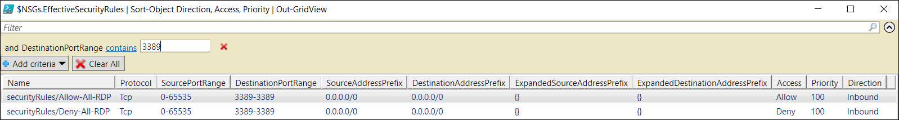

---
title: Troubleshoot Network Security Groups - PowerShell | Microsoft Docs
description: Learn how to troubleshoot Network Security Groups in the Azure Resource Manager deployment model using Azure PowerShell.
services: virtual-network
documentationcenter: na
author: AnithaAdusumilli
manager: narayan
editor: ''
tags: azure-resource-manager

ms.assetid: 4c732bb7-5cb1-40af-9e6d-a2a307c2a9c4
ms.service: virtual-network
ms.devlang: na
ms.topic: article
ms.tgt_pltfrm: na
ms.workload: infrastructure-services
ms.date: 09/23/2016
ms.author: anithaa

---
# Troubleshoot Network Security Groups using Azure PowerShell
> [!div class="op_single_selector"]
> * [Azure Portal](virtual-network-nsg-troubleshoot-portal.md)
> * [PowerShell](virtual-network-nsg-troubleshoot-powershell.md)
> 
> 

If you configured Network Security Groups (NSGs) on your virtual machine (VM) and are experiencing VM connectivity issues, this article provides an overview of diagnostics capabilities for NSGs to help troubleshoot further.

NSGs enable you to control the types of traffic that flow in and out of your virtual machines (VMs). NSGs can be applied to subnets in an Azure Virtual Network (VNet), network interfaces (NIC), or both. The effective rules applied to a NIC are an aggregation of the rules that exist in the NSGs applied to a NIC and the subnet it is connected to. Rules across these NSGs can sometimes conflict with each other and impact a VM's network connectivity.  

You can view all the effective security rules from your NSGs, as applied on your VM's NICs. This article shows how to troubleshoot VM connectivity issues using these rules in the Azure Resource Manager deployment model. If you're not familiar with VNet and NSG concepts, read the [Virtual network](virtual-networks-overview.md) and [Network security groups](virtual-networks-nsg.md) overview articles.

## Using Effective Security Rules to troubleshoot VM traffic flow
The scenario that follows is an example of a common connection problem:

A VM named *VM1* is part of a subnet named *Subnet1* within a VNet named *WestUS-VNet1*. An attempt to connect to the VM using RDP over TCP port 3389 fails. NSGs are applied at both the NIC *VM1-NIC1* and the subnet *Subnet1*. Traffic to TCP port 3389 is allowed in the NSG associated with the network interface *VM1-NIC1*, however TCP ping to VM1's port 3389 fails.

While this example uses TCP port 3389, the following steps can be used to determine inbound and outbound connection failures over any port.

## Detailed Troubleshooting Steps
Complete the following steps to troubleshoot NSGs for a VM:

1. Start an Azure PowerShell session and login to Azure. If you're not familiar with using Azure PowerShell, read the [How to install and configure Azure PowerShell](/powershell/azure/overview) article.
2. Enter the following command to return all NSG rules applied to a NIC named *VM1-NIC1* in the resource group *RG1*:
   
        Get-AzureRmEffectiveNetworkSecurityGroup -NetworkInterfaceName VM1-NIC1 -ResourceGroupName RG1
   
   > [!TIP]
   > If you don't know the name of a NIC, enter the following command to retrieve the names of all NICs in a resource group: 
   > 
   > `Get-AzureRmNetworkInterface -ResourceGroupName RG1 | Format-Table Name`
   > 
   > 
   
    The following text is a sample of the effective rules output returned for the *VM1-NIC1* NIC:
   
        NetworkSecurityGroup   : {
                                   "Id": "/subscriptions/[Subscription ID]/resourceGroups/RG1/providers/Microsoft.Network/networkSecurityGroups/VM1-NIC1-NSG"
                                 }
        Association            : {
                                   "NetworkInterface": {
                                     "Id": "/subscriptions/[Subscription ID]/resourceGroups/RG1/providers/Microsoft.Network/networkInterfaces/VM1-NIC1"
                                   }
                                 }
        EffectiveSecurityRules : [
                                 {
                                 "Name": "securityRules/allowRDP",
                                 "Protocol": "Tcp",
                                 "SourcePortRange": "0-65535",
                                 "DestinationPortRange": "3389-3389",
                                 "SourceAddressPrefix": "Internet",
                                 "DestinationAddressPrefix": "0.0.0.0/0",
                                 "ExpandedSourceAddressPrefix": [… ],
                                 "ExpandedDestinationAddressPrefix": [],
                                 "Access": "Allow",
                                 "Priority": 1000,
                                 "Direction": "Inbound"
                                 },
                                 {
                                 "Name": "defaultSecurityRules/AllowVnetInBound",
                                 "Protocol": "All",
                                 "SourcePortRange": "0-65535",
                                 "DestinationPortRange": "0-65535",
                                 "SourceAddressPrefix": "VirtualNetwork",
                                 "DestinationAddressPrefix": "VirtualNetwork",
                                 "ExpandedSourceAddressPrefix": [
                                  "10.9.0.0/16",
                                  "168.63.129.16/32",
                                  "10.0.0.0/16",
                                  "10.1.0.0/16"
                                  ],
                                 "ExpandedDestinationAddressPrefix": [
                                  "10.9.0.0/16",
                                  "168.63.129.16/32",
                                  "10.0.0.0/16",
                                  "10.1.0.0/16"
                                  ],
                                  "Access": "Allow",
                                  "Priority": 65000,
                                  "Direction": "Inbound"
                                  },…
                         ]
   
        NetworkSecurityGroup   : {
                                   "Id": 
                                 "/subscriptions/[Subscription ID]/resourceGroups/RG1/providers/Microsoft.Network/networkSecurityGroups/Subnet1-NSG"
                                 }
        Association            : {
                                   "Subnet": {
                                     "Id": 
                                 "/subscriptions/[Subscription ID]/resourceGroups/RG1/providers/Microsoft.Network/virtualNetworks/WestUS-VNet1/subnets/Subnet1"
                                 }
                                 }
        EffectiveSecurityRules : [
                                 {
                                "Name": "securityRules/denyRDP",
                                "Protocol": "Tcp",
                                "SourcePortRange": "0-65535",
                                "DestinationPortRange": "3389-3389",
                                "SourceAddressPrefix": "Internet",
                                "DestinationAddressPrefix": "0.0.0.0/0",
                                "ExpandedSourceAddressPrefix": [
                                   ... ],
                                "ExpandedDestinationAddressPrefix": [],
                                "Access": "Deny",
                                "Priority": 1000,
                                "Direction": "Inbound"
                                },
                                {
                                "Name": "defaultSecurityRules/AllowVnetInBound",
                                "Protocol": "All",
                                "SourcePortRange": "0-65535",
                                "DestinationPortRange": "0-65535",
                                "SourceAddressPrefix": "VirtualNetwork",
                                "DestinationAddressPrefix": "VirtualNetwork",
                                "ExpandedSourceAddressPrefix": [
                                "10.9.0.0/16",
                                "168.63.129.16/32",
                                "10.0.0.0/16",
                                "10.1.0.0/16"
                                ],
                                "ExpandedDestinationAddressPrefix": [
                                "10.9.0.0/16",
                                "168.63.129.16/32",
                                "10.0.0.0/16",
                                "10.1.0.0/16"
                                ],
                                "Access": "Allow",
                                "Priority": 65000,
                                "Direction": "Inbound"
                                },...
                                ]
   
    Note the following information in the output:
   
   * There are two **NetworkSecurityGroup** sections: One is associated with a subnet (*Subnet1*) and one is associated with a NIC (*VM1-NIC1*). In this example, an NSG has been applied to each.
   * **Association** shows the resource (subnet or NIC) a given NSG is associated with. If the NSG resource is moved/disassociated immediately before running this command, you may need to wait a few seconds for the change to reflect in the command output. 
   * The rule names that are prefaced with *defaultSecurityRules*: When an NSG is created, several default security rules are created within it. Default rules can't be removed, but they can be overridden with higher priority rules.
     Read the [NSG overview](virtual-networks-nsg.md#default-rules) article to learn more about NSG default security rules.
   * **ExpandedAddressPrefix** expands the address prefixes for NSG default tags. Tags represent multiple address prefixes. Expansion of the tags can be useful when troubleshooting VM connectivity to/from specific address prefixes. For example, with VNET peering, VIRTUAL_NETWORK tag expands to show peered VNet prefixes in the previous output.
     
     > [!NOTE]
     > The command only shows effective rules if an NSG is associated with either a subnet, a NIC, or both. A VM may have multiple NICs with different NSGs applied. When troubleshooting, run the command for each NIC.
     > 
     > 
3. To ease filtering over larger number of NSG rules, enter the following commands to troubleshoot further: 
   
        $NSGs = Get-AzureRmEffectiveNetworkSecurityGroup -NetworkInterfaceName VM1-NIC1 -ResourceGroupName RG1
        $NSGs.EffectiveSecurityRules | Sort-Object Direction, Access, Priority | Out-GridView
   
    A filter for RDP traffic (TCP port 3389), is applied to the grid view, as shown in the following picture:
   
    
4. As you can see in the grid view, there are both allow and deny rules for RDP. The output from step 2 shows that the *DenyRDP* rule is in the NSG applied to the subnet. For inbound rules, NSGs applied to the subnet are processed first. If a match is found, the NSG applied to the network interface is not processed. In this case, the *DenyRDP* rule from the subnet blocks RDP to the VM (**VM1**).
   
   > [!NOTE]
   > A VM may have multiple NICs attached to it. Each may be connected to a different subnet. Since the commands in the previous steps are run against a NIC, it's important to ensure that you specify the NIC you're having the connectivity failure to. If you're not sure, you can always run the commands against each NIC attached to the VM.
   > 
   > 
5. To RDP into VM1, change the *Deny RDP (3389)* rule to *Allow RDP(3389)* in the **Subnet1-NSG** NSG. Confirm that TCP port 3389 is open by opening an RDP connection to the VM or using the PsPing tool. You can learn more about PsPing by reading the [PsPing download page](https://technet.microsoft.com/sysinternals/psping.aspx)
   
    You can or remove rules from an NSG by using the information in the output from the following command:
   
        Get-Help *-AzureRmNetworkSecurityRuleConfig

## Considerations
Consider the following points when troubleshooting connectivity problems:

* Default NSG rules will block inbound access from the internet and only permit VNet inbound traffic. Rules should be explicitly added to allow inbound access from Internet, as required.
* If there are no NSG security rules causing a VM’s network connectivity to fail, the problem may be due to:
  * Firewall software running within the VM's operating system
  * Routes configured for virtual appliances or on-premises traffic. Internet traffic can be redirected to on-premises via forced-tunneling. An RDP/SSH connection from the Internet to your VM may not work with this setting, depending on how the on-premises network hardware handles this traffic. Read the [Troubleshooting Routes](virtual-network-routes-troubleshoot-powershell.md) article to learn how to diagnose route problems that may be impeding the flow of traffic in and out of the VM. 
* If you have peered VNets, by default, the VIRTUAL_NETWORK tag will automatically expand to include prefixes for peered VNets. You can view these prefixes in the **ExpandedAddressPrefix** list, to troubleshoot any issues related to VNet peering connectivity. 
* Effective security rules are only shown if there is an NSG associated with the VM’s NIC and or subnet. 
* If there are no NSGs associated with the NIC or subnet and you have a public IP address assigned to your VM, all ports will be open for inbound and outbound access. If the VM has a public IP address, applying NSGs to the NIC or subnet is strongly recommended.  

