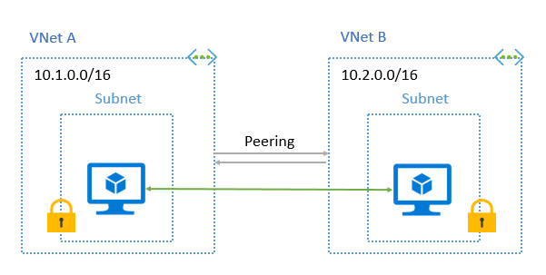

# Virtual network peering

[Azure’s Virtual Network (VNet)](virtual-networks-overview.md) is your own private network space in Azure which enables you to securely connect Azure resources to each other.

virtual network peering enables you to seemlessly connect virtual networks. Once peered, the virtual networks appear as one for connectivity purposes. The virtual machines in the peered virtual networks can communicate with each other directly.
The traffic between virtual machines in the peered virtual networks is routed through the Microsoft backbone infrastructure, much like traffic is routed between virtual machines in the same virtual network through *private* IP addresses only.

>[!IMPORTANT]
> You can peer virtual networks in different Azure regions. This feature is currently in preview. You can [register your subscription for the preview.](virtual-network-create-peering.md). Peering virtual networks in the same regions is generally available.
>

The benefits of using virtual network peering include:

* Traffic going through virtual network peerings is completely private. It goes through the Microsoft backbone network and no public internet or gateways involved.
* A low-latency, high-bandwidth connection between resources in different virtual networks.
* The ability to use resources in one virtual network from another virtual network once peered.
* Vrtual network peering helps you transfer data across Azure subscriptions, deployment models, and across Azure regions (preview).
* The ability to peer virtual networks created through the Azure Resource Manager or to peer one virtual network created through Resource Manager to a virtual network created through the classic deployment model. Read the [Understand Azure deployment models](../azure-resource-manager/resource-manager-deployment-model.md?toc=%2fazure%2fvirtual-network%2ftoc.json) article to learn more about the differences between the two Azure deployment models.

## Requirements and constraints

* Peering virtual networks in the same region is generally available. Peering virtual networks in different regions is currently in preview in US West Central, Canada Central, and US West 2. You can [register your subscription for the preview.](virtual-network-create-peering.md)
    > [!WARNING]
    > Virtual network peerings created in this scenario may not have the same level of availability and reliability as scenarios in a general availability release. Virtual network peerings may have constrained capabilities and may not be available in all Azure regions. For the most up-to-date notifications on availability and status of this feature, check the [Azure Virtual Network updates](https://azure.microsoft.com/updates/?product=virtual-network) page.

* The peered virtual networks must have non-overlapping IP address spaces.
* Address spaces cannot be added to or deleted from a virtual network once a virtual network is peered with another virtual network.
* Virtual network peering is between two virtual networks. There is no derived transitive relationship across peerings. For example, if virtualNetworkA is peered with virtualNetworkB, and virtualNetworkB is peered with virtualNetworkC, virtualNetworkA is *not* peered to virtualNetworkC.
* You can peer virtual networks that exist in two different subscriptions, as long a privileged user (see [specific permissions](create-peering-different-deployment-models-subscriptions.md#permissions)) of both subscriptions authorizes the peering, and the subscriptions are associated to the same Azure Active Directory tenant. You can use a [VPN Gateway](../vpn-gateway/vpn-gateway-about-vpngateways.md?toc=%2fazure%2fvirtual-network%2ftoc.json#V2V) to connect virtual networks in subscriptions associated to different Active Directory tenants.
* Virtual networks can be peered if both are created through the Resource Manager deployment model or if one virtual network is created through the Resource Manager deployment model and the other is created through the classic deployment model. virtual networks created through the classic deployment model cannot be peered to each other, however. You can use a [VPN Gateway](../vpn-gateway/vpn-gateway-about-vpngateways.md?toc=%2fazure%2fvirtual-network%2ftoc.json#V2V) to connect virtual networks created through the classic deployment model.
* Though the communication between virtual machines in peered virtual networks has no additional bandwidth restrictions, there is a maximum network bandwidth depending on the virtual machine size that still applies. To learn more about maximum network bandwidth for different virtual machine sizes, read the [Windows](../virtual-machines/windows/sizes.md?toc=%2fazure%2fvirtual-network%2ftoc.json) or [Linux](../virtual-machines/linux/sizes.md?toc=%2fazure%2fvirtual-network%2ftoc.json) virtual machine sizes articles.

     

## Connectivity

After virtual networks are peered, resources in either virtual network can directly connect with resources in the peered virtual network.

The network latency between virtual machines in peered virtual networks in the same region is the same as that within a single virtual network. The network throughput is based on the bandwidth that's allowed for the virtual machine, proportionate to its size. There isn't any additional restriction on bandwidth within the peering.

The traffic between virtual machines in peered virtual networks is routed directly through the Microsoft backbone infrastructure, not through a gateway or over the public internet.

Virtual machines in a virtual network can access the internal load-balancer in the peered virtual network in the same region. Support for internal load balancer does not extend across globally peered virtual networks in preview. The general availability release of global virtual network peering will have support for internal load balancer.

Network security groups can be applied in either virtual networks to block access to other virtual networks or subnets, if desired.
When configuring virtual network peering, you can either open or close the network security group rules between the virtual networks. If you open full connectivity between peered virtual networkss (which is the default option), you can apply network security groups to specific subnets or virtual machines to block or deny specific access. To learn more about network security groups, read the [Network security groups overview](virtual-networks-nsg.md) article.

## Service chaining

You can configure user-defined routes that point to virtual machines in peered virtual networks as the "next hop" IP address to enable service chaining. Service chaining enables you to direct traffic from one virtual network to a virtual appliance in a peered virtual network through user-defined routes.

You can also effectively build hub-and-spoke type environments, where the hub can host infrastructure components such as a network virtual appliance. All the spoke virtual networks can then peer with the hub virtual network. Traffic can flow through network virtual appliances that are running in the hub virtual network. In short, virtual network peering enables the next hop IP address on the user-defined route to be the IP address of a virtual machine in the peered virtual network. To learn more about user-defined routes, read the [user-defined routes overview](virtual-networks-udr-overview.md) article. To learn how to create a [hub and spoke network topology](/azure/architecture/reference-architectures/hybrid-networking/hub-spoke?toc=%2fazure%2fvirtual-network%2ftoc.json#virtual network-peering)

## Gateways and on-premises connectivity

Each virtual network, regardless of whether it is peered with another virtual network, can still have its own gateway and use it to connect to an on-premises network. You can also configure [virtual network-to-virtual network connections](../vpn-gateway/vpn-gateway-vnet-vnet-rm-ps.md) by using gateways, even though the virtual networks are peered.

When both options for virtual network interconnectivity are configured, the traffic between the virtual networks flows through the peering configuration (that is, through the Azure backbone).

When virtual networks are peered in the same region, you can also configure the gateway in the peered virtual network as a transit point to an on-premises network. In this case, the virtual network that is using a remote gateway cannot have its own gateway. A virtual network can have only one gateway. The gateway can be either a local or remote gateway (in the peered virtual network), as shown in the following picture:

Gateway transit is not supported in the peering relationship between virtual networks created through different deployment models or different regions. Both virtual networks in the peering relationship must have been created through Resource Manager and must be in the same region for gateway transit to work. Globally peered virtual networks do not currently support gateway transit.

When the virtual networks that are sharing a single Azure ExpressRoute connection are peered, the traffic between them goes through the peering relationship (that is, through the Azure backbone network). You can still use local gateways in each virtual network to connect to the on-premises circuit. Alternatively, you can use a shared gateway and configure transit for on-premises connectivity.

## Permissions

Virtual network peering is a privileged operation. It’s a separate function under the VirtualNetworks namespace. A user can be given specific rights to authorize peering. A user who has read-write access to the virtual network inherits these rights automatically.

A user who is either an admin or a privileged user of the peering ability can initiate a peering operation on another virtual network. The minimum level of permission required is Netwqork Contributor. If there is a matching request for peering on the other side, and if other requirements are met, the peering is established.

For example, if you were peering virtual networks named myvirtual networkA and myvirtual networkB, your account must be assigned the following minimum role or permissions for each virtual network:

|Virtual network|Deployment model|Role|Permissions|
|---|---|---|---|
|myvirtual networkA|Resource Manager|[Network Contributor](../active-directory/role-based-access-built-in-roles.md?toc=%2fazure%2fvirtual-network%2ftoc.json#network-contributor)|Microsoft.Network/virtualNetworks/virtualNetworkPeerings/write|
| |Classic|[Classic Network Contributor](../active-directory/role-based-access-built-in-roles.md?toc=%2fazure%2fvirtual-network%2ftoc.json#classic-network-contributor)|N/A|
|myvirtual networkB|Resource Manager|[Network Contributor](../active-directory/role-based-access-built-in-roles.md?toc=%2fazure%2fvirtual-network%2ftoc.json#network-contributor)|Microsoft.Network/virtualNetworks/peer|
||Classic|[Classic Network Contributor](../active-directory/role-based-access-built-in-roles.md?toc=%2fazure%2fvirtual-network%2ftoc.json#classic-network-contributor)|Microsoft.ClassicNetwork/virtualNetworks/peer|

## Monitor

When peering two virtual networks created through Resource Manager, a peering must be configured for each virtual network in the peering.
You can monitor the status of your peering connection. The peering status can be one of the following:

* **Initiated**: When you create the peering to the second virtual network from the first virtual network, the peering status is Initiated.

* **Connected**: When you create the peering from the second virtual network to the first virtual network, its peering status is Connected. If you view the peering status for the first virtual network, you see its status changed from Initiated to Connected. The peering is not successfully established until the peering status for both virtual network peerings is Connected.

* **Disconnected**: If one of your peering links is deleted after a connection was established, your peering status is disconnected.

## Troubleshoot

To troubleshoot traffic flowing across your peering connection, you can [check your effective routes.](virtual-network-routes-troubleshoot-portal.md)

You can also troubleshoot your connectivity to a virtual machine in a peered virtual network using Network Watcher's [connectivity check](../network-watcher/network-watcher-connectivity-portal.md). Connectivity check lets see how is routed directly from your source VM's network interface to your destination VM's network interface.

## Limits

There are limits on the number of peerings that are allowed for a single virtual network. The default number of peerings is 50. You can increase the number of peerings. For more information, review the [Azure networking limits](../azure-subscription-service-limits.md#networking-limits).

## Pricing

There is a nominal charge for ingress and egress traffic that utilizes a virtual network peering connection. For more information, see the [pricing page](https://azure.microsoft.com/pricing/details/virtual-network).

## Next steps

* Complete a virtual network peering tutorial. A virtual network peering is created between virtual networks created through the same, or different deployment models that exist in the same, or different subscriptions. Complete a tutorial for one of the following scenarios:

    |Azure deployment model  | Subscription  |
    |---------|---------|
    |Both Resource Manager |[Same](virtual-network-create-peering.md)|
    | |[Different](create-peering-different-subscriptions.md)|
    |One Resource Manager, one classic     |[Same](create-peering-different-deployment-models.md)|
    | |[Different](create-peering-different-deployment-models-subscriptions.md)|

* Learn how to create a [hub and spoke network topology.](/azure/architecture/reference-architectures/hybrid-networking/hub-spoke?toc=%2fazure%2fvirtual-network%2ftoc.json#virtual network-peering)
* Learn about all [virtual network peering settings and how to change them](virtual-network-manage-peering.md)
