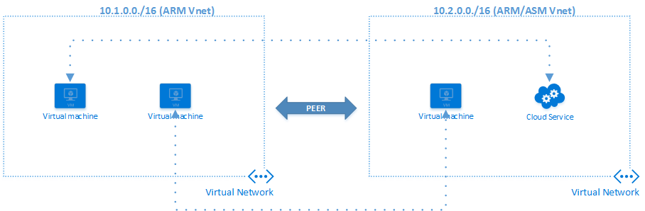
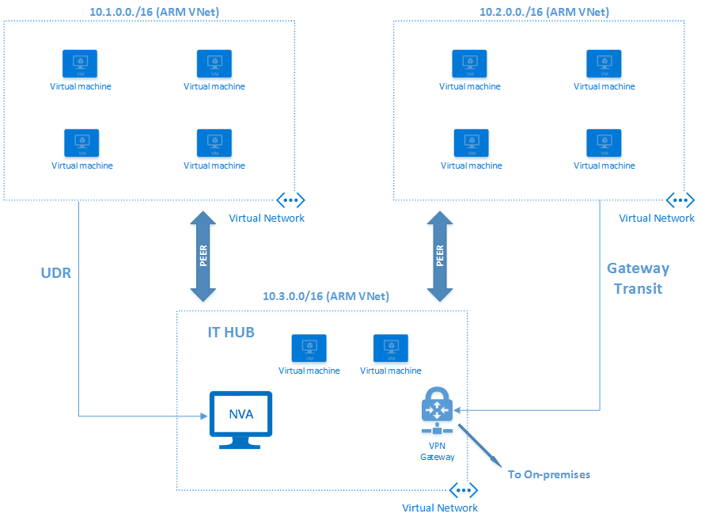

<properties
   pageTitle="Azure Virtual Network Peering | Microsoft Azure"
   description="Learn about VNet peering in Azure."
   services="virtual-network"
   documentationCenter="na"
   authors="narayanannamalai"
   manager="jefco"
   editor="tysonn" />
<tags
   ms.service="virtual-network"
   ms.devlang="na"
   ms.topic="get-started-article"
   ms.tgt_pltfrm="na"
   ms.workload="infrastructure-services"
   ms.date="07/28/2016"
   ms.author="narayan" />

# VNet peering

VNet peering is a mechanism that connects two virtual networks in the same region through the Azure backbone network. Once peered, the two virtual networks appear as one for all connectivity purposes. They are still managed as separate resources, but virtual machines in these virtual networks can communicate with each other directly by using private IP addresses.

The traffic between virtual machines in the peered virtual networks is routed through the Azure infrastructure much like traffic is routed between VMs in the same virtual network. Some of the benefits of using VNet peering include:

- A low latency, high bandwidth connection between resources in different virtual networks.
- The ability to use resources such as network appliances and VPN gateways as transit points in peered VNet.
- The ability to connect a virtual network that uses the Azure Resource Manager model to a virtual network that uses the classic deployment model and enable full connectivity between resources in these virtual networks.

Requirements and key aspects of VNet peering:

- The two virtual networks that are peered should be in the same Azure region.
- The virtual networks that are peered should have non-overlapping IP address spaces.
- VNet peering is between two virtual networks, and there is no derived transitive relationship. For example, if virtual network A is peered with virtual network B, and if virtual network B is peered with virtual network C, it does not translate to virtual network A being peered with virtual network C.
- Peering can be established between virtual networks in two different subscriptions as long a privileged user of both subscriptions authorizes the peering.
- A virtual network that uses the Resource Manager deployment model can be peered with another virtual network that uses this model, or with a virtual network that uses the classic deployment model. However, virtual networks that use the classic deployment model can't be peered to each other.
- Though the communication between virtual machines in peered virtual networks has no additional bandwidth restrictions, bandwidth cap based on VM size still applies.

## Connectivity
After two virtual networks are peered, a virtual machine (web/worker role) in the virtual network can directly connect with other virtual machines in the peered virtual network. These two networks have full IP-level connectivity.

The network latency for a round trip between two virtual machines in peered virtual networks is the same as for a round trip within a local virtual network. The network throughput is based on the bandwidth that's allowed for the virtual machine proportionate to its size. There isn't any additional restriction on bandwidth.

The traffic between the virtual machines in peered virtual networks is routed directly through Azure’s back-end infrastructure and not through a gateway.

Virtual machines in a virtual network can access the internal load-balanced (ILB) endpoints in the peered virtual network. Network security groups can be applied in either virtual network to block access to other virtual networks or subnets if desired.

When users configure peering they can either open or close the network security group (NSG) rules between the virtual networks. If the user chooses to open full connectivity between peered virtual networks (which is the default option), they can then use NSGs on specific subnets or virtual machines to block or deny specific access.

Azure-provided internal DNS name resolution for virtual machines doesn't work across peered virtual networks. Virtual machines have internal DNS names that are resolvable only within the local virtual network. However, users can configure virtual machines that are running in peered virtual networks as DNS servers for a virtual network.

## Service chaining
Users can configure user-defined route tables that point to virtual machines in peered virtual networks as the "next hop" IP address, as shown in the diagram later in this article." This enables users to achieve service chaining, through which they can direct traffic from one virtual network to a virtual appliance that's running in a peered virtual network through user-defined route tables.

Users can also effectively build hub-and-spoke type environments where the hub can host infrastructure components such as a network virtual appliance. All the spoke virtual networks can then peer with it, as well as a subset of traffic to appliances that are running in the hub virtual network. In short, VNet peering enables the next hop IP address on the ‘User defined route table’ to be the IP address of a virtual machine in the peered virtual network.

## Gateways and on-premises connectivity
Each virtual network, regardless of whether it is peered with another virtual network, can still have its own gateway and use it to connect to on-premises. Users can also configure [VNet-to-VNet connections](..vpn-gateway-vnet-vnet-rm-ps.md) by using gateways, even though the virtual networks are peered.

When both options for virtual network interconnectivity are configured, the traffic between the virtual networks flows through the peering configuration (that is, through the Azure backbone).

When virtual networks are peered, users can also configure the gateway in the peered virtual network as a transit point to on-premises. In this case, the virtual network that is using a remote gateway cannot have its own gateway. One virtual network can have only one gateway. It can either be a local gateway or a remote gateway (in the peered virtual network) as shown in the following picture.

Gateway transit is not supported in the peering relationship between virtual networks using the Resource Manager model and those using the classic deployment model. Both virtual networks in the peering relationship need to use the Resource Manager deployment model for a gateway transit to work.

When the virtual networks that are sharing a single ExpressRoute connection are peered, the traffic between them goes through the peering relationship (that is, through the Azure backbone network). Users can still use local gateways in each virtual network to connect to the on-premises circuit. Alternatively, they can use a shared gateway and configure transit for on-premises connectivity.

## Provisioning
VNet peering is a privileged operation. It’s a separate function under the Virtual Networks namespace. A user can be given specific rights to authorize peering. A user who has read-write access to the virtual network inherits these rights automatically.

A user who is either an admin or a privileged user of the peering ability can initiate a peering operation on another VNet. If there is a matching request for peering on the other side, and if other requirements are met, the peering will be established.

Refer to the articles in the Next steps section to learn more about how to establish VNet peering between two virtual networks.

## Limits
There are limits on the number of peerings that are allowed for a single virtual network. Refer to [Azure Networking limits](../azure-subscription-service-limits.md#networking-limits) for more information.

## Pricing
VNet peering will be free of charge during the review period. Once it is released, there will be a nominal charge on ingress and egress traffic that utilizes the peering. For more information, refer to the [pricing page](https://azure.microsoft.com/pricing/details/virtual-network).

## Next steps
- [Set up peering between Virtual Networks](virtual-networks-create-vnetpeering-arm-portal.md).
- Learn about [NSGs](virtual-networks-nsg.md).
- Learn about [user-defined routes and IP forwarding](virtual-networks-udr-overview.md).
