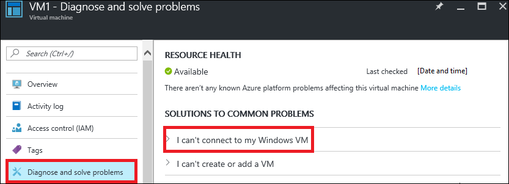
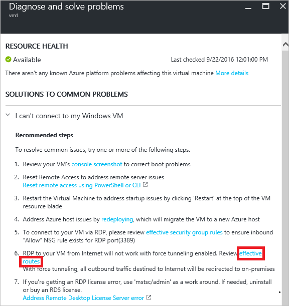
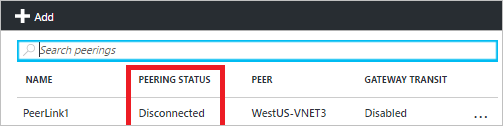
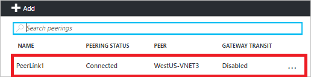
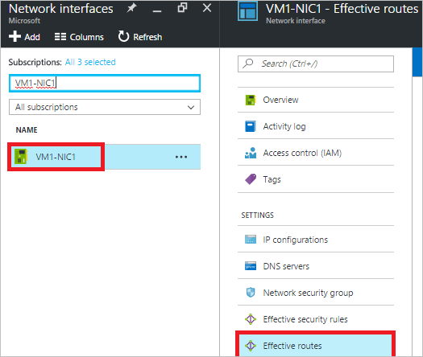
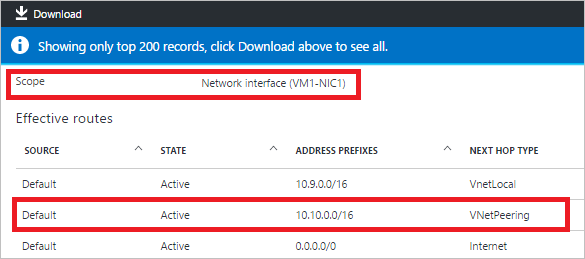
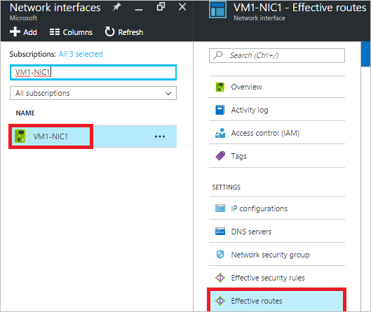
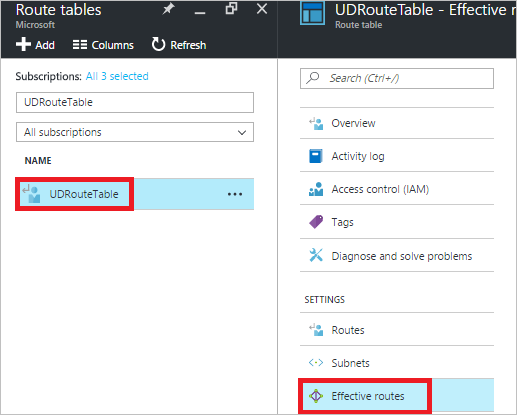
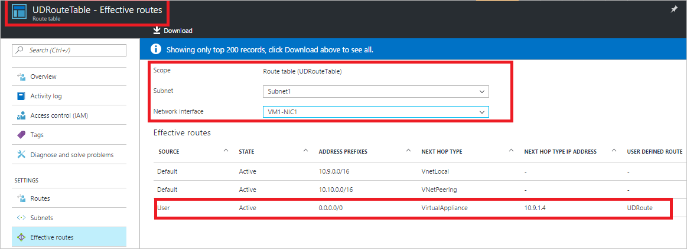

# Troubleshoot routes using the Azure Portal
> [!div class="op_single_selector"]
> * [Azure Portal](virtual-network-routes-troubleshoot-portal.md)
> * [PowerShell](virtual-network-routes-troubleshoot-powershell.md)
>
>

If you are experiencing network connectivity issues to or from your Azure Virtual Machine (VM), routes may be impacting your VM traffic flows. This article provides an overview of diagnostics capabilities for routes to help troubleshoot further.

Route tables are associated with subnets and are effective on all network interfaces (NIC) in that subnet. The following types of routes can be applied to each network interface:

* **System routes:** By default, every subnet created in an Azure Virtual Network (VNet) has system route tables that allow local VNet traffic, on-premises traffic via VPN gateways, and Internet traffic. System routes also exist for peered VNets.
* **BGP routes:** Propagated to network interfaces through ExpressRoute or site-to-site VPN connections. Learn more about BGP routing by reading the [BGP with VPN gateways](../vpn-gateway/vpn-gateway-bgp-overview.md) and [ExpressRoute overview](../expressroute/expressroute-introduction.md) articles.
* **User-defined routes (UDR):** If you are using network virtual appliances or are forced-tunneling traffic to an on-premises network via a site-to-site VPN, you may have user-defined routes (UDRs) associated with your subnet route table. If you're not familiar with UDRs, read the [user-defined routes](virtual-networks-udr-overview.md#user-defined-routes) article.

With the various routes that can be applied to a network interface, it can be difficult to determine which aggregate routes are effective. To help troubleshoot VM network connectivity, you can view all the effective routes for a network interface in the Azure Resource Manager deployment model.

## Using Effective Routes to troubleshoot VM traffic flow
This article uses the following scenario as an example to illustrate how to troubleshoot the effective routes for a network interface:

A VM (*VM1*) connected to the VNet (*VNet1*, prefix: 10.9.0.0/16) fails to connect to a VM(VM3) in a newly peered VNet (*VNet3*, prefix 10.10.0.0/16). There are no UDRs or BGP routes applied to VM1-NIC1 network interface connected to the VM, only system routes are applied.

This article explains how to determine the cause of the connection failure, using effective routes capability in Azure Resource Management deployment model.
While the example uses only system routes, the same steps can be used to determine inbound and outbound connection failures over any route type.

> [!NOTE]
> If your VM has more than one NIC attached, check effective routes for each of the NICs to diagnose network connectivity issues to and from a VM.
>
>

### View effective routes for a virtual machine
To see the aggregate routes that are applied to a VM, complete the following steps:

1. Login to the Azure portal at https://portal.azure.com.
2. Click **More services**, then click **Virtual machines** in the list that appears.
3. Select a VM to troubleshoot from the list that appears and a VM blade with options appears.
4. Click **Diagnose & solve problems** and then select a common problem. For this example, **I can’t connect to my Windows VM** is selected.

    
5. Steps appear under the problem, as shown in the following picture:

    

    Click *effective routes* in the list of recommended steps.
6. The **Effective routes** blade appears, as shown in the following picture:

    

    If your VM has only one NIC, it is selected by default. If you have more than one NIC, select the NIC for which you want to view the effective routes.

   > [!NOTE]
   > If the VM associated with the NIC is not in a running state, effective routes will not be shown. Only the first 200 effective routes are shown in the portal. For the full list, click **Download**. You can further filter on the results from the downloaded .csv file.
   >
   >

    Notice the following in the output:

   * **Source**: Indicates the type of route. System routes are shown as *Default*, UDRs are shown as *User* and gateway routes (static or BGP) are shown as *VPNGateway*.
   * **State**: Indicates state of the effective route. Possible values are *Active* or *Invalid*.
   * **AddressPrefixes**: Specifies the address prefix of the effective route in CIDR notation.
   * **nextHopType**: Indicates the next hop for the given route. Possible values are *VirtualAppliance*, *Internet*, *VNetLocal*, *VNetPeering*, or *Null*. A value of *Null* for **nextHopType** in a UDR may indicate an invalid route. For example, if **nextHopType** is *VirtualAppliance* and the network virtual appliance VM is not in a provisioned/running state. If **nextHopType** is *VPNGateway* and there is no gateway provisioned/running in the given VNet, the route may become invalid.
7. There is no route listed to the *WestUS-VNET3* VNet (Prefix 10.10.0.0/16) from the *WestUS-VNet1* (Prefix 10.9.0.0/16) in the picture in the previous step. In the following picture, the peering link is in the *Disconnected* state:

    

    The bi-directional link for the peering is broken, which explains why VM1 could not connect to VM3 in the *WestUS-VNet3* VNet.
8. The following picture shows the routes after establishing the bi-directional peering link:

    

For more troubleshooting scenarios for forced-tunneling and route evaluation, read the [Considerations](virtual-network-routes-troubleshoot-portal.md#considerations) section of this article.

### View effective routes for a network interface
If network traffic flow is impacted for a particular network interface (NIC), you can view a full list of effective routes on a NIC directly. To see the aggregate routes that are applied to a NIC, complete the following steps:

1. Login to the Azure portal at https://portal.azure.com.
2. Click **More services**, then click **Network interfaces**
3. Search the list for the name of a NIC, or select it from the list that appears. In this example, **VM1-NIC1** is selected.
4. Select **Effective routes** in the **Network interface** blade, as shown in the following picture:

       

    The **Scope** defaults to the network interface selected.

      

### View effective routes for a route table
When modifying user-defined routes (UDRs) in a route table, you may want to review the impact of the routes being added on a particular VM. A route table can be associated with any number of subnets. You can now view all the effective routes for all the NICs that a given route table is applied to, without having to switch context from the given route table blade.

For this example, a UDR (*UDRoute*) is specified in a route table (*UDRouteTable*). This route sends all Internet traffic from *Subnet1* in the *WestUS-VNet1* VNet, through a network virtual appliance (NVA), in *Subnet2* of the same VNet. The route is shown in the following picture:

To see the aggregate routes for a route table, complete the following steps:

1. Login to the Azure portal at https://portal.azure.com.
2. Click **More services**, then click **Route tables**
3. Search the list for the route table you want to see aggregate routes for and select it. In this example, **UDRouteTable** is selected. A blade for the selected route table appears, as shown in the following picture:

    
4. Select **Effective Routes** in the **Route table** blade. The **Scope** is set to the route table you selected.
5. A route table can be applied to multiple subnets. Select the **Subnet** you want to review from the list. In this example, **Subnet1** is selected.
6. Select a **Network Interface**. All NICs connected to the selected subnet are listed. In this example, **VM1-NIC1** is selected.

    

   > [!NOTE]
   > If the NIC is not associated with a running VM, no effective routes are shown.
   >
   >

## Considerations
A few things to keep in mind when reviewing the list of routes returned:

* Routing is based on Longest Prefix Match (LPM) among UDRs, BGP and system routes. If there is more than one route with the same LPM match, then a route is selected based on its origin in the following order:

  * User-defined route
  * BGP route
  * System (Default) route

    With effective routes, you can only see effective routes that are LPM match based on all the availble routes. By showing how the routes are actually evaluated for a given NIC, this makes it a lot easier to troubleshoot specific routes that may be impacting connectivity to/from your VM.
* If you have UDRs and are sending traffic to a network virtual appliance (NVA), with *VirtualAppliance* as **nextHopType**, ensure that IP forwarding is enabled on the NVA receiving the traffic or packets are dropped.
* If Forced tunneling is enabled, all outbound Internet traffic will be routed to on-premises. RDP/SSH from Internet to your VM may not work with this setting, depending on how the on-premises handles this traffic.
  Forced-tunneling can be enabled:
  * If using site-to-site VPN, by setting a user-defined route (UDR) with nextHopType as VPN Gateway
  * If a default route is advertised over BGP
* For VNet peering traffic to work correctly, a system route with **nextHopType** *VNetPeering* must exist for the peered VNet’s prefix range. If such a route doesn’t exist and the VNet peering link looks OK:
  * Wait a few seconds and retry if it's a newly established peering link. It occasionally takes longer to propagate routes to all the network interfaces in a subnet.
  * Network Security Group (NSG) rules may be impacting the traffic flows. For more information, see the [Troubleshoot Network Security Groups](virtual-network-nsg-troubleshoot-portal.md) article.
