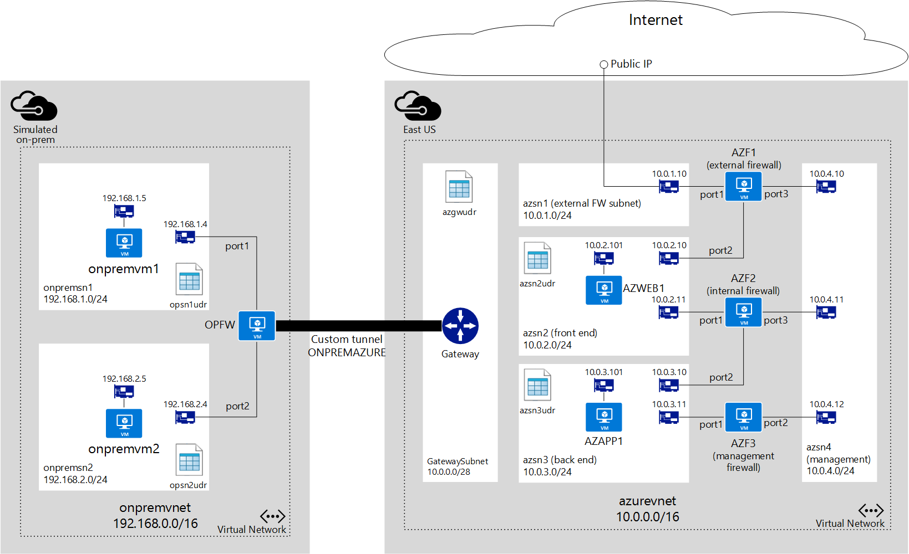

<properties 
   pageTitle="Hybrid connection with 2-tier application | Microsoft Azure"
   description="Learn how to deploy virtual appliances and UDR to create a multi-tier application environment in Azure"
   services="virtual-network"
   documentationCenter="na"
   authors="jimdial"
   manager="carmonm"
   editor="tysonn" />
<tags 
   ms.service="virtual-network"
   ms.devlang="na"
   ms.topic="article"
   ms.tgt_pltfrm="na"
   ms.workload="infrastructure-services"
   ms.date="05/05/2016"
   ms.author="jdial" />

# Virtual appliance scenario

A common scenario among larger Azure customer is the need to provide a two-tiered application exposed to the Internet, while allowing access to the back tier from an on-premises datacenter. This document will walk you through a scenario using User Defined Routes (UDR), a VPN Gateway, and network virtual appliances to deploy a two-tier environment that meets the following requirements:

- Web application must be accessible from the public Internet only.
- Web server hosting the application must be able to access a backend application server.
- All traffic from the Internet to the web application must go through a firewall virtual appliance. This virtual appliance will be used for Internet traffic only.
- All traffic going to the application server must go through a firewall virtual appliance. This virtual appliance will be used for access to the backend end server, and access coming in from the on-premises network via a VPN Gateway.
- Administrators must be able to manage the firewall virtual appliances from their on-premises computers, by using a third firewall virtual appliance used exclusively for management purposes.

This is a standard DMZ scenario with a DMZ and a protected network. Such scenario can be constructed in Azure by using NSGs, firewall virtual appliances, or a combination of both. The table below shows some of the pros and cons between NSGs and firewall virtual appliances.

||Pros|Cons|
|---|---|---|
|NSG|No cost.  Integrated into Azure RBAC.  Rules can be created in ARM templates.|Complexity could vary in larger environments. |
|Firewall|Full control over data plane.  Central management through firewall console.|Cost of firewall appliance.  Not integrated with Azure RBAC.|

The solution below uses firewall virtual appliances to implement a DMZ/protected network scenario.

## Considerations

You can deploy the environment explained above in Azure using different features available today, as follows.

- **Virtual network (VNet)**. An Azure VNet acts in similar fashion to an on-premises network, and can be segmented into one or more subnets to provide traffic isolation, and separation of concerns.
- **Virtual appliance**. Several partners provide virtual appliances in the Azure Marketplace that can be used for the three firewalls described above. 
- **User Defined Routes (UDR)**. Route tables can contain UDRs used by Azure networking to control the flow of packets within a VNet. These route tables can be applied to subnets. One of the newest features in Azure is the ability to apply a route table to the GatewaySubnet, providing the ability to forward all traffic coming into the Azure VNet from a hybrid connection to a virtual appliance.
- **IP Forwarding**. By default, the Azure networking engine forward packets to virtual network interface cards (NICs) only if the packet destination IP address matches the NIC IP address. Therefore, if a UDR defines that a packet must be sent to a given virtual appliance, the Azure networking engine would drop that packet. To ensure the packet is delivered to a VM (in this case a virtual appliance) that is not the actual destination for the packet, you need to enable IP Forwarding for the virtual appliance.
- **Network Security Groups (NSGs)**. The example below does not make use of NSGs, but you could use NSGs applied to the subnets and/or NICs in this solution to further filter the traffic in and out of those subnets and NICs.

In this example there is a subscription that contains the following:

- 2 resource groups, not shown in the diagram. 
	- **ONPREMRG**. Contains all resources necessary to simulate an on-premises network.
	- **AZURERG**. Contains all resources necessary for the Azure virtual network environment. 
- A VNet named **onpremvnet** used to mimic an on-premises datacenter segmented as listed below.
	- **onpremsn1**. Subnet containing a virtual machine (VM) running Ubuntu to mimic an on-premises server.
	- **onpremsn2**. Subnet containing a VM running Ubuntu to mimic an on-premises computer used by an administrator.
- There is one firewall virtual appliance named **OPFW** on **onpremvnet** used to maintain a tunnel to **azurevnet**.
- A VNet named **azurevnet** segmented as listed below.
	- **azsn1**. External firewall subnet used exclusively for the external firewall. All Internet traffic will come in through this subnet. This subnet only contains a NIC linked to the external firewall.
	- **azsn2**. Front end subnet hosting a VM running as a web server that will be accessed from the Internet.
	- **azsn3**. Backend subnet hosting a VM running a backend application server that will be accessed by the front end web server.
	- **azsn4**. Management subnet used exclusively to provide management access to all firewall virtual appliances. This subnet only contains a NIC for each firewall virtual appliance used in the solution.
	- **GatewaySubnet**. Azure hybrid connection subnet required for ExpressRoute and VPN Gateway to provide connectivity between Azure VNets and other networks. 
- There are 3 firewall virtual appliances in the **azurevnet** network. 
	- **AZF1**. External firewall exposed to the public Internet by using a public IP address resource in Azure. You need to ensure you have a template from the Marketplace, or directly from your appliance vendor, that provisions a 3-NIC virtual appliance.
	- **AZF2**. Internal firewall used to contrl traffic between **azsn2** and **azsn3**. This is also a 3-NIC virtual appliance.
	- **AZF3**. Management firewall accessible to administrators from the on-premises datacenter, and connected to a management subnet used to manage all firewall appliances. You can find 2-NIC virtual appliance templates in the Marketplace, or request one directly from your appliance vendor.

## User Defined Routing (UDR)

Each subnet in Azure can be linked to a UDR table used to define how traffic initiated in that subnet is routed. If no UDRs are defined, Azure uses default routes to allow traffic to flow from one subnet to another. To better understand UDRs, visit What are User Defined Routes and IP Forwarding.

To ensure communication is done through the right firewall appliance, based on the last requirement above, you need to create the following route table containing UDRs in **azurevnet**.

### azgwudr

In this scenario, the only traffic flowing from on-premises to Azure will be used to manage the firewalls by connecting to **AZF3**, and that traffic must go through the internal firewall, **AZF2**. Therefore, only one route is necessary in the **GatewaySubnet** as shown below.

|Destination|Next hop|Explanation|
|---|---|---|
|10.0.4.0/24|10.0.3.11|Allows on-premises traffic to reach management firewall **AZF3**|

### azsn2udr

|Destination|Next hop|Explanation|
|---|---|---|
|10.0.3.0/24|10.0.2.11|Allows traffic to the backend subnet hosting the application server through **AZF2**|
|0.0.0.0/0|10.0.2.10|Allows all other traffic to be routed through **AZF1**|

### azsn3udr

|Destination|Next hop|Explanation|
|---|---|---|
|10.0.2.0/24|10.0.3.10|Allows traffic to **azsn2** to flow from app server to the webserver through **AZF2**|

You also need to create route tables for the subnets in **onpremvnet** to mimic the on-premises datacenter.

### onpremsn1udr

|Destination|Next hop|Explanation|
|---|---|---|
|192.168.2.0/24|192.168.1.4|Allows traffic to **onpremsn2** through **OPFW**|

### onpremsn2udr

|Destination|Next hop|Explanation|
|---|---|---|
|10.0.3.0/24|192.168.2.4|Allows traffic to the backed subnet in Azure through **OPFW**|
|192.168.1.0/24|192.168.2.4|Allows traffic to **onpremsn1** through **OPFW**|

## IP Forwarding 

UDR and IP Forwarding are features that you can use in combination to allow virtual appliances to be used to control traffic flow in an Azure VNet.  A virtual appliance is nothing more than a VM that runs an application used to handle network traffic in some way, such as a firewall or a NAT device.

This virtual appliance VM must be able to receive incoming traffic that is not addressed to itself. To allow a VM to receive traffic addressed to other destinations, you must enable IP Forwarding for the VM. This is an Azure setting, not a setting in the guest operating system. Your virtual appliance still needs to run some type of application to handle the incoming traffic, and route it appropriately.

To learn more about IP Forwarding, visit [What are User Defined Routes and IP Forwarding](./virtual-networks-udr-overview.md#ip-forwarding).

As an example, imagine you have the following setup in an Azure vnet:

- Subnet **onpremsn1** contains a VM named **onpremvm1**.
- Subnet **onpremsn2** contains a VM named **onpremvm2**.
- A virtual appliance named **OPFW** is connected to **onpremsn1** and **onpremsn2**.
- A user defined route linked to **onpremsn1** specifies that all traffic to **onpremsn2** must be sent to **OPFW**.

At this point, if **onpremvm1** tries to establish a connection with **onpremvm2**, the UDR will be used and traffic will be sent to **OPFW** as the next hop. Keep in mind that the actual packet destination is not being changed, it still says **onpremvm2** is the destination. 

Without IP Forwarding enabled for **OPFW**, the Azure virtual networking logic will drop the packets, since it only allows packets to be sent to a VM if the VM’s IP address is the destination for the packet.

With IP Forwarding, the Azure virtual network logic will forward the packets to OPFW, without changing its original destination address. **OPFW** must handle the packets and determine what to do with them.

For the scenario above to work, you must enable IP Forwarding on the NICs for **OPFW**, **AZF1**, **AZF2**, and **AZF3** that are used for routing (all NICs except the ones linked to the management subnet). 

## Firewall Rules

As described above, IP Forwarding only ensures packets are sent to the virtual appliances. Your appliance still needs to decide what to do with those packets. In the scenario above, you will need to create the following rules in your appliances:

### OPFW

OPFW represents an on-premises device containing the following rules:

- **Route**: All traffic to 10.0.0.0/16 (**azurevnet**) must be sent through tunnel **ONPREMAZURE**.
- **Policy**: Allow all bidirectional traffic between **port2** and **ONPREMAZURE**.
 
### AZF1

AZF1 represents an Azure virtual appliance containing the following rules:

- **Policy**: Allow all bidirectional traffic between **port1** and **port2**.

### AZF2

AZF2 represents an Azure virtual appliance containing the following rules:

- **Route**: All traffic to 10.0.0.0/16 (**onpremvnet**) must be sent to the Azure gateway IP address (i.e. 10.0.0.1) through **port1**.
- **Policy**: Allow all bidirectional traffic between **port1** and **port2**.

## Network Security Groups (NSGs)

In this scenario, NSGs are not being used. However, you could apply NSGs to each subnet to restrict incoming and outgoing traffic. For instance, you could apply the following NSG rules to the external FW subnet.

**Incoming**

- Allow all TCP traffic from the Internet to port 80 on any VM in the subnet.
- Deny all other traffic from the Internet.

**Outgoing**
- Deny all traffic to the Internet.

## High level steps

To deploy this scenario, follow the high level steps below.

1.	Login to your Azure Subscription.
2.	If you want to deploy a VNet to mimic the on-premises network, provision the resources that are part of **ONPREMRG**.
3.	Provision the resources that are part of **AZURERG**.
4.	Provision the tunnel from **onpremvnet** to **azurevnet**.
5.	Once all resources are provisioned, log on to **onpremvm2** and ping 10.0.3.101 to test connectivity between **onpremsn2** and **azsn3**.