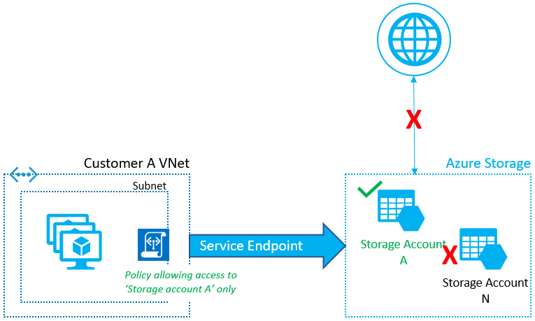

# Virtual network service endpoint policies for Azure Storage

Virtual Network (VNet) service endpoint policies allow you to filter egress virtual network traffic to Azure Storage accounts over service endpoint, and allow data exfiltration to only specific Azure Storage accounts. Endpoint policies provide granular access control for virtual network traffic to Azure Storage when connecting over service endpoint.



This feature is generally available for __Azure Storage__ in __all global Azure regions__.

## Key benefits

Virtual network service endpoint policies provide following benefits:

- __Improved security for your Virtual Network traffic to Azure Storage__

  [Azure service tags for network security groups](https://aka.ms/servicetags) allow you to restrict virtual network outbound traffic to specific Azure Storage regions. However, this allows traffic to any account within selected Azure Storage region.
  
  Endpoint policies allow you to specify the Azure Storage accounts that are allowed virtual network outbound access and restricts access to all the other storage accounts. This gives much more granular security control for protecting data exfiltration from your virtual network.

- __Scalable, highly available policies to filter Azure service traffic__

   Endpoint policies provide horizontally scalable, highly available solution to filter Azure service traffic from virtual networks, over service endpoints. No additional overhead is required to maintain central network appliances for this traffic in your virtual networks.

## JSON Object for Service Endpoint policies
Let's take a quick look at the Service Endpoint Policy object.

```json
"serviceEndpointPolicyDefinitions": [
    {
            "description": null,
            "name": "MySEP-Definition",
            "resourceGroup": "MySEPDeployment",
            "service": "Microsoft.Storage",
            "serviceResources": [ 
                    "/subscriptions/subscriptionID/resourceGroups/MySEPDeployment/providers/Microsoft.Storage/storageAccounts/mystgacc"
            ],
            "type": "Microsoft.Network/serviceEndpointPolicies/serviceEndpointPolicyDefinitions"
    }
]
```

## Configuration

-	You can configure the endpoint policies to restrict virtual network traffic to specific Azure Storage accounts.
-	Endpoint policy is configured on a subnet in a virtual network. Service endpoints for Azure Storage should be enabled on the subnet to apply the policy.
-	Endpoint policy allows you to add specific Azure Storage accounts to allow list, using the resourceID format. You can restrict access to
    - all storage accounts in a subscription<br>
      `E.g. /subscriptions/subscriptionId`

    - all storage accounts in a resource group<br>
      `E.g. subscriptions/subscriptionId/resourceGroups/resourceGroupName`
     
    - an individual storage account by listing the corresponding Azure Resource Manager resourceId. This covers traffic to blobs, tables, queues, files and Azure Data Lake Storage Gen2. <br>
    `E.g. /subscriptions/subscriptionId/resourceGroups/resourceGroupName/providers/Microsoft.Storage/storageAccounts/storageAccountName`
-	By default, if no policies are attached to a subnet with endpoints, you can access all storage accounts in the service. Once a policy is configured on that subnet, only the resources specified in the policy can be accessed from compute instances in that subnet. Access to all other storage accounts will be denied.
-	When applying Service Endpoint policies on a subnet, the Azure Storage *Service Endpoint scope* gets upgraded from regional to **global**. This means that all the traffic to Azure Storage is secured over service endpoint thereafter. The Service endpoint policies are also applicable globally, so any storage accounts, that are not explicitly allowed, will be denied access. 
-	You can apply multiple policies to a subnet. When multiple policies are associated to the subnet, virtual network traffic to resources specified across any of these policies will be allowed. Access to all other service resources, not specified in any of the policies, will be denied.

    > [!NOTE]  
    > Service endpoint policies are **allow policies**, so apart from the specified resources, all other resources are restricted. Please ensure that all service resource dependencies for your applications are identified and listed in the policy.

- Only storage accounts using the Azure Resource Model can be specified in the endpoint policy. Your classic Azure Storage accounts will not support Azure Service Endpoint Policies.
- RA-GRS secondary access will be automatically allowed if the primary account is listed.
- Storage accounts can be in the same or a different subscription or Azure Active Directory tenant as the virtual network.

## Scenarios

- **Peered, connected or multiple virtual networks**: To filter traffic in peered virtual networks, endpoint policies should be applied individually to these virtual networks.
- **Filtering Internet traffic with Network Appliances or Azure Firewall**: Filter Azure service traffic with policies, over service endpoints, and filter rest of the Internet or Azure traffic via appliances or Azure Firewall.
- **Filtering traffic on Azure services deployed into Virtual Networks**: At this time, Azure Service Endpoint Policies are not supported for any managed Azure services that are deployed into your virtual network. 
- **Filtering traffic to Azure services from on-premises**:
Service endpoint policies only apply to the traffic from subnets associated to the policies. To allow access to specific Azure service resources from on-premises, traffic should be filtered using network virtual appliances or firewalls.

## Logging and troubleshooting
No centralized logging is available for service endpoint policies. For service resource logs, see [Service endpoints logging](virtual-network-service-endpoints-overview.md#logging-and-troubleshooting).

### Troubleshooting scenarios
- Access denied to storage accounts that were working in preview (not in geo-paired region)
  - With Azure Storage upgrading to use Global Service Tags, the scope of Service Endpoint and thus Service Endpoint policies is now Global. So any traffic to Azure Storage is encrypted over Service Endpoints and only Storage accounts that are explicitly listed in policy are allowed access.
  - Explicitly allow list all the required Storage accounts to restore access.  
  - Contact Azure support.
- Access is denied for accounts listed in the endpoint policies
  - Network security groups or firewall filtering could be blocking access
  - If removing/re-applying the policy results in connectivity loss:
    - Validate whether the Azure service is configured to allow access from the virtual network over endpoints, or that the default policy for the resource is set to *Allow All*.
    - Validate that the service diagnostics show the traffic over endpoints.
    - Check whether network security group flow logs show the access and that storage logs show the access, as expected, over service endpoints.
    - Contact Azure support.
- Access is denied for accounts not listed in the service endpoint policies
  - Validate whether Azure Storage is configured to allow access from the virtual network over endpoints, or whether the default policy for the resource is set to *Allow All*.
  - Ensure the accounts are not **classic storage accounts** with service endpoint policies on the subnet.
- A managed Azure Service stopped working after applying a Service Endpoint Policy over the subnet
  - Managed services are not supported with service endpoint policies at this time. *Watch this space for updates*.

## Provisioning

Service endpoint policies can be configured on subnets by a user with write access to a virtual network. Learn more about Azure [built-in roles](../role-based-access-control/built-in-roles.md?toc=%2fazure%2fvirtual-network%2ftoc.json) and assigning specific permissions to [custom roles](../role-based-access-control/custom-roles.md?toc=%2fazure%2fvirtual-network%2ftoc.json).

Virtual networks and Azure Storage accounts can be in the same or different subscriptions, or Azure Active Directory tenants.

## Limitations

- You can only deploy service endpoint policies on virtual networks deployed through the Azure Resource Manager deployment model.
- Virtual networks must be in the same region as the service endpoint policy.
- You can only apply service endpoint policy on a subnet if service endpoints are configured for the Azure services listed in the policy.
- You can't use service endpoint policies for traffic from your on-premises network to Azure services.
- Azure managed services do not currently support Endpoint policies. This includes managed services deployed into the shared subnets (e.g. *Azure HDInsight, Azure Batch, Azure ADDS, Azure APplication Gateway, Azure VPN gateway, Azure Firewall*) or into the dedicated subnets (e.g. *Azure App Service Environment, Azure Redis Cache, Azure API Management, Azure SQL MI, classic managed services*).

 > [!WARNING]
 > Azure services deployed into your virtual network, such as Azure HDInsight, access other Azure services, such as Azure Storage, for infrastructure requirements. Restricting endpoint policy to specific resources could break access to these infrastructure resources for the Azure services deployed in your virtual network.

- Classic storage accounts are not supported in endpoint policies. Policies will deny access to all classic storage accounts, by default. If your application needs access to Azure Resource Manager and classic storage accounts, endpoint policies should not be used for this traffic.

## Pricing and limits

There is no additional charge for using service endpoint policies. The current pricing model for Azure services (such as, Azure Storage) applies as is today, over service endpoints.

Following limits are enforced on service endpoint policies: 

 |Resource | Default limit |
 |---------|---------------|
 |ServiceEndpointPoliciesPerSubscription |500 |
 |ServiceEndpintPoliciesPerSubnet|100 |
 |ServiceResourcesPerServiceEndpointPolicyDefinition|200 |

## Next Steps

- Learn [how to configure virtual network service endpoint policies](virtual-network-service-endpoint-policies-portal.md)
- Learn more about [Virtual network Service Endpoints](virtual-network-service-endpoints-overview.md)
