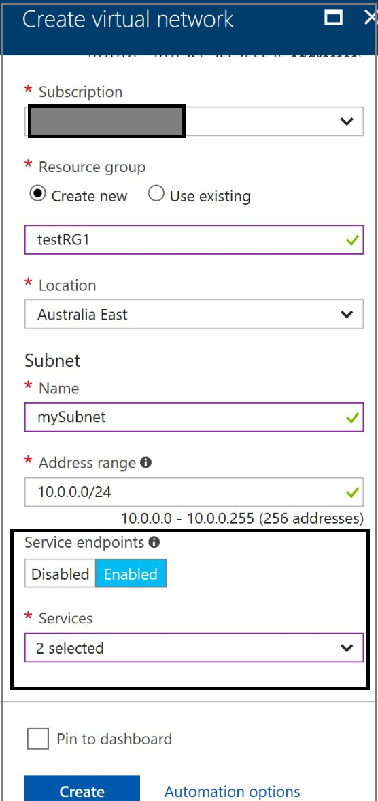

# Configure Virtual Network Service Endpoints

Virtual Network (VNet) service endpoints allow you to secure Azure service resources to your Azure Virtual Network, fully removing the public Internet access to these resources. Service endpoints provide direct connection from your virtual network to an Azure service, allowing you to use your VNet’s private address space to access the Azure services. Traffic destined to Azure services through service endpoints  always stays on the Microsoft Azure backbone network. Learn more about ["Virtual network service endpoints”](virtual-network-service-endpoints-overview.md)

This article provides steps to enable and disable service endpoints. Once endpoints are enabled on a subnet to an Azure service, you can secure specific service resources to a virtual network.

Service endpoints can be configured using [Azure portal](#Azure%20portal), [Azure PowerShell](#Azure%20Powershell), [Azure command-line interface](#cli), or an Azure Resource Manager [template](#template).

[!NOTE] During preview, Vnet service endpoints feature is supported for specific regions. For the list of supported regions, refer to  the [Azure Virtual Network updates](https://azure.microsoft.com/en-us/updates/?product=virtual-network) page.

## __Service endpoint configuration overview__

[!NOTE] Service endpoints can only be configured on VNets deployed through Azure Resource Manager deployment model.

- Service endpoints are set on each subnet of a VNet.

- For a subnet, you can only configure one service endpoint to a service. You can configure multiple service endpoints to different services (say, Azure Storage, Azure SQL).

- You can enable the endpoints on a new or existing subnet.

- Location is configured automatically for an endpoint. By default, service endpoints are configured to the VNet's region. For Azure Storage, to support regional failover scenarios, endpoints are automatically configured to [Azure paired regions.](https://docs.microsoft.com/azure/best-practices-availability-paired-regions#what-are-paired-regions)

[!IMPORTANT] Depending on the size of VNet/subnet, enabling service endpoint may take some time to finish. Ensure no critical tasks are in progress when enabling service endpoints. Service endpoints switch routes on every NIC in your subnet and may terminate any open TCP connections. 

- Service endpoint call returns “succeeded” after traffic flows to the service on all NICs in the subnet have been switched to Vnet private IP addresses.

- __Effective Routes to validate endpoint configuration__

   To validate if service endpoint is configured correctly, "effective routes" on any NIC in the subnet shows a new "default" route with nextHopType: VirtualNetworkServiceEndpoint, per service, per region. Learn more about [troubleshooting with effective routes](https://docs.microsoft.com/azure/virtual-network/virtual-network-routes-troubleshoot-portal#using-effective-routes-to-troubleshoot-vm-traffic-flow)

   [!NOTE] Effection routes can only be viewed if you have one or more network interfaces (NICs) configured and associated with a running virtual machine in the subnet.

## __Azure portal__

### __Setting up service endpoint on a subnet during VNet Create__

1. Open [Azure portal](https://portal.azure.com/).
Log in to Azure using your Azure account. If you don't have an Azure account, you can sign up for a free trial. The account must have the necessary [permissions](#provisioning) to create a virtual network and service endpoint.
2. Click +New > Networking > Virtual network > +Add.
3. On "Create virtual network", enter the following values, and then click Create:

Setting | Value
------- | -----
Name    | myVnet
Address space | 10.0.0.0/16
Subnet name|mySubnet
Subnet address range|10.0.0.0/24
Resource group|Leave Create new selected, and then enter a name.
Location|Any supported region, say, Australia East
Subscription|Select your subscription.
__ServiceEndpoints__|Enabled
__Services__ | Select one or all of the available services. At the time of preview, supported services: __"Microsoft.Storage", "Microsoft.Sql"__.

Select services for endpoints: 


4. Validate all the settings are correct and click "Create".



### __Validating service endpoint configuration__

You can confirm that the service endpoints are configured using below steps:

- In resources, click on “Virtual Networks". Search for the VNet.
- Click on the Vnet name and navigate to “Service Endpoints”
- Configured endpoints show as “Succeeded”. Auto-configured locations can also be seen


### __Effective routes to validate endpoint configuration__

To view effective route on a network interface (NIC) in the subnet, click on any NIC in that subnet. Under "Suppoert + Troubleshooting", click "Effective routes". If endpoint is configured, you will see a new "default" route with address prefixes of the service as destination, and nextHopType as "VirtualNetworkServiceEndpoint".


### __Setting up service endpoints for existing subnets in a VNet__

1. In resources, click on “Virtual networks” and search for any existing VNet
2. Click on the VNet name and navigate to “Service endpoints”
3. Click “Add”. Select “Service”. You can create an endpoint to only one service at a time. 
4. Select all the subnets where you want to apply the endpoint. Click “Add”


### __Deleting service endpoints__
1. In resources, click on “Virtual Networks". Search for an existing VNet by filtering on VNet name.
2. Click on the Vnet name and navigate to “Service Endpoints”
3. Click on the service name and right-click on the service endpoint entry
4. Select "Delete"


## __Azure Powershell__

Set-up pre-requisites:

- Install the latest version of the PowerShell [AzureRm](https://www.powershellgallery.com/packages/AzureRM/) module. If you're new to Azure PowerShell, see [Azure PowerShell overview](/powershell/azure/overview?toc=%2fazure%2fvirtual-network%2ftoc.json).
- To start a PowerShell session, go to **Start**, enter **powershell**, and then click **PowerShell**.
- In PowerShell, log in to Azure by entering the `login-azurermaccount` command. The account must have the necessary [permissions](#provisioning) to create a virtual network and service endpoint.

__Get available service endpoints for Azure region__
Use the command below to get the list of services supported for endpoints, for an Azure region.
 ```powershell
Get-AzureRmVirtualNetworkAvailableEndpointService -location eastus
```

Output: 
Name | ID | Type
-----|----|-------
Microsoft.Storage|/subscriptions/xxxx-xxx-xxx/providers/Microsoft.Network/virtualNetworkEndpointServices/Microsoft.Storage|Microsoft.Network/virtualNetworkEndpointServices
Microsoft.Sql|/subscriptions/xxxx-xxx-xxx/providers/Microsoft.Network/virtualNetworkEndpointServices/Microsoft.Sql|Microsoft.Network/virtualNetworkEndpointServices

__Add Azure Storage service endpoint to a subnet *mySubnet* while creating the virtual network *myVNet*__

```powershell
$subnet = New-AzureRmVirtualNetworkSubnetConfig -Name "mySubnet" -AddressPrefix "10.0.1.0/24" -ServiceEndpoint “Microsoft.Storage”

New-AzureRmVirtualNetwork -Name "myVNet" -AddressPrefix "10.0.0.0/16" -Subnet $subnet -ResourceGroupName "myRG" -Location "WestUS"
```
You can enable multiple services by using comma-separated list of service names.
Example: "Microsoft.Storage", "Microsoft.Sql"

Expected Output:
```
Subnets : [
            {
            "Name": "mySubnet",
             ...
            "ServiceEndpoints": [
              {
                   "ProvisioningState": "Succeeded",
                    "Service": "Microsoft.Storage",
                    "Locations": [
                        "westus",
                        "eastus"
                                 ]
               }
                                ],
            "ProvisioningState": "Succeeded"
            }
          ]
```

__Add multiple service endpoints to an existing subnet__

```powershell
Get-AzureRmVirtualNetwork -ResourceGroupName "myRG" -Name "myVNet" | Set-AzureRmVirtualNetworkSubnetConfig -Name "mySubnet"  -AddressPrefix "10.0.1.0/24" -ServiceEndpoint "Microsoft.Storage", "Microsoft.Sql" | Set-AzureRmVirtualNetwork
```

Expected Output: 
```
Subnets : [
            {
                "Name": "mySubnet",
                 ...
                "ServiceEndpoints": [
                {
                    "ProvisioningState": "Succeeded",
                    "Service": "Microsoft.Storage",
                    "Locations": [
                        "eastus",
                        "westus"
                                 ]
                },
                {
                    "ProvisioningState": "Succeeded",
                    "Service": "Microsoft.Sql",
                    "Locations": [
                        "eastus"
                                 ]
                }
                ],
               "ProvisioningState": "Succeeded"
            }
         ]
```

__View service endpoints configured on a subnet__

```powershell
$subnet=Get-AzureRmVirtualNetwork -ResourceGroupName "myRG" -Name "myVNet" | Get-AzureRmVirtualNetworkSubnetConfig -Name "mySubnet"
$subnet.ServiceEndpoints
```
Output:
```
ProvisioningState Service           Locations
----------------- -------           ---------
Succeeded         Microsoft.Storage {eastus, westus}
Succeeded         Microsoft.Sql     {eastus}
```

__Delete service endpoints on a subnet__
```powershell
Get-AzureRmVirtualNetwork -ResourceGroupName "myRG" -Name "myVNet" | Set-AzureRmVirtualNetworkSubnetConfig -Name "mySubnet"  -AddressPrefix "10.0.1.0/24" -ServiceEndpoint $null | Set-AzureRmVirtualNetwork
```

### __Effective routes to validate endpoint configuration__

If service endpoints are configured, effective routes show new default routes with nextHop as "VirtualNetworkServiceEndpoint", one route entry per service per region.
Learn more about [troubleshooting with effective routes](https://docs.microsoft.com/azure/virtual-network/virtual-network-routes-troubleshoot-portal#using-effective-routes-to-troubleshoot-vm-traffic-flow)

[!NOTE] Effection routes can only be viewed if you have one or more network interfaces (NICs) configured and associated with a running virtual machine in the subnet.

## __Azure CLI__

Set-up pre-requisites:
- Log in to your Azure subscription with the [az login](/cli/azure/#login) command and follow the on-screen directions. For more information about logging in, see [Get Started with Azure CLI 2.0](https://docs.microsoft.com/cli/azure/get-started-with-azure-cli?view=azure-cli-latest).
 - The account must have the necessary [permissions](#provisioning) to create a virtual network and service endpoint.

 For full list of commands for virtual networks, see [Azure CLI Virtual Network commands](https://docs.microsoft.com/cli/azure/network/vnet?view=azure-cli-latest)

__Get available service endpoints for Azure region__

Use the command below to get the list of services supported for endpoints, for an Azure region, say "EastUS".
```azure-cli
az network vnet list-endpoint-services -l eastus
```
Output:
```
    {
    "id": "/subscriptions/xxxx-xxxx-xxxx/providers/Microsoft.Network/virtualNetworkEndpointServices/Microsoft.Storage",
    "name": "Microsoft.Storage",
    "type": "Microsoft.Network/virtualNetworkEndpointServices"
     },
     {
     "id": "/subscriptions/xxxx-xxxx-xxxx/providers/Microsoft.Network/virtualNetworkEndpointServices/Microsoft.Sql",
     "name": "Microsoft.Sql",
     "type":   "Microsoft.Network/virtualNetworkEndpointServices"
     }
```

__Add Azure Storage service endpoint to a subnet *mySubnet* while creating the virtual network *myVNet*__

```azure-cli
az network vnet create -g myRG -n myVNet --address-prefixes 10.0.0.0/16 -l eastUS

az network vnet subnet create -g myRG -n mySubnet --vnet-name myVNet --address-prefix 10.0.1.0/24 --service-endpoints Microsoft.Storage
```

To add multiple endpoints: 
--service-endpoints Microsoft.Storage Microsoft.Sql

Output:
```
{
  "addressPrefix": "10.0.1.0/24",
  ...
  "name": "mySubnet",
  "networkSecurityGroup": null,
  "provisioningState": "Succeeded",
  "resourceGroup": "myRG",
  "resourceNavigationLinks": null,
  "routeTable": null,
  "serviceEndpoints": [
    {
      "locations": [
        "eastus",
        "westus"
      ],
      "provisioningState": "Succeeded",
      "service": "Microsoft.Storage"
    }
  ]
}
```

__Add multiple service endpoints to an existing subnet__

```azure-cli
az network vnet subnet update -g myRG -n mySubnet2 --vnet-name myVNet --service-endpoints Microsoft.Storage Microsoft.Sql
```

Expected Output:
```
{
  "addressPrefix": "10.0.2.0/24",
  ...
  "name": "mySubnet2",
  ...
  "serviceEndpoints": [
    {
      "locations": [
        "eastus",
        "westus"
      ],
      "provisioningState": "Succeeded",
      "service": "Microsoft.Storage"
    },
    {
      "locations": [
        "eastus"
      ],
      "provisioningState": "Succeeded",
      "service": "Microsoft.Sql"
    }
  ]
}
```

__View service endpoints configured on a subnet__

```azure-cli
az network vnet subnet show -g myRG -n mySubnet --vnet-name myVNet
```

__Delete service endpoints on a subnet__
```azure-cli
az network vnet subnet update -g myRG -n mySubnet --vnet-name myVNet --service-endpoints ""
```

Output: 
```
{
  "addressPrefix": "10.0.1.0/24",
  ...
  "name": "mySubnet",
  "networkSecurityGroup": null,
  "provisioningState": "Succeeded",
  "resourceGroup": "myRG",
  "resourceNavigationLinks": null,
  "routeTable": null,
  "serviceEndpoints": null
}
```

### __Effective routes to validate endpoint configuration__

If service endpoints are configured, effective routes show new default routes with nextHop as "VirtualNetworkServiceEndpoint", one route entry per service per region.
Learn more about [troubleshooting with effective routes](https://docs.microsoft.com/azure/virtual-network/virtual-network-routes-troubleshoot-portal#using-effective-routes-to-troubleshoot-vm-traffic-flow)

[!NOTE] Effection routes can only be viewed if you have one or more network interfaces (NICs) configured and associated with a running virtual machine in the subnet.


## __Resource Manager Template__

### Securing Azure service resources to VNets

You can secure specific Azure resources to your virtual network through service endpoints.

Download the sample [Resource Manager template](https://azure.microsoft.com/resources/templates/201-vnet-2subnets-service-endpoints-storage-integration) to secure a storage account to a subnet in a VNet.

The template creates a VNet with 2 subnets, a VM with a NIC in each of the subnets. Enables endpoint on one subnet and secures a storage account to that subnet.
The template also adds a sample IP firewall rule. 

You can download the template and modify parts of it to fit your scenario.

Instructions are provided with the template for deploying the template using the Azure portal, PowerShell, or the Azure CLI. Ensure you have the required [permissions](#provisioning) to set up the endpoint and secure the account.

To secure Azure resources to a subnet:

- a service endpoint should be configured on that subnet.
- the resource should be secured to the vnet by adding a virtual network rule on the resource.

### Deleting service endpoints with resources secured to the subnet

[!NOTE] If Azure service resources are secured to the subnet and the service endpoint is deleted, you 
cannot access the resource from the subnet anymore. Re-enabling the endpoint alone won't restore access to the resources previously secured to the subnet.

To secure the service resource to this subnet again, you need to:

- enable the endpoint again
- remove the old vnet rule on the resource
- add a new rule securing the resource to the subnet

### __Provisioning__

Service endpoints can be configured on Virtual networks independently, by network administrators. A user with read-write access to Virtual network automatically inherits these rights. 

To secure Azure service resources to a VNet, below minimum access rights are required: 

Service  | Role | Permissions
---------|------|----------------
Storage | StorageAdministrator |Microsoft.Network/virtualnetworks/JoinservicetoVnet

Learn more about built-in roles and assigning specific permissions to custom roles.

VNets and Azure service resources can be in the same or different subscriptions. If these are in different subscriptions, the resources should be under the same Active Directory (AD) tenant, at the time of this preview. 

###__Next Steps__

For more instructions to secure service resource to VNets, refer to below links:

[Securing Azure Storage accounts to Virtual Networks](https://docs.microsoft.com/azure/storage/common/storage-network-security)

[Securing Azure SQL to Virtual networks](https://docs.microsoft.com/azure/sql-database/sql-database-vnet-service-endpoint-rule-overview)