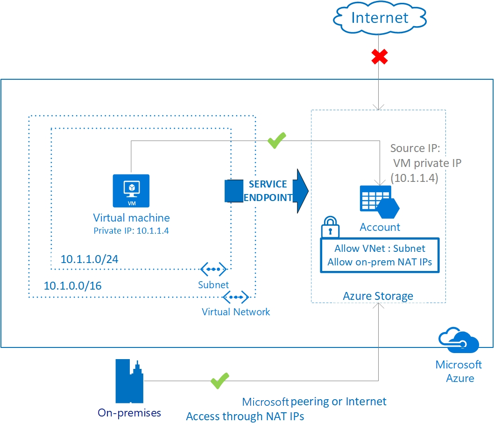

# Virtual Network Service Endpoints

Virtual Network (VNet) service endpoints extend your virtual network private address space and the identity of your VNet to the Azure services, over a direct connection. Endpoints allow you to secure your critical Azure service resources to only your virtual networks. Traffic from your VNet to the Azure service always remains on the Microsoft Azure backbone network.

This feature is available for the following Azure services and regions:

**Generally available**

- **[Azure Storage](../storage/common/storage-network-security.md?toc=%2fazure%2fvirtual-network%2ftoc.json#grant-access-from-a-virtual-network)**: Generally available in all Azure regions.
- **[Azure SQL Database](../sql-database/sql-database-vnet-service-endpoint-rule-overview.md?toc=%2fazure%2fvirtual-network%2ftoc.json)**: Generally available in all Azure regions.
- **[Azure SQL Data Warehouse](../sql-database/sql-database-vnet-service-endpoint-rule-overview.md?toc=%2fazure%2fvirtual-network%2ftoc.json)**: Generally available in all Azure regions.
- **[Azure Database for PostgreSQL server](../postgresql/howto-manage-vnet-using-portal.md?toc=%2fazure%2fvirtual-network%2ftoc.json)**: Generally available in Azure regions where database service is available.
- **[Azure Database for MySQL server](../mysql/howto-manage-vnet-using-portal.md?toc=%2fazure%2fvirtual-network%2ftoc.json)**: Generally available in Azure regions where database service is available.
- **[Azure Database for MariaDB](https://docs.microsoft.com/azure/mariadb/concepts-data-access-security-vnet)**: Generally available in Azure regions where database service is available.
- **[Azure Cosmos DB](../cosmos-db/vnet-service-endpoint.md?toc=%2fazure%2fvirtual-network%2ftoc.json)**: Generally available in all Azure regions.
- **[Azure Key Vault](../key-vault/key-vault-overview-vnet-service-endpoints.md)**: Generally available in all Azure regions.
- **[Azure Service Bus](../service-bus-messaging/service-bus-service-endpoints.md?toc=%2fazure%2fvirtual-network%2ftoc.json)**: Generally available in all Azure regions.
- **[Azure Event Hubs](../event-hubs/event-hubs-service-endpoints.md?toc=%2fazure%2fvirtual-network%2ftoc.json)**: Generally available in all Azure regions.
- **[Azure Data Lake Store Gen 1](../data-lake-store/data-lake-store-network-security.md?toc=%2fazure%2fvirtual-network%2ftoc.json)**: Generally available in all Azure regions where ADLS Gen1 is available.
- **[Azure App Service](https://docs.microsoft.com/azure/app-service/app-service-ip-restrictions)**: Generally available in all Azure regions where App service is available

**Public Preview**

- **[Azure Container Registry](../container-registry/container-registry-vnet.md)**: Preview available in all Azure regions where Azure Container Registry is available.
.

For the most up-to-date notifications, check the [Azure Virtual Network updates](https://azure.microsoft.com/updates/?product=virtual-network) page.

## Key benefits

Service endpoints provide the following benefits:

- **Improved security for your Azure service resources**: VNet private address space can be overlapping and so, cannot be used to uniquely identify traffic originating from your VNet. Service endpoints provide the ability to secure Azure service resources to your virtual network, by extending VNet identity to the service. Once service endpoints are enabled in your virtual network, you can secure Azure service resources to your virtual network by adding a virtual network rule to the resources. This provides improved security by fully removing public Internet access to resources, and allowing traffic only from your virtual network.
- **Optimal routing for Azure service traffic from your virtual network**: Today, any routes in your virtual network that force Internet traffic to your premises and/or virtual appliances, known as forced-tunneling, also force Azure service traffic to take the same route as the Internet traffic. Service endpoints provide optimal routing for Azure traffic. 

  Endpoints always take service traffic directly from your virtual network to the service on the Microsoft Azure backbone network. Keeping traffic on the Azure backbone network allows you to continue auditing and monitoring outbound Internet traffic from your virtual networks, through forced-tunneling, without impacting service traffic. Learn more about [user-defined routes and forced-tunneling](virtual-networks-udr-overview.md).
- **Simple to set up with less management overhead**: You no longer need reserved, public IP addresses in your virtual networks to secure Azure resources through IP firewall. There are no NAT or gateway devices required to set up the service endpoints. Service endpoints are configured through a simple click on a subnet. There is no additional overhead to maintaining the endpoints.

## Limitations

- The feature is available only to virtual networks deployed through the Azure Resource Manager deployment model.
- Endpoints are enabled on subnets configured in Azure virtual networks. Endpoints cannot be used for traffic from your premises to Azure services. For more information, see [Securing Azure service access from on-premises](#securing-azure-services-to-virtual-networks)
- For Azure SQL, a service endpoint applies only to Azure service traffic within a virtual network's region. For Azure Storage, to support RA-GRS and GRS traffic, endpoints also extend to include paired regions where the virtual network is deployed. Learn more about [Azure paired regions.](../best-practices-availability-paired-regions.md?toc=%2fazure%2fvirtual-network%2ftoc.json#what-are-paired-regions).
- For ADLS Gen 1, the VNet Integration capability is only available for virtual networks within the same region. Also note that virtual network integration for Azure Data Lake Storage Gen1 makes use of the virtual network service endpoint security between your virtual network and Azure Active Directory (Azure AD) to generate additional security claims in the access token. These claims are then used to authenticate your virtual network to your Data Lake Storage Gen1 account and allow access. "Microsoft.AzureActiveDirectory" tag listed under services supporting service endpoints is used only for supporting service endpoints to ADLS Gen 1. Azure Active Directory (Azure AD) doesn't support service endpoints natively. Learn more about [Azure Data Lake Store Gen 1 VNet Integration](../data-lake-store/data-lake-store-network-security.md?toc=%2fazure%2fvirtual-network%2ftoc.json).

## Securing Azure services to virtual networks

- A virtual network service endpoint provides the identity of your virtual network to the Azure service. Once service endpoints are enabled in your virtual network, you can secure Azure service resources to your virtual network by adding a virtual network rule to the resources.
- Today, Azure service traffic from a virtual network uses public IP addresses as source IP addresses. With service endpoints, service traffic switches to use virtual network private addresses as the source IP addresses when accessing the Azure service from a virtual network. This switch allows you to access the services without the need for reserved, public IP addresses used in IP firewalls.

>[!NOTE]
> With service endpoints, the source IP addresses of the virtual machines in the subnet for service traffic switches from using public IPv4 addresses to using private IPv4 addresses. Existing Azure service firewall rules using Azure public IP addresses will stop working with this switch. Please ensure Azure service firewall rules allow for this switch before setting up service endpoints. You may also experience temporary interruption to service traffic from this subnet while configuring service endpoints. 
 
- __Securing Azure service access from on-premises__:

  By default, Azure service resources secured to virtual networks are not reachable from on-premises networks. If you want to allow         traffic from on-premises, you must also allow public (typically, NAT) IP addresses from your on-premises or ExpressRoute. These IP       addresses can be added through the IP firewall configuration for Azure service resources.

  ExpressRoute: If you are using [ExpressRoute](../expressroute/expressroute-introduction.md?toc=%2fazure%2fvirtual-network%2ftoc.json) from your premises, for public peering or Microsoft peering, you will need to identify the NAT IP addresses that are used. For public peering, each ExpressRoute circuit by default uses two NAT IP addresses applied to Azure service traffic when the traffic enters the Microsoft Azure network backbone. For Microsoft peering, the NAT IP address(es) that are used are either customer provided or are provided by the service provider. To allow access to your service resources, you must allow these public IP addresses in the resource IP firewall setting. To find your public peering ExpressRoute circuit IP addresses, [open a support ticket with ExpressRoute](https://portal.azure.com/#blade/Microsoft_Azure_Support/HelpAndSupportBlade/overview) via the Azure portal. Learn more about [NAT for ExpressRoute public and Microsoft peering.](../expressroute/expressroute-nat.md?toc=%2fazure%2fvirtual-network%2ftoc.json#nat-requirements-for-azure-public-peering)

### Configuration

- Service endpoints are configured on a subnet in a virtual network. Endpoints work with any type of compute instances running within that subnet.
- You can configure multiple service endpoints for all supported Azure services (Azure Storage, or Azure SQL Database, for example) on a subnet.
- For Azure SQL Database, virtual networks must be in the same region as the Azure service resource. If using GRS and RA-GRS Azure Storage accounts, the primary account must be in the same region as the virtual network. For all other services, Azure service resources can be secured to virtual networks in any region. 
- The virtual network where the endpoint is configured can be in the same or different subscription than the Azure service resource. For more information on permissions required for setting up endpoints and securing Azure services, see [Provisioning](#provisioning).
- For supported services, you can secure new or existing resources to virtual networks using service endpoints.

### Considerations

- After enabling a service endpoint, the source IP addresses of virtual machines in the subnet switch from using public IPv4 addresses to using their private IPv4 address, when communicating with the service from that subnet. Any existing open TCP connections to the service are closed during this switch. Ensure that no critical tasks are running when enabling or disabling a service endpoint to a service for a subnet. Also, ensure that your applications can automatically connect to Azure services after the IP address switch.

  The IP address switch only impacts service traffic from your virtual network. There is no impact to any other traffic addressed to or from the public IPv4 addresses assigned to your virtual machines. For Azure services, if you have existing firewall rules using Azure public IP addresses, these rules stop working with the switch to virtual network private addresses.
- With service endpoints, DNS entries for Azure services remain as-is today, and continue to resolve to public IP addresses assigned to the Azure service.

- Network security groups (NSGs) with service endpoints:
  - By default, NSGs allow outbound Internet traffic and so, also allow traffic from your VNet to Azure services. This continues to work as is, with service endpoints. 
  - If you want to deny all outbound Internet traffic and allow only traffic to specific Azure services, you can do so using [service tags](security-overview.md#service-tags) in your NSGs. You can specify supported Azure services as destination in your NSG rules and the maintenance of IP addresses underlying each tag is provided by Azure. For more information, see [Azure Service tags for NSGs.](security-overview.md#service-tags) 

### Scenarios

- **Peered, connected, or multiple virtual networks**: To secure Azure services to multiple subnets within a virtual network or across multiple virtual networks, you can enable service endpoints on each of the subnets independently, and secure Azure service resources to all of the subnets.
- **Filtering outbound traffic from a virtual network to Azure services**: If you want to inspect or filter the traffic destined to an Azure service from a virtual network, you can deploy a network virtual appliance within the virtual network. You can then apply service endpoints to the subnet where the network virtual appliance is deployed, and secure Azure service resources only to this subnet. This scenario might be helpful if you wish to restrict Azure service access from your virtual network only to specific Azure resources, using network virtual appliance filtering. For more information, see [egress with network virtual appliances](/azure/architecture/reference-architectures/dmz/nva-ha).
- **Securing Azure resources to services deployed directly into virtual networks**: Various Azure services can be directly deployed into specific subnets in a virtual network. You can secure Azure service resources to [managed service](virtual-network-for-azure-services.md) subnets by setting up a service endpoint on the managed service subnet.
- **Disk traffic from an Azure virtual machine**: Virtual Machine Disk traffic (including mount and unmount, diskIO), for managed/unmanaged disks, is not affected by service endpoints routing changes for Azure Storage. You can limit REST access to page blobs to select networks, through service endpoints and [Azure Storage network rules](../storage/common/storage-network-security.md?toc=%2fazure%2fvirtual-network%2ftoc.json). 

### Logging and troubleshooting

Once service endpoints are configured to a specific service, validate that the service endpoint route is in effect by: 
 
- Validating the source IP address of any service request in the service diagnostics. All new requests with service endpoints show the source IP address for the request as the virtual network private IP address, assigned to the client making the request from your virtual network. Without the endpoint, the address is an Azure public IP address.
- Viewing the effective routes on any network interface in a subnet. The route to the service:
  - Shows a more specific default route to address prefix ranges of each service
  - Has a nextHopType of *VirtualNetworkServiceEndpoint*
  - Indicates that a more direct connection to the service is in effect, compared to any forced-tunneling routes

>[!NOTE]
> Service endpoint routes override any BGP or UDR routes for the address prefix match of an Azure service. Learn more about [troubleshooting with effective routes](diagnose-network-routing-problem.md)

## Provisioning

Service endpoints can be configured on virtual networks independently, by a user with write access to a virtual network. To secure Azure service resources to a VNet, the user must have permission to *Microsoft.Network/virtualNetworks/subnets/joinViaServiceEndpoint/action* for the subnets being added. This permission is included in the built-in service administrator roles, by default and can be modified by creating custom roles.

Learn more about [built-in roles](../role-based-access-control/built-in-roles.md?toc=%2fazure%2fvirtual-network%2ftoc.json) and assigning specific permissions to [custom roles](../role-based-access-control/custom-roles.md?toc=%2fazure%2fvirtual-network%2ftoc.json).

Virtual networks and Azure service resources can be in the same or different subscriptions. If the virtual network and Azure service resources are in different subscriptions, the resources must be under the same Active Directory (AD) tenant. 

## Pricing and limits

There is no additional charge for using service endpoints. The current pricing model for Azure services (Azure Storage, Azure SQL Database etc.) applies as is today.

There is no limit on the total number of service endpoints in a virtual network.

Certain Azure services, such as Azure Storage Accounts, may enforce limits on the number of subnets used for securing the resource. Refer to the documentation for various services in [Next steps](#next-steps) for details.

## Virtual Network Service Endpoint Policies 

Virtual Network service endpoint policies allow you to filter virtual network traffic to Azure services, allowing only specific Azure service resources, over service endpoints. Service endpoint policies provide granular access control for virtual network traffic to Azure services. More Info: [Virtual Network Service Endpoint Policies](https://docs.microsoft.com/azure/virtual-network/virtual-network-service-endpoint-policies-overview)

## FAQs

For FAQs, look at [Virtual Network Service Endpoint FAQs](https://docs.microsoft.com/azure/virtual-network/virtual-networks-faq#virtual-network-service-endpoints)

## Next steps

- Learn how to [configure virtual network service endpoints](tutorial-restrict-network-access-to-resources.md)
- Learn how to [secure an Azure Storage account to a virtual network](../storage/common/storage-network-security.md?toc=%2fazure%2fvirtual-network%2ftoc.json)
- Learn how to [secure an Azure SQL Database to a virtual network](../sql-database/sql-database-vnet-service-endpoint-rule-overview.md?toc=%2fazure%2fvirtual-network%2ftoc.json)
- Learn how to [secure an Azure SQL Data Warehouse to a virtual network](../sql-database/sql-database-vnet-service-endpoint-rule-overview.md?toc=%2fazure%2fsql-data-warehouse%2ftoc.json)
- Learn about [Azure service integration in virtual networks](virtual-network-for-azure-services.md)
- Learn about [Virtual Network Service Endpoint Policies](https://docs.microsoft.com/azure/virtual-network/virtual-network-service-endpoint-policies-overview)
-  Quick start: [Azure resource manager template](https://azure.microsoft.com/resources/templates/201-vnet-2subnets-service-endpoints-storage-integration) to set up service endpoint on a VNet's subnet and secure an Azure Storage account to that subnet.

