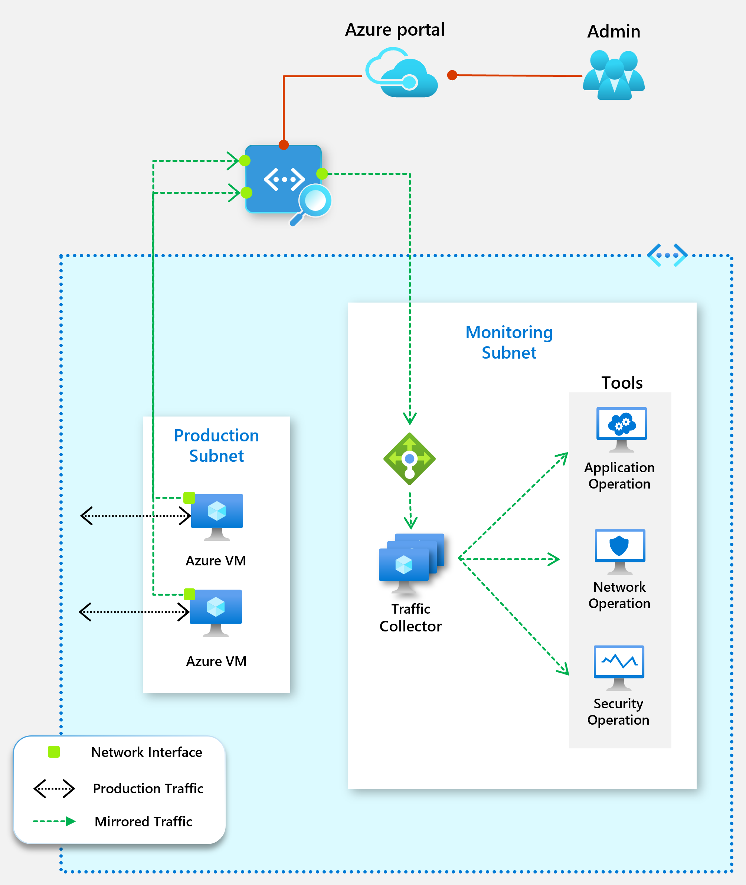

# Virtual network TAP

Azure virtual network TAP (Terminal Access Point) allows you to continuously stream your virtual machine network traffic to a network packet collector or analytics tool. The collector or analytics tool is provided by a [network virtual appliance](https://azure.microsoft.com/solutions/network-appliances/) partner. For a list of partner solutions that are validated to work with virtual network TAP, see [partner solutions](#virtual-network-tap-partner-solutions).

> [!IMPORTANT]
> Virtual network TAP is currently in developer preview in the WestCentralUS Azure region. To use virtual network TAP, you must enroll in the
preview by sending an email to <azurevnettap@microsoft.com> with your subscription ID. You will receive an email back once your subscription has been enrolled. You aren't able to use the capability until you receive a confirmation email. This developer preview is provided without a service level agreement and should not be used for production workloads. Certain features may not be supported, may have constrained capabilities, or may not be available in all Azure locations. See the [Supplemental Terms of Use for Microsoft Azure Previews](https://azure.microsoft.com/support/legal/preview-supplemental-terms/) for details.

## Virtual network TAP partner solutions

### Network packet brokers

- [Big Switch Big Monitoring Fabric](https://www.bigswitch.com/products/big-monitoring-fabric/public-cloud/microsoft-azure)
- [Flowmon](https://www.flowmon.com/blog/azure-vtap)
- [Gigamon GigaSECURE](https://blog.gigamon.com/2018/09/13/why-microsofts-new-vtap-service-works-even-better-with-gigasecure-for-azure)
- [Ixia CloudLens](https://www.ixiacom.com/cloudlens/cloudlens-azure)

### Security analytics, network/application performance management

- [ExtraHop Reveal(x)](https://www.extrahop.com/company/tech-partners/microsoft/)
- [Fidelis Cybersecurity](https://www.fidelissecurity.com/technology-partners/microsoft-azure )
- [Netscout vSTREAM]( https://www.netscout.com/technology-partners/microsoft/azure-vtap)
- [Nubeva Prisms](https://www.nubeva.com/azurevtap)
- [RSA NetWitness® Platform](https://www.rsa.com/azure)
- [Vectra Cognito](https://vectra.ai/microsoftazure)

The following picture shows how virtual network TAP works. You can add a TAP configuration on a [network interface](virtual-network-network-interface.md) that is attached to a virtual machine deployed in your virtual network. The destination is a virtual network IP address in the same virtual network as the monitored network interface or a [peered virtual](virtual-network-peering-overview.md) network. The collector solution for virtual network TAP can be deployed behind an [Azure Internal Load balancer](../load-balancer/load-balancer-overview.md?toc=%2fazure%2fvirtual-network%2ftoc.json#concepts) for high availability. To evaluate deployment options for individual solution, see [partner solutions](#virtual-network-tap-partner-solutions).

## Prerequisites

Before you create a virtual network TAP, you must have received a confirmation mail that you are enrolled in the preview, and have one or more virtual machines created using [Azure Resource Manager](../azure-resource-manager/resource-group-overview.md?toc=%2fazure%2fvirtual-network%2ftoc.json) deployment model  and a partner solution for aggregating the TAP traffic in WestCentralUS region. If you don't have a  partner solution in your virtual network, see [partner solutions](#virtual-network-tap-partner-solutions) to deploy one. You can use the same virtual network TAP resource to aggregate traffic from multiple network interfaces in the same or different subscriptions. If the monitored network interfaces are in different subscriptions, the subscriptions must be associated to the same Azure Active Directory tenant. Additionally, the monitored network interfaces and the destination endpoint for aggregating the TAP traffic can be in peered virtual networks in the same region. If you are using this deployment model ensure that the [virtual network peering](virtual-network-peering-overview.md) is enabled before you configure virtual network TAP.

## Permissions

The accounts you use to apply TAP configuration on network interfaces must be assigned to the [network contributor](../role-based-access-control/built-in-roles.md?toc=%2fazure%2fvirtual-network%2ftoc.json#network-contributor) role or a [custom role](../role-based-access-control/custom-roles.md?toc=%2fazure%2fvirtual-network%2ftoc.json) that is assigned the necessary actions from the following table:

| Action | Name |
|---|---|
| Microsoft.Network/virtualNetworkTaps/* | Required to create, update, read and delete a virtual network TAP resource |
| Microsoft.Network/networkInterfaces/read | Required to read the network interface resource on which the TAP will be configured |
| Microsoft.Network/tapConfigurations/* | Required to create, update, read and delete the TAP configuration on a network interface |

## Next steps

- Learn how to [Create a virtual network TAP](tutorial-tap-virtual-network-cli.md).
