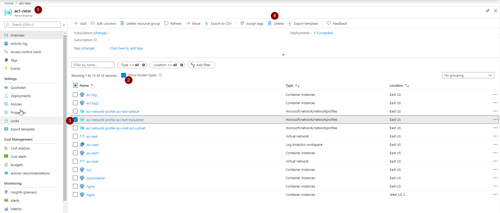

# Troubleshooting: Failed to delete a virtual network in Azure

You might receive errors when you try to delete a virtual network in Microsoft Azure. This article provides troubleshooting steps to help you resolve this problem.

[!INCLUDE [support-disclaimer](../../includes/support-disclaimer.md)]

## Troubleshooting guidance 

1. [Check whether a virtual network gateway is running in the virtual network](#check-whether-a-virtual-network-gateway-is-running-in-the-virtual-network).
2. [Check whether an application gateway is running in the virtual network](#check-whether-an-application-gateway-is-running-in-the-virtual-network).
3. [Check whether Azure container instances still exist in the virtual network](#check-whether-azure-container-instances-still-exist-in-the-virtual-network).
4. [Check whether Azure Active Directory Domain Service is enabled in the virtual network](#check-whether-azure-active-directory-domain-service-is-enabled-in-the-virtual-network).
5. [Check whether the virtual network is connected to other resource](#check-whether-the-virtual-network-is-connected-to-other-resource).
6. [Check whether a virtual machine is still running in the virtual network](#check-whether-a-virtual-machine-is-still-running-in-the-virtual-network).
7. [Check whether the virtual network is stuck in migration](#check-whether-the-virtual-network-is-stuck-in-migration).
8. [Check whether the virtual network was used by a web app for VNet integration](#check-whether-the-virtual-network-was-used-by-a-web-app-for-vnet-integration).

## Troubleshooting steps

### Check whether a virtual network gateway is running in the virtual network

To remove the virtual network, you must first remove the virtual network gateway.

For classic virtual networks, go to the **Overview** page of the classic virtual network in the Azure portal. In the **VPN connections** section, if the gateway is running in the virtual network, you will see the IP address of the gateway. 


For virtual networks, go to the **Overview** page of the virtual network. Check **Connected devices** for the virtual network gateway.


Before you can remove the gateway, first remove any **Connection** objects in the gateway. 

### Check whether an application gateway is running in the virtual network

Go to the **Overview** page of the virtual network. Check the **Connected devices** for the application gateway.


If there is an application gateway, you must remove it before you can delete the virtual network.

### Check whether Azure container instances still exist in the virtual network

1. In the Azure portal, go to the resource group's **Overview** page.
1. In the header for the list of the resource group's resources, select **Show hidden types**. The network profile type is hidden in the Azure portal by default.
1. Select the network profile related to the container groups.
1. Select **Delete**.

   

1. Delete the subnet or virtual network again.

If these steps don't resolve the issue, use these [Azure CLI commands](../container-instances/container-instances-vnet.md#clean-up-resources) to clean up resources. 

### Check whether Azure Active Directory Domain Service is enabled in the virtual network

If the Active Directory Domain Service is enabled and connected to the virtual network, you cannot delete this virtual network. 


To disable the service, see [Disable Azure Active Directory Domain Services using the Azure portal](../active-directory-domain-services/delete-aadds.md).

### Check whether the virtual network is connected to other resource

Check for Circuit Links, connections, and virtual network peerings. Any of these can cause a virtual network deletion to fail. 

The recommended deletion order is as follows:

1. Gateway connections
2. Gateways
3. IPs
4. Virtual network peerings
5. App Service Environment (ASE)

### Check whether a virtual machine is still running in the virtual network

Make sure that no virtual machine is in the virtual network.

### Check whether the virtual network is stuck in migration

If the virtual network is stuck in a migration state, it cannot be deleted. Run the following command to abort the migration, and then delete the virtual network.

```azurepowershell
Move-AzureVirtualNetwork -VirtualNetworkName "Name" -Abort
```

### Check whether the virtual network was used by a web app for VNet integration

If the virtual network was integrated with a web app in the past, then the web app was deleted without disconnecting the VNet integration, see [Deleting the App Service plan or web app before disconnecting the VNet integration](https://github.com/MicrosoftDocs/azure-docs/blob/046310ca15df6c82612b11971b9481b98125dd64/includes/app-service-web-vnet-troubleshooting.md).

## Next steps

- [Azure Virtual Network](virtual-networks-overview.md)
- [Azure Virtual Network frequently asked questions (FAQ)](virtual-networks-faq.md)
