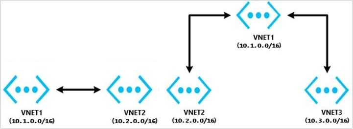
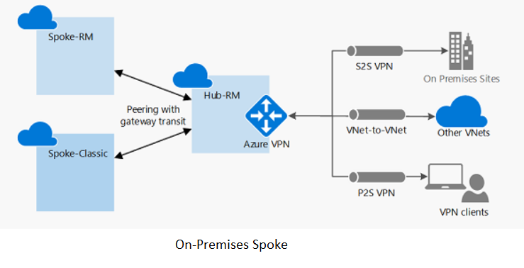
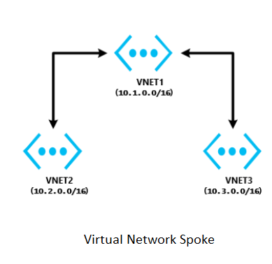

# Troubleshoot virtual network peering issues

This troubleshooting guide provides steps to help you resolve most [virtual network peering](virtual-network-peering-overview.md) issues.

## Configure virtual network peering between two virtual networks

Are the virtual networks in the same subscription or in different subscriptions?

### The virtual networks are in the same subscription

To configure virtual network peering for the virtual networks that are in the same subscription, use the methods in the following articles:

* If the virtual networks are in the *same region*, see [Create a peering](./virtual-network-manage-peering.md#create-a-peering).
* If the virtual networks are in the *different regions*, see [Virtual network peering](./virtual-network-peering-overview.md). 

> [!Note]
> Connectivity doesn't work over global virtual network peering for the following resources: 
>
> * Virtual machines (VMs) behind Basic internal load balancer (ILB) SKU
> * Redis cache (uses Basic ILB SKU)
> * Application gateway v1 (uses Basic ILB SKU)
> * Virtual machine scale sets (uses Basic ILB SKU)
> * Azure Service Fabric clusters (uses Basic ILB SKU)
> * SQL Server Always On (uses Basic ILB SKU)
> * Azure App Service Environment for Power Apps (uses Basic ILB SKU)
> * Azure API Management (uses Basic ILB SKU)
> * Microsoft Entra Domain Services (uses Basic ILB SKU)

For more information, see the [requirements and constraints](./virtual-network-peering-overview.md#requirements-and-constraints) of global peering.

### The virtual networks are in different subscriptions or Active Directory tenants

To configure virtual network peering for virtual networks in different subscriptions or Active Directory tenants, see [Create a virtual network peering between different subscriptions](./create-peering-different-subscriptions.md).

> [!Note]
> To configure network peering, you must have **Network Contributor** permissions in both subscriptions. For more information, see [Peering permissions](virtual-network-manage-peering.md#permissions).

## Configure virtual network peering with hub-spoke topology that uses on-premises resources

### For a site-to-site connection or an ExpressRoute connection

Follow the steps in: [Configure VPN gateway transit for virtual network peering](../vpn-gateway/vpn-gateway-peering-gateway-transit.md?toc=%2fazure%2fvirtual-network%2ftoc.json).

### For point-to-site connections

1. Follow the steps in: [Configure VPN gateway transit for virtual network peering](../vpn-gateway/vpn-gateway-peering-gateway-transit.md?toc=%2fazure%2fvirtual-network%2ftoc.json).
2. After virtual network peering is established or changed, download and reinstall the point-to-site package so that the point-to-site clients get the updated routes to the spoke virtual network.

## Configure virtual network peering with hub-spoke topology virtual network

### The virtual networks are in the same region

1. In the hub virtual network, configure a network virtual appliance (NVA).
1. In the spoke virtual networks, have user-defined routes with the next hop type "network virtual appliance" applied.

For more information, see [Service chaining](./virtual-network-peering-overview.md#service-chaining).

> [!Note]
> If you require help to set up an NVA, [contact the NVA vendor](https://mskb.pkisolutions.com/kb/2984655).

For help with troubleshooting the NVA device setup and routing, see [Network virtual appliance issues in Azure](./virtual-network-troubleshoot-nva.md).

### The virtual networks are in different regions

Transit over global virtual network peering is now supported. Connectivity does not work over global virtual network peering for the following resources:

* VMs behind Basic ILB SKU
* Redis cache (uses Basic ILB SKU)
* Application gateway (uses Basic ILB SKU)
* Scale sets (uses Basic ILB SKU)
* Service Fabric clusters (uses Basic ILB SKU)
* SQL Server Always On (uses Basic ILB SKU)
* App Service Environment (uses Basic ILB SKU)
* API Management (uses Basic ILB SKU)
* Microsoft Entra Domain Services (uses Basic ILB SKU)

To learn more about global peering requirements and restraints, see [Virtual network peering](./virtual-network-peering-overview.md#requirements-and-constraints).

## Troubleshoot a connectivity issue between two peered virtual networks

Sign in to the [Azure portal](https://portal.azure.com) with an account that has the necessary [roles and permissions](virtual-network-manage-peering.md#permissions). Select the virtual network, select **Peering**, and then check the **Status** field. What is the status?

### The peering status is "Connected"

To troubleshoot this issue:

1. Check the network traffic flows:

   Use [Connection Troubleshoot](../network-watcher/network-watcher-connectivity-overview.md) and [IP flow verify](../network-watcher/network-watcher-ip-flow-verify-overview.md) from the source VM to the destination VM to determine whether there is an NSG or UDR that is causing interference in traffic flows.

   If you're using a firewall or NVA: 
   1. Document the UDR parameters so that you can restore them after this step is complete.
   2. Remove the UDR from the source VM subnet or NIC that points to the NVA as the next hop. Verify connectivity from the source VM directly to the destination that is bypassing the NVA. If this step doesn't work, see the [NVA troubleshooter](./virtual-network-troubleshoot-nva.md).

2. Take a network trace: 
   1. Start a network trace on the destination VM. For Windows, you can use **Netsh**. For Linux, use **TCPDump**.
   2. Run **TcpPing** or **PsPing** from the source to the destination IP.

      This is an example of a **TcpPing** command: `tcping64.exe -t <destination VM address> 3389`

   3. After the **TcpPing** is complete, stop the network trace on the destination.
   4. If packets arrive from the source, there is no networking issue. Examine both the VM firewall and the application listening on that port to locate the configuration issue.

   > [!Note]
   > You can't connect to the following resource types over global virtual network peering (virtual networks in different regions):
   >
   > * VMs behind Basic ILB SKU
   > * Redis cache (uses Basic ILB SKU)
   > * Application gateway (uses Basic ILB SKU)
   > * Scale sets (uses Basic ILB SKU)
   > * Service Fabric clusters (uses Basic ILB SKU)
   > * SQL Server Always On (uses Basic ILB SKU)
   > * App Service Environment (uses Basic ILB SKU)
   > * API Management (uses Basic ILB SKU)
   > * Microsoft Entra Domain Services (uses Basic ILB SKU)

For more information, see the [requirements and constraints](./virtual-network-peering-overview.md#requirements-and-constraints) of global peering.

### The peering status is "Disconnected"

To resolve this issue, delete the peering from both virtual networks, and then re-create them.

## Troubleshoot a connectivity issue between a hub-spoke virtual network and an on-premises resource

Does your network use a third-party NVA or VPN gateway?

### My network uses a third-party NVA or VPN gateway

To troubleshoot connectivity issues that affect a third-party NVA or VPN gateway, see the following articles:

* [NVA troubleshooter](./virtual-network-troubleshoot-nva.md)
* [Service chaining](./virtual-network-peering-overview.md#service-chaining)

### My network does not use a third-party NVA or VPN gateway

Do the hub virtual network and the spoke virtual network have a VPN gateway?

#### Both the hub virtual network and the spoke virtual network have a VPN gateway

Using a remote gateway isn't supported.

If the spoke virtual network already has a VPN gateway, the **Use remote gateway** option isn't supported on the spoke virtual network. This is because of a virtual network peering limitation.

#### Both the hub virtual network and the spoke virtual network do not have a VPN gateway

For site-to-site or Azure ExpressRoute connections, check the following primary causes of connectivity issues to the remote virtual network from on-premises:

* On the virtual network that has a gateway, verify that the **Allow forwarded traffic** check box is selected.
* On the virtual network that doesn't have a gateway, verify that the **Use remote gateway** check box is selected.
* Have your network administrator check your on-premises devices to verify that they all have the remote virtual network address space added.

For point-to-site connections:

* On the virtual network that has a gateway, verify that the **Allow forwarded traffic** check box is selected.
* On the virtual network that doesn't have a gateway, verify that the **Use remote gateway** check box is selected.
* Download and reinstall the point-to-site client package. Virtual network routes that are newly peered don't automatically add routes to point-to-site clients.

## Troubleshoot a hub-spoke network connectivity issue between spoke virtual networks in the same region

A hub network must include an NVA. Configure UDRs in spokes that have an NVA set as the next hop, and enable **Allow forwarded traffic** in the hub virtual network.

For more information, see [Service chaining](./virtual-network-peering-overview.md#service-chaining), and discuss these requirements with the [NVA vendor](https://mskb.pkisolutions.com/kb/2984655) of your choice.

## Troubleshoot a hub-spoke network connectivity issue between spoke virtual networks in different regions

Transit over global virtual network peering is now supported. Connectivity doesn't work over global virtual network peering for the following resources:

* VMs behind Basic ILB SKU
* Redis cache (uses Basic ILB SKU)
* Application gateway (uses Basic ILB SKU)
* Scale sets (uses Basic ILB SKU)
* Service Fabric clusters (uses Basic ILB SKU)
* SQL Server Always On (uses Basic ILB SKU)
* App Service Environment (uses Basic ILB SKU)
* API Management (uses Basic ILB SKU)
* Microsoft Entra Domain Services (uses Basic ILB SKU)

For more information, see the [requirements and constraints](./virtual-network-peering-overview.md#requirements-and-constraints) of global peering and [Different VPN Topologies](/archive/blogs/igorpag/hubspoke-daisy-chain-and-full-mesh-vnet-topologies-in-azure-arm-v2).

## Troubleshoot a hub-spoke network connectivity issue between a web app and the spoke virtual network

To troubleshoot this issue:

1. Sign in to the Azure portal. 
1. In the web app, select **networking**, and then select **VNet Integration**.
1. Check whether you can see the remote virtual network. Manually enter the remote virtual network address space (**Sync Network** and **Add Routes**).

For more information, see the following articles:

* [Integrate your app with an Azure virtual network](../app-service/overview-vnet-integration.md)
* [About Point-to-Site VPN routing](../vpn-gateway/vpn-gateway-about-point-to-site-routing.md)

## Troubleshoot a virtual network peering configuration error message 

### Current tenant `<TENANT ID>` isn't authorized to access linked subscription

To resolve this issue, see [Create a virtual network peering between different subscriptions](./create-peering-different-subscriptions.md).

### Not connected

To resolve this issue, delete the peering from both virtual networks, and then recreate them.

### Failed to peer a Databricks virtual network

To resolve this issue, configure the virtual network peering under **Azure Databricks**, and then specify the target virtual network by using **Resource ID**. For more information, see [Peer a Databricks virtual network to a remote virtual network](/azure/databricks/administration-guide/cloud-configurations/azure/vnet-peering#id2).

### The remote virtual network lacks a gateway

This issue occurs when you peer virtual networks from different tenants and later want to configure `Use Remote Gateways`. A limitation of the Azure portal is that it can't validate the presence of a virtual network gateway in another tenant's virtual network.

There are two ways to resolve the issue:

 * Delete the peerings and activate the `Use Remote Gateways` option when you create a new peering.
 * Use PowerShell or CLI, instead of the Azure portal, to enable `Use Remote Gateways`.

## Next steps

* [Troubleshooting connectivity problems between Azure VMs](./virtual-network-troubleshoot-connectivity-problem-between-vms.md)
