<properties
   pageTitle="Azure Virtual Network (VNet) Plan and Design Guide | Microsoft Azure"
   description="Learn how to plan and design virtual networks in Azure based on your isolation, connectivity, and location requirements."
   services="virtual-network"
   documentationCenter="na"
   authors="telmosampaio"
   manager="carmonm"
   editor="tysonn" />
<tags
   ms.service="virtual-network"
   ms.devlang="na"
   ms.topic="article"
   ms.tgt_pltfrm="na"
   ms.workload="infrastructure-services"
   ms.date="02/08/2016"
   ms.author="telmos" />

# Plan and design Azure Virtual Networks

Creating a VNet to experiment with is easy enough, but chances are, you will deploy multiple VNets over time to support the production needs of your organization. With some planning and design, you will be able to deploy VNets and connect the resources you need more effectively. If you are not familiar with VNets, it's recommended that you [learn about VNets](virtual-networks-overview.md) and [how to deploy](virtual-networks-create-vnet-arm-pportal.md) one before proceeding. 

## Plan

A thorough understanding of Azure subscriptions, regions, and network resources is critical for success. You can use the list of considerations below as a starting point. Once you understand those considerations, you can define the requirements for your network design.

### Considerations

Before answering the planning questions below, consider the following:

- Everything you create in Azure is composed of one or more resources. A virtual machine (VM) is a resource, the network adapter interface (NIC) used by a VM is a resource, the public IP address used by a NIC is a resource, the VNet the NIC is connected to is a resource.
- You create resources within an [Azure region](https://azure.microsoft.com/regions/#services) and subscription. And resources can only be connected to a VNet that exists in the same region and subscription they are in. 
- You can connect VNets to each other by using an Azure [VPN Gateway](../vpn-gateway/vpn-gateway-vnet-vnet-rm-ps.md). You can also connect VNets across regions and subscriptions this way.
- You can connect VNets to your on-premises network by using one of the [connectivity options](../vpn-gateway/vpn-gateway-cross-premises-options.md) available in Azure. 
- Different resources can be grouped together in [resource groups](../resource-group-overview.md#resource-groups), making it easier to manage the resource as a unit. A resource group can contain resources from multiple regions, as long as the resources belong to the same subscription.

### Define requirements

Use the questions below as a starting point for your Azure network design.	

1. What Azure locations will you use to host VNets?
2. Do you need to provide communication between these Azure locations?
3. Do you need to provide communication between your Azure VNet(s) and your on-premises datacenter(s)?
4. How many Infrastructure as a Service (IaaS) VMs, cloud services roles, and web apps do you need for your solution?
5. Do you need to isolate traffic based on groups of VMs (i.e. front end web servers and back end database servers)?
6. Do you need to control traffic flow using virtual appliances?
7. Do users need different sets of permissions to different Azure resources?

### Understand VNet and subnet properties

VNet and subnets resources help define a security boundary for workloads running in Azure. A VNet is characterized by a collection of address spaces, defined as CIDR blocks. 

>[AZURE.NOTE] Network administrators are familiar with CIDR notation. If you are not familiar with CIDR, [learn more about it](http://whatismyipaddress.com/cidr).

VNets contain the following properties.

|Property|Description|Constraints|
|---|---|---|
|**name**|VNet name|String of up to 80 characters. May contain letters, numbers, underscore, periods, or hyphens. Must start with a letter or number. Must end with a letter, number, or underscore. Can contains upper or lower case letters.|  
|**location**|Azure location (also referred to as region).|Must be one of the valid Azure locations.|
|**addressSpace**|Collection of address prefixes that make up the VNet in CIDR notation.|Must be an array of valid CIDR address blocks, including public IP address ranges.|
|**subnets**|Collection of subnets that make up the VNet|see the subnet properties table below.||
|**dhcpOptions**|Object that contains a single required property named **dnsServers**.||
|**dnsServers**|Array of DNS servers used by the VNet. If no server is specified, Azure internal name resolution is used.|Must be an array of up to 10 DNS servers, by IP address.| 

A subnet is a child resource of a VNet, and helps define segments of address spaces within a CIDR block, using IP address prefixes. NICs can be added to subnets, and connected to VMs, providing connectivity for various workloads.

Subnets contain the following properties. 

|Property|Description|Constraints|
|---|---|---|
|**name**|Subnet name|String of up to 80 characters. May contain letters, numbers, underscore, periods, or hyphens. Must start with a letter or number. Must end with a letter, number, or underscore. Can contains upper or lower case letters.|
|**location**|Azure location (also referred to as region).|Must be one of the valid Azure locations.|
|**addressPrefix**|Single address prefix that make up the subnet in CIDR notation|Must be a single CIDR block that is part of one of the VNet's address spaces.|
|**networkSecurityGroup**|NSG applied to the subnet|see [NSGs](resource-groups-networking.md#Network-Security-Group)|
|**routeTable**|Route table applied to the subnet|see [UDR](resource-groups-networking.md#Route-table)|
|**ipConfigurations**|Collection of IP configuration objects used by NICs connected to the subnet|see [IP configuration](../resource-groups-networking.md#IP-configurations)|

### Name resolution

By default, your VNet uses [Azure-provided name resolution.](virtual-networks-name-resolution-for-vms-and-role-instances.md#Azure-provided-name-resolution) to resolve names inside the VNet, and on the public Internet. However, if you connect your VNets to your on-premises data centers, you need to provide [your own DNS server](virtual-networks-name-resolution-for-vms-and-role-instances.md#Name-resolution-using-your-own-DNS-server) to resolve names between your networks.  

### Limits

Make sure you view all the [limits related to networking services in Azure](../azure-subscription-service-limits#networking-limits) before designing your solution. Some limits can be increased by opening a support ticket.

### Role-Based Access Control (RBAC)

You can use [Azure RBAC](../active-directory/role-based-access-built-in-roles.md) to control the level of access different users may have to different resources in Azure. That way you can segregate the work done by your team based on their needs. 

As far as virtual networks are concerned, users in the **Network Contributor** role have full control over Azure Resource Manager virtual network resources. Similarly, users in the **Classic Network Contributor** role have full control over classic virtual network resources.

>[AZURE.NOTE] You can also [create your own roles](../active-directory/role-based-access-control-configure.md) to separate your administrative needs.

## Design

Once you know the answers to the questions in the [Plan](#Plan) section, review the following before defining your VNets.

### Number of subscriptions and VNets

You should consider creating multiple VNets in the following scenarios:

- **VMs that need to be placed in different Azure locations**. VNets in Azure are regional. They cannot span locations. Therefore you need at least one VNet for each Azure location you want to host VMs in.
- **Workloads that need to be completely isolated from one another**. You can create separate VNets, that even use the same IP address spaces, to isolate different workloads from one another. 
- **Avoid platform limits**. As seen in the [limits](#Limits) section, you cannot have more than 2048 VMs in a single VNet. 

Keep in mind that the limits you see above are per region, per subscription. That means you can use multiple subscriptions to increase the limit of resources you can maintain in Azure. You can use a site-to-site VPN, or an ExpressRoute circuit, to connect VNets in different subscriptions.

### Subscription and VNet design patterns

The table below shows some common design patterns for using subscriptions and VNets.

|Scenario|Diagram|Pros|Cons|
|---|---|---|---|
|Single subscription, two VNets per app|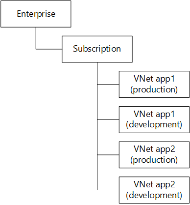|Only one subscription to manage.|Maximum of 25 apps per Azure region. You need more subscriptions after that.|
|One subscription per app, two VNets per app|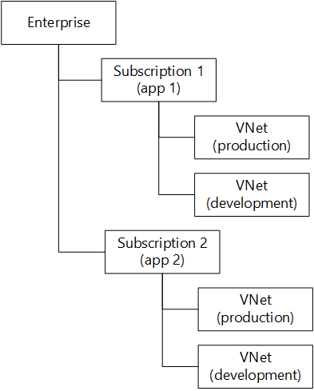|Uses only two VNets per subscription.|Harder to manage when there are too many apps.|
|One subscription per business unit, two VNets per app.|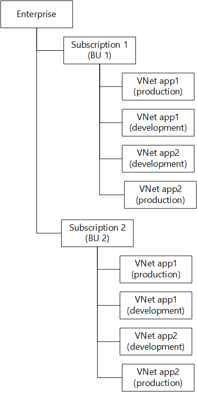|Balance between number of subscriptions and VNets.|Maximum of 25 apps per business unit (subscription).|
|One subscription per business unit, two VNets per group of apps.|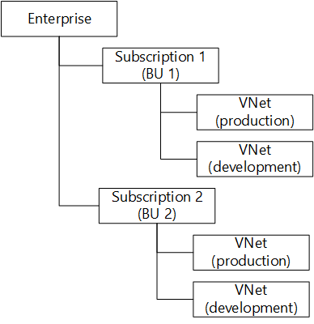|Balance between number of subscriptions and VNets.|Apps must be isolated by using subnets and NSGs.|

### Number of subnets

You should consider multiple subnets in a VNet in the following scenarios:

- **Not enough private IP addresses for all NICs in a subnet**. If your subnet address space does not contain enough IP addresses for the number of NICs in the subnet, you need to create multiple subnets. Keep in mind that Azure reserves 5 private IP addresses from each subnet that cannot be used: the first and last addresses of the address space (for the subnet address, and multicast) and 3 addresses to be used internally (for DHCP and DNS purposes). 
- **Security**. You can use subnets to separate groups of VMs from one another for workloads that have a multi-layer structure, and apply different [network security groups (NSGs)](virtual-networks-nsg.md#subnets) for those subnets.
- **Hybrid connectivity**. You can use VPN gateways and ExpressRoute circuits to [connect](../vpn-gateway/vpn-gateway-cross-premises-options.md) your VNets to one another, and to your on-premises data center(s). VPN gateways and ExpressRoute circuits require a subnet of their own to be created.
- **Virtual appliances**. You can use a virtual appliance, such as a firewall, WAN accelerator, or VPN gateway in an Azure VNet. When you do so, you need to [route traffic](virtual-networks-udr-overview.md) to those appliances and isolate them in their own subnet.

### Subnet and NSG design patterns

The table below shows some common design patterns for using subnets.

|Scenario|Diagram|Pros|Cons|
|---|---|---|---|
|Single subnet, NSGs per application layer, per app|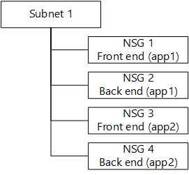|Only one subnet to manage.|Multiple NSGs necessary to isolate each application.|
|One subnet per app, NSGs per application layer|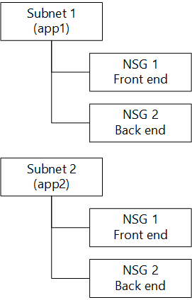|Fewer NSGs to manage.|Multiple subnets to manage.|
|One subnet per application layer, NSGs per app.|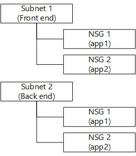|Balance between number of subnets and NSGs.|Maximum of 100 NSGs. 50 apps if each apps requires 2 distinct NSGs.|
|One subnet per application layer, per app, NSGs per subnet|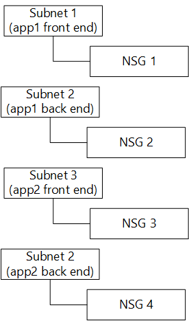|Possibly smaller number of NSGs.|Multiple subnets to manage.|

## Sample design

To illustrate the application of the information in this article, consider the following scenario.

You work for a company that has 2 data centers in North America, and two data centers Europe. You identified 6 different customer facing applications maintained by 2 different business units that you want to migrate to Azure as a pilot. The basic architecture for the applications are as follows:

- App1, App2, App3, and App4 are web applications hosted on Linux servers running Ubuntu. Each application connects to a separate application server that hosts RESTful services on Linux servers. The RESTful services connect to a back end MySQL database.
- App5 and App6 are web applications hosted on Windows servers running Windows Server 2012 R2. Each application connects to a back end SQL Server database.
- All apps are currently hosted in one of the company's data centers in North America.
- The on-premises data centers use the 10.0.0.0/8 address space.

You need to design a virtual network solution that meets the following requirements:

- Each business unit should not be affected by resource consumption of other business units.
- You should minimize the amount of VNets and subnets to make management easier.
- Each business unit should have a single test/development VNet used for all applications.
- Each application is hosted in 2 different Azure data centers per continent (North America and Europe).
- Each application is completely isolated from each other.
- Each application can be accessed by customers over the Internet using HTTP.
- Each application can be accessed by users connected to the on-premises data centers by using an encrypted tunnel.
- Connection to on-premises data centers should use existing VPN devices.
- The company's networking group should have full control over the VNet configuration.
- Developers in each business unit should only be able to deploy VMs to existing subnets.
- All applications will be migrated as they are to Azure (lift-and-shift).
- The databases in each location should replicate to other Azure locations once a day.
- Each application should use 5 front end web servers, 2 application servers (when necessary), and 2 database servers.

### Plan

You should start your design planning by answering the question in the [Define requirements](#Define-requirements) section as shown below.

1. What Azure locations will you use to host VNets?

	2 locations in North America, and 2 locations in Europe. You should pick those based on the physical location of your existing on-premises data centers. That way your connection from your physical locations to Azure will have a better latency.

2. Do you need to provide communication between these Azure locations?

	Yes. Since the databases must be replicated to all locations.

3. Do you need to provide communication between your Azure VNet(s) and your on-premises data center(s)?

	Yes. Since users connected to the on-premises data centers must be able to access the applications through an encrypted tunnel.
 
4. How many IaaS VMs do you need for your solution?

	200 IaaS VMs. App1, App2 and App3 require 5 web servers each, 2 applications servers each, and 2 database servers each. That's a total of 9 IaaS VMs per application, or 36 IaaS VMs. App5 and App6 require 5 web servers and 2 database servers each. That's a total of 7 IaaS VMs per application, or 14 IaaS VMs. Therefore, you need 50 IaaS VMs for all applications in each Azure region. Since we need to use 4 regions, there will be 200 IaaS VMs.

	You will also need to provide DNS servers in each VNet, or in your on-premises data centers to resolve name between your Azure IaaS VMs and your on-premises network. 

5. Do you need to isolate traffic based on groups of VMs (i.e. front end web servers and back end database servers)?

	Yes. Each application should be completely isolated from each other, and each application layer should also be isolated. 

6. Do you need to control traffic flow using virtual appliances?

	No. Virtual appliances can be used to provide more control over traffic flow, including more detailed data plane logging. 

7. Do users need different sets of permissions to different Azure resources?

	Yes. The networking team needs full control on the virtual networking settings, while developers should only be able to deploy their VMs to pre-existing subnets. 

### Design

You should follow the design specifying subscriptions, VNets, subnets, and NSGs. We will discuss NSGs here, but you should learn more about [NSGs](virtual-networks-nsg.md) before finishing your design.

**Number of subscriptions and VNets**

The following requirements are related to subscriptions and VNets:

- Each business unit should not be affected by resource consumption of other business units.
- You should minimize the amount of VNets and subnets.
- Each business unit should have a single test/development VNet used for all applications.
- Each application is hosted in 2 different Azure data centers per continent (North America and Europe).

Based on those requirements, you need a subscription for each business unit. That way, consumption of resources from a business unit will not count towards limits for other business units. And since you want to minimize the number of VNets, you should consider using the **one subscription per business unit, two VNets per group of apps** pattern as seen below.

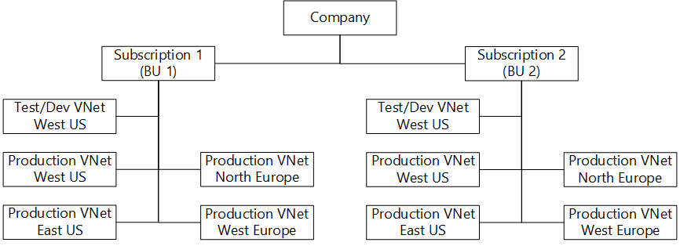

You also need to specify the address space for each VNet. Since you need connectivity between the on-premises data centers and the Azure regions, the address space used for Azure VNets cannot clash with the on-premises network, and the address space used by each VNet should not clash with other existing VNets. You could use the address spaces in the table below to satisfy these requirements.  

|**Subscription**|**VNet**|**Azure region**|**Address space**|
|---|---|---|---|
|BU1|ProdBU1US1|West US|172.16.0.0/16|
|BU1|ProdBU1US2|East US|172.17.0.0/16|
|BU1|ProdBU1EU1|North Europe|172.18.0.0/16|
|BU1|ProdBU1EU2|West Europe|172.19.0.0/16|
|BU1|TestDevBU1|West US|172.20.0.0/16|
|BU2|TestDevBU2|West US|172.21.0.0/16|
|BU2|ProdBU2US1|West US|172.22.0.0/16|
|BU2|ProdBU2US2|East US|172.23.0.0/16|
|BU2|ProdBU2EU1|North Europe|172.24.0.0/16|
|BU2|ProdBU2EU2|West Europe|172.25.0.0/16|

**Number of subnets and NSGs**

The following requirements are related to subnets and NSGs:

- You should minimize the amount of VNets and subnets.
- Each application is completely isolated from each other.
- Each application can be accessed by customers over the Internet using HTTP.
- Each application can be accessed by users connected to the on-premises data centers by using an encrypted tunnel.
- Connection to on-premises data centers should use existing VPN devices.
- The databases in each location should replicate to other Azure locations once a day.

Based on those requirements, you could use one subnet per application layer, and use NSGs to filter traffic per application. That way, you only have 3 subnets in each VNet (front end, application layer, and data layer) and one NSG per application per subnet. In this case, you should consider using the **one subnet per application layer, NSGs per app** design pattern. The figure below shows the use of the design pattern representing the **ProdBU1US1** VNet.

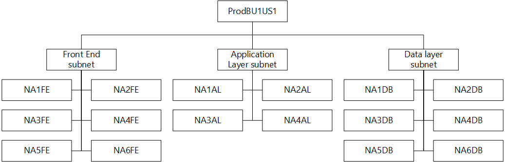

However, you also need to create an extra subnet for the VPN connectivity between the VNets, and your on-premises data centers. And you need to specify the address space for each subnet. The figure below shows a sample solution for **ProdBU1US1** VNet. You would replicate this scenario for each VNet. Each color represents a different application.

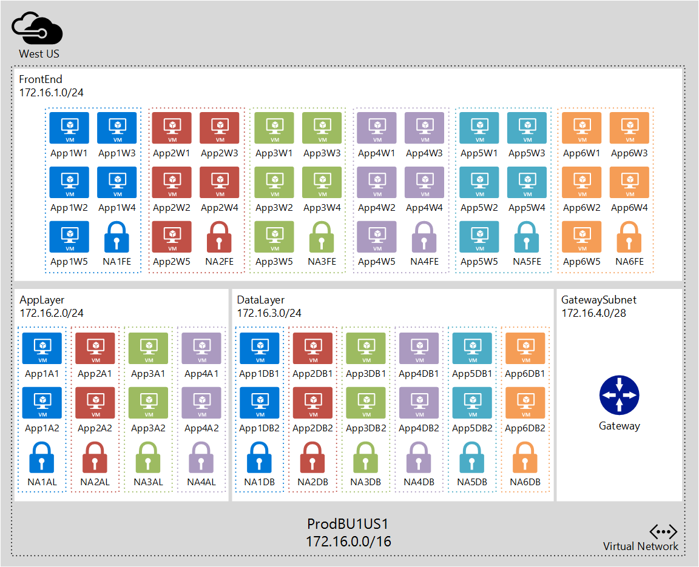

**Access Control**

The following requirements are related to access control:

- The company's networking group should have full control over the VNet configuration.
- Developers in each business unit should only be able to deploy VMs to existing subnets.

Based on those requirements, you could add users from the networking team to the built-in **Network Contributor** role in each subscription; and create a custom role for the application developers in each subscription giving them rights to add VMs to existing subnets.

## Next steps

- [Deploy a virtual network](virtual-networks-create-vnet-arm-template-click.md) based on a scenario.
- Understand how to [load balance](../load-balancer/load-balancer-overview.md) IaaS VMs and [manage routing over multiple Azure regions](../traffic-manager/traffic-manager-overview.md).
- Learn more about [NSGs and how to plan and design](virtual-networks-nsg.md) an NSG solution.
- Learn more about your [cross-premises and VNet connectivity options](../vpn-gateway/vpn-gateway-cross-premises-options.md).  

