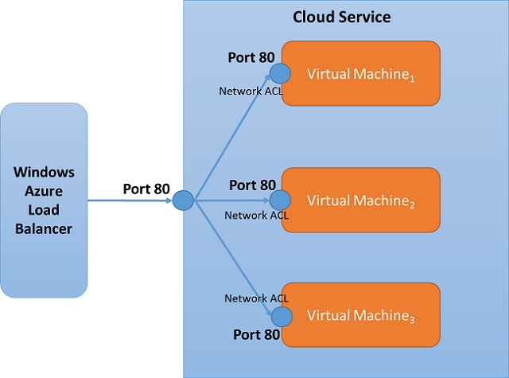

# What is an endpoint access control list?

> [!IMPORTANT]
> Azure has two different [deployment models](../azure-resource-manager/resource-manager-deployment-model.md?toc=%2fazure%2fvirtual-network%2ftoc.json) for creating and working with resources: Resource Manager and classic. This article covers using the classic deployment model. Microsoft recommends that most new deployments use the Resource Manager deployment model. 

An endpoint access control list (ACL) is a security enhancement available for your Azure deployment. An ACL provides the ability to selectively permit or deny traffic for a virtual machine endpoint. This packet filtering capability provides an additional layer of security. You can specify network ACLs for endpoints only. You can't specify an ACL for a virtual network or a specific subnet contained in a virtual network. It is recommended to use network security groups (NSGs) instead of ACLs, whenever possible. When using NSGs, endpoint access control list will be replaced and no longer enforced. To learn more about NSGs, see [Network security group overview](security-overview.md)

ACLs can be configured by using either PowerShell or the Azure portal. To configure a network ACL by using PowerShell, see [Managing access control lists for endpoints using PowerShell](virtual-networks-acl-powershell.md). To configure a network ACL by using the Azure portal, see [How to set up endpoints to a virtual machine](../virtual-machines/windows/classic/setup-endpoints.md?toc=%2fazure%2fvirtual-machines%2fwindows%2fclassic%2ftoc.json).

Using Network ACLs, you can do the following:

* Selectively permit or deny incoming traffic based on remote subnet IPv4 address range to a virtual machine input endpoint.
* Blacklist IP addresses
* Create multiple rules per virtual machine endpoint
* Use rule ordering to ensure the correct set of rules are applied on a given virtual machine endpoint (lowest to highest)
* Specify an ACL for a specific remote subnet IPv4 address.

See the [Azure limits](../azure-subscription-service-limits.md?toc=%2fazure%2fvirtual-network%2ftoc.json#networking-limits) article for ACL limits.

## How ACLs work
An ACL is an object that contains a list of rules. When you create an ACL and apply it to a virtual machine endpoint, packet filtering takes place on the host node of your VM. This means the traffic from remote IP addresses is filtered by the host node for matching ACL rules instead of on your VM. This prevents your VM from spending the precious CPU cycles on packet filtering.

When a virtual machine is created, a default ACL is put in place to block all incoming traffic. However, if an endpoint is created for (port 3389), then the default ACL is modified to allow all inbound traffic for that endpoint. Inbound traffic from any remote subnet is then allowed to that endpoint and no firewall provisioning is required. All other ports are blocked for inbound traffic unless endpoints are created for those ports. Outbound traffic is allowed by default.

**Example Default ACL table**

| **Rule #** | **Remote Subnet** | **Endpoint** | **Permit/Deny** |
| --- | --- | --- | --- |
| 100 |0.0.0.0/0 |3389 |Permit |

## Permit and deny
You can selectively permit or deny network traffic for a virtual machine input endpoint by creating rules that specify "permit" or "deny". It's important to note that by default, when an endpoint is created, all traffic is permitted to the endpoint. For that reason, it's important to understand how to create permit/deny rules and place them in the proper order of precedence if you want granular control over the network traffic that you choose to allow to reach the virtual machine endpoint.

Points to consider:

1. **No ACL –** By default when an endpoint is created, we permit all for the endpoint.
2. **Permit -** When you add one or more "permit" ranges, you are denying all other ranges by default. Only packets from the permitted IP range will be able to communicate with the virtual machine endpoint.
3. **Deny -** When you add one or more "deny" ranges, you are permitting all other ranges of traffic by default.
4. **Combination of Permit and Deny -** You can use a combination of "permit" and "deny" when you want to carve out a specific IP range to be permitted or denied.

## Rules and rule precedence
Network ACLs can be set up on specific virtual machine endpoints. For example, you can specify a network ACL for an RDP endpoint created on a virtual machine which locks down access for certain IP addresses. The table below shows a way to grant access to public virtual IPs (VIPs) of a certain range to permit access for RDP. All other remote IPs are denied. We follow a *lowest takes precedence* rule order.

### Multiple rules
In the example below, if you want to allow access to the RDP endpoint only from two public IPv4 address ranges (65.0.0.0/8, and 159.0.0.0/8), you can achieve this by specifying two *Permit* rules. In this case, since RDP is created by default for a virtual machine, you may want to lock down access to the RDP port based on a remote subnet. The example below shows a way to grant access to public virtual IPs (VIPs) of a certain range to permit access for RDP. All other remote IPs are denied. This works because network ACLs can be set up for a specific virtual machine endpoint and access is denied by default.

**Example – Multiple rules**

| **Rule #** | **Remote Subnet** | **Endpoint** | **Permit/Deny** |
| --- | --- | --- | --- |
| 100 |65.0.0.0/8 |3389 |Permit |
| 200 |159.0.0.0/8 |3389 |Permit |

### Rule order
Because multiple rules can be specified for an endpoint, there must be a way to organize rules in order to determine which rule takes precedence. The rule order specifies precedence. Network ACLs follow a *lowest takes precedence* rule order. In the example below, the endpoint on port 80 is selectively granted access to only certain IP address ranges. To configure this, we have a deny rule (Rule \# 100) for addresses in the 175.1.0.1/24 space. A second rule is then specified with precedence 200 that permits access to all other addresses under 175.0.0.0/8.

**Example – Rule precedence**

| **Rule #** | **Remote Subnet** | **Endpoint** | **Permit/Deny** |
| --- | --- | --- | --- |
| 100 |175.1.0.1/24 |80 |Deny |
| 200 |175.0.0.0/8 |80 |Permit |

## Network ACLs and load balanced sets
Network ACLs can be specified on a load balanced set endpoint. If an ACL is specified for a load balanced set, the network ACL is applied to all virtual machines in that load balanced set. For example, if a load balanced set is created with "Port 80" and the load balanced set contains 3 VMs, the network ACL created on endpoint "Port 80" of one VM will automatically apply to the other VMs.

## Next Steps
[Manage access control lists for endpoints using PowerShell](virtual-networks-acl-powershell.md)

