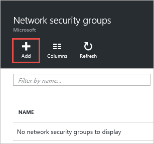
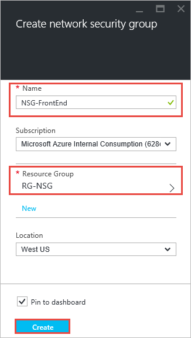
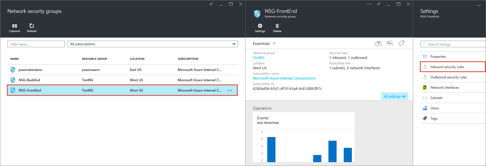
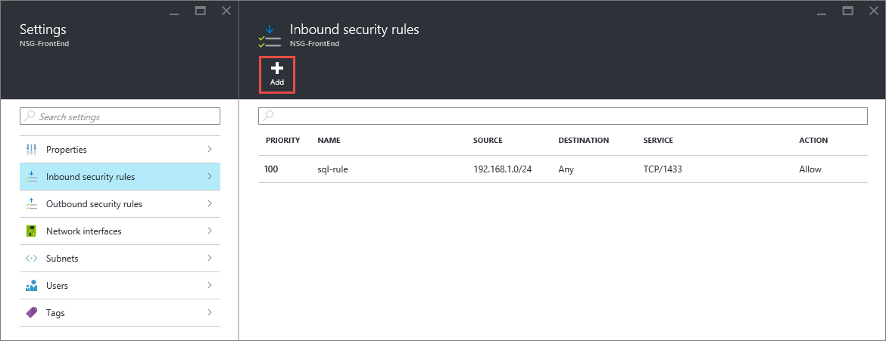
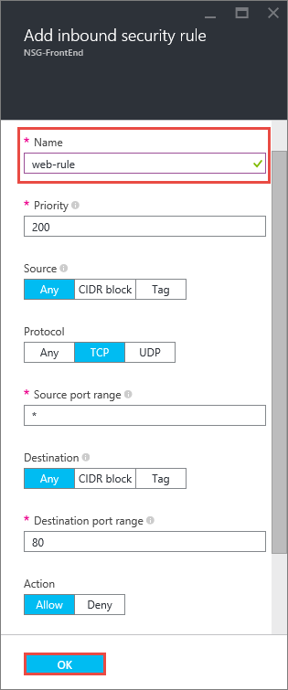
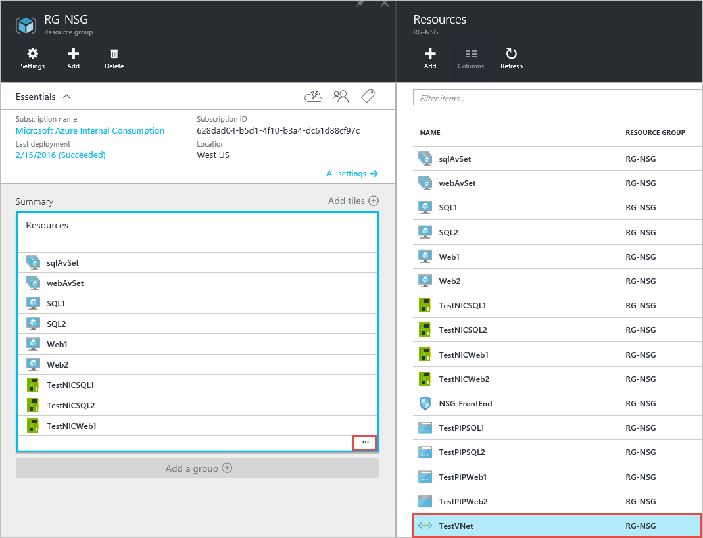
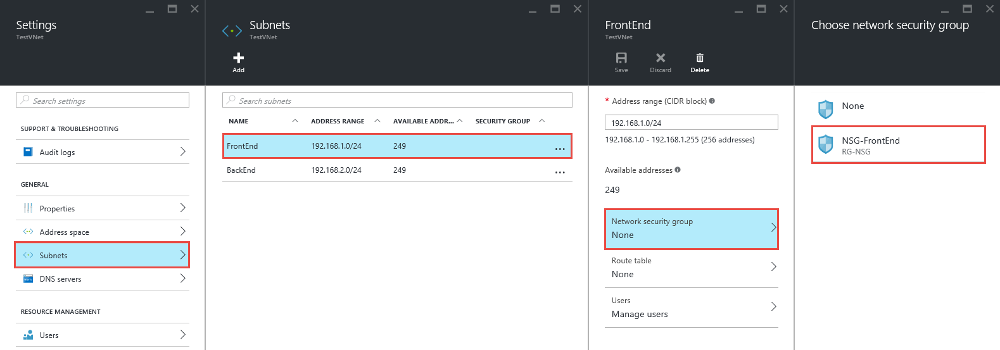
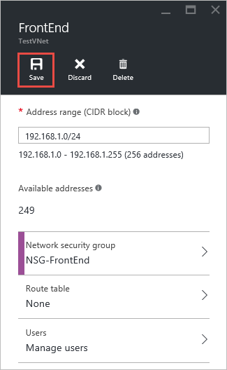
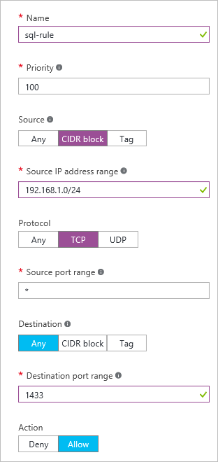
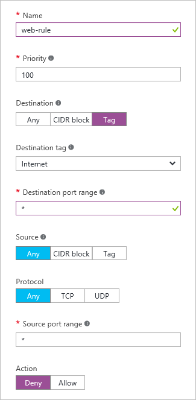

<properties 
   pageTitle="How to create NSGs in ARM mode using the Azure portal | Microsoft Azure"
   description="Learn how to create and deploy NSGs in ARM using the Azure portal"
   services="virtual-network"
   documentationCenter="na"
   authors="jimdial"
   manager="carmonm"
   editor="tysonn"
   tags="azure-resource-manager"
/>
<tags 
   ms.service="virtual-network"
   ms.devlang="na"
   ms.topic="article"
   ms.tgt_pltfrm="na"
   ms.workload="infrastructure-services"
   ms.date="02/04/2016"
   ms.author="jdial" />

# How to manage NSGs using the Azure portal

[AZURE.INCLUDE [virtual-networks-create-nsg-selectors-arm-include](../../includes/virtual-networks-create-nsg-selectors-arm-include.md)]

[AZURE.INCLUDE [virtual-networks-create-nsg-intro-include](../../includes/virtual-networks-create-nsg-intro-include.md)]

[AZURE.INCLUDE [azure-arm-classic-important-include](../../includes/azure-arm-classic-important-include.md)] This article covers the Resource Manager deployment model. You can also [create NSGs in the classic deployment model](virtual-networks-create-nsg-classic-ps.md).

[AZURE.INCLUDE [virtual-networks-create-nsg-scenario-include](../../includes/virtual-networks-create-nsg-scenario-include.md)]

The sample PowerShell commands below expect a simple environment already created based on the scenario above. If you want to run the commands as they are displayed in this document, first build the test environment by deploying [this template](http://github.com/telmosampaio/azure-templates/tree/master/201-IaaS-WebFrontEnd-SQLBackEnd), click **Deploy to Azure**, replace the default parameter values if necessary, and follow the instructions in the portal. The steps below use **RG-NSG** as the name of the resource group the template was deployed to.

## Create the NSG-FrontEnd NSG

To create the **NSG-FrontEnd** NSG as shown in the scenario above, follow the steps below.

1. From a browser, navigate to http://portal.azure.com and, if necessary, sign in with your Azure account.
2. Click **Browse >** > **Network Security Groups**.

    

3. In the **Network security groups** blade, click **Add**.
  
    

4. In the **Create network security group** blade, create an NSG named *NSG-FrontEnd* in the *RG-NSG* resource group, and then click **Create**.

	

## Create rules in an existing NSG

To create rules in an existing NSG from the Azure portal, follow the steps below.

2. Click **Browse >** > **Network security groups**.

3. In the list of NSGs, click **NSG-FrontEnd** > **Inbound security rules**

	

4. In the list of **Inbound security rules**, click **Add**.

	

5. In the **Add inbound security rule** blade, create a rule named *web-rule* with priority of *200* allowing access via *TCP* to port *80* to any VM from any source, and then click **OK**. Notice that most of these settings are default values already.

	

6. After a few seconds you will see the new rule in the NSG.

	

7. Repeat steps  to 6 to create an inbound rule named *rdp-rule* with a priority of *250* allowing access via *TCP* to port *3389* to any VM from any source.

## Associate the NSG to the FrontEnd subnet

1. Click **Browse >** > **Resource groups** > **RG-NSG**.
2. In the **RG-NSG** blade, click **...** > **TestVNet**.

	

3. In the **Settings** blade, click **Subnets** > **FrontEnd** > **Network security group** > **NSG-FrontEnd**.

	

4. In the **FrontEnd** blade, click **Save**.

	

## Create the NSG-BackEnd NSG

To create the **NSG-BackEnd** NSG and associate it to the **BackEnd** subnet, follow the steps below.

1. Repeat the steps in [Create the NSG-FrontEnd NSG](#Create-the-NSG-FrontEnd-NSG) to create an NSG named *NSG-BackEnd*
2. Repeat the steps in [Create rules in an existing NSG](#Create-rules-in-an-existing-NSG) to create the **inbound** rules in the table below.

	|Inbound rule|Outbound rule|
	|---|---|
	|||

3. Repeat the steps in [Associate the NSG to the FrontEnd subnet](#Associate-the-NSG-to-the-FrontEnd-subnet) to associate the **NSG-Backend** NSG to the **BackEnd** subnet.

## Next Steps

- Learn how to [manage existing NSGs](virtual-network-manage-nsg-arm-portal.md)
- [Enable logging](virtual-network-nsg-manage-log.md) for NSGs.